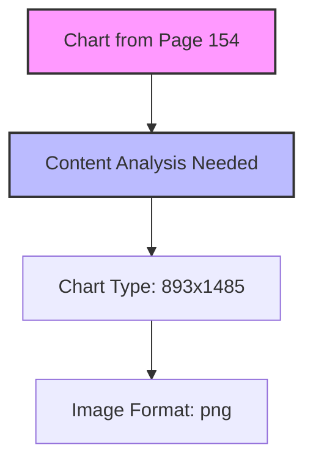
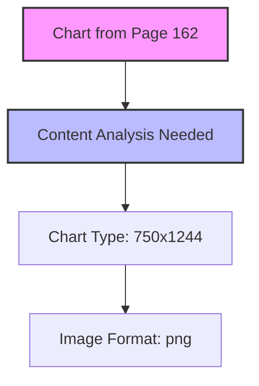
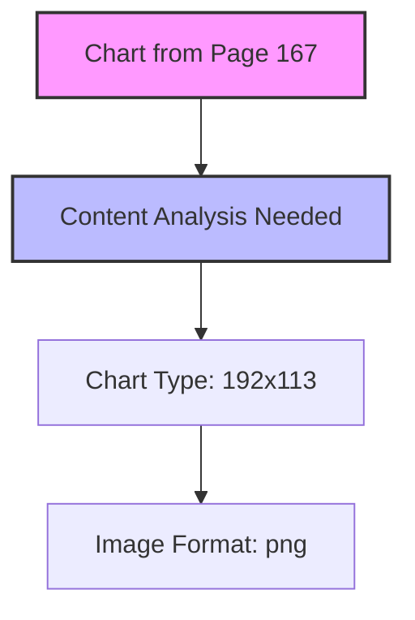
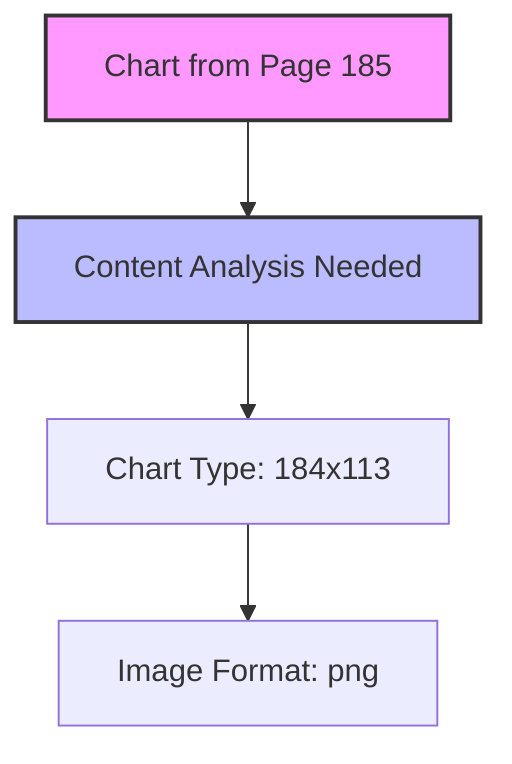

# Enlightened Management & The Organizational Imperative

**Source:** 030346.Enlightened Management.pdf  
**Author:** Robert Campbell  
**Copyright:** 1995, All Rights Reserved  
**Conversion Date:** 2025-07-26 16:55:24  
**Total Pages:** 258  
**Pages with Content:** 253  
**Images Found:** 36  
**Chart Candidates:** 27  
**Sections Detected:** 1464

## Document Structure Summary

This document provides a comprehensive framework for organizational structure based on cosmic principles and enlightened management. The content is organized into four main parts:

### Part I - Orders of Organization
- **Chapter 1:** A General Discussion - Philosophical foundations of organization
- **Chapter 2:** Personal Organization - Individual cognitive frameworks  
- **Chapter 3:** The Hunter Clan - Primitive organizational structures
- **Chapter 4:** The Swidden Tribe - Agricultural community organization
- **Chapter 5:** The Country Town - Municipal organizational systems
- **Chapter 6:** The Nation City - Urban organizational complexity

### Part II - Cosmopolitan Organization  
- Advanced organizational structures for complex societies
- Integration of diverse cultural and operational elements
- Scalable management frameworks

### Part III - Charting the Organization
- **Chart 1:** The Three Company Dimensions
- **Chart 2:** The Operations Department - product work
- **Chart 3:** The Construction Department - product work  
- **Chart 4:** The Design Department - development work
- **Chart 5:** The Finance Department - financial work
- **Chart 6:** The Sales Department - sales work
- **Chart 7:** The Marketing Department - marketing work
- **Chart 8:** The Personnel Department - organization work

### Part IV - Transparency and Resonance
- Creating transparent organizational environments
- Enabling participant awareness of their role in the whole
- Fostering creative, responsible organizational participation

## Semantic Annotations for Distributed Cognition

This document contains rich semantic patterns suitable for hypergraph encoding:
- **Hierarchical organizational structures** - Mapped across multiple scales from personal to cosmopolitan
- **Systems thinking frameworks** - Recursive patterns of organization and management
- **Chart relationships** - 27 visual diagrams converted to Mermaid format for computational processing
- **Philosophical foundations** - Deep exploration of order, chaos, and meaning in organizational contexts
- **Practical applications** - Concrete departmental structures and management approaches

The text demonstrates cognitive adjacency between theoretical principles and practical implementation, making it ideal for distributed cognition frameworks and agentic processing systems.

---


<!-- Page 3 -->


### ENLIGHTENED MANAGEMENT
&
### THE ORGANIZATIONAL IMPERATIVE


The story of how to structure
any company for optimum
## Potential, Commitment & Performance.


### Robert Campbell


### © Copyright 1995
### All Rights Reserved


www.cosmic-mindreach.com


<!-- Page 4 -->

Other Books by Robert Campbell

###  FISHERMAN’S GUIDE
### To The Cosmic Order
( For the general reader )

###  SCIENCE & COSMIC ORDER:
### A New Prospectus
( For the informed science reader )

###  DOWNSIZING DARWIN
## An Intelligent Face For Evolution
( For the general reader )

###  THE HALL OF TWO TRUTHS
An Adventure Novel with a cosmic theme
( For the general reader )


For samples and ordering information see
www.cosmic-mindreach.com


<!-- Page 5 -->


This is not a novel.
It is a text about the principles
of organization structure.
The story involved is intended to make the ideas
more interesting, readable and accessible.


<!-- Page 7 -->

### CONTENTS

# Chapter


### Page

# PART I - ORDERS OF ORGANIZATION

### 1 - A General Discussion


1
### 2 - Personal Organization


7
### 3 - The Hunter Clan


15
### 4 - The Swidden Tribe


19
### 5 - The Country Town


25
### 6 - The Nation City


33
### 7 - The Civic Analog


45

# PART II - COSMOPOLITAN ORGANIZATION

8 - Profit Distribution for Survival Advantage


55
9 - A Meal in the Market - The Organizational Challenge
79
10 - Questions of Shopping - Organizational Needs

95
11 - Packaging a Product


111


# PART III - CHARTING THE ORGANIZATION

## 12 - Chart 1 - The Three Company Dimensions


135
# 13 - Chart 2 - The Operations Department -  product work
141
# 14 - Chart 3 - The Construction Department - product work
149
# 15 - Chart 4 - The Design Department - development work
159
# 16 - Chart 5 - The Finance Department - financial work           171
# 17 - Chart 6 - The Sales Department - sales work


181
# 18 - Chart 7 - The Marketing Department - marketing work     189
# 19 - Chart 8 - The Personnel Department - organization work    195

# PART IV - TRANSPARENCY AND RESONANCE


20 - Common Accord in Job Interfacing


209
21 - Common Accord and Resonance


219
22 - Transparency of the Creative Process


233


<!-- Page 9 -->

### ENLIGHTENED MANAGEMENT
&
### THE ORGANIZATIONAL IMPERATIVE


### FOREWORD


In recent years we have been besieged by such a host of books on
business and its organization, that one might expect that at least a few of
them would have approached the question of organization itself. How is
experience organized? Is there an organizational imperative implicit in
the nature of experience? If so how does it work? How do we integrate
experience as individuals and does this have a bearing on our collective
endeavors? Is there a direct relationship between the individual and col-
lective integration of experience in a business enterprise, or in the social
enterprise of humanity generally? If there is, we ought to seek it out. If
we can discover how it works, then we can surely find great advantage in
structuring our organizations accordingly.

This is a book that pursues the discovery and the practical applica-
tion of structural principles in business that are implicit in the nature of
experience generally. There is a story involved, in which the reader is
cast as the central character. In this way it is hoped that you will discov-
er how to apply two structural constraints to optimum advantage. These
two constraints are both necessary and sufficient to properly structure
any business organization, such that it relates to itself and to its envi-
# ronment in a creative, responsible, and transparent way. Each participant
# can see their part and their place, in relation to the whole organization,
through three dimensions that come into focus as a natural consequence
of employing the two structural constraints. As the President of a com-
pany, in unusual circumstances, you find a way to work this out.

The superior effectiveness of such an organization derives from an
enhanced perception of the potential dimension, the commitment dimen-
sion and the performance dimension, for these three dimensions have
their correlates in the integration of human experience. The intuitive,
right brain development of idea derives its potential through a treasury
of memory. Explicit technique is the key to our left brain commitment to
endeavors that relate to our social organization. We assess our perfor-


<!-- Page 10 -->

mance via feedback from our emotional limbic brain that fuels our ani-
mated responses to the ongoing stream of circumstance.

It thus becomes possible to structure business organizations to func-
tion in accord with how we ourselves are biologically structured to func-
tion as ordinary human beings. We can be more responsive and more
creative in a more spontaneous way. The need for bureaucratic controls
and behavioral manipulation falls away, along with the political infight-
ing that becomes so deeply entrenched in these kinds of organizations.
The benefits become apparent in the redemption of wasted efforts, lost
opportunities, abandoned talents, and the enormous costs that they
represent, not only to business organizations, but to the people that con-
stitute them, and to the cultures that we must serve in a constructive way
in order to survive.


<!-- Page 11 -->


# PART 1

### ORDERS OF ORGANIZATION


<!-- Page 13 -->

# Part I - Orders of Organization


# CHAPTER 1

### A GENERAL DISCUSSION


Organization. It is a strange word. It means different things in dif-
ferent contexts.

“How so?”  you might say. “The context itself is organized in some
way. So how can the word mean different things. Organization is organi-
zation.”

“What about chaos then? Is random order a form of organization?”

You think for a moment to be sure of your answer. “Well, chaos
certainly needs an observer to be identified as such.” You are confident
that you have found a handle on the question. “And it can only be known
as such in relation to order. By its nature, chaos must be one face of
some kind of order. Otherwise we would not be able to identify it.”

“Hmmm. Is that really so? Maybe the only order is chaos, and ap-
parent orders that may emerge within it from time to time are transient
phenomena, a mere passing expression of chaos.”

You look at me like I was the accused in the prisoner’s dock. “Why
that’s utterly absurd. You are being less than honest.”

“Me? Less than honest?”  I’m a little annoyed.

“Yes, you. There are ordered assumptions implicit in your statement
that render it so much double talk.”

“Double talk is it?! How so?”

# “Well examine the statement with just a little impartiality. Can’t you
see that saying ‘from time to time’ implies a sequential order of time that
is fundamental even to chaos? Can’t you see that identifying transient
phenomena implies an observer with a sufficiently ordered mind and
sensory apparatus to perceive events in a spatial order of things?”

“Yes. I suppose I see what you mean. A good point. But then per-
haps the ordered mind and sensory apparatus are themselves just a tran-
sient expression of chaos, an accidental order that will ultimately pass
into oblivion along with the perception of the passing.”


<!-- Page 14 -->

### 2 • Enlightened Management

You squint at me through your reading glasses. “You really are a
case. Now you are saying that chaos is oblivion. Can’t you see that? And
oblivion it must be if it is the only order. Random order is a homogene-
ous annihilation without ordered phenomena. But then we wouldn’t be
around to worry each other about it, would we?!”

“I suppose not.”

“Of course not! A totally random order is not consistent with the
ordered universe that we see around us. Such chaos as may exist is but
one aspect of the order that sustains the whole of the universe.”

“And who is to say that this universe is real?  There is nothing per-
manent about it. Why it is changing every instant, mere passing episodes
in a dream. The whole thing is no more than an illusion.”1

“Why that rubbish is just more double talk.”  You shake your head
as if to rearrange your thoughts. “You really are a master at it. Now you
are trying to say that both order and chaos are an illusion and that noth-
ing is real. But that view must then itself be an illusion, and yet you
maintain that it alone is real? Why, you are trying to say that the only
reality is illusion. It is a contradiction in terms. Words lose their mean-
ing, my friend.”

“My point exactly.” I give you a big smile to rub the point in.
“Unless you want to suggest that there is some permanence to meaning
that can survive the chaotic transience of events.”

“Of course there is. There must be. Unless we are all totally mad,
we must believe that.”

“Aha. But then you must believe that meaning inheres in an order
that determines the nature of transience, and not in transient events them-
selves.”

“What’s that? What fool notion are you trying to slip past me now?”

“It is simple enough. You believe that meaning derives from an
order that transcends space and time. This order cannot be identified as
confined in space and time.”2

A suspicious expression invades your face. “Of course it can be
identified. If I understand your meaning I see you before me. Your mean-
ing is implicit in your person and the words that come out of your
mouth!”

“Not if I walk away, it’s not. Does the meaning in my words walk
away with me?”

“Let’s not be ridiculous. I have a memory of course. And the mean-
ing of your words is associated with my memory of you.”


<!-- Page 15 -->

### Personal Organization •  3

“But the event itself is gone, no longer a reality. Neither I nor your
memory of me determines the nature of meaning. I am not a permanent
resident of your mind. And what are words but uttered sounds that have
already passed. Where is the meaning in sounds?”

“You can’t be serious. Why it is the meaning we have learned to
associate with them. We learn spoken language from the crib and the
# sand box. It is passed on from generation to generation. It is part of our
# culture, part of our collective experience.”

“So far so good. In other words, you believe that meaning is deter-
mined by an order that transcends transient events in space and time, just
as I said.”

“Wait just a minute! You’re twisting things around. I didn’t say
that.”

“Is that so! You said language was passed on from generation to
generation. Surely this passing on from one generation to the next is a
transient event, yet the meaning implicit in language is universally un-
derstood by everyone. Now how is this universal meaning possible if
there is no common order implicit in experience that transcends the per-
petual passing of events?”

“That’s a very good question. But let me twist things around for a
change. How is universal meaning possible if there is such an order as
you suggest?”

“That’s a fair question also. This order that transcends the passing
of events also determines the organization of events, so that although
events may be different in space and time, they are all organized in a
similar way.3 It is precisely this characteristic of experience that allows
us to learn from experience and also to benefit from the experience of
others.”

“What’s that got to do with language?”

“How else could we learn language from parents and friends?”

“Now you are contradicting yourself again. You said at the outset
that organization means different things in different contexts. Now you
are saying that everything is organized in a similar way. You can’t make
a single straight statement.”

“There is no contradiction in what I said and both statements are
straight.”

“What?” There is a puzzle etched in your intelligent face, now a
caricature of itself. “Things are both the same and different? There’s no
contradiction in that?”
.


<!-- Page 16 -->

### 4 • Enlightened Management

“Not if you allow of hierarchies in experience. A tree may have
many different branches, but they are all the same tree. And there may be
many different trees of the same kind. And there may be many different
kinds of trees, but they are all trees. And trees are just one kind of plant.”

“And plants are just one kind of life, etceteras. You are talking
about groups and classes, not hierarchies, my friend.” You toss me an
intimidating look of disgust. “These are just distinctions of kind made
convenient by language. You are twisting things around again.”4

“Not so! There is an ordered hierarchy hidden in the classification
of all life forms that is essential to how they evolve and grow, irrespec-
tive of the diversity of species. In fact it is more general than that. The
organization of the whole of experience is dependent upon a common
hierarchy that is implicit in the way phenomena evolve.”5

“Now that’s a mouthful!”  You throw your head back and laugh.
“You’ve bitten off more than you can chew this time. Why if that’s true
there must be some evidence in experience. In fact there must be some
historical evidence in human experience as to how this experience itself
is organized.”

“In human experience?”

“Yes. There must be specific evidence in human experience.”

“So you want to confine the discussion to human experience?”

“Are you not talking about how we humans and our societies
evolve?”

“Among other things, yes.”

“And you maintain that there is historical evidence in human ex-
perience as to how experience itself is organized and evolves?”

“There is evidence, of course.”

“Then would you be kind enough to point it out.”

I overlook the sarcasm in your tone. “I will make an attempt. But
you must try to examine the facts very carefully, with as much fairness as
you can muster.”


### NOTES:

1
The contention that all phenomena are illusory crops up amid the
proliferation of ideas in Hindu philosophy. For example there are several
passages in the Upanishads which treat the world as merely an appear-


<!-- Page 17 -->

### Personal Organization •  5

ance, although this can’t be considered a prevailing theme. Some Bud-
dhists would also argue that since all things are impermanent they have
no self, no real identity. This argument has especially gained favor in
western Buddhism that tends to oppose itself to any meaningful concept
of God. The emphasis in the East is generally very different. The Bud-
dhist Far East is in fact populated to the brim with spirits and gods, in-
cluding the belief that intelligence is transcendent, omnipresent and all
things are interdependent. Some Mahayana schools of Buddhist thought
do however place all experience on a level with dreams. The Madhyami-
kas, for example, deny the reality of both external objects and the self. In
western philosophy the same question has been treated in many ways.
Parmenides was the first to distinguish between the sensible and the in-
telligible and maintain that the sensible was unreal. Through his influ-
ence on Socrates and Plato he has touched the whole development of
western thought. It is only through the explosive growth of western sci-
# ence, particularly in this century, that such a fervent belief in physical
evidence and materialism has become so prevalent. Philosophical ques-
tions about the nature of meaning have largely been sidetracked by sci-
ence.

2
Various beliefs in a transcendent order to experience are as old as
human history. The Vedic rta, the Hindu and Buddhist dharma, the
Sumerian me, the Egyptian maat, the Taoist yin and yang are all ancient
conceptions of the same cosmic order. The Greek philosophers that had
such an influence on the development of western thought were also pre-
occupied with the question. For example many of Plato’s dialogues dealt
with his Theory of Forms, concerning a transcendent universal order.

3
That there is a similar structure to diverse phenomena has been pro-
posed by various schools of thought, and implied by many others. Of
special note is Gestalt Psychology, which developed on the premise of an
underlying isomorphy to experience. (Ellis, W.D., A sourcebook of Ge-
stalt Pscychology, London, 1938.) Likewise Bertrand Russell developed
the idea of logical atomism in a series of lectures, maintaining that logi-
cal constructionism depends upon an isomorphism between the structure
of an ideal language and the structure of reality. (Russell, B.A.W., The
Philosophy of Logical Atomism, The Monist, Vol. 28, 29, 1918, 1919.
Reprinted in Logic and Knowledge, Marsh, R.C., Ed., London, 1956.)

.


<!-- Page 18 -->

### 6 • Enlightened Management

4
Groups and classes have always been fundamental to the develop-
ment of thought, from Aristotle’s Categories to the mathematical devel-
opment of Set Theory. Set theory was developed between 1874 and
1897, primarily by Georg Cantor, with important contributions by Dede-
kind and others. After some initial resistance to the theory, some went so
far as to say that almost the whole of mathematics can be derived from
the theory of sets. Bertrand Russell, who considered mathematics to be
but an elaborate extension of logic, regarded set theory as the connecting
link.

5
The empirical, logical, and intuitive evidence for hierarchies in the
natural order, and in the creative process generally, was developed by the
author in Fisherman’s Guide: A Systems Approach to Creativity and
Organization, New Science Library (Shambhala), Boston, 1985. It is also
treated in more rigorous fashion in Science and Cosmic Order: A New
### Prospectus.


<!-- Page 19 -->

# Part I - Orders of Organization


# CHAPTER 2

### PERSONAL ORGANIZATION


Suppose that you are in a strange city in a strange country and a taxi
has just dropped you off at a museum, miles from your hotel. You pay
him. You enter the old gallery to sop up some history. Ninety minutes
later you find that your wallet has been stolen. You remember a man
bumping into you as you left the museum. You are left without one cent.
You know no one and you don‟t speak the language. You begin to wand-
er, wondering what to do. You are lost and a little confused. Of the few
people you meet that can speak your language, none will help you. Your
confusion grows. Then you stop and think, “I‟ve got to get organized.”
What do you mean?

Before you lost your wallet you were organized, now without it
you‟re not. You had a plan before, but the plan required money to ex-
ecute. Now, without money, you need a new plan. The plan is your or-
ganization. It is a sequence of actions that will bring about a desired
result. You can still do nothing without money, but you are carrying a
camera worth a thousand dollars. “Can I convert this to cash?” you ask
yourself. “Can I use it as collateral until I can have some money trans-
ferred from home or get a new credit card?” You can‟t get back to your
hotel without money and you have no identification. Your passport is in
your hotel room.

You go into a camera shop and ask for the owner. He shuffles out
from the back room, looks you up and down.

“How can I help you?” he asks coolly.

You shift from one foot to the other, feeling awkward. “My wallet
was stolen,” you say lamely. You are embarrassed by your circums-
tances.

“In my shop?” he interjects before you have a chance to continue.

“No, no. At... at the museum.”

“And what has that to do with me?”


<!-- Page 20 -->

### 8 • Enlightened Management

“Well, I thought you might advance me some money on my camera,
enough to get me back to my hotel. Then I would return the money and
collect my camera later today or tomorrow.”

“I do not deal in second hand cameras.”

“But as a favor, I thought you might make an exception. I have no
money to get back to my hotel. I am lost.”

“Do you have some ID?”

“In my wallet, of course, along with my credit cards. I am staying at
the Sheraton. I am the President of General Dynamics.”

He looks you up and down again. You‟re wearing dungarees and
sneakers. The camera must be hot. You can see it on his face. “And I am
the Pope. Leave my shop before I call the police!”

You can‟t find a pawn shop. Nobody knows what you are talking
about.

You spot a bank down the street. You enter and walk past the tellers
to an office area to the rear, behind a long marble counter. A young lady
finally gets up from her desk and approaches you in a foreign language.
You smile and explain that you only speak English. You are not a very
cosmopolitan person. She calls another to take her place.

“Yes sir. Can I help you?”

“I would like to speak with the manager for a moment.” After your
last experience you feel a little sheepish. You are self conscious about
the way you are dressed. She senses it, of course.

“Do you have an appointment?”

“No, I‟m afraid not.”

“I‟m sorry. The manager is busy at the moment.”

“Is there an assistant manager that I might talk to?”

She looks at you skeptically. “Perhaps you could tell me the nature
of your business.”

“It‟s a rather personal matter.”

“But we are a bank. Do you want to open an account? Do you want
a loan?”

“Well... I suppose it could be classified as a loan.”

“Domestic or business?”

“Domestic I would think.”

“Then you are a resident of this country?” she asks with a tone of
disbelief.


<!-- Page 21 -->

### Personal Organization •  9

“My company does business here,” you explain lamely, hoping this
line of questioning will soon end. “In fact we do business with this
bank.”

“And which company is that? Do you have a business card?”

“I have just been to the museum. I have no business cards with me.
I‟m sorry.”

“Then perhaps you could give me the information. What is your
company‟s name?”

“Ah... General Dynamics.” The truth is out before you think better
of it.

“And your position with the company?”

She‟ll never believe it. You must fabricate something quickly. “Ac-
countant. I... I am an accountant.”

“Please wait a moment.”  She picks up a phone, looks at you
strangely, makes a call that you do not understand, then directs you
through a gate in the marble counter, past a row of desks into one of
several inner offices.  She introduces you to a small thin man in his for-
ties and leaves. He offers you a seat in a leather armchair.

“How can I help you?” he asks directly, his eyes doing a very care-
ful audit through his gold rimmed spectacles.

“I am on a business trip, but today I have taken the opportunity to
see a bit of your city on my own. I enjoy mixing with people on an in-
formal basis and must apologize for my dress. Unfortunately I have run
into an embarrassing problem that I hope you will help me with.”

“What is the nature of your problem?”

“I was robbed. A pickpocket at the museum.”

“Surely you need a policeman, not a bank.”

“A policeman cannot help me. There is no chance to find the pick-
pocket and recover my wallet. The point is that I have no money.”

His eyebrows come together like the jaws of a vice, squeezing his
forehead into a frown. His thin black mustache curls into a sadistic grin.
It is an immaculately trimmed little mustache, the impressive result of
hours of grooming. “My dear sir,” he says leaning forward, “we are not a
charitable institution.”

“I had hoped for a small loan. Until tomorrow. I have a camera, an
expensive camera to offer as collateral. It‟s a very good camera, auto-
matic everything. The camera alone is worth a thousand dollars, the lens
another five hundred. I don‟t need a lot of money. Just enough to get me
back to my hotel and see me through until I contact an American Express


<!-- Page 22 -->

### 10 • Enlightened Management
office. Perhaps two hundred dollars. Just until tomorrow.”  You try to
cool your approach. A hard sell isn‟t going to work on this miser. You
are rattling on like a nervous school boy.

He leans back and laughs. “I cannot give you money for a camera.
We don‟t do this kind of business. If you are a business man, as you say,
you must know that. Good day, sir.” He stands up to usher you to the
door.

“A hundred dollars. Just a hundred until tomorrow. You must know
that I will return for my camera. I will pay you back two hundred tomor-
row. A hundred percent interest for twenty-four hours.”

He looks at you like a vicious puppy. “We are not in the business of
loan sharking. Nor do we fence stolen goods.”

“I am not a thief! I am the victim of a thief! I am staying at the She-
raton. At least phone and check.”

“Why should I bother. We cannot loan you money on a camera. I
am a busy man. I have other matters to attend to.”

“Then let me use your phone.”

“There are phones outside.”

“I have no coins for a pay phone.”

He sighs, shrugs and sits back down. “The Sheraton?”

### “Yes.”

He looks up the number and dials, waits for a reply then hands you
the phone. Nice of him. He sits glaring at you, twiddling his thumbs
while you talk.

Yes, the hotel had processed your credit card when you checked-in.
Yes, they will advance you cash for the taxi upon arrival at the hotel.
You had a platinum card. Just good business. You hang up relieved. You
thank the thin man behind the desk and ask for his business card.

“Why do you want my card?” he asks, a little perturbed.

“Why, to thank the management of this bank for your cooperation,
of course. Without that phone call, I don‟t know what I would have
done.”

He hands you a card with reluctance. He is beginning to see possi-
ble repercussions. Wouldn‟t loan you a hundred bucks on a thousand
dollar camera. Would let you stay stranded and hungry. Maybe you are
not just another anonymous nobody.

You shake his hand anyway and give him a big smile. At least you
are assured of a place to eat and sleep. You know where you are going


<!-- Page 23 -->

### Personal Organization •  11
and what you have to do. You are back on schedule. You are organized
again.

This personal organization concerns the integration of a series of
actions. It is functional in character, and it brings some desired result.
This is true whatever the endeavor, be it digging a ditch, playing the
guitar, or solving Fermat‟s Last Theorem. That there is more thought
behind the writing of each mathematical symbol than behind each spade
full of earth does not alter their intrinsic similarity as goal directed activ-
ities. There is also a difference in kind that we will come to later, but
whatever this difference, there is always a functional level of organiza-
tion involved. A suitable nexus of physical actions produces an antic-
ipated result. There is no limit to the number of possible behaviors that
may be undertaken. There are many shapes and sizes of trees in the for-
est.1

There is a certain incongruity in all of this, because the word organ-
ization implies something more organic than just directed activities in a
linear series. It implies a delegation of different activities to different
organs that are interdependent in their function. Tasks that are similar in
# character are assigned to departments. There is an independent delega-
tion of certain functions, implicit in the nature of organization itself,
each involving a degree of specialization.2

In one‟s personal organization this delegation does not occur in a
social way. Our muscles animate our body to enact patterns tailored by
our nervous system according to the needs of circumstance. A pattern of
behavior finds perceptual balance with the environment in an anticipated
way. The organs which act as the focus of specialized activity are our
# body parts. Our mouth speaks, our eyes see, our feet walk. The nexus of
goal directed social activities that result are not organic in the same
sense at all. An unlimited variety of unrelated personal activities is poss-
ible, from playing the piano to mountain climbing, while the various
organs of our body remain confined to their interdependent specializa-
tion.

At the same time our personal organization relates to a social con-
text. Furthermore this social context is in many respects an extension of
personal organic organization. Instead of walking to the museum you
take a taxi. You don‟t need to find the energy in your digestive tract to
activate your legs. You let the taxi driver fill the tank and step on the
accelerator. Easy. Money suffices in lieu of physical exertion. It is a kind
of social energy that you can draw on to act in a greater diversity of


<!-- Page 24 -->

### 12 • Enlightened Management
ways than you otherwise could. It gives you freedom and power. With-
out it your activities in a social context are severely restricted. Your very
survival is threatened.3


“So what?” you interrupt. “Cute story, but are you supposed to be
telling me something I don‟t know?”

Your intrusion throws me off. “I‟m only getting started. I‟m point-
ing out that we all have a functional kind of organization that is distinct
from an organic kind. In fact it is the first level in an organic hierarchy
of activities. Give me a chance.”

“Well, that‟s nice to think about. Riveting. What‟s all the flack
about money?”

“I am pointing out that this is the way our social organizations have
evolved. In a free market economy, we have access to all kinds of assis-
tance so long as we have money. This hasn‟t always been so, and in
# some parts of the world it still isn‟t. Various kinds of social systems
survive, some of them from antiquity.”

“Do we have to go into all that?” You turn up your nose.

“We are looking for historical evidence, remember? It is worth hav-
ing a look to see if we can identify some sort of historical development
which will give us a clue as to how human experience is organized.”

“OK. OK. What‟s next?”


### NOTES:

1
The point here is that this first functional level of organization is
physical in character. It relates directly to physical behavior and any
number of behaviors are possible. Rather than dwelling on physical be-
havior, as a behavioral psychologist might do, we will be advancing
through levels of organization that do not emerge from physical beha-
vior. Rather they determine its character. There is a hierarchy involved
and physical behavior is the bottom rung in the tiers of the hierarchy.

2
Both Vitalism and Organismic Biology attempted to come to terms
with the distinction being made here. In 1919, the zoologist W. E. Ritter
described the organismic theory that “the organism in its totality is as


<!-- Page 25 -->

### Personal Organization •  13

essential to an explanation of its elements as its elements are to an ex-
planation of the organism.” Both vitalism and organismic biology share
traits in common, including a teleological viewpoint. This view has fal-
len into disfavor, largely because of the current emphasis placed on the
fundamental importance of physics and the attendant belief that chemi-
stry, including the chemistry of life, are emergent properties of physics.
The result is a widespread conviction that there are no organizational
# principles at work in the universe, apart from the laws of physics. It is
believed that biological evolution on the planet is directed by accidental
mutations and the so-called process of natural selection.

The self-contrariness of this view is pointed up in Murray Gell-
Mann‟s The Quark and the Jaguar, W. H. Freeman, New York, 1995. As
a major contributor to quantum mechanics and quark theory, Gell-Mann
attempts to bridge the gap between the accepted laws of physics and the
complexity of the natural world, that is, between the quark and the ja-
guar. At the outset, he is very firm in denying a teleological viewpoint,
including universal influences in the natural order, or any inference of a
transcendental basis to order or intelligence. By the time he gets around
to addressing our social and economic problems, however, Gell-Mann is
# talking about the interrelationship between universals and particulars,
about unity in diversity, and even goes so far as to state “...there is pro-
found truth in the old adage, „The whole is greater than the sum of the
# parts‟.” This is not to single out Gell-Mann for criticism, for he has
made enormous contributions and is more thoughtful and concerned than
many scientists are today. His book just happened to be handy. The point
is that the enormous research commitment to physics in this century
seems to have distorted the perspective of the whole scientific communi-
ty, to the point that many are blind to their own biases and inconsisten-
cies, and there seems to be a widespread ignorance of central issues in
the historical development of both western and eastern thought.

3
We shall see that as our social organizations grow in complexity
that they invariably acquire a specialization of independent functions as
they relate to one another and to the whole. Moreover, in any creative
endeavor, there is an isomorphy to how this specialization of indepen-
dent functions takes place. The same pattern always occurs. It will be
said that the pattern is always self-similar, and it embraces self-similar
patterns within itself.


<!-- Page 26 -->

### 14 • Enlightened Management


<!-- Page 27 -->

# Part I - Orders of Organization


# CHAPTER 3

### THE HUNTER CLAN


You wake up at dawn. You are wet. It is raining and the shelter that
you built the day before is not very good.

“You should have done a better job,” your wife scolds. “Two of the
children are sick.”

“How could I know it would start raining in the night. I plan to fin-
ish it this morning.” You have never seen a hotel in your life, and you
have never had money.

The fire is almost out. You find some dry kindling to get it going
# again, and add some wood. The fire is partly protected from the rain by
the shelter. It feels good, but the shelter is still leaking. You gather some
large leaves and begin threading them together like a row of shingles on
slivered bamboo that you had prepared the day before. You fasten the
rows of shingles across the crude frame of the shelter, tying them in
place with pliable slivers. Your eldest son and daughter help you. The
two young ones are curled up under some furs. Two others died of the
fever before they were a year old, and your wife is pregnant again.

You have seen pictures of big cities in books that some of the tribes
have, and you have heard all sorts of stories about the queer people that
live in them. You know that you cannot go there. You need money to go,
and hill people never do well there. You would lose your freedom and
your power. The spirits know it is not right for you.

You are of the Mlabri tribe. White men call you a primitive hunter
gatherer. The Thai and the Lao call your tribe the Phi Tong Luang, the
Spirits of the Yellow Leaves, because you often move again by the time
the leaves on your shelter turn yellow.1

“Come to breakfast,” your wife calls. She has put out some fruit and
rice on banana leaves. Your uncle has come over from across the ravine
and joins you. He brought his two sons and two large fish. The rain has
stopped.


<!-- Page 28 -->

### 16 • Enlightened Management

“I checked the nets,” he says. “There are many fish here. And your
brother snared two rabbits last night. Good spot.” The cold season is
coming and your small group has moved down into a narrow valley that
extends for many miles along a minor tributary of the upper Mekong
River, in Laos. It will be warmer here and there should be enough to eat
in the valley for several months.

Yours is the oldest system of social organization on the planet.
There was a time, many thousands of years ago, when it was the only
system of social organization. Now you are one of the last remaining
hunter gatherer tribes in mainland Asia. You own very little, there are
only fifteen in your band, and you share whatever you have. Your secu-
rity lies in sharing. What you give to your brother, or your uncle, you
will receive back next month or next year when you are not so fortunate.
The worst thing you can do for your security is hoard. Selfishness is
fatal. You will be left behind to fend for yourself, and a time will soon
come when you need help. Neither can you survive in large groups. The
streams would be fished out, the animals spooked, and the forest picked
clean in no time. You would be constantly moving, unable to stop for
even a day. This way you achieve a nice balance and there are no serious
disagreements. Disagreements come when a group gets too large. You
know this, and you split.

Yours is a personal kind of social organization. It is functional be-
cause everyone does their own thing and shares with the group. There is
no leader, no boss to whom everything defers, although the judgment of
some may have earned more respect than that of others. Joint decisions
are made on the basis of such precedents, and a decision to split always
remains an option if all can’t agree. There are shamans among the hunter
clans, but they wield no political power. The scattered small groups
aren’t politically connected. They simply share a common language and
customs.

The world was first explored to its limits by nomads of this kind. It
was a task that took hundreds of millennia and several species develop-
ments to accomplish. A few remnants of these cultures remain, each
adapted to their environment—the Eskimo, the Bushman and Hottentot,
the aboriginals of  Malaysia, Indonesia and Australia.

“We are out of rice,” you wife says as you finish eating. It is a lux-
ury that you allow yourselves when you have the opportunity. It is the
influence of the other tribes.

“We can take some fish up to the Lisu tomorrow.” The Lisu have
the closest village, on top of the nearby mountain at about five thousand


<!-- Page 29 -->

### The Hunter Clan • 17
feet elevation. They are one of a hundred tribes in the mountains. They
are swidden farmers. They slash and burn, plant their crops until the soil
peters out, then they slash and burn some more. They grow hill rice and
raise chickens and pigs. They don’t come down to the river to fish.2

“It is an all day trip up the mountain and back, with a load both
ways. Will you come,” you ask your uncle. “We should be able to trade
for a month’s supply of rice if we take enough fish.”

“Get me a new pot,” your wife adds, “and any clothes they can
spare.”

The other tribes don’t survive through your personal kind of social
organization, at least not to the same extent. They don’t share like your
clan. They have personal possessions, beyond their immediate needs, that
give them status and power. Their possessions allow them to barter and
trade. Some of the tribes also grow poppies. Opium is the only crop they
can produce economically for cash. Cash lets them buy some manufac-
tured essentials from the town.

# In many parts of the world, where conditions permitted or required,
the hunter clan developed into the tribal village. Then there was a head-
man or chief, one or more shamans, specialized craftsmen, and some-
times able bodied men had to double as warriors as the need arose. For
# the most part these cultures are historical casualties of civilization.

The tribal roots of Asia are still intact in the mountains, especially in
# Burma, Laos and parts of China, although many tribes are far flung
throughout remote areas of Asia. The tribal population, still living in
traditional ways, amounts to many millions. Each is a nationality without
a nation, for they have traditionally made no permanent claim on land.
Many different tribes share the same territory in peace, as they have done
for thousands of years. Before the white man, similar patterns were
prevalent throughout the Americas.

But hostility has traditionally marked relations between the hill
tribes of Asia and the lowland people that proclaim themselves nation
states. The latter thrive by assimilating the former like a hungry sponge,
making a permanent claim on all territory within boundaries arbitrarily
drawn on a map. The great wall of China is a testimony to how deeply
rooted is the hostility that still prevails.

Genghis Khan was perhaps the greatest exponent of the tribal, no-
madic way of life familiar to the spirit cultures of Asia. He took it upon
himself to abandon his life as a blacksmith in middle age to ruthlessly
establish an empire that spanned the breadth of Asia. From the Pacific
into eastern Europe, he established his word as law, yet his rule was


<!-- Page 30 -->

### 18 • Enlightened Management
marked by cultural tolerance and respect for local and tribal traditions.
He respected the functional organization of the different peoples he con-
quered. This is in marked contrast to the colonial empires and the ruth-
less decimation of the spirit cultures of North and South America.


“Do you have to bring Genghis Khan into it? Really!” You yawn in
my face.

“Just trying to inject a little interest. You know. Local color, and all
that.”

“But it sounds as if you are trying to make the greatest despot in
history out to be a hero. He respected the functional organization of the
peoples that he conquered, you say. A nice man. Why don’t you point
out that he stacked up pyramids of skulls in the cities he conquered?”

“It isn’t relevant to the development of the ideas. I am trying to
illustrate that man’s early development was concentrated around the
functional level of organization.”

“But we already talked about functional organization.”

“And we are going to talk about it some more. Do you have to keep
interrupting?”


### NOTES:

1
The Mlabri tribe was not discovered by anthropologists until the
1960’s, although the other tribal peoples had always been familiar with
them. As one of the last hunter gatherer tribes of mainland Asia, their
numbers are very small.

2
The Lisu are widespread in northern Burma, Thailand, Laos, and
south western China.


<!-- Page 31 -->

# Part 1 - Orders of Organization


# CHAPTER 4

### THE SWIDDEN TRIBE


“Get her! Get her!” you shout to your brother. He makes a mad dash
around the woodpile. Some wild squawking brings down the wood on
top of him. The chicken streaks out the other side. You make a lunge and
grab it by the tail feathers. It is flapping its wings furiously. You get to
your feet, holding on, blood streaming from a scrape on the knee. You
get a good grip on its legs as your brother crawls out from under a tan-
gled heap of firewood.

“Got her!” you say. “Get the cleaver.”

“It’s over there on the block,”  he says pointing, brushing off.

You are panting, trying to catch your breath. It has been a wild
chase. “You going to do it then?”

“It’s your turn. I did it last time.”

“No you didn’t. I did.”

“Well you can do it again. I don’t like to do it.”

“You like to eat it well enough.”

The chicken knows what’s up. It’s frantic.

“I’ll help. You do it. Papa says we got to do it.”

“You’re younger. You do it.”  He’s the next oldest of seven.

“You don’t like to do it either. That’s why you want me to do it.”

“OK, then. We’ll do it together.” He’s your elder. You have to make
allowances.

“OK, then. I’ll hold it. You do the chop.”

“I got a good hold already. You do the chop. It might get away
again.”

“You got its feet. I’ll grab its head.”

“OK. Stretch out its neck.”

“He won’t stop flapping and squawking.”

“You wouldn’t stop neither if it was your neck. Stretch his neck on
the block.”

“Quick. Give him the chop.”


<!-- Page 32 -->

### 20 • Enlightened Management

“I can’t let go of his feet. I’m right handed. You do it. Quick!”

### “OK. OK.”

Your brother brings down the cleaver. Splat. Blood squirts in your
face. Feathers fly. Wings are flapping more than ever. You let go. The
chicken runs off without its head.

“What did you let go for?”

You wipe the blood from your eyes. “Catch it. It’s getting away.”
The chicken runs into a tree, gets up and takes off again. You both give
chase. In a few minutes it runs out of steam and is flopping around in
some leaves at the edge of the forest. Your brother picks it up by the feet
and brings it back near the woodpile. It is still flapping its wings, less
frantically now.

A younger sister comes up, toting a baby brother on her back.
“Whatcha doing?” she asks.

“What’s it look like. We just killed a chicken. Now we’re going to
pluck it.”

“Can I help?”

“You can’t pluck a chicken.”

“Sure I can. I done it before.”

What luck, you think to yourself. “Can you clean it too?”

“Gizzard and all. Let me do it.”

“Well, if you want.” You don’t like plucking them any better than
killing them.

“What am I going to do with him?” She indicates the baby on her
back. She’s bone weary. She’s not much bigger than the load she has
been carrying for hours. You know how she feels. When you were
smaller, you carried her on your back until you were bow legged.

“I’ll take him for a while, if you want. It’s a good trade.”


The tribal village is organized more organically than the hunter clan,
having some division of labor and specialization of function, although
the children grow up learning about helping each other and sharing. They
learn their functional traditions through the family unit as it relates to the
village. The family unit can be compared to the hunter-gatherer clan,
except the animals and crops that they need are domesticated.

Within the village, the main division is generally between the vil-
lage priest or headman, and shamans who communicate with the spirits
in various ways. Shamans are often adept at inviting states of spirit pos-
session.

Someone needs to represent the village in collective and ritual mat-
ters and this is the job of the priest or the headman. These days there may


<!-- Page 33 -->

### The Swidden Tribe • 21
be both, a headman being appointed to deal with the government. The
priest or headman may come by his position in several ways. He may
inherit it for life, he may be formally selected by the elders, or he may
come into it because he is the most influential man in the village.1 If he is
a wealthy man, one with many possessions, including children to offer in
marriage, he will also have much power to barter. That often means that
he has considerable power to settle disputes.

Power doesn’t always ensure that disputes will be settled fairly,
however. Disputes are more serious in a tribal village because it is more
# difficult to split. It takes planning and preparation to move part of a vil-
lage. A site must be located and fields prepared for a growing season. A
hundred people or more may be dislocated. A village must be a certain
minimum size to do well. There is also a maximum size that a village can
reasonably sustain. The larger it is, the more jungle that must be cleared
and planted, and as the soil fertility is depleted, the farther away from the
village the fields become, until it is no longer practical to walk to them.
The village must be moved more and more frequently, a task that be-
comes more and more difficult the larger it becomes. It is easier to split
before size becomes a problem in itself. This is also a solution to long
standing divisions that the headman is unable to permanently resolve.

The elder shaman is often a counterbalance to the headman. There
may be a number of young shamans that have displayed a natural ability
to communicate with the spirits, cure disease and work spells, but an
elder shaman has distinguished himself throughout a lifetime.2 He may
be both respected and feared, for he can be a powerful moral force in the
village. He can bring enormous pressure to bear to expose and correct
injustice, and maintain the tradition. Few will risk incurring the kind of
scrutiny he can bring to bear from everyone in the village. It may mean
being socially ostracized with no where to go. The trials of surviving
alone in the jungle are formidable for a village dweller who has been
dependent all their life on a community tradition.3 A village headman
would likewise be foolish to invite confrontation with an elder shaman
without extremely good reasons, for his own social support may be
eroded.

There are other specializations of function in a tribal village but they
are more specific. There may be a blacksmith with a homemade forge.
Lumber is sawn by hand from felled trees, by those who are practiced in
the art. Someone may own a pony or two that can be used to facilitate
trade and carry goods from a lowland town. There may be other crafts-
men who have acquired skills and tools not otherwise available. Some


<!-- Page 34 -->

### 22 • Enlightened Management
may have a potter’s wheel or a loom. A wealthy family may have a
treadle sewing machine. Usually these specializations of function are
# part-time endeavors. There are no schools and no formal legal system.
The languages have no script, although a rare few may learn the Chinese
script, since it is independent of the spoken language. Some in the village
may speak Yunnanese, since the different tribes need to communicate,
and this is the most useful language.4

The tribal village is still a functionally oriented kind of organiza-
tion, albeit more organized than the hunter clan. People still perform
functional roles as these relate to specific immediate needs.

Today the plight of the hilltribes is more desperate than ever. In
Burma, the uplands tribes are the first line of defense against lowland
intrusions. The Karen, the Mon, the Wa, the Shan, the Kachin and others
have an ongoing armed conflict with the lowland Burmese. Similar con-
flicts exist in Laos. This has forced the largest of the upland tribes to
organize for armed combat. In Thailand the tribes are exposed to trekkers
and tourism while roads and pickup trucks are replacing ponies on moun-
tain trails. On the one hand tribal population pressures threaten the land
they must depend on. On the other hand, the relentless march of technol-
ogy, that drives big governments, is hungry for the resources of their
territory—the teak, the minerals, the hydro-electric power, the land itself.


You look at me sideways. “So why are you giving me a lecture
about the tribal minorities of Asia?” You are wearing a scowl. “I can’t do
a thing about their problems and quite frankly I’m not interested. I’ve got
problems of my own. Besides, you’re getting off the track.”

“Look here! There’s no need to get abusive.” I’m discouraged by
your attitude. “I’m simply trying to show that there are sub-levels of
organization within the functional level in the tribal village.”

“So what? I can’t see where you are going with this?”

“I’m coming to higher levels of organization, associated with higher
levels of abstraction in thought. These begin to emerge only in more
complex social circumstances.”

Your scowl transforms to a quandary. “Higher levels of abstraction
in thought? What kind of monster is that?”

I am surprised at your feigned ignorance of simple words. “Lan-
guage allows us to deal with experience in abstraction. Surely you must
know that. We can make plans, simulate events in our minds prior to
actually enacting the plan. This simulation of experience is an abstrac-


<!-- Page 35 -->

### The Swidden Tribe • 23
tion. It deals with those elements of experience that are essential to work-
ing out the plan.”

“Oh, I see.” You look away and add in a grumble, “Go ahead then.”


### NOTES:

1
Some of the methods of selecting village priests and headmen
among hilltribes in Thailand are outlined by Paul and Elaine Lewis in
Peoples of the Golden Triangle, Thames and Hudson, New York, 1984.
It is interesting to compare the many similarities in beliefs and customs
of the hilltribes of Asia to native American tribes. See Betty and Ian Bal-
lantine, Eds., The Native Americans, Turner, Atlanta, 1993.

2
A shaman is typically regarded to belong to his spirits, just as the
village priest belongs to the village guardian. Only a shaman becomes
possessed, and his main function is to divine the cause of illness or dis-
order and then sing away the spirit responsible. For example, in a Lisu
village, a shaman bends over, hands on his knees, whistles for his spirits
to come and sings himself into a trance. The spirits ride him as if he were
a horse, speaking through him. When he finally falls unconscious, in a
coma on the floor, it is a sign that the spirit returns to its abode as the
shaman sleeps. Inviting states of possession is a common phenomenon in
South East Asia. During the Chinese vegetarian festival one can see hun-
dreds of spirit mediums in a state of possession parade through the
streets, and perform various supernatural feats. They too fall unconscious
coming out of the state in the temple, and they retain no memory of hav-
ing been possessed.

3
The Akha people sometimes use exile from the village as a form of
purgation. For example, if a couple has twins, or a deformed child, these
infants are viewed as human rejects, disrupting the proper order of the
cosmos and bringing tragedy to the village and to the family concerned.
The human rejects must be quickly smothered and buried in a remote
spot in the forest. Elaborate purification ceremonies must be held, to
# preserve the Akha Way, and the parents may be required to live apart
from the village for a long period.


<!-- Page 36 -->

### 24 • Enlightened Management

4
Yunnan province of China is quite mountainous, having an average
elevation over 6,000 feet, with many tribal minorities, hence Yunnanese
is a convenient common language.


<!-- Page 37 -->

# Part I - Orders of Organization


# CHAPTER 5

### THE COUNTRY TOWN


You can see the mountains in the distance, but you have rarely been
exposed to the people that live there. Sometimes you may see them at the
market, but you don’t speak their language and they don’t speak much of
yours. They have been in your shop. They may come to buy a few things
now and then, but otherwise they keep to themselves in the mountains. If
you want to go there to see them you must walk many miles, and it
would be risky to go alone. The tribes may make no permanent claim on
a specific piece of ground, but the mountains have always belonged to
them. Your life is confined mainly to your business in the country town
where you have always lived.

An old woman has been browsing through your shop. She finally
puts two small sacks of rice and a plastic bucket on the counter.

You add it up on your calculator and let her see. “One hundred and
twenty baht.”

“One hundred,” she says.

“I cannot,” you say. “ There’s little profit.”

“There’s no profit for me,” she smiles.

“Today, a special price for you. One hundred and ten baht.”

She reaches into her bag and puts down one hundred and five on the
counter. Four wrinkled up twenties, two old tens and a five baht coin.
“That’s all I have.” She puts on a sweet look. You know she never has
enough money.

“Very special. For you only,” you say. She gives you a nice thank
you, puts the rice in the bucket and leaves.

A young woman enters, wearing blue jeans and a man’s cotton shirt.

“Give me 5, 7, 9 and 8, 2, 4,”  she says. She hands you forty baht.

You write the numbers on a piece of paper, initial it, and give it to
her. She is a regular customer. You make an entry in your book. Your
shop brings you a comfortable income but you also run your own lottery
on the government lottery draw. The same numbers win. You can pay


<!-- Page 38 -->

### 26 • Enlightened Management
better and still be ahead because you don’t have to cover all the numbers
and come across for the really big prizes. Your only overhead is a modest
contribution to the local police.

Then you have the rice barn as well. You buy rice at competitive
prices at the end of the harvest when the price is low. And you sell it a
few months later at fifty percent profit, when rice is not plentiful. Most
of the farmers have only five or ten acres, not enough to afford them a
rice barn that would allow them to wait for better prices. They hardly
have enough money to wait for the harvest. But that often gives you the
opportunity to make short term loans at very high interest rates, with the
harvest as collateral. Of course you pride yourself that the rates you
charge are lower than some others. All in all, you do very well. You have
two sons in university and a daughter in high school. Another daughter,
married with a baby, lives next door.

Even in a country town of a few thousand people, things are very
different from a tribal village. There are many organs of interdependent
function in its organization. There is a post office, a police detachment,
two schools, three temples, a car dealership, three motorcycle shops, two
gas stations, some district government offices, a market, a farmers coop-
erative, some street vendors, a wholesale warehouse, a bus station, sev-
eral small restaurants, shops selling manufactured goods of many kinds,
clothing shops, a gambling house that subsidizes police income and
keeps taxes in check, likewise a brothel, the town offices, the electric
power authority, a traditional massage parlor, two banks, a small hotel, a
trucking company, a district hospital, two small medical clinics, a dental
clinic, two drug stores, a Chinese herbalist, a small supermarket, a bak-
ery, an electronics shop and service center, a movie theater, a hotel, a
welding shop, a furniture store, a local furniture manufacturer, two small
building contractors, a lumber yard with building supplies, a repair ga-
rage, several beauty salons and barber shops, a lawyer’s office, two
plumbing contractors with plumbing supplies, a heavy equipment rental
business, two electrical contractors, and miscellaneous others.

It is noteworthy that nearly all of these specialized outlets are still
functional in character, just as the job of village blacksmith, or mule
skinner, or seamstress is functional in character. There are differences
within this functional context, however. At the village level there is usu-
ally no boss giving directions to a number of employees under his or her
authority, while at the town level there frequently is, in many of the es-
tablishments. For instance the police detachment of seven men will have
a police sergeant or a lieutenant, who is in command, although he may


<!-- Page 39 -->

### The Country Town • 27
also perform normal police duties himself. Likewise the post office, with
a staff of eight, will have a working postmaster, for these functions are
not sufficiently complex at the town level to incur genuine supervisory
work. Many of the shops may also have a small sales staff responsible to
the shop owner. Leaders at this level are functional leaders, like a team
leader, a foreman, a working chief, or a school principal.

There will be some specialization of function within some of the
larger enterprises. For example the small furniture manufacturer may
have a few sales people, an accountant with a clerk or two, several car-
penters with a complement of apprentices, a few upholsterers, a number
of laborers and general maintenance people, two truck drivers, and some
security guards. The point is that once again all of these various jobs will
be essentially functional in character, even though they relate organically
to one another within the context of the business. The people have the
required skills to function independently, and the results expected are
known. The routines are preset by precedent and by the way the manu-
facturing area, yard, office, and show room are organized. The products
are of a standard variety, and are normally automatically replenished as
they move out to the customer. This functional type of work is focused
primarily on repetitive task cycles associated with the manufacturing
operation.

The owner of the factory doesn’t usually have to give many instruc-
tions, although his is the only job that is not entirely functional in charac-
# ter. Normally, however, part of his day is taken up with the simple func-
tional task of inspection, to make sure the work is up to standard, on
time, and so on. But he must also ensure that sufficient materials are
ordered in time, that they are received in good condition and approve
invoices for payment accordingly. He must ensure that the payroll is
reasonably equitable between the various employees, taking into account
special skills and talents, length of service, availability, and so on. He
must ensure that product quality is maintained, that prices are both suffi-
cient to cover costs and competitive, and that customers pay promptly.
He must ensure that the company premises are adequate for the work on
hand and expected in the future. He must ensure that equipment and
manufacturing techniques are efficient and up to date. In some cases he
must personally maintain some key customer contacts that are vital to the
retail sale of his products, perhaps in neighboring towns. This work of
ensuring the proper commitment of material, labor and operating facili-
ties is supervisory by its nature, as distinct from functional. It is con-
cerned with maintaining a productive flow of recurrent product cycles, as


<!-- Page 40 -->

### 28 • Enlightened Management
distinct from task cycles. In a small operation this supervisory aspect of
the owner’s job is still embryonic.

But in your shop, selling some produce, some dry goods and hard-
ware, these supervisory tasks are not a significant concern. Your wife
and daughter help you, you have a hired girl and a handy man. You reor-
der stock as it is sold and you create nothing tangible. Your business lies
primarily in providing a service at the functional level. You make it con-
venient for people to obtain their needs, for otherwise they would have to
travel all over the country. It is a long day nonetheless, for you open with
the market at six in the morning and you don’t close until seven in the
evening, six days a week.

“Let’s go to bed,” your wife says, after a big dinner. It’s only nine
o’clock, but you get up at five. You don’t need convincing.

The next thing you know your worst fears have come true. Ten big
winners on a single draw. The odds are millions to one against it. You
have to fork over three million baht. Somebody had a dream about the
right sequence on five of the digits. Ten members of their family hold
tickets with that sequence. Where are you going to get that kind of cash?
You want to run away, escape. Then you feel like crying. You feel like a
baby crying, a real baby. You are screaming and bawling your eyes out,
trying to catch your breath. You can’t catch your breath and you’re shak-
ing all over.

“Wake up! Wake up!” Your wife is shaking you. There is a baby
crying. Thank god it wasn’t real. But there is a baby crying, screaming,
terrified, can’t get its breath. Your daughter is there in the bedroom with
your wife, holding your infant grandson. She is almost as terrified as the
screaming child.

“What’s going on? What has happened?”

“Nothing has happened. The baby won’t stop crying. I’ve never
seen him cry like this. Something is wrong, very wrong.” Your daughter
is nearly in tears.

“You must go quickly and see the doctor,” your wife urges.
“Quickly! Get dressed!”

You pull on your trousers and a shirt. Your son-in-law is waiting
downstairs in the pickup, motor running. It is three AM.

You jump in the truck and the two of you speed off to the doctor,
leaving the screaming infant behind. You don’t need the infant. You only
need the doctor and the baby’s history. Between you and your son-in-law
you have the history going back a few generations.


<!-- Page 41 -->

### The Country Town • 29

The best spirit doctor in town lives a mile away. You are there in
two minutes, climb the stairs of his old teak house and pound on the
door. You hear stirring inside then a minute later the door squeaks open.
He has lit an oil lamp and invites you in immediately. He is not surprised
at being disturbed.1

He places the oil lamp on the floor, sits cross legged on a straw mat
and invites the two of you to do likewise in front of him. You have
known him all your life and exchange a few polite formalities. He does
not have electricity in his house. Either he doesn’t like it or he can’t af-
ford it. Maybe both.

“What seems to be the problem,” he asks directly, as he begins to
roll a smoke.

“It is my baby boy,” your son-in-law says. “He awoke crying terri-
bly and cannot stop, cannot get his breath.”

“How long?”

“Nearly half an hour.”

“Not very long.”

“I have never seen a baby cry like this,” you interject. “It is as if he
is terrified of something.”

The old man picks up the oil lamp to light his smoke. Country to-
bacco. Smells like a brush fire. A long series of questions follow, as he
clarifies the child’s ancestry back three generations, who married who,
their occupations, how many children, who has died, when, how, and so
on. You muse to yourself that he must know all about everyone in town.
But he is a likable old chap. He once had a touch of leprosy which is
apparent from the toes of both feet. His wife has been dead for years.

At length the old man gets up and goes to the spirit alter in the large
room. It is fastened to the wall, head high. He lights a candle and joss
sticks and places them on the altar. Then he sits alone in front of the
altar.2 After a brief chant he begins to talk to the spirits, relating the
problem and the ancestry of the child. He comes back to you once to
clarify a point about your loan business, then returns to his position in
front of the altar. A short while later he returns again and sits on the mat
in front of you.

“You once loaned money to an uncle,” he says.

He might have meant anyone because friends are often called uncle.
“That’s right,” you reply. “You remember Uncle Somsit, my father’s
brother?”

He nods.

“I loaned him some money just before he died.”


<!-- Page 42 -->

### 30 • Enlightened Management

“Your uncle never repaid the loan. This won’t let him rest. It is his
spirit which has unsettled the baby.”

“But I forgot about it long ago. He didn’t want his family to know
about it. He wouldn’t tell me what the money was for. Maybe medical
bills.”

“Then you will forgive the loan?”

“Yes. Of course.”

The old man gets up again and goes back to his spirit altar. He be-
gins to talk quietly again, explaining that the loan has been forgiven and
that the baby’s welfare has been badly affected. He entreats that the spirit
of the uncle should be at peace. He asks the spirits to give their blessings
to the child that it may enjoy good health and good fortune.

When he returns again he places an empty glass in front of you. You
put seven baht in the glass. The amount has been set by tradition. That’s
all it will cost, about twenty-five cents.

You feel better somehow, as if something has been put in its proper
place. When you get home the baby is already asleep. Maybe your
daughter will take it to the clinic in the morning, just to be sure that it
doesn’t have the fever. But the old shaman seems to have done the job.

Although it may be a newly industrialized country, becoming ever
more complex in its organization and employing ever more sophisticated
techniques, every village and town and city in the country still has sha-
mans and spirit doctors that employ a variety of methods. No one ap-
points them. Some just have a natural flair for it, and the tradition is as
old as humanity. In the East, customs are never discarded. Old traditions
thrive within the new, like underlying layers of soil.


“Now we’re beginning to get somewhere,” you say. A compliment
at last. “So your are suggesting that there is a supervisory level of work
that is different from the functional level of work?”

“That’s right. There is a different level of abstraction in thought
associated with this kind of work. It concerns how to best commit the
resources of labor, materials and facilities to recurrent product cycles.
Functional work is concerned primarily with performing a series or a
repetition of task cycles.”

“But you’ve got product cycles in a tribal village too. People have
to decide how many chickens and pigs to raise, what crops to plant, how
to build their houses, that sort of thing.”


<!-- Page 43 -->

### The Country Town • 31

“Yes, but their customs are determined by ancient traditions and no
one is assigned the supervisory role of making these decisions to give
direction to others. It isn’t necessary.”

“So why do you throw in the story of the spirit doctor. What’s that
got to do with anything?”

“I pointed out why. If you would pay attention you would know that
ancient customs of social organization aren’t discarded in the East. There
are still shamans in the villages, towns and cities even though modern
medicine and commerce arrived long ago. Higher levels of work in com-
plex social organizations don’t have to disrupt old functional traditions.”

“All right! OK. Don’t get on your high horse. What’s next?”


### NOTES:

1
There are tens of thousands of spirit doctors in Thailand. The cus-
tom is prevalent throughout Southeast Asia.

2
Spirit altars are a common fixture in houses throughout China and
Southeast Asia. In Thailand people erect a small spirit house for the
Chow Tee, the spirit of the piece of land where they build their house,
and they pay their respects daily. They may also have a spirit altar inside.
Although people are predominantly Buddhist, these are animist customs
that survive from ancient times.


<!-- Page 44 -->

### 32 • Enlightened Management


<!-- Page 45 -->

# Part I - Orders of Organization


# CHAPTER 6

### THE NATION CITY


Many functions are not available in the country town. There is gen-
erally no need of them, or else they involve large numbers of people. For
instance, there are no research organizations, no laboratories, no univer-
sities or institutions of specialized education. There are also no consul-
tant firms, such as architects, consulting engineers, management consul-
tants and the like. There are no heavy industries, no steel plants or roll-
ing mills, no automobile assembly plants, no foundries, no refineries or
petrochemical plants. There are no stock brokers, no major financial
# institutions, no department stores, no television or radio stations. These
are all functions of a nation city providing for needs on a national scale.

You are sitting at a conference table with your senior managers, in
offices in the City of Chonburi, about one hundred and fifty kilometers
east of Bangkok. You are the president of a moderately sized property
development company with interests in various cities in Thailand, espe-
cially the Eastern Seaboard Development near Chonburi.1

“We have a real problem here.” You look around the table. “Has
anyone got any solutions.”


Your Sales Manager shuffles some papers in front of him, a little
nervously. We may call him Sal, to make it easy to remember his job.
Sal is quite a promoter. “Thirty thousand percent profit is not such a
large problem,” he says. “Many companies would like to be in our shoes.
We can’t help it if land prices suddenly escalate three hundred times
overnight. We had anticipated an increase when we purchased the
land.”2

Of course you had inside information well in advance that the East-
ern Seaboard Development project would go ahead. You had quietly
purchased five thousand rai of land, two thousand acres. You had used a
number of individuals and several subsidiary companies formed on pa-
per for the purpose. You justified the deception in order to prevent un-


<!-- Page 46 -->

### 34 • Enlightened Management
reasonable price demands. The total purchasing costs were thirty million
baht, a little over one million dollars.3 Now the current market value is
over four hundred million dollars, even more once it is subdivided, not
to mention the projected value of the developments on the land.

“We didn’t anticipate such a large increase,” you reply caustically.
It was true. Land prices had suddenly soared all over the country, when
it became apparent to everyone that land was being gobbled up at a fu-
rious rate. You focus on Sal with singular attention. “You don’t have the
full picture. You should see that we are faced with having to declare
huge profits as we develop, subdivide and sell off the property. We are a
# public company. You must know what we will have to part with in taxes.
You must also know what will happen to our stock.”

The Sales Manager smiles. “Of course we all know what will hap-
pen to the stock. Aren’t all of us here counting on that rather heavily?
Naturally we must expect to give something to the government in order
to profit.”  He meets with some agreeable glances around the table and
feels more at ease.

“Can you not think ahead of padding your own pocket as quickly as
you can?” You are annoyed at his cavalier attitude. “What about tomor-
row? What about the fallout from yesterday?” You look hard into his
eyes. “What about the ethics of what we have done? A few hundred
families have sold us their land, thinking they had a good deal. Now the
money they received will not buy them a patch large enough to sustain
them anywhere in the nation. They will join the ranks of the homeless,
when they could have been wealthy. It has happened countless times
from one end of the country to the other.”

Sal squirms a bit but musters a smile. “That’s just good business.”
He feels himself on the defensive again. “We saw an opportunity and
took it. Their loss is not our fault. What can we do about it? We should
be thankful to have been so fortunate. It is their bad luck and not ours.”

“But it is our bad luck. Do you want to live beside beggars? We
have lost potential buyers in our own projects. Who do you think we are
developing land for? Martians?”

“A lot of farmers elsewhere didn’t sell until after the boom. Some
lose. Some win. It is just a matter of luck. And we have been lucky.”

“We are faced with profits that will leave us with a horrendous tax
bill and destabilize our stock. We cannot sustain these profit levels. As
surely as our stock will soar for a couple of years, it will crash again.
And when it does crash it may be at a time when we most need to attract


<!-- Page 47 -->

### The Nation City •  35
investment capital to finance new projects. We will be unable to. Yet
here we sit now with our hands full of money that we have to give away
to government and stockholders. Why should we give exorbitant profits
to strangers and overinflate our  stock when we least need to attract in-
vestment capital? We must find ways of diverting this profit to stabilize
our future position.”

Your Design Manager, Des for short, opens a file in front of him.
“We can defray profits easily enough in the beginning, if we schedule
the work with that view in mind,”  he points out. He is a meticulous man
and has given the matter a little thought. “We can telescope the second
and third phases to increase our capital outlay on services and infrastruc-
ture to coincide with phase one. This will aggravate the problem of ex-
cessive profit in the later phases of development, but it can buy some
time to divert profits into future projects with additional land acquisi-
tion. We can also increase our outlay on the quality and extent of infra-
structure, better common areas, roads, parks, and recreational facilities,
buried rather than overhead cables, better waste disposal, water treat-
ment and so on. This will enhance the salability of the development as
well.”

It was a constructive idea, but not nearly enough. You ask your
Construction Manager, Con, if he has any suggestions.

“Yes. Certainly.” He is always the image of confidence. “We can
accelerate the construction of the golf course, since this doesn’t involve
the direct sale of land, and we can drag our feet on the industrial estates.
We can also accelerate the high rise projects, move our completion
schedules forward, several months ahead of possession dates promised
to the customer. This would create a temporary lag of several millions of
dollars between expenditures and income. It is not a lot, but it can help,
and it would also help our public image to be ahead of schedule for a
change. But I don’t think that it would be wise to telescope the installa-
tion of services in the later phases. The roads, sewers, water mains and
so on, will deteriorate more rapidly with lack of use. It may be better to
delay the later phases until their excessive profits can be offset against
less profitable developments.”

“We can’t delay them,” Sal comments with detectable dislike for
Con’s opinions. They don’t get along. “We already have contractual
commitments.”

“Then it may be an opportunity to diversify.”

“Diversify how?” Sal smirks.


<!-- Page 48 -->

### 36 • Enlightened Management

Con leans back in his chair. “Perhaps buy some expensive property
in Bangkok and build a major hotel with a shopping complex. That could
eat up three hundred million easily enough.”

There are a few snickers.

“The hotel market is already flat,” says the Acquisitions Manager.
We may call him Mark, since his job has to do with marketing. “Only
thirty percent occupancy rates, and a price war on. Besides we already
have prime land in Bangkok. It has gone up in value over a hundred
times as well. We have more land than we know what to do with.”

“Unfortunately that seems to be our problem,” you remind every-
one. “Everything we touch turns into such a profit bonanza it becomes a
problem. And you can be sure that these times of enormous inflation in
land values will not last.”

“We could always sell off houses, shophouses, and condo units at
bargain basement prices, give the benefit to the customer instead of the
stockholder,” suggests the Sales Manager.

“Speculators will just buy everything up and turn it over for a prof-
it,” says Con in rebuttal. “Meanwhile most of the units would sit empty
while they do. The development would turn into a ghost town.”

“Then let’s declare a great bonus and give the profit to our em-
ployees.” More snickers and laughs.

Con remains serious. “And make them all wealthy? We’d never get
another honest day’s work out of them.”

“And the major stockholders would scream bloody murder,” adds
the Financial Manager, Fin, who has been silent until this point.

“Maybe a health plan and pension fund then,” suggests Perse, a
more junior Personnel Officer who sits in on management meetings.
“Security is an excellent employee incentive in western countries. We
will be able to attract and keep the best people.”


“And we will be unable to get rid of the worst,” says the Construc-
tion Manager. “And if we let someone go, we will have to give them a
share of their pension. Some people will be trying to get fired for their
windfall. This isn’t the west.”

“There is a way around most of these difficulties, if a pension fund
is structured correctly,” you point out. “I like the idea, but it won’t help
much with our problem. We will still be stuck with the money in a fund
that earns interest.”

The Financial Manager speaks up again. “The most effective way to
avoid declaring excessive profits is to make a major expenditure in the


<!-- Page 49 -->

### The Nation City •  37
near future. This obviously must be in the form of some capital invest-
ment. We can purchase more land, or a project consistent with the nature
of our business to date, or we can expand and diversify in some way.”

“It is a poor time to buy land,” your Acquisitions Manager ob-
serves. “Land prices are overinflated at present. I think we are due for a
correction before a year is out. Besides, we are well placed for land for
a couple of years. We moved at the right time.”

“I see,” Fin replies politely. “We could set aside a fund for future
acquisitions, but we would still be faced with huge taxes. And the size of
the fund and the interest it would earn would itself be an embarrassment,
unless we established it as a separate finance or investment company of
some kind.”

There are some suggestions and discussion on various kinds of di-
versification possible. As the meeting closes, you make requests of each
# of your department managers.

“Sales. I want you to closely review your sales projections, pricing
schedules, competitor’s pricing, and expected quarterly revenues over
the next three years.

“Design and Engineering. I want you to review revised development
costs in light of our discussions, unit costs and projected quarterly costs
over the next three years.

“Construction. I want you to review your construction project sche-
dules and expected progress on a quarterly basis over the next three
years. Coordinate with both Sales and Engineering and provide input on
any contingency expenditures that may be encountered.

“Personnel. I want you to come up with a workable employee bene-
fit package with cost estimates for each employee classification, and also
projected quarterly costs for the next three years.

“Acquisitions. I want you to have a second look at possible bargains
in the property market. Everything from tourist to commercial and indus-
trial development potential. While you’re at it keep an eye out for exist-
ing businesses that are in financial trouble, hotels, resorts, office and
shopping complexes, anything.

“Finance. I want you to come up with a plan for a tolerable pattern
of projected profits and growth that is healthy for our long term survival.
Suggest general strategies by which it may be attainable, with quarterly
projections for the next three years, and annual projections beyond that
for another five years.

“Keep your reports brief and to the point.”


<!-- Page 50 -->

### 38 • Enlightened Management

After the meeting, you attend to some routine affairs in your office,
call for your Mercedes and leave for home early. You have been invited
to another dinner meeting. It is the last thing you want to do this evening
but you are obliged to go. You are tired of the speeches, the endless
small talk and empty theories on everything from TQM to Re-
engineering your organization. You are tired of chasing after a pot of
gold at the end of a rainbow. You already have more wealth than you
know what to do with. You have a beautiful home, a beautiful wife,
three beautiful children, three beautiful cars, a beautiful boat, a beautiful
second home in the mountains. You have been cursed with too much
success.

What you do not yet fully realize as you navigate through the traf-
fic, wondering what to do about your organization, is that it is on the
verge of a major transition.  At present, your most senior managers oper-
ate at a senior supervisory level in the corporate hierarchy. They are
concerned with committing the resources of land, labor, materials and
operating facilities to achieve results related to product cycles in major
projects.

`For example, when the construction manager initiates a project, he
must first dispatch crews to survey and grade the site, install sewers,
watermains, electricity,  and roadways. Once there is reasonable access
to the properties, building construction can begin—houses, townhouses,
shophouses, factories, offices, high-rise projects and so on. All of this
involves a diversity of functional skills organized into crews of specia-
lized trades that must work in an orderly sequence. Some of the work
may be contracted out. You must employ people to schedule them ac-
cordingly, and to keep track of their time and progress, the equipment
and the materials they use. You must also employ people to inspect their
work and monitor their needs and progress. This supervisory work is
different in kind from functional work. It concerns the commitment of
resources to product cycles, as opposed to their application to specific
tasks. Supervisory work implicitly gives direction to functional work. In
any case, the mainstream activity in your company is construction, asso-
ciated with property development. This is you main product work.

# The Design Department employs both architects and engineers,
although some large projects may be designed or engineered on a con-
tractual basis by outside consultants, under preliminary design guide-
# lines specified by this department. There are also draftsmen, a schedul-
ing function to maintain proper priorities, surveyors, cost estimators,


<!-- Page 51 -->

### The Nation City •  39
junior engineers and technologists preparing contract documents, ma-
terial specifications and purchase requisitions, and engineering inspec-
tors. All of these interdependent functions are organized under the de-
# partment head at the senior supervisory level. In some companies this
design activity may go under various names, such as Engineering, Plan-
ning, Product Development, Research, and the like. They are all con-
cerned with developing the product idea.

The Sales Manager also works at the supervisory level. Under his
direction are groups of people performing various specialized functions.
There is a group of sales people who maintain direct contacts with po-
tential buyers and who service consummated sales accounts. In the case
of commercial and industrial sales this may involve detailed coordina-
# tion with other departments for the design, construction, and financing of
specialized premises in commercial complexes or industrial estates.
There is also the task of pricing projects, in the light of both project
costs and market competition. There is the job of preparing and monitor-
ing the terms and conditions of sales contracts and leases. There must be
a small scheduling group interfacing with engineering and construction
scheduling to ensure that projects can be delivered on time in accordance
with contract commitments. Of course there will also be an advertising
function, and forecasting. Similar activities are involved in any sales
# department.

The Financial Manager too has specialized groups performing in-
terdependent functions. The largest of these account for expenditures
and revenues, the usual job of accounting according to established pro-
cedures and producing reports. There is also the vital task of maintaining
adequate cash flow to finance the various projects, budgeting for the lag
between expenditures and revenues through various banking and finan-
cial arrangements. There is the compilation of the annual budget from
# submissions by the various departments, together with quarterly and
annual stockholder’s reports. Then there is the job of arranging various
financing strategies for domestic, commercial and industrial customers.
There will also be someone delegated the task of monitoring the system
of accounts and assigning account numbers. These financial tasks are
familiar to every sizable company.

At this point in the growth of your organization, the Personnel func-
# tion, and the Acquisitions function, don’t qualify as full fledged depart-
ments with an interdependent variety of functions within them. The per-
sonnel function amounts to little more than advertising new positions,


<!-- Page 52 -->

### 40 • Enlightened Management
## screening applicants, and their initial introduction to the company. The
officer in charge also keeps track of job classifications and employee
files, assists in dealing with employee problems and so on. But he has
only one assistant. Since the remainder of the personnel function re-
mains largely undelegated, the Personnel Officer works more closely
# with you as President, than more senior department managers.

Likewise the acquisitions function does not yet amount to a full
fledged Marketing operation. The supervisory direction of property ac-
# quisition is still retained as part of your job as President. You must intuit
the direction that market trends may take and decide in what general
areas to commit the company according to your assessment of available
opportunities. The person responsible for actually acquiring land func-
tions accordingly. Although he is a senior, knowledgeable person, he
works very closely with you, essentially at a senior functional level. In
these Personnel and Marketing areas you thus continue to work at a su-
pervisory level.

As President of the company, you have a different relationship with
# the other four department managers that work at a supervisory level.
They must determine how best to commit the resources at their disposal
to achieve the desired results. It is you who must balance the needs and
# capacities of one department against another. There are various ways
that you can do this. You can decide to expand or cut back the work
force. You can purchase more construction equipment, or reduce your
inventory of equipment in favor of periodic rentals. You can introduce
new techniques, ideas, and equipment. You can provide new, better,
bigger or smaller premises. You can actively seek out growth opportuni-
ties. You can concentrate more on trying to maintain a stable size with
long term security. You can also consolidate your operations with a view
to reducing your size for more efficiency in difficult times.

This kind of work takes careful reflection. It is different in essence
from either functional or supervisory work. It may be called administra-
tive in nature and it concerns sustaining the infrastructure of the organi-
zation. There is behind it yet another kind of work, true managerial
work, that determines the nature of the whole idea of a company. It is
this that you are thrust into confrontation with as you ponder the prob-
lem of too much profit. You have suddenly been provided with an
enormous capacity to expand. The unusual circumstances in which you
find yourself dictate that you must expand, and quickly. How to do this


<!-- Page 53 -->

### The Nation City •  41
constructively with long term benefits for the whole organization, that is
your problem.

As you continue to mull over some of the possible options that
present themselves, it begins to dawn on you that there are really only
six areas in the company through which activity is focused: Construc-
tion, Design, Sales, Finance, Personnel, and Marketing. There may be
other stakeholders in a company, such as suppliers and government, but
you have no say in their organization. In one disguise or another, these
same six focal points of activity are there in every company of sufficient
size to warrant their independent delegation. They may change their
face, but they are always there. The mainstream activity, in your case
Construction, may become manufacturing in another company, or trans-
portation, or communications, or banking, or whatever, and the other
# five partners will always tag along.

For some reason you find it strange that this should be so. Is there
some underlying imperative that dictates this organizational pattern? Is it
just Social Darwinism in action, a linear advance from hunter/gather to
tribal village, to country town, to corporate structures in a nation city, all
without plan or purpose, as some western thinkers would have us be-
lieve?4 But if there is no plan why does this pattern always emerge? And
if there is no purpose, how are we to speak of development or progress?
Are modern city dwellers more advanced human beings than the age old
hilltribes? Are they better people? Are their organizations just more
complex because of their numbers? Do our organizations change our
lives or the people we are?


You have become more awake and interested. “Now we are getting
to some meaty questions,” you say to me haughtily. “It’s about time. But
you seem to be making a lot of the fact that companies all have sales,
# accounting, personnel departments, and so on, in addition to their main-
stream activities. Of course every company must assess the market, hire
people, develop products, sell products, and account for its finances.
That’s obvious.”

“Of course it’s obvious. That doesn’t explain why a common pat-
tern emerges in every company. Why only six activities? Why always
six? Don’t you find it a little strange?”

“Hmm. I never thought about it before. You have an explanation, I
suppose?”


<!-- Page 54 -->

### 42 • Enlightened Management

“There is a lot more to it than explaining the phenomenon. It may
be that these six activities indicate a fundamental principle of organiza-
tion that underlies all experience. There may be no other explanation so
far as our social evolution is concerned. And there are analogues in bio-
logical evolution. The same pattern is there.”

“Well there must be some scientific explanation. Everything has an
explanation.”

“Is that so? Are there no organizing principles that are ultimately
fundamental? Is there always another principle to explain every prin-
ciple? Is the organized world faced with an unknowable infinite regres-
sion, without any ultimate basis to meaning? Are we to be forever left
asking questions without any hope of finding answers?”

You twist up your face and look at me with dismay. “Surely you’re
not going to throw that old question at me. Scientists tell us that quarks,
probability, and other fundamental laws determine the basis of physics,
and that everything else rests on physics. How should I know? What is
the point that you’re trying to make?”

“The point is just this, that physical explanations cannot account for
the simple fact that our organizations, including our business organiza-
tions, always exhibit six interdependent focal points of activity.”

“What are you suggesting? That there are organizational principles
involved in the creative process that science knows nothing about? You
must be joking.”5

I am taken aback by your attitude. “Surely you don’t believe that
science knows everything.”

“And you surely don’t expect me to believe you instead. Science is
based on facts, on evidence.”

“The evidence in this case is abundant, if you will take the trouble
to examine it.”

“What evidence? Your brief description of a troubled company in
Thailand? You’ve got to be more convincing than that.”

“If you stop interrupting I will go ahead and fill out the picture. The
story is only just beginning.”

“OK. OK. Don’t be so impatient. Go ahead with your story.”


<!-- Page 55 -->

### The Nation City •  43
### NOTES:

1
The Eastern Seaboard Development involves new shipping facilities
on the Gulf of Thailand, together with huge new industrial and housing
estates in the province of Chonburi, some hundred miles east of Bang-
kok. The city of Chonburi is the capital of Chonburi Province.

2
An enormous escalation in land prices occurred under the Chatichai
government. It was one of the justifications seen for the military coup
that brought Chatichai’s premiership to an end. The story here refers to
the period of very rapid expansion during this time, prior to the subse-
quent economic crisis in Asia.

3
The value of the baht was approximately 25 to the dollar prior to the crisis.
It subsequently devalued to 57 to the dollar, then strengthened to about 37.
4
Darwin’s natural selection and the survival of the fittest provided a
means for explaining social processes. Late in the last century, for ex-
ample, the American political economist W. G. Sumner saw society as
the outcome of struggle, where each person pursued their own welfare.
According to his view, the winners are the ruthless and industrious, and
it is right that they should climb to the top. In a free economy, self-made
millionaires are thus seen as examples of the fittest, regardless of how
they achieve their success. The same can be said of whole societies.
Although social Darwinism may have waned for a time as being politi-
cally naive, there are still many who would espouse its virtues, especial-
ly among hard line Darwinists.

5
As science currently understands the evolutionary process, there is
no explanation apparent as to why organizations should always evolve in
a similar pattern with six interdependent activities. The same activities
are also there, albeit disguised, in the biological development of the or-
ganic cell, and the evolution of organic life generally.


<!-- Page 56 -->

### 44 • Enlightened Management


<!-- Page 57 -->

# Part I - Orders of Organization


# CHAPTER 7

### THE CIVIC ANALOG


You arrive home, have a shower, then read the paper as you sip
Chinese tea that your maid has prepared. You cannot dismiss the idea of
six areas of activity from your thoughts. You keep trying them on in
different kinds of companies. What you think of as the Construction area
always takes the form of the physical product produced. It is the main-
stream activity of a company. It may be manufacturing cars or watches.
It may be wholesaling products from diverse sources to retail outlets. It
may be providing telephone services. It may be providing various other
services, such as accounting audits, designing buildings, or transporting
goods around the world. Each of these mainstream product areas will
have a complement of five other focal points, a design or planning func-
tion, a treasury function, a sales function, a marketing function, and a
personnel function.

You hear a car drive in. A moment later your wife enters. She has
been to the market and gives her purchases to the maid before entering
the room.

“It’s a pleasant surprise to see you home early?” she says. “You
work late so often.” She is modestly dressed in a full skirt and plain
blouse, yet she always manages to look attractive.

“Have you forgotten the dinner meeting at the Royal Cliff Hotel?”

She sighs. “I knew it was too good to be true.”

“I’m sorry dear. I am obliged to go. I will try and be home early.”

“Why are you obliged?”

“I’ve been asked to introduce the guest speaker. Some American
fellow.”

“How can you introduce him if you don’t even know him?”

“He forwarded a copy of his CV. You know how it goes.”

“Who is he?” She kneels on a cushion beside the coffee table and
pours herself some tea from the pot. You suddenly feel uncomfortable in
an armchair and move to the floor.


<!-- Page 58 -->

### 46 • Enlightened Management

“A professor of Business Management from some famous university
or other. I forget which one.”

“So you are going to learn something about how to manage a busi-
ness?”

“Perhaps. His talk is entitled, ‘Re-engineering Your Organization.’
The business school he is with is offering a three day seminar for senior
managers at an atrocious fee. I am faced with having to make major
changes in the company, and he may have some ideas worth considering.
I shall see what he has to say.”

“Be careful! Remember what happened the last time you took an
expert’s advice.”

You smile at the memory, and at her concern. You know she is
right. A high flying consultant had come along, flogging a book on Total
Quality Management. You had sent a number of your people off to semi-
nars, and had attended one yourself. You had wound up establishing a
# new Quality Control Department with hoards of people poking their
noses into everyone’s business.

To be sure quality improved for a while, until the novelty wore off.
Then the hostility set in, along with subversive tactics to defeat the pro-
gram. People got fed up with someone always looking over their shoul-
der, telling them their job and making reports when they were not really
# part of the operating process at all. They were like a KGB with power
from the top, while feedback from the working level to you as President
was blocked by political pressures, and the impracticability of every
minor disagreement coming back to you for a solution. There was no
practical way to resolve disputes meaningfully at a working level. You
# were forced to dismantle the new department before it destroyed the
working moral of the whole organization. You concentrated instead on
training conducted by your own foremen, group leaders and supervisors.
You also established a practical degree of inspection both within each
# department and between departments where essential. This focused on
the engineering inspection of materials and design standards, construc-
tion inspection of work methods and safety, an internal audit, sales in-
quiries into customer satisfaction, that sort of thing.

The dinner meeting and speech was deemed a big success by most
everyone present. You thought of a few witty things to say about the
guest speaker, and the professor spoke well. He had the gift of the gab.
Professors are used to that sort of thing. And everything that he said
sounded logical enough. “Make your organization as horizontal as possi-
ble,” he said. “Establish project teams.” He kept stressing teamwork.


<!-- Page 59 -->

### The Civic Analog • 47

Teamwork, of course. The whole organization should work as a
team, not be building private empires or defending turf all of the time.
But how is one to accomplish this? There is something positive in that
word teamwork, but there is also something about the word that you do
not like. It may often be wrong for a supervisor to seek to extend his
# influence or the influence of his department, against the wishes of the
group, but it may equally be right for him to do so. He may well see a
serious problem that is his professional concern, that others are blind to.
Should he abort his own conscience, perhaps at the expense of employee
or public safety, or value to the customer, or useless effort and cost?
Disagreements may be a healthy thing if everyone is doing their job
properly. To attempt to smother all disagreements with that word team-
work, may be the worst thing you could do. Disagreements need to be
resolved, of course, but not by majority vote. Someone in authority must
take responsibility.

That is the real issue surrounding that word teamwork. People in
authority sometimes want to avoid the responsibility of making a deci-
sion, often because they don’t know the right decision to make, or are
unsure of their footing. Responsibilities are not clearly defined with ade-
quate authority attached. Feedback and input to those with authority is
often lacking because they are too far removed, leaving them without
insight into problems that arise. Insight is biased by a mal structured
organization that favors some at the expense of others. The six focal
points of the organization are not properly balanced one with another.


# You decline an invitation to attend a party after the meeting. You
return home. By today’s standards you are a maverick manager, different
from the popular kind of CEO. You don’t like the macho image that
many MD’s try to project.

You are happy to get back to the woman who has shared your life
for years. She brings you a drink on the patio by the pool. The six focal
points of activity keep coming to mind. You keep toying with them.
There must be analogs in social organization itself. You try to explain to
your wife.

“That’s like trying to figure out the meaning of life,” she says cau-
tiously.

“Not really. It is just trying to figure out how experience is organ-
ized.”

“Well that amounts to almost the same thing. How experience is
organized determines meaning, doesn’t it?”


<!-- Page 60 -->

### 48 • Enlightened Management

“I never thought about it that way.” This woman in your life never
ceases to surprise you. “Anyway we must surely try to understand this to
some extent in order to organize our activities.”

“But our activities might be anything. How can there be a civic ana-
log? What does the city produce as an organization? What product does
it create as a collective enterprise?”

“Obviously it creates many products that we need to live and get
along together, all kinds of products. Wherever an idea has the potential
to meet a need in the marketplace it can be developed as a product and
sold. Free enterprise means the freedom to meet one another’s needs in a
market environment.”

“Let us suppose that that’s it, all kinds of products in a marketplace.
Then where is the Sales function as a civic analog?”

You think for a minute. “How about the mass media? Radio, TV,
publishing, advertising. Aren’t they all concerned with communicating
ideas of some kind of value to others in the marketplace?”

“Well, I suppose so. But communication is essential to anything that
we do.”

“That’s my point. There is an organizational imperative that dictates
how all experience is integrated.”

# “Okay then. How about the Design and Engineering Department?
How do you design and engineer ideas for manufacture and sale.”

You inspect her closely. “I believe you are trying to put me on the
spot.”

“It’s your idea. I’m just trying to find out what it’s all about.”

“Okay then, how about education? Doesn’t education develop the
creation of ideas? Any community of size needs people with many di-
verse skills and abilities.”

“That’s hardly like design or engineering.” She looks at you
askance.

“Perhaps the point is that design and engineering are concerned with
the creation and development of ideas. If you turn it around, it means the
same thing in a different context.”

“A good point,”  she concedes. “How about finance then?”

“That one is easy. It is our financial institutions.”

“Maybe it is easy for you. How is a financial institution essential to
social organization? Good heavens, we are too money oriented as it is.
The mountain people have a social organization and they get along fine
without money and banks.”


<!-- Page 61 -->

### The Civic Analog • 49

“Yes, they do. But theirs is a more primary kind of social organiza-
tion. Their wealth, their treasury, lies in their traditions handed down
from generation to generation. It isn’t delegated as an explicit function.
It’s a bit like a small family business that can keep its books in its head.”

“You mean their wealth is like a collective memory associated with
their tradition?”

“I guess you could put it that way.”

“Well we have that too. We have ancient traditions that are passed
# on as part of our culture. Every culture does.”

“Naturally. But on top of this we have a highly organized system of
industry, trade and commerce. In this respect we have financial institu-
tions that monitor the relative value of things. This too is like a kind of
collective memory.”

“Finance is a memory?” She has a puzzled look.

“Precisely. If you finance a project you must know how much it will
cost. The only basis that you have to go on is the experience gained from
similar projects in the past, how much labor it will take, how much mate-
rial, how much equipment and other resources. This knowledge gained
from experience is reflected in current fiscal terms. It is a measure of the
resource capacity of the organization to perform.”

“Okay. Let’s suppose I buy that. Then what about this thing you call
marketing. I thought marketing was something like selling.”

“That is a popular misconception. It is a completely different activ-
ity than selling. It is concerned with identifying a market need together
with the organization’s capacity to respond to it.”

“What is the marketing function in your company then. You are in
the business of developing land. You are concerned with real estate, de-
veloping it, and then selling it. Where is there a marketing function in
that?”

“Before we can even think about developing a property, we must
# identify both the property and a need for a particular kind of develop-
ment on the property. The task of identifying and purchasing property
with development potential is a marketing function. It just isn’t highly
delegated in our company because we haven’t reached a size to warrant
that as yet.”

“So then, maybe real estate development is a kind of marketing
function in a civic context. What do you think? Does that fit in the con-
text of municipal organization?”

The idea rings in your mind like a gong. “You are a sweetheart.
That one had me stumped. Of course. Before other companies can enter-


<!-- Page 62 -->

### 50 • Enlightened Management
tain their business plans there must be serviced land available, or ser-
viced premises that they can buy or lease. The infrastructure must be
developed⎯power supply, water supply, sewage treatment, waste dis-
posal, air, road, and rail links, and communications systems. And there
must be housing, schools and shopping available for their employees. All
of this development must be planned, beginning with government plan-
ning, according to anticipated needs. Real estate development is a pri-
mary business in this respect, just as financial institutions are essential to
all other businesses.”

“What does that leave then?”

“Let’s see. We have covered the productive activity of businesses
generally, their mainstream activities being as diverse as the nature of
commerce itself. Then education can be associated with idea develop-
ment, media with sales, finance with money supply and our financial
organizations, marketing with infrastructure and real estate development.
That leaves the personnel analog.”

“Personnel. That just has to do with hiring doesn’t it?”

“Initially, yes. A good personnel officer is concerned with matching
the right person with the right job, to derive the most benefit from their
creative potential. Then as the organization grows the personnel function
gets more complex. There soon arises the matter of training and em-
ployee benefits. Then there are company social functions and community
functions, since the organization is also a corporate citizen. Once an or-
ganization gets to a certain size there is also the matter of properly struc-
turing it. This discussion that we are having is really a personnel func-
tion. It is not delegated as such in our company yet, but if it gets large
enough the matter of structuring the company becomes sufficiently com-
plex that it requires special study.”

“And that is why you have been wondering about this whole busi-
ness for so long.”

### “Yes.”

“Then let’s finish up so you can put it to rest.”

“You tell me then. What is the personnel analog?”

“I can’t see why you are asking. You have already indicated what it
is.”

“I have?”

“Isn’t it social organizations of various kinds? Isn’t it professional
associations, trade unions, crafts and guilds, chambers of commerce, our
political institutions, special interest groups, service clubs, charitable and


<!-- Page 63 -->

### The Civic Analog • 51
religious organizations, things like that? Don’t these kinds of organiza-
tions determine the nature of our social organization generally?”

You ponder the matter for a moment. “I suspect you have something
there. In any case it is time to put it to rest. Let’s sleep on it. You look
especially lovely this evening.”

### “Hmm...”


“What’s all this rubbish that you’re throwing at me,’ you interject
angrily. “I don’t mind you making me out to be all sorts of people. It’s a
cute twist, but you’re going too far. Now you’ve got me married to an
untarnished genius. You’re making me look bad, like some kind of
wimp.”

“You don’t need to be so sensitive. It’s only a story so that you
might better appreciate the organizational principles.”

“Well you’re not making much headway so far. So there’s six ac-
tivities in a company. So what?! And this civic analogue is a bit of a
soup, with the activities floating around together.”

“What do mean a soup?” I find your criticism unnecessarily caustic.

“Well, you’re making distinctions between ordinary companies that
must all relate to the market. How can you arbitrarily distinguish banks
from real estate companies or the media.” You are jabbing your finger
into space to indicate separate companies.

“If you would stop and think for a moment, you would recognize
that these activities function according to distinct regulations. Very spe-
cific banking practices detail the operation of banks. Real estate devel-
opment is subject to building regulations and government planning. Even
the media must conform to established standards that are distinct from
other types of companies. And in each case these guidelines are set out
by professional organizations and specific legislation. In other words
they are structured by the analogue of a personnel function.”

“Even so, so what? What is the benefit of all this analysis. What
practical benefit is all this to me?”

“I’m trying to get to that if you would only stop interrupting with
these derogatory criticisms. How can I get anything across if you resist
every step of the way?”

“Don’t get upset. I’m only asking questions to find out what you’re
getting at.”

“Well I’m coming to that, if you will let me.”

“OK then. I won’t interrupt any more. But it better be good. Get on
with it.”


<!-- Page 64 -->

### 52 • Enlightened Management


<!-- Page 65 -->


# PART II

### COSMOPOLITAN ORGANIZATION


<!-- Page 66 -->

### ƒ Enlightened Management
54


<!-- Page 67 -->

# Part II - Cosmopolitan Organization


# CHAPTER 8

### PROFIT DISTRIBUTION FOR
### SURVIVAL ADVANTAGE


You have spent most of the last several weeks in a hotel suite in
Bangkok, hassling with a bevy of lawyers and financial people. Your
# Acquisitions Manager did indeed find a partly completed project exactly
suited to your needs. You are undertaking the purchase of a large devel-
opment that has been stalled due to financial difficulties before construc-
tion could be completed. It consists of a thirty-six story office tower, and
a thirty-two story hotel tower, joined by a shopping complex and parking
garage, with plans for a future condominium development adjacent. It‟s
in a prime Bangkok location on Soi Asoke.

“Seven thousand million baht (about two hundred and eighty mil-
lion dollars) sounds like a lot of money to invest in one location in
Bangkok. And we can add another thousand million for completion of
the complex.” Your Financial Manager, Fin, is looking out the window
at the traffic jam below.

“It‟s not too late to pull out,” you say. “Once we are in, we are in
for a long time. Are you having second thoughts?”

“The hotel and office rental market is very soft right now. The new
Marketing man blames it on the gulf war followed by the military coup.
He seems confident that things will improve in a few years. Does he
really know? If he is right we should be in a very solid position.”

You have hired a new manager, at the supervisory level, to head up
# a Marketing Department to identify and assess new ventures, do market
surveys, keep abreast of trends, international influences, shifting patterns
and needs, that sort of thing. We may call him Mark II. For the time
being your Acquisitions Manager, Mark I, will still report directly to
you. He is a long standing senior employee who will be due for retire-
ment in a few years.


<!-- Page 68 -->

### 56 • Enlightened Management

“No one can infallibly assess the future,” you say. “But even if the
market doesn‟t improve, we will still be in a good position. We won‟t be
faced with the huge debt charges that sunk the current developers, to-
gether with material shortages and construction delays. The heavy con-
struction is nearly finished and we are getting a good buy. This is a capi-
tal intensive business and we will own it comfortably. Things would
have to get very bad before we found ourselves in trouble.”

“True enough. Perhaps it‟s just the thought of living in Bangkok
and fighting the traffic and pollution every day that concerns me. I grew
up in a country town, where there was fresh air and freedom of move-
ment. There is not even a place for my children to play in this city. They
would grow up breathing poison and watching more poison on TV,
without ever climbing a tree or catching a fish in a klong. And the com-
pany is moving into very big financial circles. Maybe I‟m not up to it.”

You have sensed his concerns for some time, and you are relieved
that he has chosen to speak of them. It would be too late after he found
another job. “Living in Bangkok concerns me too. There are twenty-five
planning authorities with their finger in the pie in Bangkok, and none of
them has any real authority. They rarely reach a consensus, so the infra-
structure is years behind, while the land owner can do as he likes on his
land. But every cosmopolitan metropolis has serious problems. It‟s not
safe to walk the streets after dark in New York or Chicago.”

“I am amazed at that jungle out there. Only a dozen years ago the
Dusit Thani Hotel was the tallest building in Bangkok, a mere twenty-
two stories. Now you can‟t even see it. There are thousands of taller
buildings, some of them three times as tall, one four times. We can‟t
build enough expressways and public transport to service them all at the
rate they are going up. I am in the business of finance and I don‟t know
where the money is coming from to build them, or who can afford to live
and work in them. I am not sure that I want to relocate my family to this
city, even if I could afford to live in one of those concrete monsters out
there.”

“I have some ideas about that.”

“Ideas? What kind of ideas?”

“We will have some land to spare in the new complex. The condo
developments can be redesigned, and altered in concept. There could be
room for a small park and playground. I envisage a community oriented
development that can provide attractive and affordable housing for our
own employees and more, with common areas, and recreation facilities.”


<!-- Page 69 -->

## Profit Distribution For Survival Advantage •  57

“For all employees? From maintenance workers to managers?” He
begins to pace back and forth by the window.

“Yes. We have been afforded a unique opportunity here. We have,
perhaps unwittingly, exploited several hundred families in finding our-
selves with this financial windfall that we have on our hands. Now we
have an opportunity to compensate in some measure. We don‟t need to
pursue yet another exclusive condominium development in an unending
effort to maximize profits to no constructive end, in a city that is rapidly
becoming unlivable. We don‟t need to apologize to our shareholders for
the stability and value of our stock. That is assured if we proceed with
this purchase.”

“An interesting thought. But what is to prevent our own employees
from exploiting the resale of the units at exorbitant profit, and returning
to their village up country? They come here for money, not because it‟s a
nice place to live.”

“There are ways to curtail that. It can begin with restrictions in a
rental purchase agreement in which full ownership only vests gradually,
over a period of years, with the right of resale subject to further limita-
tions.”

### “Limitations?”

“Limitations that can be reviewed by the community at large in the
best interests of everyone. There would have to be a local council, as in
any community. It would have to be formalized in a legal constitution.”

“But then this council would be at odds with the prevailing market
forces in Bangkok. People that leave the company for whatever reason
would be forced to sell at much less than they otherwise could.” He turns
and looks at you skeptically. “It sounds a bit pinko,” he says. “It sounds
like another totalitarian scheme.”

You smile. You like his forthrightness. “Not at all. No one is forced
to live there or to work for our company. Employees may be given prefe-
rence and financial incentive to live there, but they would not be locked
in. The initial consideration would be that they are offered a very agree-
able place to live at a price they could not otherwise afford. If they leave,
they simply pass that consideration on to someone else in the light of the
circumstances that prevail at the time. No one‟s freedom of choice is
limited by the creation of such a community. One‟s choices are enhanced
for their immediate benefit. There are hundreds of slums in this city. Is it
better that many of our employees should be forced to live in them and
fight traffic daily?”


<!-- Page 70 -->

### 58 • Enlightened Management

Your Financial Manager is a good natured yet serious man. He be-
gins looking down at the traffic again. “I was taught to believe that the
objective of any business organization is to make a profit. The goal is in
fact to maximize yield, just as if you were a farmer sowing rice for max-
imum yield. Why should we do this? What profit is in it? And if there is
no profit, then what becomes the guiding philosophy of our business?”

“Are you suggesting that we ought not to be concerned with the
living standards of our employees?”

“I can see the merit in what you are suggesting. I am also realistic
enough to know that any organization requires practical guiding prin-
ciples.”

“Interesting that you should say that the goal of a company is to
make a profit. How does one make a profit? Is this something that can be
grown in a field, like rice? Can it be produced in a factory, like electric
fans? How can anyone make a profit?”

He turns around to face you. “Surely you jest. One grows rice and
makes electric fans in order to make a profit.”

“Then what is this profit that is made?”

“Why it is money of course. It is value added as a result of growing
rice or making television sets. We balance our expenditures and reve-
nues and there is something left over.”

“Ah. So then profit always comes as a result of making something
else.”

“I suppose so, yes.”

“So then, by your own words, it is not a goal. It is a result. It is a
consequence of achieving a goal, of creating something of value in the
market place.”

“You are turning things around. We are in business for profit. We
cannot survive without it. Everyone knows that.”

“Perhaps it is your business school training that has turned things
around. Do you really suppose that anyone works to maximize another‟s
profit? Do you really suppose that each one of our hundreds of em-
ployees is out there working their little hearts out so that our stockhold-
ers can become wealthy? And if we have such stupid people working for
us, how can we ever expect to be successful in a competitive market?”

He sits down in an armchair across the coffee table from you. He
speaks directly and frankly. “Our employees may not be working to
make stockholders wealthy, but the best of them know that their own
reputation depends upon their competence. They know that their success


<!-- Page 71 -->

## Profit Distribution For Survival Advantage •  59
depends largely upon their skill, and upon their commitment to doing a
job well. They know that they must be professional to get ahead.”

His directness is refreshing. “I have no argument with that. The
point is that their professionalism relates to their competence in making
a product of value in the market place. It does not relate to an empty
demand for more money. Their profit comes from their earnings. Other
factors may come into it, of course, but generally speaking each em-
ployee must earn their income as a consequence of their performance. So
must each of us. So must the whole organization. It is this word „yield‟
that financial people like to use that I find offensive. The word „yield‟ is
misleading and damaging.”

“How is it misleading and damaging?”

“It leads people to believe that they are manipulated and used for
profit. It destroys the will to freely contribute. They are made to feel that
their efforts are harvested like so much rice, while their human status is
discarded as chaff. It leads corporations to believe that they can manipu-
late and use people to maximize yield. They feel free to indoctrinate and
coerce people to this end, to get everyone on the same team to maximize
profit. It has become such a fervent belief that it should qualify for tax
exempt status as a religion.”

“Really, Pres. Isn‟t that overdoing it a bit? I know you have been
thinking a lot over this enormous windfall and what to do about it. But
that doesn‟t make profit bad. We all need it.”

“It isn‟t the word profit that I find offensive. Profits are normally
earned. Yield implies the exploitation of the organization for an extrane-
ous motive.”

“But it is a simple fact that in successful businesses profits do ac-
cumulate in one way or another. This provides for additional investment
opportunities that are frequently extraneous to the conventional business
activity.”

“So theoretically then there are no limits to corporate growth. Huge
multinationals are then faced with investing in one another, takeovers
and so on, until comparatively few ultimately control and manipulate the
world. Stock markets and international finance becomes destabilized
while a few large players gamble with the security of nations, trading
one off against another. The stability of the civilized world is placed in
jeopardy over the mindless gyrations of immense profit centers for no
constructive end.”


<!-- Page 72 -->

### 60 • Enlightened Management

“With all respect, Pres, this windfall has also caused me to wonder
about the pragmatics of profit as a motive in business. I never dreamed it
possible that any organization could suddenly find itself with too much
profit. So we may find a temporary solution by investing in this large
commercial complex. What then is our ultimate solution if profits con-
tinue to grow, and everything we touch turns to gold? Are we destined to
continue buying up other companies until we too are in the game of ma-
nipulating the world? This is a game I don‟t want to play. Quite frankly I
have been thinking of submitting my resignation.”

“I was afraid of that. Please listen carefully to what I have in mind. I
hope that you will reflect on it at length and decide to stay. I respect your
judgment. I need you. This windfall has made me question and explore
new ideas about corporate structure, about how an organization works.
The organization structure itself determines whether a business functions
well or malfunctions. If it is structured incorrectly, then all of the preach-
ing about teamwork, all the theories, books and seminars in the world
won‟t help for long. Politics and bureaucracy will erode it internally.”

“I don‟t know what you mean. There may be any number of ways to
structure a business organization. It depends a lot on the kind of busi-
ness. ”

“It does and it doesn‟t. It occurs to me that there are always six
focal points of activity to any business of significant size. They are
linked in polar pairs to provide insight into three dimensions that are
essential to the success, to the very survival of the enterprise.”

“Focal points of activity?”

# “Call them departments if you wish, or regions, or areas of activity,
or domains.”

“Very well then. What are the six domains and how do they trans-
late into three essential dimensions?”1 (A diagram is given in Note 1.
# Also see Chapter 12, Chart 1.)

“Let‟s begin with Finance. Every company must account for its
resources expended and balance them against revenues, as you said. And
the resulting profit may allow the organization to extend itself and grow.
But profit doesn‟t create that growth in itself. It simply represents a cer-
tain resource potential that may be committed to developing or extending
a creative idea associated with the business. The development of the idea
# itself is a different focal point of activity, a different domain or depart-
ment. We may call it the Product Development domain. In a property


<!-- Page 73 -->

## Profit Distribution For Survival Advantage •  61
development company, like ours has been in the past, this idea develop-
# ment domain has been called the Design and Engineering Department.”

“What if we were a drug manufacturer?”

“Then it might be called Research and Development. Even financial
institutions such as banks must develop a financial product and tailor it
to meet a need in the financial marketplace. The point is that there is a
special polar relationship that always exists between the Product Devel-
# opment and the Finance departments that provides direct insight into the
creative potential of the organization. There is no other way to recognize
this potential dimension of a company. It always depends on the polarity
between Finance and Idea Development. You may have the best idea in
the world, but if you can‟t finance it, it remains only an idea. Or you may
be the wealthiest man in the world, but if you are bereft of creative ideas,
your money is sterile.”

“All of this seems fairly obvious, of course. I‟m not sure where you
are going with it.”

“It is deceptively obvious. Let‟s move on to the Sales verses Mar-
keting polarity.”

“I think I understand the fundamental distinction that you make
between Sales and Marketing. Marketing is concerned with identifying
market needs associated with the company‟s capacity to respond to
them. It may identify new ideas for development. It may recommend a
shift away from an outmoded product line to concentrate on one that is
less competitive, and so on. Sales, on the other hand, is concerned with
actually reaching the market with products currently developed that are
of proven value.”

“So then you should see that insight into the performance dimen-
sion of an organization is dependent on the polar relationship between
Sales and Marketing. Sales performance can only be creatively evaluated
# with respect to an impartial assessment of market needs in the light of
the company‟s capabilities to effectively meet them. A chart of sales
volume over a period of years may mean nothing more than changing
trends in the market. Sales must be interpreted with respect to Marketing
if one is to understand the company‟s performance. This performance
# dimension reflects on the whole company, not just on the Sales Depart-
ment. Poor performance may mean inferior product quality, poor service,
poor design, slow delivery, ineffective sales policy, inefficient manufac-
ture, overpricing, poor credit arrangements, union problems, many
things.”


<!-- Page 74 -->

### 62 • Enlightened Management

# “Why have you not decided to establish a Marketing department
until recently?”

“Marketing is not usually a delegated function in smaller compa-
nies. The company president can have a direct intuition of the market, a
gut feel for local and regional trends. With this new acquisition we will
undergo a rapid spurt in growth into more unfamiliar territory with in-
ternational factors involved. These expanded markets require profes-
sional study and analysis.”

“So that leaves us with the third company dimension.”

“Yes. I call it the commitment dimension.”

“I can see that we have not yet talked about what used to be the
main company activity, that is property development, primarily for sale.
I can see that this acquisition of a hotel, office, and commercial complex
will move us heavily into the property rental business. In a sense this is
still in line with our historical activity of providing infrastructure essen-
tial for business, so our diversification is at least reasonably consistent.
# What additional focus of activity do you see as the polar partner to prop-
erty supply?”

“The Personnel activity.”

“Personnel?” He looks at you surprised. “Do you really place that
# kind of importance on our lowly Personnel Department? Why at present
it only consists of one Personnel Officer, an assistant and a clerk.”

“If we go ahead with this acquisition that will change, just as your
# department will change.”

“Change how? And what about this third dimension? What polarity
is there between Property Supply and Personnel? How does it give us an
insight into commitment?”

“First you must understand that the Personnel activity concerns the
whole organization structure. Most of this activity as yet remains unde-
legated. In smaller organizations the structure falls into place with com-
parative ease and personnel assistance is first sought to facilitate hiring,
maintain employee records, mediate employee disputes and so on. But
the best way to structure our newly expanded organization is by no
means readily apparent. We will need to hire many people in many oc-
cupations to maintain and operate these new premises, just as we already
have many people involved in constructing new premises in our old
business.”

“I can see that.”


<!-- Page 75 -->

## Profit Distribution For Survival Advantage •  63

“Now the problem arises how best to structure this whole organiza-
tion so that it intelligently and constructively relates to itself. Once the
organization structure is drafted out, then the task of hiring the best
people to fill the slots can begin.”

# “Of course the Personnel Department must expand to meet this task,
and I assume it will have a greater role to play in maintaining an ade-
quate organization.”

“Many new things will be necessary, from formal job descriptions
and salary evaluations to ongoing organizational analysis and social
benefits.”

“How does this translate into a polarity with our mainstream activi-
ty?”

“Think for a moment in terms of the obvious. If there is some se-
rious operational problem in the company, even to the extent of general
employee moral, where do you look to find the cause and correct it?”

“I suppose to the organization structure, or maybe someone is not
the right one for the job. It could also have to do with inferior equipment
or material.”

# “If we assume that part of each department‟s job is to properly
equip itself and to maintain an adequate supply of material, that leaves
us with the organization structure and the staffing of it. If something is
seriously wrong in the overall operation, we can only look to how it is
structured and staffed. It is this polarity between mainstream operations
and the personnel function that gives us an insight into the company‟s
commitment.”

“I think I‟m beginning to glimpse what you‟re getting at. As you see
it, there are three dimensions to every company: potential, performance,
and commitment. Each dimension consists of two domains of activity
which provide for a polar insight into that aspect of the company‟s oper-
ation. Are you suggesting that this is always the case, that it is universal-
ly true?”

“Exactly so.”

“How do you know?”

“Wait a minute. There‟s more. These three polar pairs seek a mu-
tual balance. If there is an inadequacy in any dimension as it relates to
the others, the company is in difficulty. There are a variety of sides to
this. For example we suddenly find ourselves with a huge financial
windfall, that by itself is sterile. We can‟t even give it away without
compounding the problem in some way. We must find a creative idea of


<!-- Page 76 -->

### 64 • Enlightened Management
appropriate scope to realize the potential inherent in our situation. That
means increasing the company‟s commitment through the organization
and this will reflect in performance.”

“I can see that there is a balance involved.”

“Don‟t forget that there are various sides to it. In businesses that
have a reasonably stable history, those that aren‟t changing rapidly, say
dry goods retailing, steady performance can be sustained through solid
commitment with relatively modest potential. Not so in the electronics
industry. Good performance today is obsolete tomorrow. The Marketing
activity sees a picture that is changing daily, and all the commitment in
the world won‟t save old ideas. Electronics companies need to generate
large potential to survive, both the ideas and the funding to make them a
reality.”

Fin smiles. “It‟s an interesting mosaic that you portray.” His smile
fades as he returns to his question. “How do you know that there are
only three dimensions? How can you be sure that there are only six re-
gions of activity in a company?”

“Notice two essential things about the three dimensions. First, one
# partner in each polar pair relates the company to a different outside in-
terest. Finance relates the company to the stockholder. Personnel relates
the company to employees with independent lives. Marketing relates the
# company to the customer. Second, the other polar partner relates inter-
nally to developing the product idea, to actually creating the product,
and to its sale, respectively. Doesn‟t this cover the complete range of
activity for any company?”

“Hmm. It seems to. Even if it does, what is the advantage of making
this kind of analysis?”

“As President of the company I need to have an insight into the
three dimensions if I am to maintain an appropriate ongoing balance
between them. The very survival of the company depends on this. If
there is one lesson I have learned from this windfall, it is that the goal of
a company is not to maximize profit. The goal is long term survival, by
responding appropriately to shifting market needs. A company must
continue making a contribution of value to the marketplace. To do that
an appropriate balance must be maintained between the three dimen-
sions. That means that the six domains or regions of activity must each
be delegated separately. I call this the first structural constraint. If this
constraint is ignored, an insight into the three dimensions is lost.”


<!-- Page 77 -->

## Profit Distribution For Survival Advantage •  65

“Why is it lost? If all this is true, as you say, it must still be there
somewhere.”

You pause to consider the question for a moment. “Let us suppose
that the Marketing activity is delegated to the Sales Manager. The activi-
ty will become slanted toward his biased view of the company‟s opera-
tion, for he is not in control of the other two dimensions. Yet he would
be in control of assessing the direction the company should take. At the
same time I would be denied an independent insight into the company‟s
overall performance and would not be in a position to appropriately
balance the three dimensions. This is one recipe for trouble. There are
many such recipes for trouble possible, because the three dimensions are
also operative within each of the six domains of activity. Each of the six
domains in turn has six domains that tend to become separately dele-
# gated as each department grows.”2

Fin shifts uncomfortably in his chair. “New ideas always seem
strange at first, but I think I am beginning to see what you mean. What
you are saying in effect is that your job as President consists in maintain-
ing a constructive balance between the three dimensions. If you do this
well the company will succeed. Is that it?”

“In a nutshell that‟s what it comes down to.”

“That brings us back now to this question of profit. The maximiza-
tion of profit is the current governing philosophy of business in general.
If the company continues to succeed, through balancing the three dimen-
sions or not, profits will grow and keep growing. That increases the po-
tential capacity for real growth, which requires a burgeoning stream of
new ideas to be developed, each one of which brings yet more profit. Is
it then our ultimate destiny to be on this path with the giants, gobbling
up the world?”

“Not all giant companies necessarily focus their attention on domi-
nating the world economy. Some enterprises by their nature must be
giants, Boeing for instance, or AT&T. But so long as we believe that the
primary goal of a company is to maximize profits, then yes, growth for
the sake of more growth becomes the mindless result. Surely, however,
the three dimensions indicate mutual balance as the key to long term
survival. Why then must profit forever accumulate? For that matter prof-
its may be totally disbursed to the stockholder as dividends.”

He looks at you skeptically again. “You have already said that we
shouldn‟t blindly hand over all profit to stockholders, as if we were
idiots working to make others rich. I don‟t think you are suggesting that


<!-- Page 78 -->

### 66 • Enlightened Management
we give them more than is fair and equitable in the circumstances, so
long as we can continue to attract the investment capital we may need
from time to time. What then to do with the remainder?”

“Look at the three dimensions again. The stockholder is only one of
three peripheral interest groups essential to the successful operation of
the company.”

“You mean there is also the customer and the employee. Are you
implying that we can also distribute profits to the employee and to the
customer, that we don‟t need to forever keep accumulating a potential
for more growth?”

“Exactly. We can increase employee benefits to improve their stan-
dard of living, to secure their future and that of their children. That‟s
# partly what I had in mind with this new community concept. We can also
provide a better quality product to the customer at a lower price. We
don‟t need to milk the market for every baht that we can. In the process
we can insure higher occupancy rates in our new venture. We can insure
both better employee commitment and better customer commitment to
our organization.”

“Interesting.” He leans back and looks out the window, collecting
his thoughts. “This really is an interesting concept. Are you saying then
that we can function indefinitely, with complete security and stability,
without accumulating any profit whatever?”

“Essentially yes, although it may be necessary to either grow or
consolidate from time to time. Everyone involved in the organization
profits, the stockholder, the employee, and the customer, in an equitable
manner, such that it enhances the quality and stability of life for every-
one.”

“And what is to keep this balance in a proper perspective? What is
to prevent it from going off the rails into a degenerate spiral? A couple
of bad years when there are no profits to equitably distribute, and things
can start to turn sour. There are a great many people that believe in this
profit ethic of grow or die.”

“That‟s where you come in. There are no absolute guarantees in this
# world, but your department must provide the closest thing to it.”

# “The Finance Department? How can finance ensure the stability of
the whole company when the company objective is zero profit? You
must be joking.”

# “It‟s not so foolish as it seems on the surface. Your department
must change. That‟s why I am telling you all this. The change may or


<!-- Page 79 -->

## Profit Distribution For Survival Advantage •  67
may not be to your liking, but I hope it will be. I will not find another
Financial Vice President like you. I need you and I hope that you will
stay and see this thing through.”

“Did you say Vice President?”

# “Yes. It is not an idle promotion to win your favor. Your depart-
# ment must grow to meet new demands upon it. Your expanded depart-
ment will also have three dimensions consisting of six activities, al-
though not all six will be fully delegated.”

“But you will expect that I should delegate each of these activities
separately, so that I will be able to maintain an equitable balance be-
tween them?”

### “Exactly.”

“I‟m not sure that I know where to begin?”

“Begin with your mainstream activity. What is it?”

“Accounting, of course. Keeping tabs on expenditures and revenues
and making financial reports. But then what would be the Finance De-
# partment‟s finance activity?” (For an overview of the Finance Depart-
# ment see Chapter 16, Chart 5.)

“Wouldn‟t it be Finance? Doesn‟t someone have to make banking
arrangements, arrange for overdraft, invest surplus funds, arrange long
term financing when necessary, and establish credit and financing ar-
rangements with customers?”

“Of course. It takes a while for new ideas to sink in. Amazing how
dull we people really are.” Fin opens his brief case and begins making a
few notes. “How about Idea Development though? What does finance
have to engineer and design? That one is a little bit tougher.”

“Yes, it would seem so.” You are feeling your way yourself. “I
wonder where the budget fits in. Could that be it?”

“Probably is. Yes, we have to pull the budget together. And this of
course has a polar relationship to Finance. We have to finance the budg-
et in some way. This polar pair would relate to the potential dimension
of the company. Makes sense.” Fin makes another entry in his notebook.
# “So then lets go back to Accounting. What is its polar partner? Surely
# there isn‟t a Personnel function in the department. Is there?”

“Keep in mind that Personnel has to do with the dual tasks of struc-
turing and staffing the organization.”

# “Including the Finance Department?” Fin has reservations about
# someone else telling him how he must structure his department.


<!-- Page 80 -->

### 68 • Enlightened Management

“The whole organization must be structured to relate to itself prop-
# erly. Personnel must provide direction to every department in this re-
# gard, and must assist the department managers in staffing matters. It isn‟t
# that there will be a separate Personnel activity in the Finance Depart-
ment. Instead we must look for a structuring function as it relates to ac-
counting. It could be structuring anything.”

“Could it be the structuring of information?”

“I don‟t see why not.” It dawns on you that organization concerns
how we organize our knowledge and thoughts as well.

“Then maybe it concerns the system of accounts itself, together
with computer programming to collect information in certain ways. This
# activity links Finance to every department. Account numbers are as-
signed as projects and expenditures are approved to proceed, and as
sales are made. Cash flows are scheduled according to schedules of
completion, when bills must be paid and when revenues are due. The
flow of all of this data must be organized and assimilated as it relates to
the Accounting activity.”

“That seems to make sense then,” you say cautiously. “Let‟s call it
the Account Systems Organization activity. The polar relationship be-
tween Accounting and the Account Systems Organization provides for
an insight into the commitment dimension of Finance as it relates to the
whole company. All this is essential to the scheduling of cash flow, is it
not?”

# “They are so closely related as to be part of the same activity. Short
term cash flow scheduling concerns our financial organization and this is
dependent upon our system of accounts.” Fin notes this polar pair be-
tween Accounting and Account Systems Organization in his book.
“Long term finance is another question of course.”

“So far so good.”

“This performance dimension has me stumped. Where is there a
# Sales analog in the Finance Department. Where is there a Marketing
analog?”

“First, I think that we have to have another look at your mainstream
activity, Accounting. That‟s your main product. That must be translated
# to other departments in terms that are meaningful and of value to them.”

“You mean that the accounting activity is intended to service other
# departments?” He looks at you puzzled. “I have always been under the
# impression that other departments apply to us for financial approvals


<!-- Page 81 -->

## Profit Distribution For Survival Advantage •  69
then feed information back so that we can produce a balance sheet for
the benefit of the stockholder.”

“That‟s the way it works in an organization oriented toward the
maximization of profit for the benefit of the stockholder. But in our new
organizational concept we have the customer and the employee to think
about too. We must consider the equitable distribution of profits three
ways, for the stability and security of the whole organization.”

“I am still none the wiser. What does this make the Sales analog in
# the Finance Department?”

“Your mainstream activity is accounting for expenditures and reve-
nues for the whole organization. This takes place within the context of
# our financial organization, with data flow from every department, in-
cluding your own. Now how are these expenditures and revenues tabu-
lated. Are they all just lumped into two big accounts, one plus and one
minus, the difference between them being our profit or loss?”

Fin knows you know better and wonders why you are pursuing this
line. “Of course not. We have a complex system of accounts, as we just
discussed. Expenditures and revenues must be assigned against specific
account numbers. We just called this the Account Systems organization
activity.”

“How is this system of account numbers normally determined?”

“There are manuals produced by the accounting profession recom-
mending standard systems. There are also governmental regulations
involved. and independent auditors to be concerned about. There are
many things to take into account, depreciation of capital assets, tax laws
that dictate certain advantages to doing things a certain way, and so on.”

# “And how about providing information back to each department as
to how their actual expenditures tally against their anticipated budgeted
projections?”

# “They make budget submissions, of course, but our department
prepares the final budget. We know whether the budget is overspent or
not, and why.”

# “Do you really prepare the budget? Does your department estimate
every pound of steel and cement that goes into a new building project?
# Does your department determine the cost of an advertising campaign for
a new development, or the expenses involved in its architectural and
engineering design? Come now. You know better.”

“Of course. I didn‟t mean that we did all the ground work, only that
we assimilate the information into a coherent document. And we do


<!-- Page 82 -->

### 70 • Enlightened Management
provide feedback on certain budget items that may be overspent or un-
derspent beyond certain limits.”

“Do you provide an itemized tally of capital and operating expendi-
# tures, department by department, item by item, that can be compared to
budgeted projections?”

“Well, our system of accounts is not so fine tuned as that. Different
companies are organized in different ways so that generally accepted
practices are not that definitive.”

“In a housing project, do you collect all costs of land, services,
building, selling, finance, advertising, engineering and design, overheads
and so on, all projected over the life of the project, so that accurate unit
costs can be determined in order to assess fair market prices?”

“Not so detailed as all that. Quite frankly, market forces drive pric-
es, and there is such a windfall profit on land that we don‟t need com-
pletely detailed information to know that we are in a very profitable
position.”

“That may not always be so. In fact when we get into the hotel
business, we will need accurate capital, operating, and maintenance
costs, on a daily basis per room, in order to know how much we can
shave prices in a highly competitive market.”

“Then we would have to revise our system of accounts in a major
way. In fact to keep up with a changing organization, we would need
someone monitoring the Account Systems constantly as it relates to or-
ganizational needs.”

“That‟s a vitally important point. The system of accounts relates
finance to the whole organization. It must mirror the organization struc-
ture. You might say that finance and the organization are tensionally
coupled in this way.”3

Fin reflects back on the earlier conversation for a moment. “The
next thing you are going to tell me is that if we revise our accounts to
# provide full budgeting responsibility for each and every department, and
thus achieve full accountability across the organization, then we should
be in a position to equitably distribute profits between the stockholder,
employee and customer.”

“I am coming to this, yes. Before we attempt this we must also en-
sure that we have sufficient retained earnings to provide for such things
as unexpected market fluctuations, major maintenance expenditures that
crop up from time to time, contingency items, that sort of thing.”

“Can you be more explicit?”


<!-- Page 83 -->

## Profit Distribution For Survival Advantage •  71

“For example there are extraordinary maintenance expenses that are
sure to crop up in the operation of a hotel and commercial complex.
These might be associated with the expected life of interior decor, me-
chanical equipment, and so on. The point is that these extraordinary
expenses don‟t necessarily come regularly in equal amounts correspond-
ing to the annual budget. They follow cycles associated with the life of a
project, it‟s decor, accouterments, and certain facilities. Some contin-
gency assessment of this is necessary.”

“There is a capital depreciation account to allow for replacing ma-
jor facilities, of course, but I can see what you mean. It may be necessary
to have subsidiary allowances also. Can this be analyzed and estimated
in advance?”

“To some extent, but not completely. Let‟s take a housing project
and industrial estate development. It may take a few years between first
breaking ground and the completion of most housing and factory units.
During this period there is a lag between expenditures and revenues that
must be financed, either out of our own retained earnings or from other
financial sources. If the money is borrowed, and there is a drastic col-
lapse in the market for some reason, another gulf war for instance,
another coup, a revolution in China, whatever, then we could be in
trouble. Such unpredictable calamities are frequent enough these days,
and we should be prepared for them to some degree. The degree of pre-
paredness relates to the average time span associated with each project.
Our financial organization should be sufficiently resilient to absorb these
unexpected fluctuations without them incurring disastrous results.”

“Your point is taken. We surely must operate from a stable founda-
tion if we are going to wind up giving away all our hard earned profit.
You are really serious about this. You are going to give away the farm,
and call it good business at the same stroke?” Fin looks at you again
with the dubious expression that has been on his face since the conversa-
tion began.

You smile. “I‟m not going to give away the farm. Stockholders,
employees and customers are the business. It is good business to make
sure that they each get a fair shake, whatever the realities of the market-
place. The stockholder will get a good and steady return on his invest-
ment, however fickle the stock market may become. The employee will
get enhanced benefits, regardless of however competitive the employ-
ment market becomes. The customer will get a better product at a better
price, despite inflationary pressures in the market, driven by opportun-


<!-- Page 84 -->

### 72 • Enlightened Management
ism and a mentality of profit maximization. We may still retain earnings
to fund the potential dimension of the company, if it is in our best inter-
ests as an organization to grow. We may also decide to stay the same
size, or to shrink and consolidate. The point is that we are not left as
mindless slaves to a mentality of pointless growth for its own sake, to
the detriment of everyone concerned, including our social and natural
environment.”

“Sounds like the death knell to Keynesian economics.”

“Let‟s get back to our three dimensions.”

“Very well then. You are telling me that the sales activity in the
# Finance Department is the job of assessing how much profit we have for
distribution to the stockholder in the form of dividends, to the employee
in the form of improved benefits, and to the customer in the form of
better quality products for less price. I suppose we could call it the Profit
Distribution activity. It sounds more like charity work than sales. We are
talking about giving away money.”

“It‟s not so easy as it sounds. We must do it carefully to avoid get-
ting in trouble. We must carefully consider and balance the realities of
all three markets, in which we must find finances, hire personnel, and
sell our product. And we can still remain flexible with respect to possi-
ble growth, if it is in our best interests as an organization. This Profit
Distribution activity, let‟s call it, requires close study. And it requires
# input from other departments, especially Personnel and Sales.”

# “What then is the polar partner to this so-called sales activity of the
# Finance Department? What is the marketing activity of Finance?”

“Shouldn‟t it be research of financial markets? Let‟s call it Fiscal
Research. In today‟s business world, with complex international forces
at play, does it not take serious study to keep abreast of financial trends,
looming risks and windows of opportunity?”

“I suppose the larger we get, the more we become linked to interna-
tional markets generally. Such things as inflationary pressures, currency
and interest rate fluctuations, stock and bond market swings and so on,
can be very costly if one is not well informed and cautious. But how
does this relate to maintaining an equitable balance of profit distribu-
tion?”

“You must think in terms of how finance relates to the whole organ-
# ization. We are going to have a Marketing Department to probe oppor-
tunities and risks, to provide long term direction for the company‟s
mainstream activity as a whole. Before this can be translated into a re-


<!-- Page 85 -->

## Profit Distribution For Survival Advantage •  73
vised emphasis on Product Development, we need to know how our
creative potential to make the revision a reality is likely to be affected
financially during the development and implementation period. Before
development and implementation can be realized, there must be organi-
# zational changes directed by the Personnel Department. This may affect
# every department in the company, including your system of accounts
which must mirror the changes. Drastic fluctuations in financial markets
can affect all this.”

“I see it now. The performance dimension of Finance is critical to
the potential dimension of the company as a whole.”

“That‟s a good way to put it. It can also influence Sales and Opera-
tions, especially in the hotel business. For instance, a stronger yen with
respect to the dollar may mean that more Japanese than Americans are
encouraged to travel abroad. Our Sales program should likewise shift its
emphasis more to the Japanese market. We should also have sufficient
Japanese speaking staff to make their stay more pleasant.”

“You are expecting a lot.” Fin shakes his head and rubs his chin as
he notes the third polarity between the Profit Distribution activity and
the Fiscal Research activity in his book. “This means a complete over-
# haul of the Finance Department, not to mention other departments.”

“It‟s more than an overhaul. In the past your job has focused pri-
marily on the commitment of resources at your disposal to produce spe-
cified results related to product or project cycles in the company. In the
past, projects have meant new domestic and industrial subdivisions, in
short, homes, factories, and high rise units intended for sale. I call your
present job a senior supervisory position, although your current title is
### Financial Manager.”

“But I have supervisors reporting to me that I consider senior.”

“Yes you do, and they are. But the work that they do concerns over-
seeing repetitive task cycles that are prescribed by you and your profes-
sion. However knowledgeable, skilled and experienced they may be,
their work is functional in character as opposed to supervisory in the
special sense that I define the word. We may think of them as functional
chiefs. You are an executive supervisor in a sense that they are not.”

“There is a difference in the level of work. I can see that.”

“In your new job as Financial Vice President, you will be doing
what I call administrative level work. It is associated with developing
and maintaining the organizational facilities of the company as a whole.
It is yet another level of work. It is different in kind from executive su-


<!-- Page 86 -->

### 74 • Enlightened Management
pervisory work. In general four distinct levels of work can be identified.
As they are delegated and expand, the same four distinctions begin to
break out within each level, always beginning with the functional level
and working up through the hierarchy. But this need not concern us in a
four level organization, except to recognize that there may be more than
one level of functional work. It is enough to know that there is a hie-
rarchy of four levels of work, each being different in kind from the next.
Each kind of work implicitly gives direction to the next. In delegating
levels of work these distinctions must be clearly recognized. Additional
levels must not be arbitrarily created. I call this the second structural
constraint.”

“So there is functional work, supervisory work, and administrative
work. What do you call the fourth level?”

“Managerial work. Only the chief executive officer does managerial
work in a four level company. Managerial work gives form to idea and
direction to knowledge. Administrative work gives form to knowledge
and direction to routine. Supervisory work gives form to routine and
direction to behavior. Functional work gives form to physical behavior
and direction to a product or service.”4

“Interesting.” Fin makes another entry in his book. “How many
structural constraints are there?”

“Only two. Together they prescribe the limits of flexibility in struc-
turing any organization correctly for optimum effectiveness.” Your mind
wanders briefly back to that niggling question of why there should be
two structural constraints. “They are related to the natural order some-
how,” you add. “They are related to how intelligent systems are orga-
nized and integrated.”

“So then I will need executive supervisors reporting to me, each
# responsible for one of the six domains of the Financial Department?”5

“Let‟s call them Senior Supervisors, for their responsibilities will
not quite measure up to yours now. And some of them may be more
senior than others. A couple of the six activities may still operate at the
functional level, reporting directly to you, perhaps through a functional
chief, fiscal marketing for instance, even though they are senior func-
tions involving comparatively sophisticated tasks. This means that you
will still work in an executive supervisory capacity in relation to them.
This is something that you must think over very carefully.”6

Fin stands up and goes back to the window, gazing out at the forest
of sky scrapers growing up from the pollution and congestion below. He


<!-- Page 87 -->

## Profit Distribution For Survival Advantage •  75
stands there quietly, immersed in thought. You join him, wondering how
such a jungle can ever be transformed into a livable, meaningful place.
But you are stuck with it. You cannot change the whole world, yet you
must function within it. And you have the opportunity to do something
constructive within your own organization. You feel like a pioneer in the
wilderness, hacking out a new homestead. However modest your efforts,
they will mean something to those you are responsible for and to. Even-
tually the approach may begin to rub off on other organizations.

“I need you,” you say to Fin at length. “I hope you will stay.”


### NOTES:

1
The six domains of activity  may be represented as a triad consist-
ing of polar pairs as follows:


Note that each polar pair provides insight into one of the three di-
mensions. The Organization 
Production pair provides insight into the
Commitment dimension. The Finance 
Development polar pair pro-
vides insight into the Potential dimension. The Sales 
Marketing polar
pair provides insight into the Performance dimension. The six activities,
as three polar pairs, must find mutual balance and have no hierarchical
relationship one to another. This theme will be thoroughly developed.


<!-- Page 88 -->

### 76 • Enlightened Management

2
We shall see that all six domains of activity in a company only be-
come separately delegated when it grows to what will be called fourth
stage delegation. At fourth stage delegation a company may reach two to
four thousand employees or so. Numbers can vary depending on the kind
of business. Four level delegation always occurs first with respect to the
# mainstream production activity, for example the Production Department
# of a manufacturing company. But even within this largest department in
a company it rarely has an independently delegated Marketing activity,
# with a focus distinct from the Marketing Department for the company as
a whole. In other words four or five of the six activities may find a de-
# gree of independent delegation within the largest departments of a com-
pany, but rarely all six. By the time there is four level delegation within
# the mainstream activity, this department will eclipse the organization of
the company as a whole and it becomes a five level company. More on
# this later. (See Chapter 13, Note 2)

The six activities in any company have also been identified by Al-
bert Low, Zen and Creative Management, Doubleday Anchor Books,
Garden City, NY, 1976. When these ideas were initially conceived we
both worked for the same organization. Albert‟s ideas on organization
structure were helpful in giving expression to independent insights into
the creative process, as they relate to a business organization. There are
nevertheless fundamental differences in our perspectives. The three di-
mensions emphasized here derive from insights into the cosmic order,
and business structure derives from a far more extensive system of order
that underlies all experience. This is more fully outlined in Fisherman’s
Guide to the Cosmic Order.

3
The Finance and Organization activities of a company are tensional-
ly coupled, and the Development and Production activities are tensional-
ly coupled. The former tension is implicit, the latter is explicit. In other
words the organization of the system of accounts should implicitly mir-
ror the organization structure of the company, while production tech-
niques must be explicitly modified to suit the development of new prod-
ucts. The underlying reason for this tensional coupling implicit in the
nature of the creative process is outlined in Appendix 1 of Fisherman‟s
### Guide.


<!-- Page 89 -->

## Profit Distribution For Survival Advantage •  77

4
The four levels of work implicitly give form and direction to a
company. They may be summarized as follows:

Managerial work gives form to idea and direction to knowledge.
For example Marketing input may indicate a need to develop a certain
product line. It is as a result of Managerial commitment that the organi-
zation will develop and apply the knowledge and ability to do so.

Administrative work gives form to knowledge and direction to rou-
tine. Knowledge is implicit in the developed facilities and expertise of
an organization. For example once a Managerial commitment is made to
develop and produce a certain product, the organization must be devel-
oped to do so, the specific technology must be perfected, the production
facilities acquired, and the employees trained, before production can
begin. All of this work has to do with giving explicit form to knowledge
consistent with product cycles. All six activities are involved, although
they will not all be delegated at the administrative level.

Supervisory work gives form to routine and direction to behavior.
Once the production facilities and other infrastructure and trained per-
sonnel are in place, direction is implicitly provided to the formulation of
routine. Supervisory work must commit the available resources of labor,
materials, and equipment in specific routines associated with the organi-
zation of task cycles.

Functional work gives form to physical behavior and thus to a
product or service. The basic skills of various trades and professions are
assumed. Once the basic resources of labor, materials, and equipment are
provided, consistent with the organization of task cycles, then functional
work can proceed to produce or provide the end product or service of
each of the six activities involved. It may be the production of the physi-
cal product, the drafting out of its actual design, the actual sale of the
product, the production of associated financial reports, and so on.

5
The six activities that provide polar insight into the three dimen-
# sions of the Finance Department may be summarized as follows:
Commitment Dimension: The Accounting activity has a polar relation-
ship to  the Account Systems Organization activity thus providing insight
into the commitment dimension.
Potential Dimension: The Budgeting activity has a polar relationship to
the Finance activity thus providing insight into the potential dimension
# of the department.


<!-- Page 90 -->

### 78 • Enlightened Management

Performance Dimension: The Profit Distribution activity has a polar
relationship to the Fiscal Research activity thus providing insight into
# the  performance dimension of the department.
Keep in mind that the three dimensions have a triadic, not a hierarchical
relationship to one another.

6
# The fiscal research activity of the Finance Department will not like-
ly be delegated to a significant extent in a four level company. It may
involve clerical assistance from time to time to collect fiscal data for
assessment by the Financial VP. The point is that this activity will re-
main predominantly undelegated by the Financial VP. He will tend to
assess and predict financial markets himself, with functional assistance
in the collection of data.


<!-- Page 91 -->

# Part II - Cosmopolitan Organization


# CHAPTER 9

### A MEAL IN THE MARKET
### THE ORGANIZATIONAL CHALLENGE


You have just sat down with your Personnel Officer at a wobbly old
table in the market at Prathunam. You have wandered south from the
Indra Hotel through a labyrinth of narrow walkways lined with stalls
selling all manner of clothing and other goods, some of it made by the
seamstresses plying their trade in the midst of the crowds jostling past. It
is a place where many Thai people shop, since goods are a fraction of
the prices demanded in the modern shopping malls that have sprung up
all over in recent years. Fumes from gas fired woks drift through the
large eating area where many concessionaires offer a variety of food for
next to nothing. Each has an area sufficient for a few tables,

You have ordered a bowl of bami heng. Your Personnel Officer has
ordered bami nam. You have brought him here for a reason. You noticed
his natural politeness with the waitress. He seems at home in surround-
ings where well to do people rarely come.

# “We are beginning a new adventure,” you say. You have spent part
of the day explaining to him some of your thoughts about the new organ-
ization and how to structure it. You have filled him in on your discussion
with the Financial Manager the day before, especially about the commu-
nity development for employees.

“It is a very ambitious scheme,” he remarks. “It will take a great
# deal of coordination and planning, particularly if you want employee
input into the layout of the housing facilities.”

# “That’s where your department will come in. You will have to elicit
ideas from those employees who will be living there and discuss them
with all concerned.”

“The employees should perhaps select a housing committee from
the outset,” Perse says. He has always been oriented toward accommo-
dating the opinions of others, if it can be done constructively. You like


<!-- Page 92 -->

### 80 • Enlightened Management
that quality in him. “It would stimulate a lot of interest in the project,”
he adds.

“A good idea, although you should provide a guiding hand. It could
also act as a steering committee toward forming a permanent community
government. Keep in mind that you will have to coordinate with our
# Design and Engineering Department to try and implement as many of the
suggestions as are practical.”

# “Our existing Design and Engineering Department? I was under the
impression that the new commercial complex would be managed as a
separate organization.”

“Yes. The new complex will be operated and maintained as a sepa-
# rate department. But this is something very different from developing the
facilities in the first place. Operation is something distinct from design
and construction. In the larger organizational context the latter is a Prod-
uct Development activity, whereas the mainstream Product activity is the
Operation of a rental business, the rental of hotel rooms, shopping mall
and office space.”1

“So the new complex will be managed by a Vice President at the
# administrative level?” (It will be helpful to refer to Chapter 13, Chart 2.)

“That’s correct,” you reply. “He will be responsible for many em-
ployees, from hotel receptionists and dining room chefs to mechanical
# and electrical technicians. These people must be organized into depart-
# ments within his department.”2

# “Will there be a Product Development activity within the depart-
ment then?”

“Of course. This will entail the technical Maintenance of the facili-
ties, the electrical system, air conditioning, water supply, waste treat-
ment and disposal, telephone and electronic systems, that sort of thing. It
will also entail an interior decorating unit, concerned with refurbishing
the facilities on a periodic basis, and also a building maintenance group,
window washers and so on.”

“Then it is only significant changes to the facilities, as opposed to
their maintenance, that would entail input from the Design and Engineer-
# ing Department.”

“Right. When that happens, the Maintenance activity will interface
# and coordinate with Design and Engineering. Otherwise the two depart-
ments will operate independently.”

“What about the financial activity of the new complex? Will it have
## its own accounting section, budgeting, account systems organization,


<!-- Page 93 -->

A Meal in the Market - The Organizational Challenge •  81
finance and so on? Will there be six activities delegated within the new
# department’s financial activity?”

“It may have these four that you mention, and perhaps also some
functional delegation in a profit distribution activity to determine limits
of flexibility in room rates and salaries. The remaining activity, fiscal
research, will not be delegated in normal circumstances. The point is that
# the delegated activities will focus on the internal needs of the depart-
ment. For example the hotel, office and shopping complex must know
who has paid their bills and who hasn’t. It must also have a cost account-
ing function to assess it’s own efficiency. And of course it must prepare
an annual operating and capital budget. It therefore must have a system
of collecting the essential data, and there must be a degree of local flex-
# ibility in assigning account numbers to reflect the department’s needs.
## These will be small functional groups within a financial section report-
ing to a Financial Manager at the supervisory level who reports to the
Vice President in charge of operating the whole complex.”

Perse looks concerned. “Won’t this lead to conflict with the Finan-
cial Vice President of the company? Won’t he consider this his turf?”

“On the contrary, it should avoid conflict. Just because there is a
similarity in functional character between these activities doesn’t mean
# that they must be grouped into the Financial Department for the compa-
ny as a whole. The Financial VP shouldn’t be concerned with who has
paid their hotel bill and who hasn’t. He can’t devise a system to monitor
this without interfering with the VP responsible for running the hotel.
Neither can the Financial VP prepare an operating and capital budget,
for he knows nothing about the hotel business. Nor can he devise a
means of efficiently costing aspects of its operation. The occasional
costing of certain task cycles may be necessary to determine the best
way to do something, or it may be critical to pricing, as in food prepara-
tion for instance. Since we have this marvelous invention called a com-
puter, we can make it work for us if we build sufficient flexibility into an
overall system of accounts. We can allow for a further breakdown of
# subsidiary accounts for the control and use of other operating depart-
ments.”

“Then these financial activities essential to hotel operation would
# interface with corresponding activities in the Financial Department? For
example it seems obvious that a budgeting activity, associated with the
# hotel, must interface with the budgeting activity of the Finance Depart-


<!-- Page 94 -->

### 82 • Enlightened Management
ment. Likewise an accounting activity. Would this be true also of finance
policy, and the system of accounts?”

“In general it would work this way, yes. However, the last two ac-
tivities that you mention, although important to the operation of the ho-
tel, may each be performed by one or two persons, and perhaps not full
time.”

# “A part time activity? I thought it was a general rule that no em-
ployee could be delegated work in more than one of the six regions of
activity.”

“This is the first structural constraint, yes. Only at the functional
level of work may one man sometimes wear two hats, so long as he re-
ports independently to the appropriate supervisor under whom the func-
tional activity naturally falls. The point is that it is essential to maintain
perception into the three dimensions at all levels in the organization. But
yes, each activity would interface with a corresponding activity in the
# Finance Department, and the other departments as well for that matter. It
is important to recognize that this interface provides a common basis for
communication between equals. Each has their separate delegated area
of responsibility and authority, with a mutual focus in common. One is
not in a dominant position over the other.”

The waitress brings the food, also chopsticks and spoons. “What
would you like to drink?” she asks.

“Water with ice. It’s a hot evening,”  replies your Personal Officer.
The waitress gives him a warm smile, and straightens her dress.

“I’ll have the same,” you say pleasantly. She ignores you and
leaves. A moment later she returns with two bottles of water and an ice
bucket, with another warm smile for your personnel man. He is a good
looking chap of thirty-seven. He doesn’t take special notice of her atten-
tion.

# “If there are corresponding activities within each major department
that interface in this way, then there must also be a personnel activity
reporting to the VP of the new complex. Is that correct?” he asks.

“Yes. There will have to be a Personnel Officer working at a senior
functional level, much like the job that you are doing now.”

“You mean he will screen new employees, keep employee records,
mediate disputes, keep track of salary reviews, that sort of thing?”

“Essentially yes. At the functional level.”

“Then this new Personnel Officer in this new division will interface
with me?”


<!-- Page 95 -->

A Meal in the Market - The Organizational Challenge •  83

“No. He will interface with someone that works for you. You are
due for a promotion. In fact you are due for two promotions at once.”

“Two?” He lays his chop sticks across the edge of the bowl and
looks at you. He is both surprised and puzzled. He takes a sip of water.

You have already decided. You have worked closely with this man
for ten years. You know him well. He has the kind of human sensibilities
that you feel are so important in personnel work. People like him. He is
also highly intelligent and honest. His personal integrity is above re-
proach. You finish your bami heng before answering. “You are going to
be Personnel VP. If you want the job that is. And I hope that you do. I
don’t know where else I would turn.”

“You are offering me a promotion from a functional level job, all
the way to an administrative level job, skipping the supervisory level in
the middle? Why?”

You are surprised by such a direct question. You look at him for a
moment and smile. “You needn’t think it is a personal favor. The organi-
zation is making a giant leap. In better circumstances, perhaps I could
retain the administrative level of Personnel undelegated, but in our cur-
rent situation great demands are being placed on my time and I cannot
devote the attention it deserves. These special circumstances demand a
Personnel VP. You will have your work cut out for you, and I don’t
know of anyone better suited for the job.”

He pores another glass of water, takes a long drink, and puts the
glass down. He suddenly seems full of apprehensions. “I am not sure I
will know what to do,”  he says. “You might be better advised to adver-
tise for someone with more experience.”

“What good is more experience if it is of the wrong kind. We are
heading into some virgin territory. We have new concepts to guide us
toward a more responsive organization. We may make a few mistakes
initially, but the structure of the organization will be such as to bring
them to the fore. Mistakes are not irreversible in a responsible organiza-
tion, for it is also a learning organization.”

“You seem very clear on these concepts. You have obviously given
the matter a lot of thought. But as I sit here thinking about it, I cannot
readily identify the six activities of the company’s Personnel activity.
The mainstream activity seems clear enough. I assume that it corres-
ponds to the work that I do now. But I only have one assistant and a
clerk/secretary at present.”3


<!-- Page 96 -->

### 84 • Enlightened Management

“The first thing that you must do is hire someone to replace you.
Perhaps you can promote your assistant and hire a few to replace him.
But the nature of the mainstream activity will also change.”

“Change how?”

“We will have to formalize the organization structure and this may
lead to an employee union for example. Then we would be into union
negotiations, grievance procedures and so on. It would be desirable to
avoid an outside union if we can. The best way to do this might be to
formalize a grievance procedure as soon as possible. Then there is the
matter of the new community development. This task alone will employ
someone reasonably senior and experienced full time.” (It will be helpful
# to refer to Chapter 19, Chart 8, for an overview of the Personnel De-
# partment. )

“But won’t the new housing program come under the jurisdiction of
the new Operations VP. After all, most of the people living there will
work for him.”

“Is that a good reason to have their housing come under his influ-
ence as well? Should I, as President, not have independent feedback
from so vital a function as the administration of employee housing? Can
I afford to lose all prerogative of decision over so important a matter and
establish another employee with an isolated empire in my stead? And not
# everyone living there will be in his employ. I hope to have an apartment
there myself. So might you, and other key members of the parent organi-
zation. Our head offices will be moved to the new office building as
soon as it is completed.”

“I see what you mean. Yes, one must be very, very careful to avoid
structural problems. Doesn’t that require that the problem of structuring
the organization must be carefully analyzed by someone assigned to this
task? Shouldn’t that also be a personnel activity?”

“Absolutely. That activity corresponds to the personnel activity
# within the Personnel Department. The complexity of our organization
will warrant independent delegation of this function under your adminis-
tration and initially under your supervision.”

“Let me see if I have this clear then. There is a polar relationship
between the mainstream activity of maintaining a complement of compe-
tent, experienced staff, and the structuring activity. One might call the
former a personnel support activity, and the latter an organizational
analysis activity.”


<!-- Page 97 -->

A Meal in the Market - The Organizational Challenge •  85

“Support is a good way to think of the mainstream activity. In
# screening candidates for a particular job, you do not normally make the
final decision yourself. You may make recommendations, or offer sever-
al choices. You may even have a power of veto. But the final choice
normally rests with the person to whom the candidate will report, to-
gether with the next superior up the line. Then of course there are the
other associated functions to do with support, including housing in the
new complex. On the other hand, the organizational analysis activity
also includes the writing of clear and concise job descriptions for every
job in the company. In a large organization it is necessary to formalize
job descriptions consistent with the organization structure. The structure
facilitates this greatly, and once people understand how it works, every
job is clear in relation to the whole organization. There may even be two
organization structures, one actual at present, and a model structure to-
ward which the organization should move as opportunities present them-
selves. But whatever the case, the complement of personnel must be
maintained in polar relation to the organization structure.”

“So this polarity provides insight into the commitment dimension of
# the Personnel Department?”

“That is correct.”

“If we move on to consider the potential dimension of the Personnel
# Department, there should be an idea or product development activity
# with a financial activity as a polar partner.”

### “Yes.”

“It seems to me that the personnel analog of product development
would be human development. This must indicate a training responsibili-
ty. We need to create and sponsor training programs to facilitate person-
nel development. This should improve the competence of our people and
also help us to meet the staffing needs of our organization from within.”

“Very good. Will this training entail the indoctrination of company
ideals?”

“What do you mean by company ideals?”

You adjust your glasses as you prepare to put on a good perfor-
mance. “Indoctrination. You know. Efforts to get everyone thinking
alike, on the same team, and all that good stuff. You know what they
taught in your psychology courses in business school. People must adapt.
They must accept a certain mind set to fit in, to get along and be success-
ful. This is necessary to make any project a success. It must be a cooper-
ative effort. We need to mold people, make stereotypes of them.”


<!-- Page 98 -->

### 86 • Enlightened Management

He sits back and looks at you. He is troubled. “I am surprised to
hear that coming from you. I thought that you were the champion of
creative thinking. What good is a cooperative effort without creative
input? Does cooperation require mindless conformance? Are you putting
me on?”

“Me?” You give him your innocent act. “Surely we can’t have a
bunch of cowboy individualists going off in all directions doing their
own thing like macho Rambos. You must know that.”

He rubs his chin thoughtfully. “There are usually sufficient social
pressures implicit in any group to coerce acceptable standards of beha-
vior, without introducing brainwashing. How can anyone be creative if
we brainwash them? The success of an endeavor depends on indepen-
dent contributions to the whole. I thought that was what we were dis-
cussing, how to structure an organization so that each person can make a
responsible contribution without being manipulated against their better
judgment.”

You sit back relieved. “I am happy that we agree on that point.”

He is obviously relieved also. “You are an old fox,” he says. “It is
good to hear you confirm that. You had me worried.” He chuckles.

“Why should it cause you to worry?” you add, not yet ready to drop
it.

He is serious again. He squirms a bit on his rickety chair as he col-
lects his thoughts. “Why should I act as an instrument to mold people
into a behavioral straightjacket? The whole purpose of my job, as I see
it, is to facilitate the creative potential inherent in people through the
organization. This is especially important in Thai society where people
are prone to accept authority in silence, against their own judgment.
Intelligent input and feedback is too often thwarted by cultural taboos.”

“Then you are convinced that training should be directed toward
making people think independently and creatively in the organizational
context in which they find themselves?”

“Yes, I believe so.”

“Then our job is to ensure that the organizational context relates to
itself in a constructive way. We need the right structure. We need the
right people in the right slots in the structure. Then we can constructive-
ly encourage the creative potential of people without straining the organ-
ization at its seams. The need for political and bureaucratic coercion
falls away. There is no place for it in the structure. The whole organiza-
# tion becomes transparent, such that each can independently see their part


<!-- Page 99 -->

A Meal in the Market - The Organizational Challenge •  87
# in relation to the whole. Everyone can see how all of the departments
interface through the six activities, and how insight into the three dimen-
sions of the whole company is dependent upon this.”

“These new organizational concepts are making more sense all the
time. I am getting a new feel for them. Quite frankly I am impressed. I
am also amazed that no one has explored and applied these ideas be-
fore?”

You signal for the waitress. “Nong!” You order some chicken with
cashew nuts, some steamed rice and a pot of tea. All the talk is making
you hungry.

She nods and turns to your personnel man with another warm smile.
“Would you care for anything, Sir?”

“Fried squid with garlic and pepper. Some rice also.” He returns her
smile and she rushes off with a blush.

# “Let’s get back to the potential dimension of the Personnel Depart-
# ment,” he says. “What is the polar partner to training? You have men-
tioned that it has a financial character. What is it exactly?”

“It must have to do with employee benefits.”

“You mean salaries?”

# “Partly. We must devise equitable pay scales, taking into account
the level of training, experience, skill and hardship involved in each job,
the availability of the skills in the employment marketplace, and so on.”

“So then the level of training, in the broadest sense, has a polar
relationship to the level of financial remuneration?”

“This seems to be the case, at least in ideal circumstances. But then
there are other considerations. For instance there are natural talents that
may still require training, but which no degree of training could emulate
in a person lacking the talent. We can’t all be Einsteins or Mozarts.
There may also be inherent risks or hardships in a job that should com-
mand extra compensation, steel workers on tall buildings for example.
Then there is the level of responsibility to consider. If a maintenance
worker spills paint on the floor it may ruin a carpet, but if you make a
serious mistake in structuring the organization, it may ruin the whole
company. All of these things are reflected in the level of financial com-
pensation.”

“Then let’s substitute the word competence for training, since train-
ing is undertaken to improve the degree and level of competence in a
fully human sense. We need people who are capable of being fully re-
sponsible in their jobs. There is a limited extent to which we may be able


<!-- Page 100 -->

### 88 • Enlightened Management
to enhance this. To this extent then, this activity of human development
has a polar relation to the degree of financial responsibility attached,
# both on the part of the company with respect to the employee and vice
versa.”

“Then the company’s financial responsibility to the employee might
include such things as health benefits and a pension scheme?” It was a
nudge to get action on the report he had submitted previously. It had
been sidetracked with the purchase of the new complex.

“Of course. The financial activity of personnel includes establishing
pay scales that reflect degrees of competence at levels of responsibility
# peculiar to each department. This requires the costing and budgeting for
periodic increases together with health and pension benefits. Added to
this is the expense of training, both in direct costs and lost time. This
must likewise be budgeted for in the light of current employee effective-
ness and our organizational needs. For example we can’t afford to send
everyone back to university for an MBA, and we don’t need to. More
effective employees will in turn lead to higher levels of financial com-
pensation for them, for they can command more in the employment mar-
ketplace. They may leave us if we can’t give them work commensurate
with their abilities. There is a practical limit to which we can entertain
human development, a sensible balance which we must try to achieve.”

“Maybe human development is not the best wording.”

“I agree that development in this somewhat limited sense relates
more to job skills than to a person’s humanity. But I would rather have
the inadequacies of wording fall short on this side than to imply a focus
that denies a human aspect to development.”

“A good point. So this balance depends upon insight into the poten-
# tial dimension of the Personnel Department. Doesn’t this relate to the
commitment dimension of the company as a whole?”

You consider the point over a sip of water. “There is a special con-
nection here because of the polar relationship between the Personnel
# Department and the mainstream activity of the whole company. The
company will have two mainstream activities in future, one being the
# Construction Department in our land development division, the other
# being the Operating Department of the new rental complex. These two
divisions will function independently, and in parallel, with respect to the
# other five main departments of the whole company.”


<!-- Page 101 -->

A Meal in the Market - The Organizational Challenge •  89

“And what about your ideas on the equitable distribution of profits
between stockholder customer and employee. How will this be translated
into employee benefits?”

“This is another question for you to consider. There are a number of
ways it can be done. For example it could take the form of a quarterly or
annual bonus, much like a dividend to a stockholder, reflecting the com-
pany’s performance. It could also take the form of an employee savings
# or investment plan. For instance part or all of the bonus could be given
as company stock. This might help to sustain a healthy level of employee
commitment. There may be a downside to this that you should investi-
gate.”

The waitress brings your orders. You begin nibbling at the chicken
and cashews.

# “The third dimension of the Personnel Department has me puzzled.
What are the two polar activities that provide an insight into the perfor-
mance dimension? They should be the analog of sales and marketing, but
I can’t see where either of these has a place in personnel work.” He adds
some nam prik and nam pla to the squid and offers you some. You mix a
few pieces with your rice while he takes some chicken and cashews.

“Do you think that our company image in the eye of the public is
important to our continued success?” you ask.

“Of course it is. But isn’t this achieved through regular sales pro-
motion, especially advertising in the mass media?”

“People are inundated daily with media messages extolling the vir-
tues of an endless number  of companies and their products. Do you
think people believe all of this?”

“Not if they think about it. It is a kind of brainwashing, I suppose.
But if they are repeatedly exposed to the company name and its prod-
ucts, they may remember when they go to make a purchase. There is a
sort of company image that they retain. Publicity implies success which
in turn implies that the company and its products have merit.”

“I won’t deny the value of good advertising. But there is another
kind of advertising that is not dependent on the company blowing its
own horn.”

He frowns at you. “What kind of advertising doesn’t blow one’s
own horn?”

“Rumors. Reputation earned through constructive deeds and inde-
pendently reported by the media as well as by those who are directly
involved.”


<!-- Page 102 -->

### 90 • Enlightened Management

“Do you mean through a charity foundation of some kind?”

“That may be one aspect of the broader area of human relations.
The company should be recognized as a good corporate citizen through
some program of community and national service. This begins at home
through encouraging and supporting company gatherings, family events,
# interdepartmental sports and recreational activities, a newsletter, that
sort of thing. It extends to supporting community service, education, and
social events on a much broader scale. As you suggest, it could extend to
establishing a permanent charitable foundation.”

He nods attentively. “I understand. I can see that this kind of activi-
ty will clearly establish a good corporate image in the public conscience.
In this respect one can say that it is a kind of personnel related sales
activity, even though the programs need not be undertaken or exploited
for the ulterior motive of actually promoting sales. In fact, to actively
exploit these social gestures for profit would detract from their merit and
# degrade our image in the public eye. What then is the polar partner?
What is the marketing analog of personnel?”

“Before we can implement an action, we must first explore what it’s
nature should be. We must identify areas of social need consistent with
our capacity to appropriately respond. For example, if we are going to
make scholarships available to needy university undergraduates, we
might better do this in hotel management, or civil engineering, profes-
sions that we know something about and have need of. We might also
# offer part time employment to these and other students that may one day
become valuable employees. We need to keep informed about conditions
# in the job market, anticipate shortages, so that we may do our part to
provide encouragement for young people to enter these trades and pro-
fessions.  Is this not a marketing activity?”

“Yes. That much seems clear.” He pores some tea. “But do we just
undertake community work if it will benefit us in some way in the fu-
ture? What about conditions in the hundreds of slums in Bangkok? What
about the casualties of an economic system that discriminates against a
major segment of the population?”

“We cannot single handedly solve all the social ills of humanity.
# But we can try to do our part. What the marketing activity of personnel
can do is identify areas where we can make a contribution that is felt,
and for which we may bear some responsibility.”

He looks a little surprised at your last statement. “In what way are
we responsible for social problems?”


<!-- Page 103 -->

A Meal in the Market - The Organizational Challenge •  91

You finish your rice and have a sip of tea. “We are in the construc-
tion business, right? Scores of construction workers are killed every year
# in Bangkok due to lack of adequate safety measures. We can do our part
to correct this. Through our Construction Association and the Engineer-
ing Profession we can help organize a disaster fund for families that
become victims of construction accidents. We can provide statistics,
educational information, and acceptable safety standards to the industry.
We can pressure government to enact legislation and enforce it. We can
also provide guidelines and standards for the temporary housing of con-
struction workers, rather than expect them to live in the slum conditions
that they have become all too accustomed to.”

“Isn’t this the professional responsibility of construction and design
engineers through their associations?”

“All too often they concern themselves only with technical design
and construction practices and ignore employee safety and welfare. The
# Personnel Department has a part to play here in instigating action
through these associations. The point is that it takes some study and
thought to identify these areas of social welfare where we can most ef-
fectively apply ourselves with the resources at our disposal. This process
of study is a personnel marketing activity.”

“Isn’t all of this going to make for a rather top heavy organization?
Aren’t we getting a little over extended?”

“I don’t see why. It doesn’t require a lot of people to do this kind of
personnel marketing. One or two perceptive individuals working at the
functional level, on an intermittent basis as needed, should be enough.
Under your astute direction and supervision this should provide an effec-
tive focus for a personnel sales activity. The personnel sales activity will
be to facilitate, to initiate, to organize, and to support the actions of oth-
ers. This likewise will require few people. For example once an em-
ployee recreation, housing or safety committee is formed it should go-
vern itself. Once scholarship funds are appropriated, it requires only
periodic review to make awards and reassessments, and so on.”

“I am getting a better feel for what you are saying. Under the tradi-
tional concept of business, the personnel activity has generally been
flavored with the stigma of behavioral control and manipulation for the
ulterior motives of the company. There is a fresh breeze of freedom
blowing here, contributions without coercive strings attached.”

“That’s what I feel we need at this time and place in the business
realm. Business must take responsible initiative if we are to have a liva-


<!-- Page 104 -->

### 92 • Enlightened Management
ble world in the future. Our global economic endeavors are already plac-
ing the planet at risk, not to mention our social environment. It is a mat-
ter of survival, both collective and individual. It is no longer in the best
interests of business to proceed with the narrow business philosophy that
has been so fervently nurtured in the past.”

“I have felt that way for a long time.” His eyes wander around the
market area, focusing here and there on people coming and going amid
the vendors busy about their tasks. “I never dreamed there was a practic-
al way to translate mute feelings into constructive organized action. It
seems clear to me now that there really is a performance dimension to
personnel activity that gives a human face to a business organization.
This will help us in our recruitment program as well.”

“Yes it will. An enhanced company image will place us in a favora-
ble position in the job market. The kind of people that we want to attract
as employees are the kind that want to feel right about the company they
work for. This can’t be contrived. They want to feel that they are making
a positive contribution to the world they live in through the job that they
do. There is no better motivation for an employee. That is what any pro-
fessional should aspire to. This alone can secure their professional inde-
pendence, their place in the world, and their freedom as people.”

# “All of this means great changes for the Personnel Department.”

“And we must move quickly.” You call for the check. “You must
first firmly establish your mainstream activity. You need to replace
yourself, initially with several new Personnel Officers to assist in re-
cruitment and extend the system of employee records.  Don’t worry
about being overstaffed in this area at present, for jobs will later open up
in the related activities. You will also need someone to begin organiza-
tional analysis and job descriptions immediately, and likewise someone
to draft out an equitable system of pay scales and employee benefits.
You will have to keep a fairly close reign on these people until they are
thoroughly familiar with where we are going. The other personnel activi-
ties can follow behind.”

“So that means we will initially need to hire at least four or five
well seasoned personnel officers.”

You think for a moment. “Plus whatever they may need in the way
of functional assistance.” The bill comes to eighty baht. You give the
waitress a one hundred baht bill and tell her to keep the change. She
gives you a warm smile for the first time. She is rather attractive.


<!-- Page 105 -->

A Meal in the Market - The Organizational Challenge •  93


### NOTES:

1
Keep in mind the basic triad of three polar relationships that pro-
vide insight into the three dimensions. The importance of the six activi-
ties constituting the three polar pairs cannot be emphasized enough.
# Refer back to Note 1 in Chapter 8.

2
The six activities that provide polar insight into the three dimen-
# sions of the Operations Department may be summarized as follows:
Commitment Dimension: The Operations activities have a polar relation-
ship to the Personnel activity concerned with the organization, thus pro-
viding insight into the commitment dimension.
Potential Dimension: The Maintenance activity has a polar relationship
to the Finance activity thus providing insight into the potential dimen-
# sion of  the department.
Performance Dimension: The local Sales activity has a polar relation-
ship to the undelegated Marketing activity thus providing insight into the
# performance dimension of the department.
Keep in mind that the three dimensions have a triadic, not a hierarchical
relationship to one another. Each dimension relates to the other two. For
# an overview of the Operations Department see Chart 2, Chapter 13.

3
The six activities that provide polar insight into the three dimen-
# sions of the expanded new Personnel Department may be summarized as
follows:
Commitment Dimension: The Personnel activity has a polar relationship
to the Organization Analysis activity concerned with structuring the
organization, thus providing insight into the commitment dimension.
Potential Dimension: The Human Development activity has a polar rela-
tionship to the Staff Benefits activity thus providing insight into the
# potential dimension of the department.
Performance Dimension: The local Human Relations activity has a polar
relationship to the undelegated Personnel Marketing activity thus pro-
# viding insight into the performance dimension of the department.


<!-- Page 106 -->

### 94 • Enlightened Management

Keep in mind that the three dimensions have a triadic, not a hierarchical
relationship to one another. Each dimension relates to the other two. For
# an overview of the Personnel Department see Chart 8, Chapter 19.


<!-- Page 107 -->

# Part II - Cosmopolitan Organization


# CHAPTER 10

### QUESTIONS OF SHOPPING
### – ORGANIZATIONAL NEEDS –


As you leave the little restaurant, you begin strolling slowly back
through the congested aisles lined with stalls of clothing. You stop here
and there to let knots of people squeeze by or to examine some goods.

Your personnel man picks up the conversation. “I assume that you
will want to begin hiring some of the key people for the new hotel com-
plex as soon as we can.”

“Yes. We already need a security staff in the final stages of con-
struction, and a sales program to replace that of the former developer.
We may be able to hire some of their people. The shopping center and
some of the offices can be ready for occupancy by the end of the year.
The hotel will take another six months after that. There will be hundreds
of employees to select over this period.”

“It seems to me that we need to find an experienced Operations VP
very soon, someone who has experience in managing a major hotel.”

“I agree. We need him to help us develop the organization, and to
provide input on the finishing touches of the whole complex. It would be
good if he had a following, a few key people that he has worked with or
knows to be competent in the business.”

“What about the new Personnel Officer that will report to him?
With all this hiring, don’t we need to select someone for this position
right away? ”

“Not immediately, but soon. At this stage we need to select key
supervisory people for the new complex, especially for the hotel. The
screening of people at this level will still fall mainly to you. The new
Operations VP will want to have a say in the final selection of his key
supervisory people, but so will I. At least I will want to be familiar with
the candidates and discuss his selection with him before it becomes fi-
nal. Although it is unlikely that I will attempt to influence his judgment,


<!-- Page 108 -->

### 96 • Enlightened Management
I want to be familiar with his judgment, and I want to know these key
people from the outset.”

“Will you want to be familiar with the candidates and selection of
people that will in turn report to them? Will you want to know the group
leaders and junior supervisors at the functional level? Will you want to
know the Head Chef and the Room Service Supervisor?”

“Not at this level. I will get to know some of them in the course of
time but their selection is not of concern to me. There will be many em-
ployees at the functional level.”

“So as a general rule you feel that supervisors and managers should
be thoroughly familiar with employees two levels down.”

“Yes. That is why the Operations Personnel Officer is not essential
# just yet. Apart from a few security people, we don’t need to hire people
at the functional level just yet.”

# “Then this will be the Operations Department responsibility when
the time comes, I take it.”

You stop for a moment to let some people jostle by. “So far as
doing the actual hiring is concerned, yes. But you must provide guidance
on the organization structure and job descriptions. These are primarily
your responsibility down to the junior supervisory and functional levels,
# with input from Operations Department people. I also want to review the
# structure in detail before it is implemented. The Operations Department
# must properly interface with the other departments. I need to be com-
pletely reassured of that.”

# “I understand. The six Operations Department activities must be
# properly delegated to interface with those of the other departments. This
# is something that cannot be independently structured by each depart-
ment, then hope for the best. It is essential that it be done correctly so
that you will have a balanced insight into the three dimensions of the
whole company, just as each VP will have a balanced insight into his
# department.”

“It is also essential so that everyone in the company will see their
# part in relation to the whole. This brings up another vital aspect of the
organization structure, since it should function responsibly at every lev-
el. If there is to be this spontaneous response to perceived need at every
level in the organization, everyone must know where they fit in the
scheme of things. Often a spontaneous response cannot be unilateral.
# Often it takes a cooperative effort from people in more than one depart-
ment.”


<!-- Page 109 -->

Questions of Shopping - Organizational Needs •  97

# “But when two or three departments are involved, doesn’t action
require the approval of top management?”

“Let us suppose that the central air conditioning system for the ho-
tel breaks down completely, for reasons that the maintenance technicians
are unable to determine. It is scorching weather and the hotel is unbeara-
bly hot. Who should they turn to for assistance?”

“I suppose they should call in the professionals, whoever supplied
the units.”

“Maybe the units were imported. Or maybe the fault is not with the
units. Maybe it is with the power supply to them. Or maybe it is in the
control instrumentation. Maybe it is in the circulation system. They can-
not isolate the problem and fix it. Who do they turn to?”

# “Is there any reason they can’t call the Engineering Department?
They are the experts who designed it in the first place. Presumably they
commissioned it before it was turned over to Operations.”

# “In order to contact the Engineering Department, should they have
to go through the chain of command? Should they have to get approval
first from their supervisor, and he in turn from the Operations VP, and
he in turn from the President, myself, who would then contact the Engi-
neering VP, who would then instruct his Engineering Design supervisor
to have one of his people look into the matter?”

“I should hope not. Even if everyone in the chain was waiting by
the phone for such an emergency, it would be a waste of precious time.
People would be vacating the hotel.”

“Of course. Informal and direct horizontal communication must be
facilitated throughout the organization. A man should be able to get on
# the phone and call his counterpart in another department any time he
needs help. He should know who to call and how the organization is
intended to work. They should be familiar with one another on a mutual-
ly voluntary working basis. ”

“Teamwork? That’s the buzzword in all the talk about re-
engineering organizations.”

“But there is a difference here. No effort is necessary to organize
special task forces or project teams to cut through bureaucracy and poli-
tics. Bureaucracy is structured out of the organization from the outset.”

“It would be nice to think so. What insurance is there that this is
so?”

“Suppose it wasn’t so. Then a problem like the air conditioning
failure would float to the surface for everyone to see. Customers would


<!-- Page 110 -->

### 98 • Enlightened Management
leave the hotel. It would reflect in sales and show up in reports. It would
be referred up the line, eventually to me, with everyone afraid, unwil-
ling, or unable to make a responsible decision in the job they are ex-
pected to do.”

“In that case then, we are back to the commitment dimension of the
organization. There is something wrong with either the structure or the
staffing of the organization. This organizational problem needs to be
identified and corrected, right?”

“That’s right. There is no way to build a separate bureaucracy to
guard against embarrassing instances like this. The problems are them-
selves the check in the system, and attempts at bureaucratic control can
only aggravate them. Problems like this indicate that the organization
itself needs special attention. Perhaps a problem may only be a matter of
learning from experience, and people will know what to do next time,
but it may also reflect some deep seated chronic deficiency in the organ-
ization.”

It is getting crowded again and you stop by a stall selling blue jeans
and tee shirts.

“Would you like something, Sir?” asks the proprietor.

Your companion has begun to feel the material. “How much?”
Perse asks, holding up a pair of children’s jeans.

“Two hundred and fifty baht. Very good material.”

“And very expensive.”

“I can give a reduction. How many pair do you want?”

“That depends on the reduction you give. Can you sell them for one
hundred and fifty?”

“Cannot. But if you buy two pair, I can sell them for two hundred.”

“For one eighty each, I will take three pair.”

“OK. Special price for you,” she smiles. “Do you want some Tee
shirts? Children’s sizes only fifty baht.”

“Three Tee shirts too then.” He turns to you and asks “Why are
# prices in department stores two or three times? The same articles are
made in sweat shops at slave labor rates.”

You feel the material. “Both the customer and the employees that
make them are exploited, of course, to enrich corporations and their
stockholders. There is not a proper balance in business organizations.
That’s why there is an atmosphere of apprehension about the stability of
the future.”


<!-- Page 111 -->

Questions of Shopping - Organizational Needs •  99

“Maybe I should pay this woman more than she is willing to settle
for then.” He gives her two five hundred baht bills.

You sense that he is testing you. “Do you believe for a moment that
she would pass a portion of her increased profits on to the impoverished
souls that make the goods that she sells? Of course not. And the woman
that owns this shop is already comparatively wealthy.”

“So what is the solution to this kind of imbalance then? This is a
widespread problem.”

“You know that I am not a believer in a controlled economy. But I
firmly believe that a fair degree of intelligent regulation is required in
order to enhance a free market system, especially in developing coun-
tries. We need realistic and humane labor regulations enforced, govern-
ing minimum wages, maximum working hours, penalties against the
exploitation of children, and so on. And there needs to be much closer
scrutiny of monopolistic collusion in the marketplace with the intention
of fleecing the customer, a practice that is often facilitated by political
patronage in developing countries.”

“So then balance in a business organization has a political compo-
nent also?”

“Of course. We must function within the law. And we have an obli-
gation to lobby for just and practical laws, and to insist upon their impar-
tial enforcement.”

Perse smiles as he poses his next question. “Isn’t this inviting bu-
reaucracy, when we are doing our best to eliminate it within our own
organization?”

“Is it bureaucracy? Or is it that governments deal in different issues
than business corporations do? We must establish a system of equitable
salaries together with good working conditions within our business or-
ganizations in order to operate effectively. Is this bureaucracy? Why
shouldn’t governments regulate irresponsible organizations from exploit-
ing workers with no bargaining power? Is it not the role of government
to promote the quality of life for everyone? Should government not have
an inspection function, just as we do to insure product quality?”

“There is a distinction to be made here. I can see that. But so often
governments have a tendency to overstep the mark. They excel at pa-
perwork and rubber stamps. They begin regulating everything that a
business does. They invent unbridled bureaucratic controls that accom-
plish nothing except to smother the slightest spark of creative initiative.”


<!-- Page 112 -->

### 100 • Enlightened Management

“I agree that regulation can and does run away with itself to no
useful end. This kind of control only masks the culprits that usually find
ways to circumvent it. For the rest of us, the injustice is compounded
and insult is added to injury.”

The woman has placed his purchase in a plastic bag and returns his
change. You move on slowly through the crowded isles, Perse in the
lead. Before long he pauses at an open area with a spirit altar. He presses
his palms together and wais to pay his respects. You follow suit, then he
asks a question.

“Let us consider another kind of hypothetical problem in our new
organization. Let us suppose that the rental complex maintenance people
discover, after the complex is in operation for a year, that they don’t
have enough storage space. They want to build a sizable new storeroom
# for spare parts and a workshop. The only site that presents itself is on the
roof of one of the buildings, either  atop the hotel or the office tower, or
on the roof of the shopping mall. How would they go about this?”

“A good question.” You consider it for a moment. “They would
have to begin with some kind of rough inventory of the operating and
maintenance spares that they would need, together with an estimate of
the total weight and volume involved, and the area they needed for a
workshop. Then they would call upon the Engineering Design people to
review their needs and the most suitable location.”

“You mean they wouldn’t have to go through channels to do this?
They wouldn’t have to go through the whole chain of command?”

“That’s correct. The Maintenance Supervisor would simply contact
the Engineering Design Supervisor and outline his needs. He in turn
would assign the project to a design engineer.”

“You mean the two supervisors could initiate the project without
any management approvals?”

“No one knows yet if the project is feasible or how much it will
cost. The design engineer would have to check that the added load to the
building could be adequately supported, and he would produce a prelim-
inary design to the satisfaction of all concerned, together with a prelimi-
nary estimate for review and budgeting purposes. To take the matter this
far is not a major engineering project.”

“So then the Maintenance Supervisor would add to this the cost of
# spare parts and workshop equipment and submit it to the Operations VP
for approval?”


<!-- Page 113 -->

Questions of Shopping - Organizational Needs •  101

“That’s right. Dependent on established policy, cost, urgency and so
on, the Operations VP may be able to give final approval and assign
funds from a contingency allotment in the current budget. If it falls out-
side these guidelines, the project may have to come to me as President
for approval, or if there is no urgency it may simply be included in the
next year’s budget submissions. Whatever the case, once the project and
its budget is approved by management, the final design work can pro-
ceed, a construction schedule agreed, together with the ordering of spare
# parts for delivery upon completion of the project. When the engineers
complete the design and specifications, they submit the package to the
construction people who proceed with the work as scheduled, with ap-
propriate engineering inspection. Once construction is completed, deli-
# very and storage of spare parts can be completed.”

# “And apart from a single management approval to proceed with the
project, everything else can be worked out directly at the supervisory
# level between the various departments involved?”

# “Yes, through the manner in which the various departments inter-
face through the respective branches of the six activities. That is what
supervisory work is concerned with
the commitment of resources for a
specified result.”

“So there is no need to establish project teams to short circuit bu-
reaucracy?”

“No. That’s the point. There is no need for all this talk of re-
engineering with this in mind. Bureaucratic red tape is preempted by the
nature of the organization structure.”

“While we are on the subject of the design and construction of new
# facilities, will our current design and construction departments be in-
volved in the completion of the new complex?”

“Would you like a coffee?”

### “Sure.”

“Let’s go back to the lobby lounge. We can sit and talk it over more
comfortably there.”

You make your way through the remaining aisles and cross the
street into the hotel. There is a large lobby with comfortable leather arm
chairs. You sink into one next to your new Personnel VP. You consider
it a productive day. He is rapidly acquiring a good grasp of what you
have in mind for the company. And you have become more familiar and
comfortable with one another. He is more than an employee. He is a
friend you can rely upon. A waitress comes and you both order coffee.


<!-- Page 114 -->

### 102 • Enlightened Management

“There are still a few details to work out in the purchase agree-
ment,” you begin, in response to his question. “This entails contractual
matters with the architects, the engineering firm, and the building con-
tractor. If this goes as I hope it will, the current contracts will be phased
out with the completion of the exterior shell of the buildings and the
primary utilities. All the contractors have lost money on the job because
of delays, and they seem anxious to get out with a reasonable settle-
ment.”

“So our own people will take over from there?”

“They are already reviewing the interior design, the specifications,
the contract agreements and so on. Some modifications are inevitable,
although hopefully they will not be too extensive. We should be ready to
call for new construction bids on the completion of the office tower and
shopping mall within a matter of weeks. The completion of the hotel is
more complex because of the interior appurtenances. It will take a little
longer. In any case I prefer to go this way. It will allow us to tighten up
the contractual agreements and specifications, and it will allow us to
have direct inspection over the work to insure that we get what we pay
for.”

“It seems to me that this makes it all the more urgent to hire key
people for the hotel, especially the Operations VP.”

“We need his input as soon as possible. If you have any connections
in this area, get some feelers out right away. And prepare large newspa-
per advertisements both in English and in Thai. The day we sign the
purchase agreement, begin advertising in the major newspapers, in Thai
## Rath, Bangkok Post, The Nation.”

“Can we identify the other key people that we will need in the Op-
# erations Department? We have talked a lot about the maintenance activi-
ty. I assume that maintaining the premises in a state of renewal is a
Product Development activity and that we will need a Maintenance Su-
pervisor. This person should probably be responsible for maintaining the
whole complex including the hotel, the office tower and the mall, since
the utilities are interconnected. But what about the mainstream activity,
the operation of these facilities? Will this also fall under a single manag-
er?”

“Perhaps it could, without technically violating any structural prin-
ciples.1 In this case, however, I think it is best to have a Hotel Manager,
distinct from a Lease Manager responsible for operating the mall and
office tower. A hotel is a distinctive kind of operation.”


<!-- Page 115 -->

Questions of Shopping - Organizational Needs •  103

“So these two Operations Managers will both report to the Opera-
tions VP and will relate independently to the Maintenance Manager and
the other four activities?”2

“That’s right. For example the finance activity can readily cope
with both operations because the system of accounts, as prescribed by
# the Finance Department, reflects the organization of the whole company.
And the Personnel Officer can readily screen new employees at the func-
tional level, maintain employee records and so on for both operations.
The organization structure and job descriptions, pay scales, health bene-
# fits and so on, will be monitored by your department to ensure consis-
tency for the whole company.”

“That takes care of the commitment and potential dimensions of the
# Operations Department. What about the performance dimension? Will
there be a Sales Manager responsible to the Operations VP who will
# interface with a Sales Department for the whole company? Will the cur-
rent Sales Manager become the new Sales VP?”

You pause for a moment to carefully word your response. “I have to
give the matter more thought.  But I feel that we do need a new Sales VP
who can reach international markets, both for the hotel and rental com-
plex, and also for our property development projects. I feel it should be
an outsider. We will become a mature four level organization. We will
have many foreign clients, especially from Hong Kong, Taiwan, Singa-
pore, Japan and Europe. We should not wait for them to seek us out. We
must take our business to them.”

He pauses to study you. A question is turning over in his mind. He
is about to give it voice, when he changes his mind. You can see it by a
break in his concentration. Then he pursues another line of question. Is
he afraid to speak his mind? “By a mature four level organization, I take
it that you mean there is delegation at the functional level, at the supervi-
sory level, and at the administrative level. Then the fourth level consists
of only you, as President and Managing Director of the whole organiza-
tion? There is only one Chief Executive Officer.”

His circuitous line of thinking is beginning to turn in your mind
also. His future rests in your hands. He knows that. Has he allowed this
simple fact to compromise him? Has he dropped the other question only
to confirm the supremacy of your position in the company? The unspo-
ken question has raised questions of your own.


<!-- Page 116 -->

### 104 • Enlightened Management

“That’s right,” you reply. “And the four levels will be most devel-
oped in the mainstream activity of the company as it relates to the new
acquisition.”

# “What about the sales activity within the Operations Department
then? What will that task be?” He is hedging back around to it.

“First we must consider what the leasing business has to sell. There
is a somewhat different focus between the hotel, and the office, or the
mall, and yet there are similarities. For example the mainstream activity
of the hotel focuses on much more personalized service and rapid turno-
ver of clientele. There is a sales flavor to every activity in the hotel busi-
ness, in the hope that every customer will come back again. This is dif-
ferent to the long term leasing of office and shopping mall space that
will be utilized to carry on an independent business.”

“I can see that. From the moment you pass the doorman of any good
# hotel, until you depart, people are smiling and being helpful. Are all of
these employees, that are exposed to the traveler, in the sales activity of
the hotel operation then?”

“Not in the technical sense of the word, although they are certainly
selling the hotel through the quality of their service. The point is that
there is an additional level in the operation of the hotel that itself utilizes
the serviced space provided for a specific enterprise within it. This func-
tional level is not as developed in the mainstream operation of the office
tower and mall. For example, the mainstream activity of the office and
mall is largely routine maintenance and operation, as distinct from major
maintenance. It consists of such things as the cleaning of windows and
common areas, garbage and waste disposal, water supply, central air
conditioning, verifying water and electrical bills, and other subsidiary
services to tenants. All of these things are required for the operation of
the hotel also, but the subsidiary services take on major proportions,
everything from bell hops and maids to restaurants and cocktail
lounges.”

“What about the hotel sales activity then? Would this be reception,
check in and check out, cashier, and so forth?”

“Yes, but there are other aspects to it also, local and in-house adver-
tising for example. This might include a brochure describing hotel ser-
vices for the benefit of hotel guests, hotel notices and bill boards, news-
paper, radio and TV advertising of special promotions, such as luncheon
specials, holiday events, conventions and the like. Then there is the task
of maintaining a high standard of trained sales staff, together with train-


<!-- Page 117 -->

Questions of Shopping - Organizational Needs •  105
ing all employees to put their best face forward. There are also the ne-
cessary activities of continually updating a sales policy, monitoring a
pricing policy, forecasting sales, and sales planning with a local focus,
although the latter two may not always be delegated. The Sales Manager
may do these himself. These six activities themselves tend to polarize
into three dimensions for the local sales role, yet they are essentially
functional in character at this level.”

“I can see that. It is also apparent that these sales activities are re-
quired for the operation of the office tower and mall. They are just not as
developed or detailed. The clients are long term, each with their own
business to run. Yet the main sales activities of advertising and renting,
maintaining trained staff, sales policy, pricing policy, forecasting, and
planning still need to be done. But you seem to stress that there is a
# strictly local focus to this sales activity within the Operations Depart-
ment.”

“That’s right.” You search Perse’s face for clues. Where is he going
with this? Is he coming back to the unspoken question?

“But surely there are major hotels that function independently and
also have an international focus. In fact they may be independent with
respect to all of the six activities. They may have no parent organiza-
tion.”

“Of course they can be organized this way. And we could also or-
ganize the hotel to operate as a separate company, but then most of these
activities would have to be duplicated and I would lose an insight into
the hotel operation. The Operations VP would become the Chief Execu-
tive Officer. We would lose the benefit of integrating an independent
# Design and Engineering Department, or a Construction Department, or a
# Personnel Department, all with capabilities that the hotel itself could
never afford to maintain. Keep in mind that the office tower and mall
also provides us with a captive market for the interior design, and deco-
# rating sections of our Design and Construction Departments respective-
ly. Then there are the added benefits of an international Sales and Mar-
keting focus that becomes available to us for our property development
division, as well as for the hotel, office and mall. None of these opera-
tions could afford to independently maintain the same kind of interna-
tional sales or marketing coverage.”

# “Then you plan to establish a major international Sales Department
under a Sales VP?”


<!-- Page 118 -->

### 106 • Enlightened Management

# “I plan to establish a Sales Department with national and interna-
tional capabilities under a Sales VP, yes. But this should be done with
relatively few well placed people. The sales group in the hotel and office
complex will likely have more employees.”

“Does that mean that we will have permanent sales offices abroad?”

He is nibbling away at the silent question, as if he is setting you up,
painting you into a corner. There are certain things you are not prepared
to discuss with him just yet. He seems to sense this. “Not necessarily
permanent offices of our own. It may prove more feasible to have estab-
lished firms represent us, in those countries with sufficient business
potential. The volume may warrant an office of our own in any given
country, of course. In any case it will require frequent traveling by key
sales people to maintain a productive sales activity in these countries.”

“What will happen to our existing sales organization then? Will it
become integrated with our construction and development operation?
Will the Construction Manager be promoted to Construction VP? Will
he be responsible for six activities integrated with a property develop-
ment focus completely independent from the operation of the hotel com-
plex?”

Now he is getting warmer. He is going to squeeze you a little. “It
could become organized this way, still maintaining insight into the three
dimensions at all levels, if the size of our property development opera-
tion warrants it. But I see no need for that at the present time. At present
we call our mainstream property development activity the Construction
# Department, although we are beginning to get into property management
at the functional level with a few condo projects. We can live with that
for now, and carry on as before in the property development sector of the
# business. Our current property development Sales Department essential-
# ly has a local and regional focus. It will simply become part of an en-
# hanced Sales Department with a national and international focus.”

The coffee has been a long time in coming but it doesn’t matter. It
gives you a moment or two to think. He is getting very close to the sensi-
tive issue again. You add some cream to your cup and take a sip. Music
has started in the mezzanine bar. Thai music. Soft and sweet.

“Then our existing property development company will continue to
function pretty much as before, except that Finance, Personnel, and
Sales will be elevated to administrative level status with responsibilities
relating to the new complex.”

“That’s right.”


<!-- Page 119 -->

Questions of Shopping - Organizational Needs •  107

“Then the Construction and also the Design and Engineering De-
# partments will both continue to operate as three level organizations with
you at the helm retaining administrative control.”

“That’s right.” Is he backing away again? Maybe he is just blocking
possible avenues of escape before he gets directly to it.

“And this doesn’t violate any structural principles in your  mind?”

“No. I don’t see why it should, so long as I can handle the work
load. The point is that independent insight into the three dimensions is
still maintained at all levels. It might actually be easier for  me if the
## property development section expanded to a full four level operation.
This shouldn’t be rushed, however. We certainly have enough on our
plate for the time being.”

“But why is it that the Finance Manager gets a promotion to a VP,
whereas the Construction Manager and the Design and Engineering
Manager do not? The latter two activities will also be involved in the
completion of the new complex.”

“That’s just the point. The completion of the new complex will
merely be another property development project for them, and once
# completed these departments will not have a continuous ongoing rela-
tionship in its daily operation. Finance, Sales, and Personnel will have a
continuos daily relationship.”

“So there is essentially no expansion in the company’s operations
# so far as the Design and the Construction departments are concerned?”

“That’s right. Our property development division has not undergone
a major expansion as a result of acquiring the new hotel complex.”

# “There is still the new Marketing Department to consider. This new
man is already hired and will be needing staff, presumably in his main-
# stream activity first. I assume that staffing needs in this new department
will be small in terms of numbers, smaller even than the Personnel De-
# partment, but considerable in terms of professional expertise. It takes a
great deal of professional experience to astutely assess trends and needs
in international markets in the light of the company’s capabilities.”

If Perse is ever going to come back to your problem area, he is tak-
ing a long way around. “That’s correct. Just a couple of very good brains
with a wealth of experience, will be backed up by reliable data gathering
and careful analysis.”

“Why do you want to keep our long standing acquisitions man sepa-
# rate from this new department, if his job of finding strategically located
# property at the right price is really part of a marketing function?”


<!-- Page 120 -->

### 108 • Enlightened Management

“Because he is a long standing friend that I don’t want to lose pro-
fessional contact with. The new Marketing Manager cannot possibly
appreciate his abilities the way I do. Although his job requires a great
deal of experience and many contacts, it is essentially functional in cha-
## racter and  relates primarily to our property development section. I am
violating no structural principles in retaining property acquisitions sepa-
# rate from the Marketing Department until he retires. By then the new
Marketing Manager will have his feet wet. There is considerable flex-
ibility within the two structural constraints.”

“I understand. And yet you don’t want to continue on a similar basis
with the existing Sales Manager? You want to hire a new Sales VP at the
administrative level above him? The existing Sales Manager will no
longer report to you.”

Aha! Now the worm has turned. Now he has his defenses in place
and he going to put the issue to you.

“The circumstances are different,” you protest. “And the Sales
Manager is not due for retirement in a few years.”

# “Couldn’t the Sales Department of the property development sec-
tion operate separately, just as you intend for the Design and Construc-
# tion Departments?”

“That is possible, but then we would lose the advantage of a nation-
al and international focus to sales as it relates to property development.”

He is not going to be so easily misled. “Cannot a regional focus to
sales be delegated independently from a national and international fo-
cus? Are any structural principles violated in doing it this way?”

You shift in the large comfortable chair. You take another swallow
of coffee. This newly promoted Personnel VP has begun pushing you
pretty hard. He has given you good reason to justify your position. You
consider the question for a moment, and you chose you wording careful-
ly.

“Perhaps it could be done this way,” you say cautiously. You see
# structural difficulties with divorcing an integrated sales department at
the administrative level from regional sales at the supervisory level, but
you do not express them. “I suppose that if our property development
division does expand to a four level operation with administrative dele-
gation under a new VP, then there will be sales delegation at the supervi-
sory level under that new VP.”

“And that sales activity will have a regional focus, just as it does at
present. Correct?”


<!-- Page 121 -->

Questions of Shopping - Organizational Needs •  109

You look at him closely. Is he being cocky? No. You can’t find
such a lame excuse to avoid a perfectly valid question, even if he was
being cocky. He has you cornered. Clever. You sure picked the right
man for the job. You reach for your wallet to pay the bill.

“As I said, perhaps it could be done this way. There may be suffi-
cient flexibility in the two structural constraints to permit it and still
maintain insight into the three dimensions at all levels. It is just that in
our case I feel that this is not the best way to handle it.”

“Is it because of the individual involved?” He looks you directly in
the eye. “Is it because Sal is a difficult man? Is it because you don’t like
the Sales Manager?”

You look at your watch. You add a yawn. “Don’t you think we have
had enough talk for one day? I am pleased that you seem to be getting
such a good grasp of your new job so quickly. I think that you already
know where to go from here, and some of these other questions will
work themselves out in due time.” You stand up and have a stretch.

With youth on his side he rises more easily. “I want to thank you,
Sir. Today has been one of the most interesting days in my business
career.”

“As dramatic as that?”

“Maybe dramatic is not the right word. For the first time I can see
that my job is more than just a job.”


### NOTES:

1
Keep in mind the basic triad of three polar relationships that pro-
# vide insight into the three dimensions. Compare the diagram in Chapter
8, Note 1, with Figure 21-1 to see the correspondence to nervous system
organization.

Note again that each polar pair provides insight into one of the three
dimensions. The Organization 
Production polar pair provides insight
into the Commitment dimension. The Finance 
Development polar pair
provides insight into the Potential dimension. The Sales 
### Marketing
polar pair provides insight into the Performance dimension. The six
activities, as three polar pairs, must find mutual balance and have no
hierarchical relationship one to another. Each of the six activities
# represents a company department that in turn has six analogous activities
that may be delegated to various degrees.


<!-- Page 122 -->

### 110 • Enlightened Management


With the acquisition of the new hotel complex there will be two
# Production activities in parallel—the Operation Department that con-
# cerns the operation of the new complex, and the Construction Depart-
ment associated with property development.

2
The six activities that provide polar insight into the three dimen-
# sions of the Operations Department may be summarized as follows:
Commitment Dimension: The Operations activities have a polar relation-
ship to the Personnel activity concerned with the organization structure,
thus providing insight into the commitment dimension. But there are two
independently organized Operations activities that are supervised in
parallel by the Hotel Manager, and by the Lease Manager. Each of these
two parallel activities has an independent polar relationship to the Per-
sonnel activity, making for two parallel Commitment Dimensions that
must independently find balance with the other two dimensions.
Potential Dimension: The Maintenance activity has a polar relationship
to the Finance activity thus providing insight into the potential dimen-
# sion of the department.
Performance Dimension: The local Sales activity has a polar relation-
ship to the undelegated Marketing activity thus providing insight into the
# performance dimension of the department.


Keep in mind that the three dimensions have a triadic, not a hierar-
chical relationship to one another. The Operations VP strives to integrate
them in a balanced way, while he himself operates as one of two parallel
Production type activities, the other one headed by the Construction
# Manager. The polar Operations Department relationship to the Personnel
# Department for the whole company thus provides one parallel insight
into the company’s Commitment Dimension, the other being provided by
# the polar relationship of the Construction Department to the Personnel
# Department. For an overview of the Operations Department see Chart 2,
# Chapter 13.


<!-- Page 123 -->

# Part II - Cosmopolitan Organization


# CHAPTER 11

### PACKAGING A PRODUCT


You have just entered a swank private club in Chonburi province
with your Sales Manager. A hostess greets him warmly, by name. He
reminds her of his reservation in the Sabai Room. Sabai is a word that
can mean various things in the Thai language: pleasure, comfort, con-
tentment, satisfaction—all rolled into one, and more on occasion.

Several days have passed since your discussions about organization
structure with your newly appointed Finance VP and Personnel VP. Al-
though you haven‟t yet had an opportunity to make official announce-
ments about these appointments, the news has obviously leaked. Perhaps
you intended the leak. There was nothing secret. The news is also out
that an agreement to purchase the new complex has been finalized and
officially signed. There is no turning back now.

You remove your shoes and proceed past a large richly appointed
dining area with traditional musicians and dancers. As you enter the
Sabai Room beyond, the lighting becomes very dim. There is a jungle
waterfall in the center of the room. Tiny bulbs are set in a high ceiling
like stars, their intensity changing in twinkling patterns. Another hostess
greets your Sales Manager by name. She escorts you to a private com-
# partment with low seating, upholstered in silk. Large silk cushions are
placed around the perimeter. A candle is guttering beside a floral ar-
rangement on a low teak table. A dim Chinese lantern is suspended from
a drop ceiling above. As you sit down on opposite sides of the table, the
hostess retreats with a graceful wai, drawing the screen closed behind
her. Very cozy.

Your Sales Manager insisted upon bringing you here. You are be-
ginning to wonder what kind of seduction he has in mind. Your first
inclination was to decline the invitation, but you have learned that some-
times these situations can be very instructive, if you give those that con-
trive them sufficient leeway.


<!-- Page 124 -->

### 112 • Enlightened Management

“Nice place,‟ you say. “Very private.”

He chuckles, his eyes gleaming. “Very nice. And the service is sa-
bai, sabai. Have you been here before?”

“My first encounter. But you seem to be well known by all.”

He shrugs. “It is one of the obligations of my job.”

You are about to say something when the screen opens and two
very beautiful young women in kimonos enter. They wai graciously and
kneel at the end of the table. You raise your eyebrows. What is this? A
geisha house Thai style?

Your Sales Manager is watching you closely and grinning. “This is
Khun Lek and Khun Tuk, Sir. They are our personal hostesses for the
evening.”

“You reserved them specially?”

“Of course, Sir. They are not only attractive, they are very cul-
tured.”

“I can see that.”  Tuk is smiling alluringly at you.

“Lek is making eyes at Sal and giggling a little. He is giving her
signals to cool it a bit. They are obviously well acquainted.

Tuk leans forward toward you. The offered glimpse down the loose
front of her kimono confirms that she is well endowed. “Would you care
for some liquid refreshment, Sir?”

You shift a little uncomfortably. Is this young beauty unnerving
you? You are old enough to be her father with a decade to spare. Or is it
the compromising nature of the circumstances? Just what exactly does
Sal have in mind?

Lek interjects. “We have the best imported wines, Sir. And also a
full range of cocktails.”

“Would you like to see a menu, Sir?” Tuk leans forward again,
smiling, exposing another glimpse of her wares. Your blood quickens a
beat. You wonder what your wife would say if she could see you now.
After so many years together she would probably laugh.

“Perhaps some wine. Red. Beaujolais would be fine.”

“Nonsense, Sir.” Sal laughs with a wave of his hand. “This is a
special occasion. We must christen the new acquisition. Champagne. A
magnum of Mums. And bring glasses for yourselves. Also an aperitif.
Shrimp cocktails.”

You are still aware of the kimono poised perilously in front of you.
Then Tuk rises as easily as a leaf on the breeze and disappears through
the screen with Lek.


<!-- Page 125 -->

Packaging a Product •  113

“Very nice young ladies, Sir. And the food here is heavenly.”

Your Sales Manager is making efforts at being especially obse-
quious tonight, but is not quite succeeding. He has deliberately contrived
these circumstances with some motive in mind. You know that. He
knows that you know that.

“Why have you brought me here?” you ask pointedly. You are de-
pending on the direct approach to maintain some semblance of propriety.

He smiles. “I thought you might enjoy a relaxing evening, Sir. You
have been working very hard on the new acquisition. You deserve a
night out.” He is trying to make it appear as a gratuitous gesture. He
knows there has been a lot of tension for you over the past few weeks.
You may be vulnerable. “I have heard that the agreement to purchase is
finalized at last. Is that correct, Sir?” he asks.

“Yes. Everything is in order to proceed now. In fact the wheels have
already begun to turn,”

“Which wheels are those, Sir?”

“We have begun to reassess the design, to the extent that we may
still have an opportunity to modify the final stages of construction to suit
# our needs. And the Construction Department has already assembled an
inspection group on site to insure quality control, safety and security.”

“I heard that Des and Con were down to Bangkok for a few negotia-
tion sessions. Quite frankly I expected to be called into the matter my-
self.”

He is trying a dash of the direct approach too. Clever. He gets you
into a compromising situation, then he probes for faults. Perhaps you
could have kept him better informed. But there were more urgent things
on your mind, and you knew the grapevine was working overtime.

“Sales has not been a primary concern up until now,” you point out.
“The priority issues have been the financial terms of the agreement, to-
gether with contractual matters relating to the design and construction of
the complex with consultants and contractors.”

“Perse has also been involved. It seems that I have been the only
one left out.”

“That‟s correct. There are reasons for this. The organization will
# have to grow very quickly. It is imperative that our Personnel Depart-
ment should mature quickly enough to respond to our organizational
needs. A number of key people must be hired immediately, with hun-
dreds to follow over the next eighteen months.”


<!-- Page 126 -->

### 114 • Enlightened Management

“I understand that,” he says slowly, choosing his words. “There is
also the matter of leasing the shopping mall and office space. From what
I hear, these buildings will be ready for occupancy within a year. There
has been an active sales program under way by the current developer.
There are already lease options on some thirty to forty percent of the
space.”

“Where are you getting your information?”

“Rumors abound. I am also sufficiently acquainted with the project
to know.”

“You have done some investigation on your own?”

“I consider it an obligation to show a little initiative in my job, yes.
I must keep informed of the market in my business. I must know what‟s
happening. Sales is very competitive these days.”

“And it has an associated marketing activity.” You are trying to
steer the conversation in another direction. You are hoping that he will
take the bait.

“I have wondered. Why have you hired a new Marketing Manager
# divorced from my department? Quite frankly I don‟t quite understand
# your recent attitude toward my department, Sir.” He is being unusually
direct for a change, but in a conciliatory manner.

“The new Marketing man was hired a few months ago. I thought I
# had explained my reasons then. This Marketing Department is not con-
cerned with selling. It will employ only a few people to assess and ana-
lyze company interests in the national and international marketplace.”
You are trying to get the conversation around to an organizational dis-
cussion.

“But a moment ago you said that Marketing is a Sales activity.”

“No. I said that Sales has a marketing activity. It is not the same
thing.”

“It sounds the same to me. What difference does it make to turn the
words around?”

“It is a matter of context. In the context of the whole company,
Marketing is an activity independent from Sales. Within the context of
Sales, the marketing activity has a different focus.”

“Different how?”

# “The Marketing Department concerns the direction of the whole
# company. The Sales Department marketing activity concerns the direc-
tion of the sales program. You need to focus a sales program in the most
effective way, and to do this you need to assess the market demand, the


<!-- Page 127 -->

Packaging a Product •  115
competition, costs and prevailing prices, together with short term trends
which might affect the market during the sales life of a specific current
project. It is not your job to focus on the identification and development
of new projects to meet long term market needs and trends. This is the
job of steering the future course of the company as a whole.”

Soft music has begun to play in your carrel. There are stereo speak-
ers mounted high in the corners.

The screen opens. Tuk enters first with the magnum immersed in an
ice bucket. Lek follows with a tray and menus. They have touched up
their make-up. Very provocative. Your powers of restraint may be tested
tonight.

Tuk wipes the bottle with a towel and holds it out for your inspec-
tion. “Will this be satisfactory, Sir?” She is a very gracious young lady.

“I am sure it will be fine.”

She proceeds to open the bottle and pore some in a glass for you to
taste. She is very efficient. She leans forward again and extends the glass
to you with a smile.

“It will be fine, I am sure.”

She fills the glass and sets it on the table in front of you. Then she
fills the other glasses. Very cool. She casts a modest yet suggestive
glance sideways as she kneels again, closer, by your knee. She is utterly
feminine. And she is poised so that your eyes can hardly avoid the loose
front of her kimono. Sal must have held auditions to find this one.

Meanwhile Lek has been leaning against Sal‟s leg, massaging his
calf slowly.

Sal lifts his glass. “To your health, Sir.”

Tuk and Lek follow suit. “To your health, Sir.”

“And to your‟s,” you reply, as you lift your glass and take a sip.

No sooner have you set the glass down than Tuk offers you a deli-
cious looking shrimp, already dipped and presented to your lips. It is
done so gracefully that it would be boorish to refuse. Already she has
you eating out of her hand.

Sal lifts his glass again. “To the success of the new acquisition.”

Tuk and Lek follow suit. “To the success of the new acquisition.”

You add your bit. “To the success of the new acquisition.”

Tuk looks up at you with the innocence of an angel, deliberately
offering a better glimpse of her kimono front. “What is the new acquisi-
tion, Sir?”


<!-- Page 128 -->

### 116 • Enlightened Management

You smile at her. It is impossible not to. “Our company has just
purchased a hotel in Bangkok.”

Her eyes grow momentarily larger. She has captivating eyes. “Ah,
that is a very large acquisition indeed. We must toast again.” She raises
her glass. “To the success of the new acquisition.”

“To the success of the new acquisition.” You all have a chuckle.

She fills your glass again. Now it is Tuk‟s turn. “To the success of
the new acquisition.”

The bubbly is going down very smoothly. Nice warm glow already.

Tuk presents another shrimp to your lips. You take it gently. “You
must be a very important man in the company,” she says demurely as she
tops up your glass again.

“Why should you think so? Perhaps I am just an old fool.” An old
fool to be sure. You are feeling younger by the moment.

“Never, Sir. You are a very discriminating man.” A coy smile
wanders across her face with a slightly saucy tilt of her head. “And you
have a very good heart.”

You feel a twinge in your groin. You try to think of your wife.

Sal interjects. “He is the President of the company.” He proposes
another toast. “To the President.”

The girls raise their glasses. “To the President.”

Your Sales Manager is presenting a powerful case for his promo-
tion. He has manipulative skills beyond your expectations.

“Are you not going to drink a toast to the President, Sir?” Tuk asks
sweetly.

“It isn‟t a proper thing to drink a toast to oneself.”

“Perhaps. But then perhaps it is not always a good thing to be too
proper. What do you think?” She leans forward again, smiling, her breast
brushing your hand.

You raise your glass. “To Tuk and Lek.”

Sal joins you. “To Tuk and Lek.”

“Why did you not toast Tuk and Lek?” you ask.

“You are wise. I also think it is not proper to toast oneself.”

Lek looks at Sal with a serious expression. “I thought that you were
the manager at your company.

“Yes. I am the Sales Manager.” He turns to you curiously. “I as-
sume that I am still the Sales Manager?” There is a touch of sarcasm in
his voice.


<!-- Page 129 -->

Packaging a Product •  117

“There is no change in your status in the company.” You say even-
ly.

“There are rumors that Fin and Perse received big promotions. Is
that true?”

“That is true. I will announce it officially tomorrow at our weekly
meeting. The following day a circular will be released announcing the
purchase, and organizational changes that are under way.”

“How about Con and Des. Are they getting big promotions too?”

“No. Their status will remain the same. Their involvement in the
completion of the new complex is to be regarded as just another devel-
opment project.”

“I see. Then what is my involvement to be?”

You look at him squarely. “I am not sure that this is the best time
and place to discuss this, Sal. Can it not wait until tomorrow?”

“If you wish. But surely there is no harm in some informal discus-
sion between friends. Are there corporate secrets involved?”

“There are no secrets involved. I can try to outline what I have in
mind if you want, but it is difficult to give you the complete picture in a
few words. I hope that you will come to appreciate all of the factors in-
volved over a period of time. Time is the one thing I have not had much
of over the past few weeks. I have not even had time to talk to my wife,
so please don‟t feel that I am picking on you. I am sorry that you have
been left out of the picture.”

“We have time now. Unless you are shy to speak in front of the
girls. But they are surely harmless.”

Harmless indeed. It sounds like a challenge. Tuk puts her hand on
your knee and smiles. A lovely smile. Suggestion moves subtly in her
molten eyes.

“Very well then,” you say slowly. If you can‟t match wits with your
subordinates you don‟t deserve to remain in your job. “The new acquisi-
tion obviously requires major alterations in our organization. The nature
of the new operation is also significantly different from the property
development business that we are used to.”

### “Obviously.”

“These simple facts require the operational independence of the
hotel complex within the larger structure of the organization as a whole.
The clear resolution of the factors involved in this structural problem is
# the job of the Personnel Department in a company of our size. We are
moving from a three level operation to a full four level operation in the


<!-- Page 130 -->

### 118 • Enlightened Management
hotel complex. We have to do this in one quantum leap, and it will
# present a challenge to our Personnel Department. Likewise the Finance
# Department must integrate the financial requirements of the whole or-
# ganization. In a four level company the scope of these departments broa-
dens. Their direction requires delegation at the administrative level, con-
cerned with sustaining the infrastructure of the organization itself. This
is why Fin and Perse are being promoted to Vice Presidents. The promo-
tions reflect their new administrative status. The hotel complex will also
require an Operations VP at the administrative level.”

# “So Con and Des don‟t receive promotions because their depart-
ments will not grow to four level status. How about the new Marketing
# Department. Will Mark II be a VP too?”

“No. Although his job is a senior  position in the company, in the
organizational context his job will be at the supervisory level. His title
will remain Marketing Manager. This means that the administrative level
of marketing remains undelegated. I will continue to be responsible for
the administrative direction of Marketing, which areas to concentrate on,
what ideas to pursue for the company‟s future, that kind of thing. I will
thus be able to make decisions on the whole company‟s direction based
on much better information, encompassing international markets.”

“I see.” He takes a long sip from his glass, while he casually fondles
# Lek‟s hair. “So that leaves only the Sales Department. And you say that
my status in the company will not change. But there must be a need for
an administrative level in sales as well. There must be a need for a Sales
VP, is there not?”

Tuk has begun massaging the calf of your leg. Her fingers are mag-
ic. They seem to penetrate the muscles and pluck at your tendons. Now
she has removed your socks and is working her fingers into the joints of
your ankles and feet. Sabai, sabai. She tops up your glass again and
hands it to you. You have lost count. You have a sip as she concentrates
again on your feet. Lovely. You wonder idly if your wife would allow
such a maid in the house. Not a chance. No wife would ever indulge a
husband in such pleasures. You rouse from your reverie. Sal‟s sly smile
brings you back to the reality of your situation.

“Yes. There is a need for a Sales VP.” You straighten your shoul-
# ders and try to sharpen your wits. “The Sales Department must acquire a
national and international focus in addition to the local and regional
focus that we have been most accustomed to.”


<!-- Page 131 -->

Packaging a Product •  119

“But we already have an international focus. I have been to Taiwan,
Hong Kong and Japan to close deals. And I speak Chinese. I know these
people, what they like. I know how to sell them.”

“As you know how to sell me? I have seen your expense accounts.”
You smile. “The business world is changing. We need a more organized
kind of international focus. We need to get our message to more people
in a more professional way.” Those fingers kneading the soles of your
feet are heavenly.

Sal looks at you guilefully. “With all due respect, Sir, human nature
isn‟t going to change.”

“What are you trying to suggest?” You give him a long, studied
look. “Are you trying to say that a product can be sold without convey-
ing its merits to the purchaser? Are you trying to say that people buy
because of other considerations?”

“Of course they do,” he answers immediately. “A product isn‟t sold
on its practical merits. People are not only greedy, they are blind to their
own greed while condemning it in others. In themselves they feel justi-
fied and consider themselves clever, as long as they are getting a piece of
the action. They think they are entitled to special treatment. Everyone
wants to be special.”

### “Everyone?”

### “Everyone.”

“So you sell by giving the customer special treatment?”

“Certainly. People are easily manipulated to buy, so long as they are
made to believe there is something special in it for them. They will pay
double to get something special.”

“So you believe that packaging sells products, not the product it-
self.” Tuk‟s fingers are moving back up the calf of one leg. It is affecting
your concentration.

“Certainly. You see my watch?” he says, holding out his wrist. “Do
you think that I bought it because it is a good watch? No. I bought it
because it is a Rolex. It is a symbol of wealth. And wealth is power. And
power is success, the capacity to get what you want.”

“I see,” you say, admiring the diamonds glittering on the face of his
watch. “But I wear a Seiko. Why didn‟t I spend half a million baht on a
Rolex? I can afford to better than you. But my watch didn‟t cost a twen-
tieth of yours and it keeps just as good time. Maybe you‟re just not very
astute at assessing price and value. This would be a very serious flaw for
a Sales Manager to have.”


<!-- Page 132 -->

### 120 • Enlightened Management

Sal sees the connection to his non-promotion, but he doesn‟t bat an
eye. “The flaw resides in the customer, Sir. The Rolex is only to impress
the customer. It is one of the tools of my job.”

“But a moment ago you said that everyone wants to be special, that
this alone is what motivates them. Are you now excluding yourself?”

“To the extent that I am able to see this trait clearly in others and
exploit it to sell, yes. I said that people are blind to the flaw in them-
selves, but to be able to exploit it in others, that is the secret to selling.
Besides, it is not to be considered a flaw. We cannot help what we are. It
is the desire to have more and better things that drives our economy. It is
this that improves our standard of living. This is the very basis of
progress.”

“You are confusing concepts.”

“There is no confusion here. The world runs on emotion, not con-
cepts. What do you mean?”

“Blind emotion is mindless. On the one hand you say that packaging
with emotional appeal is the only thing that sells, that the practical me-
rits of the product are irrelevant. On the other hand you say that this
same blind process is the very basis of progress. How then are we able to
find progress in products of irrelevant practical value?”

He pauses a moment, takes a sip of champagne. He sets the glass
down slowly. “You are turning things around. Are you suggesting now
that people are not emotionally driven? Are you suggesting that we are
motivated by concepts? Do you really believe that people are governed
by cold, logical reason?”

Tuk‟s fingers have moved up to your thigh. You take her hand gent-
ly and try to set it aside. She begins to work at the fingers of your hand.
Lek has filled the glasses again and has moved onto the seat beside Sal,
snuggling up like a siamese kitten.

“I think we should order some food while I still have control of my
senses,” you say. “It is a visceral, emotionally driven wish, of course, but
the concept is appealing in so much as it will help to maintain my sobrie-
ty and quell the irrational cravings of my body. In my thus enhanced
mental and emotional condition perhaps we can then continue the dis-
cussion, at your pleasure, of course.”

Sal laughs. You like the man well enough. You are just not going to
entrust him with the job of directing a national and international sales
effort. How can you trust him when he believes that sales policy should
be geared to playing on the customer‟s weaknesses in order to trick them


<!-- Page 133 -->

Packaging a Product •  121
into a purchase. He will trick you too if he can. There is something less
than honest about him. You couldn‟t allow Fin to juggle the financial
statement to attract investors. Nor would you let Perse devise training
programs to manipulate employees in order to exploit them. Why should
it be OK to dupe the customer?

At Sal‟s insistence you agree to a selection from the menu fit for an
orgy. Lek pushes a button near the screen and in no time a waitress ar-
rives to accept the order. It is a very smooth operation.

Tuk holds the last shrimp to your lips then slides closer on the silk
cushion beside you. She  begins to work at your left arm. You have a
touch of bursitis in your elbow and shoulder. Her magic fingers feel
sublime. The music is flowing through you in bubbling rivulets, com-
mingling with vague and wondrous fantasies. She works her fingers
across your shoulders to the back of your neck. You close your eyes.
Your cares evaporate like a mist from your tired body.

You know that Sal is playing on your physical weakness, taking
advantage of the strain you have been under for weeks. It is your ex-
hausted old body that might succumb. Somehow your body is the market
he is trying to reach. The urges and pleasures that tease you under Tuk‟s
magic fingers are as old as mankind. Older. You begin to speculate. Is
there a human analog to the three dimensions of a company. Surely there
must be. The three dimensions concern the integration of experience, the
whole of experience, any enterprise, every enterprise. In a business en-
terprise they simply become delegated as six distinct activities as the
organization grows.

But if the human soma is the market, then the marketing activity
must be experienced as a need. An emotional need, of course. And sales,
# as the polar partner, must represent emotional feedback to the mentation
process. So perhaps Sal is right. We are emotionally driven creatures so
far as the performance dimension goes. There is a kind of emotive bal-
ance achieved. The music, the champagne, the magic fingers, the taunt-
ing suggestion of more in Tuk‟s molten eyes. These are the product in
Sal‟s little scheme.

But the product is an idea developed. He has engineered this setup.
He has drawn on his personal resources to do it. A thousand and one
nights of reverie. He obviously has broad experience in these matters.
The potential dimension is the polar insight between the idea conceived
and Sal‟s considerable resources of memory. He has ample potential to
fund such an enterprise. You must be careful not to underestimate him.


<!-- Page 134 -->

### 122 • Enlightened Management

In order to give his scheme expression he must translate the poten-
tial inherent in the idea into an explicit technique. And the making of the
product has a polar relationship to the organization structure. The organ-
ization is conveniently provided by the Sabai Room. It is tailor made for
just such a purpose. The question of staffing is crucial, of course. He
must select the right young lady.

You could not imagine a better choice than Tuk. Her fingers have
wandered to your other shoulder, her arms around you, her breasts
pressed against you. She has begun to hum to the haunting melodies
swimming through you. You can feel her sweet breath in your ear. Your
lungs are filled with her narcotic aroma. You inhale her presence with
every breath.

It seems an eternity has passed before you hear the screen open
again. Your eyes spring open. Lek has entwined herself around Sal like a
vine. His tie is removed and her fingers are exploring under his shirt.
Through his half closed eyes you read his sly smile.

Two more beautiful young ladies enter with trays, eyes lowered,
silent, discreet. They too are wearing silk kimonos. Suggestive kimonos
with loose fronts. Loose sleeved kimonos that cover them fully without
covering them at all. Kimonos that beg to be removed.

They place a simmering vessel of tom yam in the middle of the
table alongside a covered insulated pot of steamed rice. Plates and small
bowls are distributed with chop sticks and chinaware spoons. They ladle
some steamed rice onto each plate. Then they leave, without raising their
eyes or saying a word. They return in a moment with two ice buckets,
each containing a bottle of wine. A bottle is held out for your inspection.
Beaujolais, red. You notice that the champagne is finished.

“Who ordered this?” you ask politely.

“It is with the compliments of the house, Sir,” Tuk whispers in your
ear. “It is not every day that we have such a distinguished guest.”

You smile. Any other response would be boorish. The wine is
opened. You try it and nod. Likewise Sal. Then the two leave silently
again.

Tuk fills your bowl, then spoons some tom jam onto your rice. She
holds the spoon to your lips for a taste. You sip.

“Nice and spicy.”

“You like it spicy?” she smiles.

“Of course.”

“Then I will try to be spicy too,” she says, cuddling closer.


<!-- Page 135 -->

Packaging a Product •  123

“You are quite spicy enough already.”

“I am happy that you are pleased,” she whispers. “I want to please
you in every way.”

“You will get me divorced.”

“Oh never, Sir. I am very discreet.”

You glance up at Sal. He is looking at you, grinning from ear to ear.
Could it be blackmail that he has in mind? Maybe he plans to get some
lurid photos and threaten to show them to your wife if you don‟t give
him the job. No. He knows you better than to try. Besides, he is not that
direct. It is something else that he has in mind.

“You seem very pleased with yourself,” you say to him.

“Do you still maintain that people are not emotionally driven?”

“I have never suggested that we are not emotionally driven.”

“Then you are ready to agree that packaging sells the product, not
its pragmatic merits?”

“I agree to no such thing.” You have a small sip of wine. “Because
our mental processes are emotionally fueled does not mean that we must
identify blindly with our emotions. Emotional energy is like a currency
of exchange that funds the development of ideas. Properly channeled, it
can help us to see the practical benefits of a product.”

“I have no idea of what you are talking about.”

“If you are hungry, what do you do?”

“I eat.”

“But before you can eat, you must have food. It must come from
somewhere, from the forest, the sea, a garden, a farm, a ranch. There
must be produce before you can eat. Someone must produce it and sell it,
unless you are prepared to forage for yourself. But even if you are a
hunter gatherer, you select from the jungle only what has practical merit
in satiating your body‟s needs. You don‟t eat poisonous flowers or peb-
bles because they may be pretty.”

Using his chop sticks, Sal fishes a shrimp and a mushroom from his
tom yam. He chews them slowly, thinking. “There is a primitive level of
survival that is necessary, of course. But we are not primitives, nor are
we poor. The modern age has risen above this in the markets that we are
concerned with. We do not consider practical merits when we go to a
supermarket to buy. We go where the produce is packaged the best, be-
cause that is what we like. It gives us something special. Then we buy
what we want. We don‟t give a damn that prices may be twice what they
are in the old markets, because the produce is not as well packaged there.


<!-- Page 136 -->

### 124 • Enlightened Management
That‟s what marketing is. It is creating the need in the mind of the cus-
tomer, the need to get something special. It all comes down to packaging.
Properly packaged anything can be sold. Practicality has nothing to do
with it. Sales must appeal to the customer‟s sophisticated image of them-
selves.”

“You are confusing concepts again.”

“How so?”

“There are practical reasons for packaging food in a supermarket.
Cleanliness, efficiency in pricing, automatic cash registers. In general
pre-packaging makes for more efficient shopping and it minimizes the
number of hands that maul through your food in the process of selection.
The packaging idea has been developed from a perception of practical
needs. It can supply good quality food at competitive prices.”

He looks at your suit coat laying across a cushion. “You are wear-
ing an expensive western style suit. Fisherman‟s pants and a tee shirt
might be more comfortable and practical at a fraction of the price. Why
do you wear a suit?”

“I might prefer fisherman‟s pants. I am not suggesting that every-
thing that we do is governed totally by pragmatic considerations. The
business suit has evolved as a kind of business uniform. It is a cultural
norm that is expected of men in our position. It is impractical for us to
try to change this norm, no matter how it is packaged.”

He raises his eyebrows. “Is that so? Chamlong manages. He has
packaged his humble life style and clothing as a symbol of his commit-
ment. He has offered the voting public something special.”

“Khun Chamlong is an extraordinary public figure and has been a
popular politician. It isn‟t every man that could do this.”

“That‟s the point. He is special. He is offering the people something
special.”

“The point is that the man has character and commitment. He has
offered the people a return to traditional values. Honest government.
Personal integrity. That‟s his message, not the package. He doesn‟t ex-
pect people to dress like him and live a celibate life in a kuti.” (A kuti is
a small hut used by forest monks.)

“The quality of the product is unimportant. It is the packaging that
will sell it.”

“Have you never heard the old adage, „Never judge a book by its
cover?‟”


<!-- Page 137 -->

Packaging a Product •  125

“The old saying is empty. Look at what sells. Books that are pack-
aged and promoted for the mass market. Few books have  quality literary
content today. And these days what famous author has anything of prac-
tical merit to say about the human condition? None that I know of. Sex,
violence, mindless action. That‟s what sells. People want to be enter-
tained, to enjoy, to indulge their emotions, give them free reign. They
want to sanction their wildest fantasies and feel special.”

Tuk has stopped eating and places her hand on your thigh. She be-
gins to massage you gently. The touch of her fingers sends chills up your
spine. He has a point, of course, but you cannot concede its merits.

“You forgot to observe that the book market is flat. The publishing
industry has done it to itself by promoting mindless hype. The sensation-
al can only go so far until it becomes impotent. The cultural impact can
be devastating. The rate of illiteracy is climbing. People the world over
are becoming mindless consumers, pawns to be manipulated by whims
of the media and those that use it for ulterior motives.”

The screen opens and the two silent beauties return with trays of
food. Peking duck, broiled fish, lobster, steamed oysters, baby vegeta-
bles. A new blend of fragrances assaults your senses. They place the
food and leave. Tuk picks up an oyster on the half shell and slides it into
your mouth. Delicious. Your stomach growls. Tuk giggles softly. She
# gives you another. Incredible. Then she begins skillfully parting the fish
from its skeleton and distributing portions for each. Her movements are
graceful and competent.

Sal seems disappointed in the way the conversation has gone. His
orientation is completely different to yours. He lives in a different world
and believes that he is in control. No amount of discussion is likely to
change that. However you might package your ideas he is unlikely ever
to buy them. He is concerned with the projection of illusion, not with the
perception of reality. The illusion must be seen as reality. That is the
nature of the lie.

You would like to broach the whole matter of organization structure
with him, as you have done with Fin and Perse. You would like him to
understand the three dimensions of the company and how each of the six
activities likewise has three dimensions. You would like him to see how
# this works in the Sales Department, and how it interfaces with other
# departments. But you know that words are powerless to alter his percep-
tions.


<!-- Page 138 -->

### 126 • Enlightened Management

The fish is tangy and hot. The duck is succulent, tender, perfectly
seasoned. You eat in silence for a while, letting the music do all the talk-
ing. Finally Sal places his chop sticks across his plate. He leans back
against the cushions with a full glass of wine, while Lek snuggles up
beside him. You continue to lean forward and nibble slowly at the duck.
It is a defensive maneuver. The packaging in the circumstances is all too
inviting. Tuk is humming softly, the fingers of one hand toying with your
hair at the back of your neck. She has one breast pressed against you.

Sal breaks the silence. “If my status in the company is to remain
unchanged, and if there is to be a Sales VP, that obviously means that
someone new must be hired. Do you have anyone in mind for the posi-
tion?”

“Not as yet. We will begin advertising soon.”


“What precisely will the new job entail?”

You pause a moment, pondering whether to give it a try. “There are
generally six activities that must be integrated at the administrative level
# in any company. These are six major departments of a company, and
# each department likewise has six analogous activities within it.”

“Six? Why six?”

“It is just the way it is. This is the way that we integrate experience.
There must be some reason implicit in the natural order of things.”

Sal shrugs. He whispers something in Lek‟s ear. A moment later she
and Tuk leave for the washroom. “Sales has to do with selling a product.
What else can be involved?” With the women gone there is a different
# tone in his voice. (For an overview of the Sales Department see Chapter
### 17, Chart 6.)

“Selling is the mainstream activity of sales, of course. But as the
company grows and becomes more complex, there arises the question of
how best to organize a sales effort to blanket the intended market. The
sales effort must be organized to have a national and international focus
as well as a local and regional focus. And the sales staff must be tho-
roughly acquainted with sales policies accordingly. There is thus an or-
ganization and training activity that is analogous to a personnel function,
# but within the context of the Sales Department. Insight into the commit-
ment  dimension of sales depends on the polarity between this organiza-
tion activity and the actual selling activity. If the sales effort is not going
well, maybe something is wrong with how it is organized or staffed.”1

# “I don‟t see that there are separate activities. I organize my depart-
ment, tell my people the policies and urge them to get on with the job of


<!-- Page 139 -->

Packaging a Product •  127
selling. A Sales Manager must inspire his people to sell. It is not an aca-
demic exercise.”

“Not at the supervisory level, no. The supervisory level is con-
cerned with the commitment of resources to the tasks at hand. But at the
administrative level the job of the Sales VP takes on a different complex-
ion. The primary concern is with the infrastructure of the company as a
# whole. The VP cannot organize an international department by the seat
of his pants. He cannot dream up new policies and give them to his
people in a pep-talk every morning. The scope of your sales effort at
present is confined by the limited size of the property development oper-
ation, and the policies are determined through input from me. Until now
there has been no independent sales delegation at the administrative
level. That is the point.”

“Why do we need it now? We have always got along fine.” There is
a hard edge to his words.

“You aren‟t listening to me. Because the scope of the new operation
requires it. Sales becomes multifaceted. International corporations will
be leasing space in the office complex and the shopping mall, while we
will be attracting travelers from all over the world to our new hotel.”

“So we do a little advertising abroad.”

“You should know better. Office and commercial space is overbuilt
in Bangkok. It is not a seller‟s market. We must target foreign corpora-
tions that are planning to establish in Thailand. We must find out who
they are. We can even plant the idea for companies to establish them-
selves in Thailand. And we must help them to establish, give them in-
formation on our laws and customs, use our contacts to assist them with
the bureaucracy. We must offer them advantages that they can‟t find
elsewhere. We must target travel agencies that send tour groups to
Thailand and offer package deals in our hotel. We may be able to assem-
ble package deals with the airlines and so on. We must advertise also.
All this requires a structured organization.”

“So this new VP will be responsible for developing sales policy
too?”

“He must be, yes. He must become familiar with needs in the sales
market, the competition and so forth. The marketing aspect of sales will
provide him with sufficient guidance to develop sales ideas, sales pack-
ages you might call them.”

“So you agree that selling comes down to packaging.” He grins.


<!-- Page 140 -->

### 128 • Enlightened Management

“Packaging is one aspect of selling. But these packages will be as-
sembled as a separately delegated activity, by a group analogous to an
engineering group that assembles a design package for a building
project. In this case the packages will relate to the terms of the lease
contract and the services offered. There may be any number of packages
with various advantages to offer and they require careful study before
they are implemented. Some leases may be very long term.”

# “Will he be developing a sales policy for my department too?”

“Yes. He must integrate the policy for the whole company. He will
draw on your input of course, just as I have always done.”

“What about pricing policy?”

“Interesting that you should put these two separate activities togeth-
# er. They are polar partners. The sales policy must be developed within
the context of pricing policy, just as product development for the whole
company must relate to available financial resources. This polar pair
# provides an insight into the potential dimension of the Sales Depart-
ment.”

“When you start talking about the polar pairs, the commitment di-
mension and the potential dimension you loose me completely. I haven‟t
the foggiest notion of what you mean.”

“It is simple enough. Don‟t look for something too difficult. There
are three dimensions to a company, that is all. Insight into each dimen-
sion is provided by a polar pair, making for a total of six activities.”

“Sort of like the three dimensions to space?”

“Sort of.”

“What is the third dimension then?”

“We have already touched on it. It is the sales-marketing polarity. It
provides insight into the performance dimension.”

“You mean there is a sales activity within sales?”

“Yes. It is sales forecasting. Realistic sales targets must be set that
can only be properly evaluated in relation to the marketing activity of the
# sales department.”

“So we must sell the idea of how much we can sell.”

“Something like that.”

“And there will be someone assigned this job full time? I do the
forecasting myself at present.”

“Someone must do it, and keep on top of it. It is unlikely that the
Sales VP will be able to devote sufficient time and study to the task. He
will definately need assistance at the functional level, assembling data


<!-- Page 141 -->

Packaging a Product •  129
and so forth, and this will likely need delegated supervisory direction.
The Sales VP will likewise need functional assistance with the market-
ing activity, although this activity will not likely be delegated at the su-
pervisory level.”

The silent beauties return with hot towels. You wipe your face and
hands as they remove the dishes. A moment later Tuk and Lek return,
looking refreshed. Tuk stands observing you for a moment, bathing you
with her molten eyes. Then she snuggles up beside you in good spirits.
She nuzzles her nose in your ear. You wish she wouldn‟t do that, and
you also wish that she would do it again. She does. The shivers run
through you. The conversation with Sal is suddenly ancient history.

The screen opens again and the silent ones enter with more trays.
They place dishes of mixed fruit and pastries. They pour coffee from a
china service that looks to be from the Ming Dynasty. Then they open a
rare bottle of absinthe. You don‟t notice them leave. They vanish like a
pair of ephemeral creatures from another world.

Tuk raises the glass to your lips. Your senses are already reeling
from the wine, from her perfume, from her nearness. The music is roam-
ing your cerebral convolutions. You take a sip and sink back into the
cushions. Sal‟s package is making a more compelling impression upon
you than your dry package has made on him. He is leaning back grinning
with his glass, while Lek explores his torso with her hands. Are you
really falling into his trap? Is it a trap? Are you just a paranoid stodgy
old fool? Tuk begins to kneed her thumbs into your palms and down the
length of your fingers. Shivers crawl to the crown of your head. Your
lids feel heavy. You feel her magic fingers creeping up your arms.

“Ah. My bursitis,” you moan with relief.

“Bursitis, Sir? What is that?”

“It is a pain in the joints, in my elbows and shoulders. Your fingers
chase it away completely.” You sink deeper into the cushions. Your eyes
drift closed.

“You should have mentioned it earlier, Sir. I want nothing more
than to please you.”

Before you know it, Tuk has straddled you and is working her fin-
gers into your shoulders and around your neck. Your eyes peek open.
You are looking into her open kimono front. There is nothing left to the
imagination. She is working her hips slowly, rhythmically, into your
loins while her fingers knead your neck and shoulders. You make a
feeble effort to rise.


<!-- Page 142 -->

### 130 • Enlightened Management

“Just relax, Sir,” she whispers softly. You are filled with her scent.
Her full firm breasts are dangling inches in front of your nose. “Let me
help you with your bursitis.”

“It is not my bursitis that I am worried about.” It feels so good. You
want to devour this heavenly creature. The chemistry of your body is
sending urgent messages. Messages older than Australopithecus. Primal
marketing. The social realities of your situation seem meaningless. What
is Sal selling?

“Would you like somewhere more private, Sir? You can stay the
night. We have some very nice rooms. We can enjoy the night together.”

Somewhere more private. The night together. Your mind has be-
come an inferno. You put your arms around her. With a super human
effort you pull yourself to an upright sitting position. She is astride your
lap, her breasts perched under your chin.

“I must go home,” you murmur. “It has been a pleasant evening, but
it is long past time that I went home.” You can‟t let primitive market
forces dominate your body‟s corporation. Your personal integrity as a
human being is at stake. That‟s what Sal seeks to erode without saying a
# word. Your world would fall apart. Your commitment and potential
would be reduced to zero in one glorious performance. The wheel of
samsara would devour you.

“Don‟t you like me, Sir?” she whispers, her eyes searching yours.

“Of course I like you. And there are powerful feelings that urge me
to stay. But that is not the point. My place is not here.”

She looks at you sadly and leans back on your lap. “You are such a
good man, Sir. I like you too much. I could make you happy, I am sure.”

You smile. “Tonight, I am sure. But tomorrow I would have to go
home and face my wife. We have been together for thirty years. What
would I say?”

Her fingers play with the hair around you ears. “Your wife is very
fortunate?” she says sadly.

“Besides, I am much too old for you. If I was younger I might not be
able to resist.”

“I don‟t like young men. They are selfish and rude.” She ties up her
kimono and moves to the silk cushion beside you.

Sal struggles to disentangle himself from Lek. “What‟s wrong?” he
asks nervously, straightening up. “Where are you going?”


<!-- Page 143 -->

Packaging a Product •  131

“My wife is expecting me.” You look at your watch. Almost mid-
night. “She will be waiting up. She is a patient woman, but I haven‟t
seen much of her for weeks.”

“You could phone and tell her something. Tomorrow is a holiday.”

“You can stay.”

You straighten your tie and tuck in your shirt tail. “Can I pay the
bill?”

“Certainly not. It is my treat,” Sal replies. “I hope you enjoyed the
evening.”

You smile politely. “I must make a point of watching your expenses
more closely from now on.” He grins sheepishly.

Tuk sees you out to the front door. “I hope you will come again,
Sir.” You press a few bills into her palm. She gives you a hug and a peck
on the cheek.

Twenty minutes later you are at home, standing in front of your
wife. She has confronted you just inside the front door.

“Where have you been?” she demands. “You smell like a winery.”
She is scanning you like an X-ray machine.

“Dinner with Sal, my sweet.”

“Dinner till midnight?”

“You should be proud of me, my sweet. I survived intact.” You put
your arms around her and pull her close. “Sal presented me with quite a
challenge.”

She pushes you away. “Does Sal wear perfume? You are absolutely
reeking! Is that lipstick on your cheek?”

You pull her closer. “Quite possibly my sweet. Sal had arranged...”

She pushes you away. “Don‟t blame this on Sal. You‟re a grown
man!”

You pull her back. “Yes, I am a man. And I faced a formidable chal-
lenge tonight.”

She struggles to hold you at arms length. Then she spots something
in your shirt pocket.  She pulls out a card and reads it. “Tuk, 379-1298.
Just who is Tuk?”

Your wife must have been a detective in a previous life. The fire in
her eyes warms your heart. She is actually jealous. After all these years.
Jealous! “I guess she slipped that into my pocket when I wasn‟t look-
ing.”


<!-- Page 144 -->

### 132 • Enlightened Management

“Well I will just slip it into the garbage.” She tears it in pieces. “No
mia noi for you, my dear. Just one wife, and that is me. Do you under-
stand that?”

You pull her close again. “I understand perfectly, my sweet. Now
let‟s go to bed. Quickly.”


### NOTES:

1
The six activities that provide polar insight into the three dimen-
# sions of the Sales Department may be summarized as follows:
Commitment Dimension: The Sales activities have a polar relationship to
the Organization activity concerned with structuring and scheduling the
sales activities, thus providing insight into the commitment dimension.
But there are two independently organized Sales activities that are admi-
nistered in parallel by the Sales VP. One is concerned with local and
regional property sales, the other with international sales encompassing
the hotel complex also. Each of these two parallel activities has an inde-
pendent polar relationship to the Organization activity, making for two
parallel Commitment Dimensions that must independently find balance
with the other two dimensions.
Potential Dimension: The Sales Policy activity has a polar relationship
to the Pricing Policy activity thus providing insight into the potential
# dimension of the department.
Performance Dimension: The Sales Forecasting activity has a polar
relationship to the undelegated Sales Marketing activity thus providing
# insight into the performance dimension of the department.

Keep in mind that the three dimensions have a triadic, not a hierar-
chical relationship to one another. The Sales VP strives to integrate them
# in a balanced way. For an overview of the Sales Department see Chart 6,
# Chapter 17.


<!-- Page 145 -->

# Part III - Charting the Organization


# PART III


### CHARTING THE ORGANIZATION


<!-- Page 146 -->

### 134 • Enlightened Management


<!-- Page 147 -->

# Part III - Charting the Organization


# CHAPTER 12

## CHART 1 - THE THREE COMPANY DIMENSIONS


You are in your Chonburi office. Three weeks have passed since
your dinner with Sal. Everyone in the company has been briefed on the
new purchase, on the promotions, on the proposed new positions in the
company, and on the general reasons behind these decisions.

Perse has been busy interviewing prospective new employees for
# his own department, for the job of Operations VP of the new division,
and for the Sales VP position. There are already applicants that he feels
would be excellent for both VP positions, but he is still receiving appli-
cations and he is personally checking references. He has already selected
# several new people for his own department.

He has just come into your office with a proposed organization
chart. It is in fact a series of charts that elaborate upon one another. He
has spread them out on a large table beside a row of open windows in
your second floor office. Birds are chattering in a tree outside, some-
times landing on the sill and looking in.

You begin studying Chart 1 first. You scan it quickly. You are im-
pressed with his work.

“I like the way that you have laid this out. This chart makes it clear
that the six domains of activity for the whole company relate in polar
pairs to provide insight into the three dimensions. Excellent.”

“One must keep in mind that the three dimensions constitute a triad-
ic relationship. Each dimension must be balanced with each of the other
two.”

“A good point. There is not a linear or hierarchical relationship
between them.”

“Notice that I have called the mainstream activities Product Work.
It is intended to designate the main production activity of each of the two
company divisions, and also the main production activities of each de-
# partment and sub-department. Is that OK?”


<!-- Page 148 -->

### 136 • Enlightened Management


<!-- Page 149 -->

## Chart 1- The Three Company Dimensions • 137


“That’s fine, Perse. You have also shown how one Personnel De-
# partment has a polar relationship to two Product activities, one being the
# Operations Department of the new complex, the other being the Con-
# struction Department of the property development division. And it is
# clear from the way you have drawn them that these two Product Depart-
ments are delegated at different levels of responsibility. Very good.”

“I feel that the Construction Manager and the Design Manager may
have more senior responsibilities than managers within the Operations
# Department. They are responsible for major design decisions and capital
expenditures, and yet they still work at the supervisory level. One can
think of them as operating at an executive supervisory level.”

“Sometimes there are distinctions such as this to be made and fairly
assessed, to be sure. I notice that you have indicated a difference by the
way you have sized and arranged the dialog boxes on the chart. These
# two departments are moving toward fourth level delegation.”

“I have wondered what will happen if and when the property devel-
opment division grows sufficiently to assume fourth level delegation
status. There will be a VP, let’s call him Development VP, to distinguish
him from the Operations VP. I assume that the mainstream product ac-
tivity will continue to be construction. Will this new VP be responsible
for Personnel, Design, Finance, Sales and Marketing activities also?”

You pause for a moment, wondering where Perse is going with his
question. You thought he understood the answer already. “Of course,
although all of these activities will not be delegated at the supervisory
level.”

“Then there must be a considerable reorganization when that hap-
# pens, because these activities are, for the most part, currently being per-
# formed by independent departments of the company as they relate to the
# Construction Department.”

“I see what you mean.” But you hadn’t considered the problem
before. Suddenly it is clear that this is one way that organizations get
into trouble as they grow. They don’t recognize a need to reshuffle the
whole organization at a critical stage of expansion. “When a Develop-
ment VP is appointed at the administrative level, then the related activi-
ties essential for insight into the three dimensions must be separated out
# of their independent departments. They must be included within the new
# Development Department in order for the new VP to keep the three di-
mensions in proper perspective and balance. But a portion of these activ-


<!-- Page 150 -->

### 138 • Enlightened Management

# ities will still remain with their independent departments for the compa-
ny as a whole.”

“So that means there would be a Personnel Officer reporting to the
new Development VP performing a job similar to my old job?”

“Yes. And likewise there would be a Sales Manager, and a Finance
Manager reporting to the new Development VP. These activities will be
broadly qualified by policies established company wide by respective
# departments that will still report directly to me.”

“You are referring now to such things as national and international
sales policy and pricing. Local policy and pricing must be reasonably
consistent, although there may be room for considerable flexibility to
accommodate local circumstances. Is that the way you see it?”

Perse has a mind like a steel trap. You must watch what you say if
you don’t want to get cornered by your own words. “It is a matter of
context, yes. For example, the Finance VP is responsible for establishing
a company wide system of accounts that accurately reflects the organiza-
tion structure. This system must be sufficiently flexible to allow the
Development Finance Manager or the Operations Finance Manager to
designate subsidiary accounts to do local costing when and if this is
locally desired.”

# “How about the Design Department then? Would it be completely
included within the Development Division? If it is, there will be no
# Product Development Department for the company as a whole.”

A good question. Better throw it back at him. “Why should the
# whole Design Department be included under a new Development VP?”

“I should think because it is concerned with designing new devel-
opments.”

“There is an important distinction to be made here.” You think for a
moment. You know there is a distinction to be made, but you have to put
it clearly in focus. “We never plunge headlong into detailed architectural
and engineering design work on any project. Preliminary and conceptual
design studies always come first, complete with preliminary estimates
and feasibility studies. Several conceptual designs may be explored and
compared before finally deciding on a specific preliminary design. This
preliminary design and estimate then serves to define the scope of work
and the parameters of the final design. The final design will include the
preparation of detailed specifications, detailed design drawings, and the
terms and conditions of contracts, if any, all of which constitute the con-
struction package.”


<!-- Page 151 -->

## Chart 1- The Three Company Dimensions • 139


Perse reflects for a moment. He is looking at a group of house my-
nahs that are having an argument in the tree outside. “But preparing the
final design, the detailed plans, specifications and so on, represents the
bulk of the work, and yet you say that this should all be delegated to the
domain of the new Development VP. You are saying that just the prelim-
inary studies that define the conceptual nature, extent, and budget of a
# development project properly belong with a Design Department for the
company as a whole? This is the Product Development activity of the
whole company then?”

“Exactly. Only in this way can the potential of a specific develop-
ment project be assessed with respect to the company’s overall financial
position. The decision to proceed with a project gives direction to the
whole company and must also reflect company wide input from Market-
# ing, Sales, Personnel, and the Development Department itself. Doing the
heavy slogging of working out the detailed design then belongs in the
# Development Department.”

“I see,” Perse says, mulling over the ideas. “The Development ac-
tivity for the company as a whole will be smaller but have a broader
scope than the Development activity within the new Property Develop-
# ment Department.” Another question is troubling him. “Why would the
Personnel VP be involved in deciding on whether a specific project
should proceed?”

“Because the scope of the project may impact the organization
structure! We may need to grow or acquire new skills. Or the lack of a
project may require the organization to consolidate and shrink.”

Perse is looking at the birds again. They are chasing each other
through the branches and their chatter fills the room. “So the decision
whether to proceed with a project or not must also assess the negative
consequences of having too little work on our plate. Either too much or
too little can create a problem. Interesting.”

“Balance is the key word. Insight into the three dimensions must
find a suitable balance. But it is premature to consider the expansion of
## the Property Development section to four level status. For the time being
# the organization of the new Operations Department under an Operations
VP will keep us very busy. Let’s have a look at the Operations chart.”


<!-- Page 152 -->

### 140 • Enlightened Management


<!-- Page 153 -->

# Part III - Charting the Organization


# CHAPTER 13

# CHART 2 - THE OPERATIONS DEPARTMENT


Perse sets Chart 1 aside and turns to Chart 2.

# “In Chart 2 the Operations Department of the new complex is elabo-
rated upon,” he says, “from the Operations VP, at the Administrative
level, down through the Supervisory level to various Functional level
activities.”

# “This looks very similar to the way we discussed this department in
Bangkok.1 You have remembered our conversation well.”

“It is very close to what we discussed, Sir. You will notice that the
six activities providing insight into the three dimensions break out
clearly at the supervisory level, but not at the functional level. As a de-
# partment grows, they may begin to break out at the functional level, but
not as distinctly as at the supervisory level.”

You nod in agreement. “That is one way to distinguish between the
functional and the supervisory levels of work.” You want to explore this
a bit. “There are any number of functional activities possible, with vary-
ing levels of skill from that of a floor sweeper to that of a relativity theo-
rist.”

Perse jerks his head back, slightly shocked. “Do you mean to say
that you are placing Einstein on a par with floor sweeps and parking
attendants?”

“Not in terms of their creative potential, no. But in terms of their
relative place in a man-made organizational hierarchy, it frequently hap-
pens that very gifted people contribute at the same organizational level of
work as do ordinary laborers. In rare cases, a single individual may pos-
sess more creative potential than large organizations, even more than
whole cultures and the nations that comprise them. Such people may
alter the course of history, yet they often don’t command any special
organizational status. You don’t have to look back into antiquity to fig-
ures like the Buddha, Christ, Aristotle or Imhotep. Consider that


<!-- Page 154 -->

### 142 • Enlightened Management
### 142 • Enlightened Management


<!-- Page 155 -->

# Chart 2 - The Operations Department •  143
Mahatma Gandhi changed the political course of India. Or consider New-
ton or Einstein for that matter. There are many examples.”

“Well Einstein was a university professor wasn’t he?”

“Not when he published his first papers on special relativity and the
photoelectric effect. He was a patent office clerk in Switzerland. But
even a professor, in the context of a university’s organization, performs
at a functional level of work in the educational task of generating, as-
similating and disseminating ideas.” The distinctions involved are be-
coming clearer to you, the more you reflect, and Perse’s questions are a
big help.

“So an accountant or a salesman may bring with him a greater de-
gree of formal or interpersonal skills than a laundry worker, and yet both
work at the functional level so far as the organization is concerned?”

“Yes. In yet another sense you have even exemplified this in the
special way you have designated the Personnel Officer, in the way that
the job relates to the Hotel Manager and the Lease Manager. This polar-
ity is essential for insight into the commitment dimension of the Opera-
# tions Department, and yet the Personnel Officer will be working at the
functional level.”

“I see now. And look at the Marketing job. It is not delegated at all.
That means that the Operations VP must do it himself. The direction of
# the whole department depends upon his personal assessment of the mar-
ket. He is required to do administrative level work on the one hand and
still perform at the supervisory and functional levels on the other. And
yet his intuitive perception of the market is a vitally important aspect of
his job. It may be where his talents display themselves most creatively.”

“Exactly so. But keep in mind that he is different from the laundry
worker in so far as he also retains the supervisory and administrative
levels of Marketing as undelegated levels of thought. He has a great deal
of freedom to act that the laundry worker does not have. This also ac-
counts for the creative freedom of an Einstein working as a professor in a
university. The organizational framework of the best universities is de-
signed to facilitate creative ideas without imposing a specific conceptual
framework. They provide exposure to other creative minds, access to
technical facilities, libraries and so on. An Einstein may work at the
functional level, but he also retains, undelegated, the supervisory, admin-
istrative and managerial levels of thought in his mind, so far as the crea-
tive development of his ideas is concerned. He just doesn’t have to be
bothered with the supervisory work of the faculty, or the administration
of the campus.”


<!-- Page 156 -->

### 144 • Enlightened Management

Perse examines the chart carefully. “If you look at the functional
level reporting to the Supervisory Level, one can still distinguish some of
the six activities as they present themselves at this level. I have desig-
nated functional level supervisors as foremen or chiefs, for want of better
words. Although they don’t do supervisory work in the special sense that
you intend, they are usually considered supervisors. We can distinguish
them as chiefs at a lower hierarchical level. For that matter supervisors,
in the special sense that you intend the word, are often called managers.”

“Yes, we must be clear about our terms, however we use them. And
I think I can begin to see some of the polarities breaking out in the func-
tions you have listed under the Hotel Manager’s supervision. For in-
stance, Guest Service, Food & Beverage, Conventions, and Entertain-
# ment activities are different kinds of product work. The polar partner is
organization work done by the Reservations/Scheduling activity, thus
providing insight into a commitment dimension. Then Maintenance is a
kind of development work in the context of hotel operation, whereas
Purchasing/Stores has a financial character, requiring maintenance mate-
rials and equipment to be budgeted for, thus offering insight into a poten-
tial dimension. Reception/Sales includes the task of booking conventions
and groups of various sorts and collecting payment, so that it is clearly
# sales work, while the polar partner of the performance dimension, mar-
keting work, is not delegated. The Hotel Manager thus has insight into
three dimensions at the functional level. Although they are not so clearly
identified by our terminology as they are at the administrative and super-
visory levels, the dimensions keep breaking out as the company grows.”2

“It’s uncanny how the three dimensions keep cropping up again and
again in different contexts. It tells you what work you can expect should
# be done in every department of every kind of company. I dare say, with a
little more practice, I could walk into a steel mill, or a garment factory, or
a shipping company, or a car plant, and come up with a model chart of
how best to organize it.”

“Perhaps, but we are still feeling our way so far as the new hotel
complex is concerned. No doubt the new Operations VP will have more
input. He will be able to help us develop the next series of charts probing
# down inside the functional levels of his department. For example there
are scores of jobs to be done, all lumped under headings like Guest Ser-
vice, or Food & Beverage. But this chart is a good start. It should suffice
to clearly identify the key supervisory people that we will need to hire.
What’s next?”


<!-- Page 157 -->

# Chart 2 - The Operations Department •  145


### NOTES:

1
# See Chapters 9 and 10.

2
2. As the junior supervisory level develops more distinctly within
the functional level, so will the senior supervisory level tend to develop
administrative characteristics, while the administrative level of the whole
# department will acquire some managerial level characteristics. Thus a
# mainstream department may itself grow into four levels and eclipse the
whole organization.

# For example, let us suppose that the Operations Department devel-
ops into a chain of hotels in several cities. They could be independently
# organized as parallel Operations Departments, thus maintaining the
whole organization at four levels, but this way it will soon become too
much for the President to keep on top of. There will be advantages to
organizing the operation of the hotel chain as an integrated four level
company division. The company as a whole will then become a five level
organization. At the fourth level up from the first functional level, the
company will now have three delegated dimensions instead of one Presi-
dent. The President will now constitute the fifth level. The operation of
the hotel business will have gained more autonomy, but there will still be
an organization behind it, giving it overall direction with a more general
focus.

The four successive levels still have relevance in a five level com-
pany, except that the levels become contextually qualified. Recall that
the four levels may be designated as follows:

Managerial Work a Administrative Work a Supervisory Work a
### Functional Work
where the four kinds of work relate respectively to the direction implicit
in the following hierarchy:


Idea  a Knowledge a Routine a Form.
In other words:
Managerial Work gives form to Idea and direction to Knowledge;
Administrative Work gives form to Knowledge and direction to Routine;
Supervisory Work gives form to Routine and direction to behavior;
Functional Work gives form to behavior and direction to a product.


<!-- Page 158 -->

### 146 • Enlightened Management

# (See Chapter 8, Note 4.)

Observe now that each level of work in turn has four self-similar
levels. For example a company Managing Director, or President, in the
course of doing managerial work, must translate the product idea into a
communicable form through his knowledge and behavioral routines. He
doesn’t have to physically make the product, but he must physically per-
form in order to communicate the idea through speech, written word and
gesture. Likewise an Administrative VP must translate the communicated
idea into some plan for its physical formation through the knowledge and
routines that become structured into the infrastructure and facilities de-
veloped, and so on. Everyone must translate ideas into forms through
knowledge and routines in order to function.

The point here is that as a business organization grows, delegation
begins at the Functional level, then the Supervisory level breaks out, then
the Administrative and Managerial levels become distinct. As an organi-
zation grows to five levels, a junior supervisory level breaks out within
the Functional level, while the Supervisory level acquires an administra-
tive flavor with a focus distinct from the Administrative level which now
acquires a Managerial flavor. The horizons of the Managing Director
likewise expand, yet the nature of his work is still essentially Managerial
in character, but with a more fundamental focus that still underlies the
direction of the whole business.

Returning now to the hotel chain division of our company, the new
Division Chief Executive will now have reporting to him a number of
Hotel Managers, each with expanded responsibilities for the operation
and maintenance of a hotel with local and regional sales and financial
responsibilities, similar to the job of the Operations VP before expansion.
But there will be a centralized Division planning and development de-
# partment with architectural and engineering expertise, and likewise cen-
tralized personnel, finance, sales, and marketing activities, each inde-
pendently delegated to maintain overall insight into the three dimensions
at the Division level. These activities will assume many of the responsi-
# bilities of their counterparts in the parent company and connections with
the parent organization will become more tenuous.

The parent five level organization will still have six delegated ac-
tivities one level down from the President, however, so that there will
still be a degree of control and direction implicitly given in each activity.
For example, the Personnel activity for the whole company will still be
concerned with the structural integrity of the organization, according to


<!-- Page 159 -->

# Chart 2 - The Operations Department •  147

the two structural constraints, but the focus will be concentrated on the
top three levels of the whole organization, including other Divisions that
may have emerged. There will likewise be a Development activity in the
parent organization, but the focus will have broadened, perhaps into ex-
tending the hotel chain internationally, or into other avenues of diversifi-
cation.

Whatever the case, it is a characteristic of the way organizations
evolve beyond four levels, that they can still be considered as four level
organizations, from the top down four levels, when it comes to the prag-
matics of structuring them to maintain insight into the three dimensions.
For example, in our five level hotel chain the four levels from the top
down would contract the bottom two levels, that is the functional level
and the supervisory level that broke out of it. In this sense the functional
and supervisory levels of the hotel chain may effectively be considered
as a functional level within the context of the whole company. Having
done this, and developed the organization accordingly, one can then
move down one level into the hotel chain organization and consider it as
four levels, thus developing the organization down five levels. The two
structural constraints may thus be used to structure companies of more
than four levels, through their successive application down one level at a
time from the top.


<!-- Page 160 -->

### 148 • Enlightened Management


<!-- Page 161 -->

# Part III - Charting the Organization


# CHAPTER 14

# CHART 3 - THE CONSTRUCTION DEPARTMENT


# Perse turns to the next chart, on the Construction Department.

# “Aren’t we going to look at the Personnel Department next?” you
ask. It is next in line on Chart 1.

# “My department is small in terms of numbers. I think it’s better to
# review the large departments first.”

“OK then.”

# “The Design and Construction Departments are closely related
since they deal with the nuts and bolts of specific projects. As you say,
they are tensionally coupled.”

“Then maybe we should get Con and Des in here to join in the dis-
cussion.” You ask your secretary to summon them and to bring some
coffee and a snack. You have already been over your thoughts on the
organization with Con and Des. They seemed quick to grasp the general
idea, and they understand why they do not warrant promotions at the
present time. They are both very practical men. They arrive about the
same time as the coffee and you chat informally for a few minutes,
munching fried bananas from the street vendor, before getting back to
the charts.

“I have shown the various construction activities reporting to any
of several General Foremen, Con,” Perse begins. “This is a simplifica-
tion, as you know, since the construction situation can be quite fluid
from month to month, with manpower shifting from one construction
activity to another, especially unskilled manpower.”

“That’s true, it can, depending on work load.” Con takes a moment
to scan the whole chart, then comes back to the boxes reporting to Gen-
eral Foremen. “At present we have three General Foremen. One is busy
doing surface grading and installing utilities and roadways on two dif-
ferent projects. He has a number of crews reporting to him through their
respective crew foremen. A second General Foreman is looking after


<!-- Page 162 -->

### 150 • Enlightened Management


<!-- Page 163 -->

# Chart 3 - The Construction Department •  151
row housing and single family housing construction, as well as sewage
and fresh water treatment plants. A third General Foreman has two high
rise buildings a factory and a school in various stages of completion.
Interior decorating crews are constantly moving from site to site, some-
times providing complete interiors, furniture, everything. You might also
add a landscaping crew to your list.”

“So it is the job of the scheduler to keep track of everything in an
orderly fashion, to keep things scheduled to flow smoothly, step by step
to completion?” Perse seems to have a special interest in the matter of
scheduling.

“Yes. He must know when a crew will be finished at one site in
order to schedule it for the next. He has his finger on all of the crews,
and on all of the work in various stages of completion, as well as the
work coming up. Usually there is a backlog of work which is ready to
proceed, so it becomes a matter of assigning priorities.”

“Is the scheduler able to do this himself?” Perse asks. “I mean can
he assign priorities unilaterally?”

Con thinks for a minute. “Sometimes, but usually not. Although the
scheduler happens to be very alert and clever, he is a relatively junior
employee who nevertheless reports directly to me. He makes a weekly
written report showing the status of all of the work ready or in progress,
together with the locations of all of the crews and their schedules. These
schedules are reviewed at weekly meetings between the General Fore-
# men, the other Supervisors in the department, the Scheduler, and myself.
Priorities and bottlenecks are reviewed and determined at that time.”

### “Bottlenecks?”

“Often. Maybe there is an equipment bottleneck, a shortage of
cranes for instance. The Materials and Equipment Supervisor will know
this. He has his own internal schedule. It may be possible to alter this, or
to hire an outside crane, or to alter the priorities of the jobs. We also
# have input from the Sales Department to contend with. We must try to
meet their commitments to the customer. They have a schedule of priori-
ties too. Maybe we have to contract out more of the work. For example
we might have an outside contractor build another high rise, or a factory.
All of these factors must be reconciled one against the other, so this
scheduling function is very important to our efficient operation.”

Perse looks at you. “Isn’t this the analog of the Personnel activity
# within the Construction Department? Isn’t scheduling concerned with
organizing the work?”


<!-- Page 164 -->

### 152 • Enlightened Management

He has caught you daydreaming. You straighten up. “Yes, I think
so.” But you must collect your thoughts for a moment. “If problems arise
with the commitment dimension, one must look for solutions in the sche-
dule or its execution. But notice that this schedule is a linear series of
functional activities leading to a specific physical result. The foundation
must be built before the walls and the roof. By its nature it is functional
in character as opposed to supervisory as we define the terms. The prior-
ities are normally resolved at the Supervisory level by Con. The com-
mitment of resources thus implicitly gives direction to the functional
# level in the department. It is Con’s responsibility. That is why this func-
tional level scheduler must report to him, not to a General Foreman.”

“I tried that once,” Con interjects. “There was no end of problems
and I wound up out of touch with how to solve them. I felt like I had
resigned my job and given it to a subordinate. A General Foreman was
trying to do my job, until I put things right again.”

“How about the Materials and Equipment Supervisor?” Perse asks.
“Does the chart sum up the main functions there?”

Con scans it again. “Generally yes. We purchase and warehouse a
lot of materials, and outside storage is adequate for many building mate-
rials, bricks, blocks, aggregate, rebar, that sort of thing, so I take it that
Purchasing/Stores includes the storage yard.” He focuses on Equipment
Maintenance. “Equipment maintenance is usually construction related,
but now we are beginning to do more maintenance of equipment in com-
pleted buildings even after they are turned over to the customer
large
air conditioners, and electrical and mechanical equipment in factories.
They just call on us, and we charge them of course.” He thinks for a
## moment. “One thing you must add in this section is the fab shop.”

“Fab shop?”

“Yes. We often prefabricate such things as roof trussing, door and
window frames, precast concrete building components, standard form-
work for pouring curb and gutter, roadway, catch basins, all sorts of
things.”

“I’ll add that to the chart then. And we will have to get into more
detail later on, especially when we come to job descriptions at the func-
tional level. I can’t help but think that this Materials and Equipment
activity has a product development flavor as it relates to the character of
the construction activity.” Perse turns to you.

“I agree with that in a functional sense. There is a taste of the three
dimensions, as they relate to construction technique, at the functional


<!-- Page 165 -->

# Chart 3 - The Construction Department •  153
level. The nature of the equipment and the materials employed generally
dictates, in broad outline, the appropriate construction methods to be
employed. You don’t mix cement with a hammer and saw, and if you
have a ready-mix plant, you don’t use a shovel either. The right equip-
ment can greatly facilitate construction, as can breakthroughs in material
technology.”

Perse turns back to Con. “Anything else?”

Con scans the chart again. “The Quality Control group is small but
important. For example, we must carefully monitor the progress and
quality of the work contracted out to others. And we must just as careful-
ly check the quality of our own crews, although this has a different fla-
vor.”

“Different how?”

“With an outside contractor we have to keep reports on daily
progress as a basis for making progress payments. We must also keep a
running inventory of materials issued to them and used, that sort of
thing, in addition to inspecting the quality of work methods and the
physical workmanship.”

“Where does safety come in?”

“Safety is concerned with quality control too, but because human
safety is so important we give it separate emphasis. The Safety Chief or
an assistant makes the rounds of every job several times daily. He also
reviews construction methods, primarily with a view to safety, but he has
made many practical suggestions as to more effective construction me-
thods also. Sometimes our foremen too automatically follow the old
ways without looking for ways to improve them. For example Safety
instigated using netting suspended from top to bottom and restrained at
every floor on high rise construction. This prevents both workmen and
refuse from falling. It’s cheaper, safer and better than the old way.”

“How about the Operating Engineer. His gets involved in commis-
sioning new plant doesn’t he?”

Con glances again at the chart. “Yes. And it seems that we are sad-
dled with operating a good deal of it too, although this shouldn’t be per-
manent. Power supply to our developments gets turned over promptly to
EGAT, the power authority, but municipalities are reluctant to assume
responsibility for water treatment and supply, or for sewage treatment, or
roadway maintenance, or security, even after these facilities are com-
pleted and operating. That means we must maintain a small operating
staff, at our own expense, until the problem can be worked out.”


<!-- Page 166 -->

### 154 • Enlightened Management

“This may be the thin edge of the wedge,” you say.

Perse looks at you. “What wedge?”

“I can see down the road somewhere that we are likely to get into
the business of leasing space in some of our developments. We have
## tried to avoid this so far, but as the property development section grows
we may be forced to get into the leasing business in our industrial es-
tates, also in condo developments. That means we will have to have a
## permanent operation and maintenance section. This probably indicates
that we are not too far away from fourth level delegation in the property
## development section.”

“I suspected as much.” Perse turns to Con. “That leaves Costing and
Budgeting, unless you want to include your secretary.”

“My secretary has a thorny job. She schedules me, or tries to. She
really is important to my commitment dimension.” Con grins. “The Cost-
ing/Budgeting function is performed by one man and a clerk normally.
He keeps our accounts straight, does some costing on request, keeps tabs
on expenditures, especially if we may get into cost overruns that need to
be coordinated with finance, and he pulls together the budget for the
# department, with the input coming from the other supervisors. Most of
# the department’s capital budget goes to the purchase of new equipment.
The projects represent huge investments, of course, that are distributed
into project accounts. But then we have to estimate our operating budget
# for the department, in view of the projects that are scheduled, including
bulk materials procurement, consumables, routine maintenance and so
on. Equally important, this man acts as a check on expenditures. We
can’t let anyone have a hand in the till.”

“Doesn’t Engineering do the materials procurement?” Perse turns to
Des, who has been quietly listening up to this point.

“We do the material specifications, and we place most orders, spe-
cifying delivery dates to meet projected schedules, especially the long
lead time items, such as large central air conditioning units, fire and
water pumps, elevators, switchgear, and so on for high rise. And we do
quantity estimates on all material that goes into every project. Con gets a
summary of these quantity takeoffs for upcoming projects, since he must
receive and store the materials. But we don’t place orders for bulk items,
such as cement, aggregate, sand, asphalt, rebar, fuel, other consumables
and the like. On bulk items, it just works better if Con keeps the invento-
ry levels he needs, to keep the work flowing, without amassing it for a
number of whole projects.”


<!-- Page 167 -->

# Chart 3 - The Construction Department •  155

Con nods. “That’s right. I have standing orders with suppliers and
can get short term delivery on most items. I will only stock up if I see a
shortage in the market rearing its head. We have a lot of cement ahead at
the moment, for that reason. No point saving on inventory if the work
stops.”

“But you do call for competitive prices on an annual basis for bulk
items, or does my memory fail me?” you ask. You want to make the
point that there are checks are in place.

“Of course we do. I review these large volume bids with you before
we select our suppliers for the year.”

Perse looks to you again. “All this talk goes to show that the Cost-
ing/Budgeting function has a special relation to the Materials and
Equipment activity, associated with the potential dimension. It can act as
a double check on the relative economies of materials and equipment
procurement and inventory levels, while leaving control in the hands of
the people that need control in order to function effectively. In many
companies the purchasing and warehousing activity is regarded as a
# Finance Department activity, which places the Product Department ac-
tivity at their mercy. In our case, however, this budgeting man is ensur-
ing optimum cash flow for project development without restricting pro-
ductive activity. And if there are anomalies in relative costs they should
show up in costing and budgeting reports. This polar relationship within
# the department hones the potential dimension of the company to a fine
art. It facilitates the transformation of the creative idea into a physical
form.”

“Naturally,” you say casually. “You and I didn’t invent the creative
process. Things just start falling in place once one begins to see how the
creative process is naturally structured.”

“What about the Sales 
Marketing polarity within the Construc-
# tion Department then?” asks Perse. “If there are clues as to the commit-
ment and potential dimensions, one would expect some hint of a perfor-
mance dimension.”

You are not sure. You look towards Con. You can usually count on
him for an opinion of some kind. “Well, I’m not up on these new ideas
the way that you fellows are, but it seems to me that sales as it relates to
construction can be summed up by one word
quality. The customer
wants quality, value for their money. That’s why we have a quality con-
## trol section.”


<!-- Page 168 -->

### 156 • Enlightened Management

“The Contract Inspectors monitor the contractor’s progress as well,
don’t they?” Perse queries. “I mean, they have to fill out daily progress
reports, keep track of material used, record manpower and equipment,
especially when work is done on a cost plus basis, as opposed to a fixed
price, that sort of thing.”

“Certainly. But even this concerns the quality of the job, how well
it is organized and progressing. If equipment is sitting idle on the job,
material scattered around, and the work site in a general state of chaos,
then you can bet that the finished product will suffer in quality, and it
will cost more than it should, perhaps a lot more.”       ,

“So there are different faces to quality?”

“Absolutely.” Con pushes his glasses up his nose. “Suppose we
install sewers up a road allowance, but don’t backfill the ditch in layers
and properly compact it with tamping machines. Then we pave the
roadway above, and six months later the trench settles. The roadway is
ruined for the need of proper compaction. The inspector must be able to
insist that proper equipment and technique is employed, or he may shut
down the job. Or suppose that the water pipes inside a housing project
are not properly pressure tested. Then the people move in and turn on the
water, only to find that the pipes are leaking all over the place and de-
stroy the plaster, floors and furniture. What do you suppose our reputa-
tion is going to be? Do you think people want to buy a bunch of trouble?
No. The inspector must approve the test before the water is connected.
And this isn’t some Total Quality Management program that functions
from heaven. This Quality Control group reports to me, and so do the
General Foremen responsible for doing the work. If there is a problem
between them, I sort it out, right now. I know what’s going on, and I
have the power and resources at my disposal to resolve any conflicts that
may arise.”

You nod approval. Con is a competent construction man that
doesn’t put up with any nonsense, and he expects quality output from his
men. Everywhere in Thailand you see work sites that look like disaster
areas, but not on Con’s projects. He runs a tight ship. “So that nicely
pinpoints the construction sales activity,” you say. “What about market-
ing?”

Con scratches his head. “I’m not sure that I understand the word
marketing.”


<!-- Page 169 -->

# Chart 3 - The Construction Department •  157

Perse answers. “Marketing is identifying a better means of respond-
# ing to a need in the market. In the case of the Construction Department,
the market is the construction activity itself.”

“Well, we are always looking for ways to improve. Is that what you
mean? Looking for better ways of doing things, better equipment, better
materials, better methods?”

“I think so.” Perse turns to you.

“I agree.” It makes sense. “It is an undelegated activity in this case,
and yet anyone may come up with good ideas that deserve to be listened
to. The safety man seems to be the most active in this respect. But then
he is constantly reviewing construction methods for hazards and ways to
eliminate them. If more attention was focused in this area it may pay off
in more efficiency and better quality. Very large construction projects in
fact demand careful analysis and planning of methods, equipment and
materials before they even begin. In special cases they may even require
the development of new equipment or material. For example look at the
space program and the number of new developments required to land a
man on the moon.”

“This sort of thing is beyond our means, of course, but I get the
idea. And we are looking at several new methods. I hope to go to a con-
struction equipment exhibition with my equipment supervisor next
month in the States, if the boss will let us away.” He looks your way for
signs of approval. “Just the two of us, for a week,” he adds with a grin.1

You can hardly deny him after you opened your mouth so freely.


### NOTES:

1
# It often happens that the marketing activity of Departments within a
four level company consists largely of keeping abreast of developments
in the relevant professions. This is usually facilitated by periodicals,
# conventions, trade shows and the like. Various members of a department
# may participate without the Marketing activity becoming delegated as
such.


<!-- Page 170 -->

### 158 • Enlightened Management


<!-- Page 171 -->

# Part III - Charting the Organization


# CHAPTER 15

# CHART 4 - THE DESIGN DEPARTMENT


# Perse turns to Chart 4, outlining the Design Department under Des.

You interrupt. “Perhaps it would be good to get Fin in on this dis-
cussion,” you say, as you pick up the phone to call him. “After all, Fi-
# nance is the polar partner to the Design Department and he will be inter-
# ested to see how the two departments interface on paper.”

Fin arrives shortly, and Perse proceeds.

“I have placed drafting at the top of the list, as the mainstream activ-
# ity of the department, ” he says. “Is that correct?”

“My first reaction is to say no.” Des scans the chart carefully. “But
on second thought I think you are right. Drafting does the actual plan-
ning, that is, committing the design ideas to a final drawing form. The
design engineers and architects are concerned with the development of
the ideas themselves, so they are the idea development activity as ten-
sionally coupled to the mainstream product activity.”

“Then as construction proceeds, you have draftsmen revising draw-
ings to show the actual as built condition. I assume that changes are fre-
quently made on site to accommodate conditions. Where does this as
built information come from?”

# “Usually from the construction inspectors. It is part of their job to
make as built sketches of alterations. If there is no inspector, as some-
times happens on a very small job, the task falls to the job foreman. If
there is a major design change, the information may come from a design
engineer.”

Perse looks back at the chart. “A checker’s job is to check drawings
produced by others, I take it.”

“Yes. He checks very carefully, word by word, line by line.”

“Don’t the design engineers and architects check them then?”


<!-- Page 172 -->

### 160 • Enlightened Management


<!-- Page 173 -->

# Chart 4 - The Design Department •  161

“Yes. They are double checked. Drawing errors can be extremely
costly, even disastrous. Suppose the main columns on a high rise build-
ing are incorrectly labeled. The building might collapse.”

“So when drawings are completed, checked and double checked for
a project, they are stamped approved for construction. When the project
is ready to proceed they are then printed, and bound in sets, together with
sets of construction specifications.”

“Yes. Printing and copying machines are running constantly.”

“It is the Drawing Scheduler’s job then to monitor all of this activity
for the Chief Draftsman. How is his job different from the Design Sched-
uler who reports directly to you?”

“Keep in mind that a major project may have several hundred draw-
ings, and that a number of projects may be on the boards, or these days
on the computers, at any one time. Someone has to keep track of each
drawing and the priority assigned to it in order to determine which
draftsman does what next. This takes a lot of planning and keeping track
of. The Chief Draftsman needs this Scheduler to assist him. On the other
hand, as Design Manager, I have to be concerned with scheduling the
# work of the whole department, which engineers will be assigned which
projects, which projects are higher priority, which portions of certain
designs need to be completed first to expedite material and equipment
purchasing, and so on. These priorities and bottlenecks are assessed in
# weekly meetings with all supervisors in the department, just as Con does
# in his department. The Design Scheduler monitors this, and he maintains
contact with the Drawing Scheduler, the Engineering and Architectural
Design Schedulers, the Materials Purchasing Scheduler, the Construction
Scheduler, and the Sales Scheduler, so that problem areas are identified
in advance.”

# You interject. “This further exemplifies how departments interface
through their respective activities.”

Fin speaks up. “Don’t forget that we also have to schedule the
money supply to meet demand.”

“Right,” says Des. “A copy of the projected Design Schedule, to-
gether with budget estimates and the Materials Purchase Schedule, gets
# to the Cash Flow Scheduler in the Finance Department every week.”

“Along with similar Construction reports from the Construction
Scheduler, including the bulk Materials Purchase schedule,” adds Con.

“Why is it necessary to have two budget estimates, one from design
and another from construction?” Perse inquires.


<!-- Page 174 -->

### 162 • Enlightened Management

Des fields the question. “The design estimate is for a whole project.
The estimated cost is broken down into various material, equipment and
labor categories. The construction estimate brakes each project down into
# expenditures over time. Between the two of them the Finance Depart-
ment is kept informed both of the total expected expenditures for each
project, and also when these expenditures are likely to occur.”

“When we implement the new system of accounts to reflect the
organization structure, it should facilitate this budgeting and reporting
process,” Fin observes. “In fact the information should be on the com-
puter for access whenever anyone wants it.”

Des moves on to the next item on the chart, to the architectural de-
sign task. “Generally speaking, the architects have the first go at a new
project. In fact the first preliminary sketches may be produced before the
decision is made to purchase the land. There is an annual  budget allot-
ment for preliminary studies. Alternative ideas and concepts are evalu-
ated together with very rough estimates of costs and revenues, best case
and worst case scenarios, that sort of thing. Once the options are nar-
rowed down, the engineers will have some input, from a practical rather
than from an aesthetic perspective, providing ball park construction esti-
mates and a critical assessment of the preliminary architectural designs.
Things pleasing to the eye are sometimes impractical to build, or there
may be special difficulties with the site, quicksand and so on. The few
options that may survive are then reviewed by management for a deci-
sion.”

# “As you know, all six departments have essential input into the de-
cision making process on a new project,” you interject. You want to em-
phasize the importance of the three dimensions. “The current Sales posi-
tion⎯how much bread remains on the shelves to sell and how fast it is
moving⎯is assessed in the light of the long term Marketing pic-
ture⎯expected future market demands⎯to provide insight into the fu-
ture performance that may be expected as an outcome of decisions taken.
The projected Design cost-to-revenue ratios are assessed in the light of
the company’s Finance capacity, to provide insight into the company’s
future potential that may be expected to result from a new project. The
required construction effort is assessed in the light of how much work is
# already on the Construction Department’s plate, as this relates to the
organization structure, and the strains likely to be placed on Personnel, as
a result of the added commitment, or the lack of it. In the language of a
baker, the ability to assess the market and keep our bread moving, de-
pends upon the resource capacity to prepare the correct ingredients and


<!-- Page 175 -->

# Chart 4 - The Design Department •  163
upon the schedule of the available ovens. The three dimensions must be
kept in balance.”1

Des continues. “Once the preliminary design and the purchase of
property is settled upon, sometimes after two or three attempts, the whole
project is budgeted for and detailed design work can proceed. The archi-
tectural design becomes more focused, providing the conceptual frame-
work for the engineering design. Numbers first begin to move in the
minds of engineers, then on scratch pads, then computers begin to churn
out calculations. Everything from the structural analysis of buildings, to
electrical loads and fluid flow through pipes, ducts and ditches must be
carefully assessed, computed, checked and double checked. This requires
a bevy of engineers and technicians as the information begins to coalesce
into a coherent system of planned drawings⎯civil drawings, mechanical
drawings, electrical drawings. The Senior Design Engineer in charge of
the project, agrees this planned schedule of drawings with the Chief
Draftsman, and the information begins to flow directly between the vari-
ous engineers and technicians involved, and the draftsmen committed to
the project. Preliminary drawings are refined upon until they reach final
design status. In the meantime construction and material specifications
are prepared, together with refined estimates of costs. With repetition
from project to project, much of this falls into a pattern similar to what
has been done before.”

“Then once a refined project cost estimate is available, the Budget-
# ing & Purchasing Supervisor can notify the Finance Department of sig-
nificant changes, also keeping them abreast of the approximate expendi-
ture schedule, right?”

“That’s correct, Perse. And material and equipment specifications
begin to flow through with requisitions approved by me for purchase.”

Fin speaks up. “What checks are in place to ensure that we get the
best competitive prices without kickbacks from buyers.”

Des raises his eyebrows. “A fair question. On major items, such as
large mechanical and electrical equipment, large quantities of cable, pipe
and structural steel, and on smaller items that we can group together,
such as plumbing fittings, electrical fittings, window and door units, tiles
and paint,  we invite formal bids from a number of suppliers, each clos-
ing at a specific time on a specific date. There is a formal review process.
The relevant project engineers and architects sit on the evaluation com-
mittee along with the buyer. The bids from suppliers are evaluated and
recommendations are made accordingly. Lowest price doesn’t always
govern the outcome. Samples may differ in quality from supplier to sup-


<!-- Page 176 -->

### 164 • Enlightened Management
plier, or perhaps there are maintenance advantages to standardizing on a
certain make of air conditioning unit, for example, thus minimizing the
# problems of stocking spare parts and repair. Whatever the case, devia-
tions from selecting the lowest bidder must be justified in the recommen-
dation that comes to me for approval. I, in turn, review major purchase
decisions with the President. Don’t forget that we sometimes also call
bids on construction work from outside contractors.”

# “Do you feel that the Financial Department should get involved in
the decision process where there are large sums of money involved?” Fin
is directing the question to Des, but it is also intended for you. He is not
# trying to promote his department’s interests. He is just trying to clarify
matters.

“I’ve wondered about that,” Des says. “I know it is common prac-
# tice in most companies. But hasn’t the Finance Department already been
involved in the purchase decision, to the extent that it affects finance, in
the initial approval of the project? What can a financial person offer in
the evaluation of price as it relates to the quality of materials and equip-
ment? It is the engineer and architect that must be the arbiter here.”

“Then I can’t but wonder why the purchasing activity comes under
# the control of the Finance Department in so many companies. I have
heard of extreme cases where engineers are forbidden to contact suppli-
ers directly, for any reason. Even to get design data on manufacturer’s
equipment such as pumps and motors, they must get it through a pur-
# chasing agent within the Finance Department.”

“That may be so,” says Des. “But if you want to know how well that
system works, you won’t be able to get a sensible answer from the pur-
chasing agent or the Financial VP. You will have to go those who have
to live with the consequences, the design engineers and construction
people. You can’t write everything about a product on a spec sheet, nor
# can you expect a purchasing department to be terribly concerned about
product quality or construction schedule bottlenecks when the Finance
# Department lives in another dimension. A purchasing department, di-
vorced from design and construction, will schedule itself to suit itself
first. It’s not that they want to be nasty. They just have no feel for the
circumstances. To change that, someone has to shout all the way to the
### President.”

“Aren’t you overdoing it a bit, Des?” Fin looks at him skeptically.

“No, I don’t think so.” Des sits up straight in his chair, ready to do
battle, although he and Fin normally get along well. “It is time this prob-
lem got aired. Prompt delivery of critical material may be the key to a


<!-- Page 177 -->

# Chart 4 - The Design Department •  165
whole project, far outweighing its direct cost. What happens if the De-
# sign Department does not have control of project materials purchasing?
The only thing we can do is complain to the boss. What does the Presi-
dent do when he keeps getting interrupted by irate engineers over tardy
# delivery or second rate quality? A finance department purchasing agent
doesn’t have to get angry. He holds the purse strings and it is no sweat
off his back when a project gets done. He can smile and be nice, while
making digs about hostile engineers. The President has no way to adjudi-
cate these disputes except on the basis of how people appear to him to
behave. So he tells the engineers to be more cooperative, or maybe he
sends them off to a seminar on teamwork. And everyone knows the
President can’t get involved in every hiccup over supply. They happen
every day. So Design and Construction have no option but to extend
schedules, double the required lead time, then wait and just hope the
pieces come together in time. They do not have control of the resources
that they need to perform. How then can they be responsible for doing
their jobs in a timely and cost efficient way?”

# “Are you then suggesting that the Design Department should do the
purchasing for the whole company?”

Des shakes his head. “Definitely not. Would you like us to make
# purchase decisions on equipment and materials that your department
needs to operate? Maybe we would wait to group your paper order with
# those of other departments, and your department grinds to a halt in the
wait for something to write on. We don’t want to be saddled with your
problems and schedules. We have enough of our own. We would lose
proper focus on our own activities. So would you.”

“But then we wind up with separate purchasing activities in Design,
Construction, Finance, Sales, Personnel, Operations, and I suppose even
Marketing, although they have little to purchase except land. Does that
sound cost effective to you? What about economies of scale and the ad-
# vantages of centralizing purchasing in a single department?”2

You are enjoying the exchange. Des moves forward in his chair. “I
doubt that there are significant economies of scale, not in any company.
We don’t buy bed sheets, towels, food and soap, like a hotel does, and
they don’t buy structural steel, bricks or cement. Neither do you. But
then we don’t buy accounting software. We may use the same make of
computers, but if we do, the supplier is likely to give us the same deal
and we are likely to stick with the same manufacturer year after year for
service reasons, unless price and quality get seriously out of line.”


<!-- Page 178 -->

### 166 • Enlightened Management

“There may even be strategic advantages to using two or three
makes of compatible computers,” Fin concedes.

“The only significant anomaly that I can see is transportation,” Des
continues. “The purchase of cars is perhaps best done by our Equipment
## & Materials section, at least those cars that they are required to service
# and maintain for the use of other departments. And there is every reason
to expect that decentralized purchasing is less costly in terms of person-
nel employed, because in every case communications within the organi-
zation is facilitated. No one needs to generate a flood of memos and que-
# ries between departments. Problems are dealt with at source without
# disrupting other departments. Log jams vanish.”

Fin is genuinely interested. The company has already evolved this
way of its own accord. He is questioning because of your company’s
divergence from the system many other companies follow, especially in
the West. “If the benefits of decentralized purchasing are so obvious,
then why doesn’t everybody do it?”


“Beats me,” Des says.

“Control,” you say. “Purchasing is centralized to control all those
large expenditures of money. Financial people tend to see spending
money as their province. They control the purse strings on behalf of the
stockholder.”

Con breaks his silence. “You mean they don’t trust us, present com-
pany excepted, of course. For some strange reason, financial people are
supposed to be more trustworthy than construction people or engineers
when it comes to selecting what we need. What is to stop them from
taking kickbacks and supplying us with second best goods at inflated
prices? They don’t have the people most qualified to evaluate the quality
of materials or equipment, or the quality of suppliers for that matter.
How can there be proper checks in place to guard against collusion when
we are excluded from looking after our own business? Then just look at
the mess the financial world is in, wild fluctuations in financial markets,
hostile takeovers, bankrupt banks, and on and on. If we had buildings
collapsing at the same rate we’d all be in jail.”

Fin laughs. You laugh too. Con doesn’t. He is a serious man. He
pushes his glasses up on his nose.

“If you look at the way that companies grow, perhaps it has devel-
oped this way by default,” you suggest. “When a company is very small,
an accounting clerk in the office may look after sending out purchase
# orders because other departments aren’t yet large enough to employ
clerks for themselves, and the organization is informal. In fact the whole


<!-- Page 179 -->

# Chart 4 - The Design Department •  167
# company may be like a very small version of our Construction Depart-
ment with an accounting activity included. But then as the company
grows, and the six activities become independently developed, the pur-
# chasing activity just continues to grow within the Finance Department.
Since no one has a grasp of how the six activities define three essential
dimensions, no one corrects the problem.”

“Perhaps,” Fin says. “But I suspect that Con has put his finger on a
big piece of truth too. Financial people do tend to believe that they alone
should control expenditures. For myself I am satisfied with the argu-
ments and that proper checks are in place. These purchasing, costing and
# budgeting people in other departments are also subject to auditing scru-
# tiny. And they facilitate the Finance Department. They make our job
easier.”

“Let’s get back to the chart,” Perse says to Des. “Here we have an-
other inspection group that I should think corresponds to a design sales
activity, being concerned with quality. How is this inspection group dif-
ferent from the construction inspection group?”

“The focus is on maintaining engineering design standards, as op-
posed to construction standards. For example we check equipment and
material on arrival, to make sure it measures up to the standards ex-
pected. We monitor the strength of concrete coming out of our plant. We
take random checks on the tensile strength of rebar and structural steel,
also pipe and some plastics. We test welders and do non-destructive test-
ing on welding. We witness tests on major equipment at the manufac-
turer’s plant, we check its condition on arrival, and we frequently super-
vise technical points of its installation. We do design calculations on
temporary construction support structures of various kinds, such as
trench shoring and scaffolding, to ensure that it is adequate. We check
soil compaction with instruments where it is critical, all that sort of thing.
Then, as the work is completed, we prepare commissioning procedures
# and review them with the Construction Department and the ultimate op-
erator, before we commission new electrical or mechanical plant and put
it into operation. In some few cases, such as water and sewage treatment
plants, and some high rise buildings, we prepare standard operating and
# maintenance procedures and manuals, and train operators, as part of the
commissioning process.”

“So then this quality control, sales-oriented activity of design should
# have a marketing polar partner to provide insight into the performance
# dimension of the Design Department. Isn’t that right Des?” Perse is look-
ing at you out the side of his eye as he talks. “I suppose you have some


<!-- Page 180 -->

### 168 • Enlightened Management
thoughts about going off to architectural and engineering conferences
and workshops now and then with some of your supervisors? Do you not
have to keep abreast of trends in your profession?”

“Of course,” Des replies. “In fact there’s a conference coming up in
Australia that I have my eye on. Several of us would like to go.” Des
smiles in your direction. Is it a conspiracy? What can you say after you
gave Con the nod.


### NOTES:

1
These ideas concerning the three dimensions, consisting of a triad of
polar pairs, come from original insights into the structural dynamics of
the creative process. They derive from a universal “System” of organiza-
tion associated with the cosmic order, which unfolds in discrete stages
associated with the reconciliation of multiplicity to unity. Each succes-
sive stage of the System elaborates on the stages that precede it, at the
same time being transcended and subsumed by all of the stages that pre-
cede it. This System thus allows of infinite elaboration within itself
through a natural progression of higher Systems that are nevertheless
subsumed and transcended by the lower Systems. This universal pattern
of organization concerns the age old questions of the One and the Many,
unity and diversity, self and other, each and all. While it is beyond the
scope of this book to explore the nature of this System, it can be shown
to have a pragmatic relevance to the whole of science and the natural
order. If the reader is interested in more on this, reference should be
made to Fisherman’s Guide, ibid.

The principles involved in the matter of structuring a business or-
ganization derive from what the author calls System 4. There are four
levels associated with the hierarchy in System 4 and nine terms are gen-
erated. Three of the terms are universal, while six of the terms are par-
ticular. The latter six terms manifest as three polar pairs providing insight
into the three dimensions.

2
This is not intended to mean that there are never advantages to cen-
tralized purchasing but generally such advantages are indicated by the
organization structure. Consider the example of the hotel chain which is
# part of a larger five level organization. In this case there may be obvious


<!-- Page 181 -->

# Chart 4 - The Design Department •  169

advantages for the Development activity of the Hotel Division to provide
a centralized supply of such large volume items as linen, towels, curtains,
carpeting, china, paint and the like. In such a case the centralized supply
provides standard quality at reduced cost. It acts more like an independ-
ent supplier of certain bulk items than as a case by case purchasing activ-
ity. Each hotel will still require independent purchasing and stores activi-
ties, so that in some cases they will avail themselves of a central supply
with standard goods on hand.


<!-- Page 182 -->

### 170 • Enlightened Management


<!-- Page 183 -->

# Part III - Charting the Organization


# CHAPTER 16

# CHART 5 - THE FINANCE DEPARTMENT


# The polar partner to Design (idea or product development) is
Finance (resource capacity to realize idea), thus giving an insight into
the potential dimension. Perse and Fin have gone over the expanded
# needs of the Financial Department as they relate to the six activities, and
have drafted out Chart 5. Perse turns to it now.

## “Your mainstream activity is the Accounting Section,” he says to
Fin. “Accounts Receivable and Payable are straight forward enough.
You have to bill customers and you have to pay expenses and meet other
financial obligations. In order to do this efficiently you have to schedule
short term cash flows and balance the books. All of the relevant data
# must be collected from each department and accounted for in a balance
sheet and other financial statements. These tasks will no doubt become
more complicated with the addition of the new hotel complex, right?”

“Yes, but not as much as you might think. The capital investment of
the company and the total number of employees will increase dramati-
cally. But much of the increase in daily cash flow will be the responsibil-
# ity of the Finance section within the new Operations Department. They
will have their own accounts receivable and accounts payable activities
as they relate to the ongoing daily business of the complex, income from
hotel customers, rental income, paying electricity, purchasing operating
supplies, food bills, that sort of thing. ”

“I see, Perse says. “So in a sense they will be looking after financial
matters as they relate to the ongoing functional activity of the rental
# complex, much as the Personnel Officer of the department will be look-
ing after the functional level of personnel work.”

“That’s a good way to look at it. There is a clear distinction to be
made here between functional level activity associated with recurrent
task cycles of the business, and the supervisory and administrative levels
of activity behind it.” Fin has obviously thought about the organization


<!-- Page 184 -->

### 172 • Enlightened Management
structure quite a lot since your earlier discussions. “As I understand it,
the administrative level gives implicit direction to the supervisory level,
by translating the company idea into knowledge through the conceptual


<!-- Page 185 -->

# Chart 5 - The Finance Department •  173
design of the facilities and the infrastructure to be operated. The supervi-
sory level implicitly gives direction in turn to the functional level, by
committing the resources of labor, facilities and material to specific
product cycles. It should therefore be clear that the labor, equipment and
materials employed at the functional level is a tally of that actually
committed to a set of specific results by the supervisory level. In collect-
ing data according to a prescribed system of accounts
receivables,
paying wages, utilities and other services, paying invoices for routine
materials and equipment and so on
the bulk of the accounting legwork
is done at source, where it is easily checked and verified. I think this is
good,” Fin says confidently.

“So this accumulation of functional activity data reflects the super-
visory level commitment of resources.” Perse pauses to think for a mo-
ment. “I guess that’s to be expected since the reporting activity flows
countercurrent to the delegation implicit in the hierarchy.” You are sur-
prised by the grasp that Perse displays of finance.

“I never thought of it that way, but you’re right of course. Delega-
tion flows down through the hierarchy and reporting flows back up.”

# “So the accounting activity of the Finance Department for the
# whole company differs from that of the Operations Department in that
the former focuses on the supervisory and administrative levels as op-
posed to the functional level. Does that mean that there should be a split
# in accounting between the Operations Department and the company as a
whole, according to the type of expense and revenue involved? For ex-
ample, would there be a split in the payroll between supervisory people
and functional people?”

“In this case I think there should be, yes,” Fin replies without hesi-
tation. “The Operations VP and the supervisory people reporting directly
to him should be on a separate payroll administered by the Finance De-
# partment. There are comparatively few people involved, of course, but
they are key employees that you are directly concerned with as Person-
nel VP.”

“Yes, their salary levels, special training, and so on, will be con-
# cerns of the Personnel Department.”

You add your agreement. You want a degree of managerial input to
your administrative and senior supervisory people, and at no time should
you have to go down three levels in the organization. Individual func-
tional level people are normally beyond your direct reach as CEO, al-


<!-- Page 186 -->

### 174 • Enlightened Management
though you remain concerned with their collective needs and responsi-
bilities.

Fin continues. “There are also analogous costs, such as the depreci-
ation of capital facilities, the buildings and major long term equipment,
# that must also be the concern of the Finance Department, since these
expenditures concern the administration of the whole company. These
allowances must be assessed and factored into the operation of the hotel
complex, along with such things as the direct costs of financing the op-
eration, general overheads, and the like.”

“How about revenues?” Perse asks. “Are all revenues of the de-
# partment generated by the direct operation of the rental complex?”

“No. There are revenues other than direct income that should accrue
# to the credit of the Operations Department. For example, retained earn-
# ings of the department, the pension fund, and any other accumulated
# funds will be invested by the Finance Department and accumulate fur-
ther profits. The point is that the finance activity within the Operations
# Department will have a good degree of autonomy at the functional level,
but this must be integrated by the general accounting activity of the
# Finance Department, which generates the relevant financial statements
# and interfaces with the other five activities within the Finance Depart-
ment.”

# “And the Accounting polar partner activity, facilitating insight into
# the commitment dimension of the Finance Department, is the Account
Systems activity.” Perse looks at Chart 5 again. “This Account Systems
activity provides an operating context for the Accounting activity
through establishing a system of accounts that reflects the organization
structure, as well as the requirements stipulated by generally accepted
accounting practices and governmental regulations.”

“That’s right,” says Fin. “Then computer programs must be written
to allow for the random assimilation of the information in whatever for-
# mat is demanded by any department. For example, material and equip-
ment identification is traditionally a thorny problem. There are many
thousands of items of material, each distinct item having a description
accompanied by an identifying number. But sometimes the same materi-
# al is used by different departments for different purposes, a water valve,
for example. Sometimes it’s used for maintenance, or operations, or a
development project, or a certain client’s building, or a capital addition.
So the identifying numbers should also have certain digits to designate
# the department, the end use, and the status. By status I mean whether


<!-- Page 187 -->

# Chart 5 - The Finance Department •  175
ordered, in stock, issued, or installed. Then all material can be automati-
cally tallied for whatever purpose, for instance costing the erection of a
client’s factory, or general maintenance, or determining inventories, or
checking on materials received and outstanding for an impending
project. Likewise manpower, overheads, construction equipment and so
on, must first be identified then qualified three ways: with a source de-
# partment, a status, and an end use.”

“I can see that all of this information can also be readily assimilated
to determine a pattern of cash flow associated with various projects
scheduled, with projected sales and income, and with general operations
and maintenance. This cash flow planning will facilitate the cash sche-
duling of the Accounting activity and also allow the Finance activity of
# the Finance Department to optimize investment opportunities.”

“That’s true,” Fin confirms.

You are impressed at the way he and Perse work together. These
two men have had the best opportunity to reflect on the six activities and
three dimensions of a company, and it is already paying off. A month
ago there would have been no possible way for them to discuss these
subjects in a mutually accepted context of understanding. They continue,
oblivious to the racket going on in the tree outside. House mynahs are a
rowdy lot.

“There is also the Budgeting activity to consider when planning
cash flows,” Fin adds, “because the potential dimension between the
Finance and Budgeting activities concerns the future. Budgeting is a
product development activity funded by the resources of Finance, within
# the Finance Department. The current budget is monitored according to
# schedules provided by all departments, and short term cash flows must
be accommodated in step with this information, as continually revised
and updated. The chart indicates that the assimilation of the next annual
budget provides a one year lead time on cash flow planning. Budgeting
ahead for three, five or ten years, according to the company’s long term
plans, provides long term guidance to the Finance activity in making
necessary allowances for probable future cash flows.”

“So then the Finance activity must regulate its financial arrange-
ments accordingly
how much to rely on loans, mortgages, stocks and
bonds, how best to utilize investment banking, scheduling the terms in-
volved, optimizing financing arrangements for customers to suit the fi-
nancial situation of the company as a whole, that sort of thing, correct?”


<!-- Page 188 -->

### 176 • Enlightened Management

“Generally speaking, yes,” Fin confirms. “On the property devel-
opment side of the company, we must also remember that many of our
projects take several years to mature. In the meantime there may be huge
capital outlays involved, adding to our assets, of course, but with little in
the way of receivables from sales. In reality these assets represent only a
promise of future profits from sales. If there is a drastic collapse in mar-
ket conditions, for any reason, we could get stuck with huge assets that
become a burden to unload.”

“For that reason I suppose that we must be especially careful when
we come to assessing the Distribution of Profit,” Perse says thoughtfully.
# “This Finance Department activity corresponds to a sales function. To-
# gether with its marketing polar partner
the Fiscal Research activi-
ty
insight is provided into the performance dimension of the Finance
# Department. Hopefully the Fiscal Research activity would provide direc-
tion about the future investment climate and business cycles generally.
# Then of course there is the company’s new Marketing Department which
will be monitoring the market trends of our business.”

“True enough,” Fin says, “but it is virtually impossible to predict
social and political upheavals in the world today. Such things as a revo-
lution in China or another Gulf War can have devastating effects. A
degree of conservatism is advised in assessing patterns of profit distribu-
tion, because the earnings indicted in the company’s financial statements
assume that reasonably normal business conditions will continue to pre-
vail.”

“But when you are assessing how much dividend to declare on out-
standing common stock, surely you must also be influenced by
precedent, the pattern of dividends over the years, earnings per share
ratios, comparisons with other companies in the business, and so on. I
should think that you want to maintain a degree of stability if possible.”

“Yes, but so do you when budgeting how much of our profits
should be committed to improved employee benefits of one kind and
another. Attracting, developing and maintaining a high level of employee
competence and commitment, is a primary factor in the continued suc-
cess of any company.”

“When it comes to attracting and keeping the best people, the per-
sonnel market is very competitive these days. And the new Sales VP will
likewise be concerned with enhancing the value of our product to the
customer at stable prices, in such a way as to establish and maintain a
competitive advantage in the market place. But once a stable, well ba-


<!-- Page 189 -->

# Chart 5 - The Finance Department •  177
lanced position is achieved in distributing profits equitably between
stockholder, employee and customer, and once a sufficient reserve of
retained earnings has been accumulated for whatever purposes, including
insurance against unpredictable market fluctuations, then what do we do
when there is still profit left over?”

“Most companies are committed to continued growth and diversifi-
cation.” Fin looks to you with the old doubts turning in his mind.
“Growth becomes the order of the day. Growth for the sake of growth.”

“Without limit?” Perse is unaware of the concerns Fin voiced to
you previously.

“Without consciously recognizing a limit to growth,” you interject.
“The limits to growth are the limitations of size alone. Organizations
become so large that they lose contact with themselves. The three di-
mensions stagger out of balance. The organization structure becomes so
unwieldy that the commitment dimension falters badly. When organiza-
tions lose employee commitment, product quality falls while costs in-
crease. This soon tells in sales and the performance dimension.  Profits
turn to losses and the company’s potential dimension presents a bleak
outlook that may eventually result in the death of the organization.”

“So then let us suppose that we improve working conditions and
employee benefits to the point where we are able to attract and keep the
best possible staff.” When Perse gets onto something he doesn’t let go
easily. “This may very well improve efficiency to the point where our
operating costs are lower than our competition despite higher salaries,
thus generating comparatively higher profits. Reduced product cost and
improved quality will likewise generate more sales and comparatively
higher profits yet again. The occupancy rates in our hotel may become
much higher than average, for example. So this problem of a surplus
profit may not be so easy to dispense with, except through growth. We
could always give it all away to the stockholder, of course, but one is
hard pressed to understand why we should, beyond a reasonably attrac-
tive return on investment. We may thus be stuck between one of two
options, mindless growth, or over-inflated stock.”

“If things turn out so rosy as the picture you paint, then perhaps we
should put something back into the system,” you suggest.

“Into what system?” Con asks. He and Des have been listening with
interest.

“Into the socio-economic system that we are dependent upon. Into
the social context that supports us. Corporations invariably use every


<!-- Page 190 -->

### 178 • Enlightened Management
legal loophole to avoid taxes, while complaining about too much gov-
ernment intervention in business and government’s lackluster perfor-
mance in coping with socio-economic problems. Much of this criticism
is true, of course. Yet corporations rarely take the initiative to indepen-
dently contribute to public needs, even when they have the opportunity.
There is a growing tendency for corporations to abandon a sense of so-
cial conscience.”

“Are you actually suggesting siphoning off surplus profits into
some sort of charitable gesture, a charitable foundation of some kind?”
Des asks.

“If it comes to that, yes. Why not? Everyone talks about a better
world, but few are willing to make a commitment towards it. With our
future secured by a successful, responsive organization, why shouldn’t
we make a contribution? Nobody likes greedy self-serving people. Big
business likewise has a bad reputation. The record on social and envi-
ronmental issues is far from good. Why should exclusive self interest be
the only motivating drive behind business corporations? Corporations
are the individuals of the economic community, and there is every reason
for them to have a sense of social responsibility.”

“There is another problem to be considered as well in this question
of profit distribution” Fin interjects. “We must be careful that a fund of
retained earnings for a rainy day does not get out of hand. If it becomes
disproportionate in relation to dividends paid and the market value of
our stock, we could become a prime target for the hostile take over of
our company. All these fine ideas for an equitable relationship between
employee, shareholder and customer could become forfeit.”

“You mean someone might buy up our stock because it is underva-
lued?” Perse asks.

“Exactly. It’s the healthiest companies that make the best targets.
Once in control a hostile trader would dismember our rainy day funds,
including our pension schemes and employee housing and turn it to their
personal profit. They work like a virus that invades from the outside and
once they gets in they take over the corporate machinery and use it for
their own ends.”

You hadn’t considered this angle before. It could become a worry
unless safeguards are worked out. “This is another reason that our com-
munity development must be legally established with its own constitu-
tion, conditions of ownership and government.” You look out the win-
dow where scores of birds of several species are playing in its ample


<!-- Page 191 -->

# Chart 5 - The Finance Department •  179
limbs. “And we must think about ways of encouraging our employees to
become significant shareholders. This could provide some defense
against a hostile takeover.” Two doves are cooing on a branch near the
window. Sometimes you feed them. They are gentle creatures, such civi-
lized birds. They sometimes fly in the open window and perch in your
office. “And it is all the more reason to disperse with surplus profits into
a charitable foundation, rather than into the bottomless pockets of corpo-
rate raiders. If there is an opening there are always unscrupulous inves-
tors ready to take advantage of it.”

The noise in the tree top has reached a crescendo. Birds are chasing
one another from branch to branch and squawking loudly. For some
reason two mynah birds leave the argument in the crown of the tree.
They land on the windowsill and let out a loud squawk at the meeting.
Maybe they want to stir up an argument at your meeting. Or is it to tell
you it is lunch time. You decide to take a break for an hour and recon-
vene in the afternoon.


<!-- Page 192 -->

### 180 • Enlightened Management


<!-- Page 193 -->

# Part III - Charting the Organization


# CHAPTER 17

# CHART 6 - THE SALES DEPARTMENT


After lunch Sal, Mark I and Mark II join the others in the meeting at
your request. Although Sal is not a candidate for the new position of
Sales VP, he may have something to offer in his stead. It will also be
helpful to have Mark I and Mark II present so that everyone will clearly
understand the distinction being made between Sales and Marketing.

# “Chart 6 outlines the expanded new Sales Department,” Perse be-
gins. “The chart is sketchy at this point and the new Sales VP is sure to
have some input.”

Sal squirms uneasily. “Has the selection been made? When is he
coming?”

“Several candidates,” you interject. “No selection yet.” Sal is natu-
rally apprehensive about who his new boss will be. He is also taking it
better than you expected he would.

“You are at the top of the chart, here Sal.” Perse points out the Prop-
erty Sales Manager position. (See Chart 6) “I don’t see that there will be
much change in the people reporting to you. You will still have sales
people involved in domestic selling⎯single family, row housing, and
condominium units. And you will have sales people involved in selling
commercial and industrial packages. Are these separate sales groups?”

Sal is leaning forward, eagerly scanning the chart to see how his job
will be affected. “Yes. Domestic selling is different from selling large
packages to commercial and industrial clients. And on the up-market
domestic properties we sell a lot of interiors, some of it classy custom
work. Expensive. Our industrial clients have very different needs, of
course. Then we have smaller projects that are nearing completion, in
Chiang Mai and Chiang Rai provinces. These are looked after by a sepa-
rate group.”


<!-- Page 194 -->

### 182 • Enlightened Management


<!-- Page 195 -->

# Chart 6 - The Sales Department •  183

“So your sales staff is organized into at least three groups at present,
according to function and/or area. Each group has a leader I assume?”

“Yes. We call them supervisors.”

“And each has a number of experienced sales people with a com-
plement of junior sales clerks employed in the office or in model units?”

“For domestic sales, yes. First contact often comes through people
driving by. They see a model unit and come in to look around, get prices
and information. We have a few small commercial and industrial units
available for inspection as well, but many of our first contacts come
# through an initiative on our part. We know that certain companies may
want to locate in the Eastern Seaboard area because of the nature of their
business, so we contact them. We also advertise in the media and bill-
boards, and this brings many inquiries.”

“So to consummate a sale, the sales person makes out a sales con-
tract that is agreed and signed by the client?”

“Yes. The salesperson may have to check with construction to see
when the unit will be completed. Often this is done through our sched-
uler. Or the salesperson may have to work directly with the Design De-
# partment when custom designed premises are required. The final contract
may involve a custom designed set of plans and specifications, especially
in the case of a large industrial client.”

“So then the scheduler tracks the progress of the various projects
with respect to sales commitments made, and also monitors that the cli-
ent’s installment payments are on time. This requires that the scheduler
keep in constant contact with the Design, Construction, and Cash Flow
schedulers too. If a project is delayed for any reason, the sales people
must be informed to notify the customers affected. Or if a client is delin-
quent in making payments, a sales person must investigate the problem.”

There is pandemonium in the tree outside your office. The birds are
literally screaming. Perse pauses while Con goes to the window and
claps his hands. The mynahs disperse for the time being. “Can’t hear
yourself think,” he says, looking at you, puzzled at how you put up with
it every day.

Perse continues down the chart. “What about the customer service
activity? What function is performed by people in this category?”

“Suppose we build a factory for a customer and a few months later
the concrete floor cracks due to settlement. Or maybe the roof leaks, or
an air conditioner fails during the warranty period. Some one must ser-
vice these kinds of complaints and arrange to make things right if we
can. Sometimes we also provide subsidiary services on a routine basis,


<!-- Page 196 -->

### 184 • Enlightened Management
garbage collection and bus service, for example, during the interim pe-
riod before the municipality assumes responsibility for a development.
Or a customer may want alterations or changes made to a building after
they have assumed possession. Many situations can arise. Someone in
## the customer service section must investigate and organize action in
these situations.”

Perse moves to the next item on the chart. “Then you have to cost
# your activities and budget for the department’s expenditures. Does this
activity affect the sales pricing policy?”

“It provides input to the pricing policy along with accounting in-
formation compiled by Finance. But I see there’s going to be a separate
# pricing policy section in the Sales Department.”

“We’ll get to that later, Sal. What can you tell us about your Sales
Promotion activity?”

Sal shrugs. “Mostly advertising. A lot of newspaper adds and radio,
and some TV. And we maintain quite a few billboards. Then we have
brochures of course. Once in a while we have a special promotion and
give away some TV sets to prospective home buyers. We also have a
model of our whole Eastern Seaboard development that we put on dis-
play in a few shopping centers in Bangkok and Chonburi, along with a
lucky draw. In addition we make a special effort to reach the employees
of companies that locate in the industrial park, and we offer them better
prices and financing arrangements on purchasing homes. We’ve got to
reach a lot of people to sell over a thousand housing and condo units a
year. But it looks to me from your chart that all of these activities are
going to be duplicated by an international sales program. It seems to me
to be quite a waste.”

“We’ve discussed this before, Sal,” you interject. “The main focus
will be international as opposed to regional. The international sales effort
will also include the hotel rental complex. This won’t interfere with your
job.”

“But won’t the international sales people be selling the same thing?
We’re going to get our wires crossed, sell the same place twice. One
hand won’t know what the other is doing.”

Sal will put you on the spot if he can. You can spare him little
mercy, for he will spare you none. You must have your wits about you.
“That’s why we have a scheduler/organizer, Sal. He will interface with
# other schedulers, both inside the sales department and in other depart-
ments. Everyone will know the current status of design, construction and
sale of every unit in every project.”


<!-- Page 197 -->

# Chart 6 - The Sales Department •  185

“So then the international scheduler will be duplicating the work of
my scheduler.”

“They will both have access to the same computerized information.
They will both be updating that information with respect to current sales.
But the international scheduler will also be dealing with hotel reserva-
tions, commercial leases and related services also.”

“So then the international scheduler will also be duplicating the
# work of the Operations Department’s reservations scheduler.”

“On the contrary Sal, international efforts will complement the re-
# gional sales focus of the Operations Department. The various department
schedulers provide a means to interface and integrate these independ-
ently focused efforts.”

“What will international sales people be doing then?”

“They will be contacting businesses that may want to lease or buy
premises in Thailand. In order to do that, foreign companies must form
# Thai partnerships. The customer service people can help them to do this,
## acquaint them with the regulations, arrange pertinent introductions, assist
them with the Thai bureaucracy, and so on. We’ve been through this Sal.
The focus is very different from your regional perspective. Then there is
the matter of selling the hotel to foreign tour operators and travel agents.
We will be offering package tours targeting certain foreign markets, spe-
cial deals for frequent travelers and so on. ”

“I see,” says Sal. He is unimpressed but does acknowledge the in-
ternational function. “The same general kinds of activities are involved
in international selling. What is this Sales Scheduler activity that reports
directly to the new Sales VP? The commitment dimension?” He gives the
word a twist. “How many schedulers do we have to have anyway?”

“Everyone has to schedule their activities. This is fundamental to
# organized behavior. So does every department in every company have to
# organize itself. In the case of the newly expanded Sales Department this
# concerns how best to organize and schedule the department’s sales pro-
gram. There are policy changes to be implemented, sales packages to be
introduced, pricing policy revisions to be made, special sales promotions
to be programmed and so on. These things must be planned and sched-
uled, not come as surprises in the dark to our sales staff and customers
alike.”

“It seems to me that sales policy is going to become rigid and cum-
bersome if it’s going to be developed by a separate bureaucracy.”

“It isn’t a separate bureaucracy. Policy will be developed with feed-
back directly from yourself and the international sales manager. This


<!-- Page 198 -->

### 186 • Enlightened Management
policy group will put together formalized policy as a guide for your sales
people. They will assist in training them accordingly. Sales policy must
be consistent with respect to such things as contractual conditions, war-
ranty periods, financing and other subsidiary services available, credit
checks required, formal procedures to be followed and so on. Specific
sales packages will be developed within this overall procedural context
with a view to facilitating sales. Often these packages will target certain
groups, such as tour groups from specific countries. Or maybe industrial
sales will target certain service companies which will complement other
companies in an industrial estate, and so on. Then there is advertising on
a national and international scale with a view to reaching a wider market
than your local and regional advertising can. This is not the work of a
stifling bureaucracy. This is development work that your sales people
need as direction in order to sell effectively. You can’t build a house
without a plan, and neither can you sell it without a plan.”

“How can we sell a house if we have no power to bargain with the
purchaser?” He is raising his voice over the birds, but you suspect he
wants to raise it anyway. “The potential dimension? It looks as if pricing
policy will be out of our hands too.”

“How can you price a product if you don’t know what it costs. And
someone has to carefully evaluate the market competition. Sales reve-
nues also depend to a large extent on the volume of turnover that can be
reasonably achieved and sustained. All of these parameters allow for a
degree of flexibility in pricing, depending on circumstances. You know
that. These limits will be assessed for you. But if your sales people have
to take it upon themselves to evaluate all these questions, they won’t
have any time left for selling.”

“We did it before.”

“We did it before when things were much simpler. You and I did it
with the help of accountants and clerks and salesmen and engineers,
evaluating construction schedules, and market prices, and costs, and by
burning a lot of midnight oil. It was a ritual that went on for a few weeks
every year, like compiling the annual budget. We have outgrown that
now. This task needs to be professionally monitored by a small group on
a continuous basis. In addition to general pricing policy there are special
prices to be determined for sales packages and subsidiary services. There
is also the matter of budgeting involved, which provides important cash
# flow information to the Finance Department.”

Sal looks at the chart to disguise a rather defeated look. “That
doesn’t leave much, just Sales Forecasting and Sales Marketing⎯the


<!-- Page 199 -->

# Chart 6 - The Sales Department •  187
performance dimension it says here.” He gives it another sarcastic twist.
He has more nerve than Dick Tracy.

“That’s right. Sales forecasting must set realistic sales objectives.
The scheduling of design, construction, cash flow, hiring, new acquisi-
tions, pricing and sales policy will all be affected accordingly. Sales fore-
casting takes place in the context of sales marketing. Market conditions
must be evaluated as they affect the current product streams. For instance
the gulf war, followed by the military coup had an adverse affect on
sales, but it was not as bad as we anticipated. We adjusted our sales pol-
icy and pricing to compensate. The sales marketing activity will entail
the periodical clerical compilation of statistics, and its analysis for perti-
nent indicators. Delegation will not be continuous, and it will be at the
functional level, so that market assessment will remain largely undele-
gated. It will depend primarily on the intuitive perception of the Sales
VP. The important thing is that an insight into this performance dimen-
# sion of sales will affect the performance of every department.”

“We talked about this at the Sabai Room, right?”

Con takes off his glasses and drops his jaw. “The Sabai Room?” He
is joined by suppressed chuckles around the table. Even the birds create a
new uproar. You are not noted for your macho reputation with the
women.

Sal is shamelessly wearing a smirk. You feel a slight blush. You are
not sure whether you are embarrassed for Sal or for yourself. “That’s
right. We talked about it at the Sabai Room,” you reply evenly. “I’m
surprised you remember,” you add with a sarcastic smirk of your own.
That brings a few snickers from everyone, including Sal.

Sal seems quite proud of his notoriety. You are tempted to take him
aside after the meeting and give him a talking to, but you won’t. He is
unable to mount a significant challenge to your new organization. And
you learned long ago that there is some truth in the old Thai proverb:
“Never chase a dog up a dead-end street.”


<!-- Page 200 -->

### 188 • Enlightened Management


<!-- Page 201 -->

# Part III - Charting the Organization


# CHAPTER 18

# CHART 7 - THE MARKETING DEPARTMENT


# “Well that’s enough said about the Sales Department,” Perse inter-
venes in an obvious effort to rescue an embarrassing situation. “Let’s go
# on to the Marketing Department.”


<!-- Page 202 -->

### 190 • Enlightened Management

“This looks like a nice brief chart,” says Mark I. “Even at that it is a
bit over done, at least in my end of things.”

“You mean that these functions aren’t essential to your job?”

“Generally they are, yes. But I don’t have people assigned to them
full time. If I need a market survey done, for example, I would normally
## hire a consultant to do it. We surveyed a cross section of companies this
way, to assess interest in the Eastern Seaboard Development, long before
it was approved to proceed. We also had access to government informa-
tion and statistics when the project was nothing more than an idea in the
minds a few influential people. At this time we began making discreet
inquiries about land in the area, and as the location and benefits of the
development became obvious, we began buying, very discreetly. But
since the purchase of this new hotel complex, things have been quiet. In
fact things are at such a lull right now that I only have one junior assis-
tant and he is on holiday.”

“That may change soon,” says Mark II, running his fingers through
his thick black hair. He is much younger than Mark I.

“What’s up?”

“It’s the satellite city and new airport concept. You know the area
everyone is talking about. This project looks like it will go forward to
relieve the congestion in Bangkok. And it will be big. Bigger than the
### Eastern Seaboard Development.”

Mark I lowers his gray head, betraying a bald spot, then raises it
again to speak. “The last word I had was that the project’s core area
would likely be expropriated by the government to forestall speculation,
and to allow some intelligent planning. But land prices have already
soared over the whole area, before any commitment to proceed. The
expropriation costs could be prohibitive. What if speculation drives the
development to another area altogether?”

Mark II shakes his head. “Our studies confirm that it must go north-
east of Bangkok, about sixty kilometers distant, to allow rapid commut-
ing along high speed transportation corridors, both to Bangkok and to the
Eastern Seaboard. Land prices have also softened due to uncertainties.
The point is that careful examination of aerial photos can pinpoint the
most likely location that will create the least disruption. In fact there is
little flexibility allowed in selecting the exact location. The selection is
essentially made already.”

“Things don’t always happen in the most likely way, especially in
Thailand. We are not exactly noted for our planning. The project might
never happen at all.”


<!-- Page 203 -->

# Chart 7 - The Marketing Department •  191

Sal laughs. Everyone else is paying serious attention. Mark II con-
tinues.

“Bangkok is already unlivable and the projected population by 2010
is sixteen million. That’s an increase of nearly half a million people a
year. Something must be done.”

“Suppose a commitment is made to proceed with the satellite city.
What’s on your mind. What kind of company involvement are you think-
ing in terms of?”

“Property development, not unlike our Eastern Seaboard develop-
ments, initially. We are geared for this kind of work. But current projects
will exhaust our land here within a few years. We should at least be tak-
ing options on land in the satellite area, before prices take another spurt
upwards. We must secure the land if we are to remain in the business
where concentrated development is going to be focused.”

“You said ‘initially’. What else do you have in mind?” Mark I is
curious.

“Another hotel and commercial complex. I am confident that we can
pinpoint some land in the core area of the satellite city.”

This brings a few moans. Fin leans across the table. “We haven’t got
this one under our belt yet, and you want us to start on another?”

You interrupt. “Let’s get back to the topic under discussion, namely
# the Marketing Department of the company. Enough has been said to
demonstrate what this marketing activity is all about. It must probe the
future and offer specific guidance in the direction that a company should
take. In order to do this, potential markets must be carefully surveyed,
drawing on all sources of information available. Statistics naturally plays
a major role. In our business demography is especially important, the
study of where concentrations of people will live, and how. From this we
can develop preliminary ideas and a variety of conceptual designs as to
# how we can best participate in meeting development needs. These vari-
ous alternatives must be costed within a general range, estimating the
financing likely to be involved over the time frame concerned. The re-
sulting reports, with specific recommendations, should give us the direc-
tion we need to make intelligent decisions.”

Sal looks at Perse and points to the chart. “Why have you got test
marketing down here? How can we test market property development? It
is not like test marketing manufactured gadgets worth a few baht. We
have to spend hundreds of millions on new developments. This can’t be a
test. It’s the real thing.”


<!-- Page 204 -->

### 192 • Enlightened Management

“We are concerned with more than just property development,”
Perse replies patiently. “For instance there are various packages that may
be offered to travelers to bring them to our hotel. These packages may
sometimes begin as a marketing idea that is first tried out in a certain
area to see how it will work out, before applying the idea more widely.”

# “That means that the marketing department is going to be selling!”

Mark I pipes up. “He didn’t say that. Test marketing is conducted
# with the cooperation of the Sales Department. The task is to find out how
a new idea will work in practice before making a major commitment to
it.”

“I still don’t see much need for that in our business.”

“Perhaps there isn’t as much need as in some businesses,” Perse
replies. “In this case, the items listed on the chart don’t represent separate
# departments within the Marketing Department. The Marketing Depart-
ment is too small. It is delegated mostly at the functional level. This is a
only a list of separate functions that it may perform from time to time.”

“That’s right,” says Mark II. “I have only three people at present,
and Mark I has just one. My people are involved in market studies, re-
viewing government reports, cultivating valuable contacts, talking to
planning people, analyzing statistics, exploring ideas, including those
developed in foreign markets, and the costs associated with them. There
is no test marketing on the horizon at this time. We are concentrating on
assimilating information and getting it into a useful form at present, and
we are looking ahead five to ten years.”

“There is a place for test marketing in property development too,”
you interject. “We may be able to influence the matter of how people are
going to live in the future in a very positive way, if we do our job well. I
would like to see us give a lot more thought to this area, wherever we
may decide to make a commitment to develop in future.”

“What do you mean?” asks Mark II.

“Property development in the past has not been very imaginative in
Thailand, including our own developments. As you say, Mark I, planning
is not one of our traditional strengths. Endless rows of shop houses domi-
# nate the landscape all over the country. Shopping malls, apartment
blocks, and office towers are imported copies that do less than nothing to
enhance the quality of life. The rising generation is being denied a mean-
ingful environment. Their parks are shopping malls. Their playgrounds
are noisy arcades full of electronic games that most cannot afford to play.
What are we turning our children into? I would like to see integrated
community developments with an imaginative layout and design, units


<!-- Page 205 -->

# Chart 7 - The Marketing Department •  193
arranged in interesting patterns interspersed with shops and offices and
recreational areas with specific local needs in mind, other than just milk-
ing a mindless public for profit. I am convinced that this can be done in
attractive and affordable fashion, in a medium density development, if
we only have the will to do it.”

“I have seen some interesting developments along these lines in the
west,” Mark I says.

“So have I,” adds Mark II. “Livable places with a very positive
community atmosphere. But what has this to do with test marketing?”

“I am wondering why we couldn’t try something like this, in a small
way, in one corner of our Eastern Seaboard development. This will give
us some first hand experience to go on, and if it works well, we can ex-
pand our ideas on future development projects.”

Mark II looks at Mark I, then at you. “We both have some ideas on
this already. We’ll get a conceptual report together, with some rough
estimates, and have an architect do up some sketches. You’ll have it in
no time.”

“Don’t rush it. You have lots of time right now. Re-examine your
ideas carefully and improve them if you can.”

# The tiny but important Marketing Department has had its hour in the
sun. You turn to Perse. “When are we getting around to the Personnel
# Department?”

“Right now,” he says, turning to the last chart.


<!-- Page 206 -->

### 194 • Enlightened Management


<!-- Page 207 -->

# Part III - Charting the Organization


# CHAPTER 19

# CHART 8 - THE PERSONNEL DEPARTMENT


# “You’ve saved your own department for the last, Perse, so let’s hear
what you have to say for yourself.” Perse seems a bit uneasy suddenly.

“Well, sir,” he replies. “This is a preliminary chart at the moment, as
I still can’t fully assess the extent of the demands that will be placed on
# the Personnel Department. But I do feel that I have a grasp of the main
# activities of the department, I know the key people that I need at present,
and I feel confident now that I can proceed step by step as demands pre-
sent themselves. However, I have one fundamental reservation about my
situation.”

“What is your reservation?”

“I would rather save it for later, if you don’t mind.”

“Very well. Proceed.”

“The first Supervisory position on the chart concerns the main-
# stream activity of the department. My previous assistant will assume this
position that entails most of the tasks that I used to perform, except now
they will be done on a much larger scale, especially at first. I have al-
ready hired three Personnel Officers to assist him, and we need more
right away.”

“Another empire in the building?” asks Sal?

Perse turns to him politely. “We will have to hire hundreds of em-
ployees over the next year. Overall the company will grow to two and a
half thousand employees by the time the hotel is ready for operation. On
average this means that we will have to hire four to five people a day,
every working day for the next eighteen months. This does not take into
account the people that will leave the company and have to be replaced
in the meantime. If we assume that the average employment period with
the company is seven years, then we will be replacing nearly four hun-
dred people a year. All of this involves a lot of advertising, screening,


<!-- Page 208 -->

### 196 • Enlightened Management


<!-- Page 209 -->

# Chart 8 - The Personnel Department •  197
interviewing, checking references, documentation, indoctrination and so
on, especially with supervisory people, technical people and skilled
trades. We sometimes have scores of applicants for one job. Sometimes
we have none and we have to hunt for them.”

You are beginning to see the full problem of staffing up the hotel
and commercial complex. You turn to Perse. “You obviously can’t throw
# this job to the new Personnel Officer of the Operations Department. With
a few assistants, he can maintain the functional levels once the organiza-
tion is established, but that huge initial task of first developing the or-
ganization and staffing it must fall to you.”

“You’re quite right, Sir. There is going to be a lot of chaos at the
start, and we are going to have to work together a lot, pitching in where
the greatest need is at the time. Essential functions will still be delegated
to specific individuals, but non-urgent tasks, such as pension schemes
and most human relations tasks are often going to be placed on the back
burner until the air starts to clear.”

“What are your first priorities then?”

“The most urgent priority is hiring the key people in the new or-
ganization structure, the two new VP’s of course, but also the key super-
visory levels in the new commercial complex. We need these supervisors
# to do their part in the hiring process and to give us guidance in the organ-
izational details at the functional level. And we need the key scheduling
people to begin setting up their systems with direction from the supervi-
sory people involved.”

“Systems? What systems? I don’t understand.”

“The systems of formal communications involved in running the
business. We have to invent a whole new system of forms and paperwork
# and computer systems that communicate between every department, and
we want to keep it as simple and as direct as possible. This is going to
take a great deal of study. I feel that the scheduling people, who will play
# such a key role in formal communications between the departments, must
do much of the legwork in developing this system. They also need input
and guidance from the key supervisory people involved.”

“So we have to pull together this skeleton organization first, to de-
velop working systems before we can flesh out the organization at the
functional levels.” You hadn’t fully appreciated the magnitude of this
task. With the kind of soul searching involved in developing this system,
it’s more like a ghost than a skeleton that’s needed for the job. “It’s a big
chore to pull together a computer system, complemented by a system of
forms from scratch, everything from a coffee shop check to lease con-


<!-- Page 210 -->

### 198 • Enlightened Management
tracts, repair orders, notices and routine reports. There must be scores of
forms involved, interconnecting scores of functional working units
throughout the company. We can no doubt get some sample ideas to start
the ball rolling—see how others do it?”

“Of course. But our system has a lot to it that is original, because of
your new organizational concepts. This brings up another high priority in
# the Finance Department.”

“I was just thinking that, Perse,” Fin interrupts. “I am going to need
someone to fill that Account Systems Supervisor slot right away, along
with some help for him. And they must be very energetic and bright. It is
a thorny job to wade through our accounts jungle and superimpose an-
other system of order in a compatible way. Then we will have to develop
new computer programs. We will need help there too. It is not a simple
matter.”

“Yet all of this is essential to the formal communications of the
whole organization,” Perse emphasizes. “I just hope that we can pull it
together in time.”

“Don’t forget our stores records,” Con says. “The whole system of
material identification needs to be revised as well, and quickly. I will
need help and guidance. And you had better find some stores people to
# work on the materials control system in the new Operations Department
just as quickly. They will have many thousands of items to identify in the
same new systematic way. And they will have to set stock levels on
them, call competitive bids, place orders and receive delivery before they
can open for business.”

“It seems that your mainstream activity is going to be pressed pretty
hard to keep on schedule,” you observe, looking at Perse sympatheti-
cally. “Do you have anyone pulling together a schedule yet?”

Some sparrows have landed on the windowsill and are chattering
away as if they want their say in the meeting. “Shoo!” says Con, clap-
ping his hands. Then the mynahs raise a new clamor in the tree.

“Someone is working on it now, has been for a week. We’ve all
been working long hours and expect that we’ll have to for some time
yet.” Beads of perspiration are standing out on Perse’s forehead.

“How about the organization task itself. Do you have a supervisor in
mind for this slot yet?” This job is fundamental to the whole process of
reorganizing the company, so it is a key position.

“I have pulled these charts together myself, thus far, with input from
all of you. With minor revisions, pursuant to our discussions today, I feel
that they are reasonably accurate down to the functional level. I think


<!-- Page 211 -->

# Chart 8 - The Personnel Department •  199
that it has been my personal task to do this, consistent with insights into
these new structural principles. These charts now clearly establish the
pattern, and they open up the essential avenues into structuring the func-
tional levels accordingly. I have someone in mind for this role, and I
hope they will accept the offer to join us. This job will involve organiz-
ing a great number of activities, and it cannot be done unilaterally. It will
be necessary to work closely with the supervisors involved to sort the
whole thing out, right down to butchers, dish washers and parking atten-
dants. While the whole organization structure is being charted, we can
follow along preparing the job descriptions. I would like to see as much
# employee participation as possible in this process of writing job descrip-
tions. If a person can be shown how to write job descriptions using the
charts, then they will have a good idea of how the organization is sup-
posed to work.

“So this will facilitate the organization training function that you
see?” you ask.

“Yes. If everyone understands their job in relation to the whole or-
ganization, they are encouraged to be more responsible to their col-
leagues that are dependent upon them.”

“How does a person write his own job description using the organi-
zation charts?”

“It is simplified by the charts. Each person’s job is already desig-
nated on the charts, along with who they report to and the activities that
they are responsible for. Then working from the top of the organization
structure down, it can be seen how the activities mutually interface hori-
zontally on each effective working level in the organizational hierarchy,
according to how it is delegated.” (This is dealt with more fully in Chap-
ter 20.)

“Are you trying to say that people on the administrative level only
interface horizontally with others on the administrative level, and like-
wise on the supervisory level and the functional levels?” You are skepti-
cal about this.

“There is this tendency I think, but it is far from an iron clad rule.
For instance, I’m sure that Des doesn’t want Con walking into the draft-
ing room and telling a draftsmen what to draw. I’m equally sure that Con
doesn’t want Des to be personally giving instructions to his general fore-
men without his consent. At the same time engineering inspectors, work-
ing under Des, give engineering direction to the foremen on a job on a
routine basis. They may have to tell them what kind of temporary sup-
ports they need under a floor when pouring concrete, for example. Nor-


<!-- Page 212 -->

### 200 • Enlightened Management
mally these interfaces take place on approximately the same level and it
# is understood that each participant has a different role to play, neither
being superior to the other, although one may give direction to another.”

“But this isn’t always the case?” You want this clarified further.

“That is clear from the charts. Look at Chart 2. The Personnel Offi-
cer will interface regularly with managers senior to him in the Operations
# Department. He will also interface regularly with people reporting to
those same managers, while he himself reports to the Operations VP. It
seems that Organization Work frequently interfaces with activities senior
to it as well as junior to it. This is generally true of the schedulers.”

“It is true of other activities also,” you interject, “for instance Mar-
keting, when it is delegated. The important point is that the six activities
must be delegated separately so that they will interface to maintain in-
sight into the three dimensions. The first structural constraint is primary.
It doesn’t matter so much what the relative levels of delegation are, so
# long as the organization is transparent. People must see their part in rela-
tion to the whole. The importance of the second structural constraint is
that the four levels of work implicit in the hierarchy must be recognized
as delegation becomes necessary. If one attempts to sneak in extra levels
# in some departments, the various activities will not interface in a bal-
anced way. Some people in the organization will be placed in positions
of dominance over others and conflict will invariably arise, even among
the best of friends.”

“That’s exactly the point,” Perse agrees. “In exploring the horizontal
interfaces in writing any job description, one gains an appreciation for
how the organization is intended to work.”

“Perhaps you can give us an example later. Let’s move on to the
Human Development Supervisor. I assume that you will need this job
filled soon also.”

“Yes, although not quite so urgently as some of the others. The
pressing need will be for training the large numbers of functional staff
once we begin hiring at this level. We therefore need to identify our
training needs very carefully well in advance, and schedule programs
accordingly. Once again this has to be worked out with the  supervisors
directly involved. The supervisors should play a leading role in the pro-
grams themselves, although we may also enlist a few outside experts
from various sources.”

“So developing programs to encourage employees to further their
formal education will take a back seat until things settle into place, I
presume.”


<!-- Page 213 -->

# Chart 8 - The Personnel Department •  201

Perse looks at you apologetically. “I’m afraid that it will have to for
now. But if we get wind of good seminars or workshops, we can send
anyone interested. It is just that our capacity to develop programs of this
kind will be limited for a while.”

You move to the next item on the chart. “But we must try and get
our pay scales in good order. Serious errors here can be difficult to cor-
rect and they create a lot of hard feeling.”

“I have placed a high priority on filling the Staff Benefits Supervi-
sor slot, and also the pay scale analysis slot reporting to him. Once again
the organization charts will be a help in assessing relative pay scale
ranges. One gets a general visual picture just looking at them. Obviously
there is still a great deal of analysis required to devise the most equitable
system that we can, however. A number of factors come into play, as you
all know.”

“What about the Profit Distribution Benefits slot?” Sal interrupts.
“When are we going to get a piece of the action?”

Everybody laughs.

“It’s lesser priority, of course. I’m sure Fin is going to be hard
pressed to accurately assess our profits with everything in such a state of
flux at the present time. The Profit Distribution Supervisor slot in his
# department is more urgent. And this is not the most urgent of his needs.”

“I agree,” says Fin. “It is going to take a good deal of analysis and
planning to work this thing out properly. We need a number of key peo-
# ple in the Finance Department right now⎯yesterday. I don’t want to
harp on it Perse, but I’m telling you again. I have feelers out myself,
without any luck so far.”

“We began running adds last week and we are getting replies,”
Perse says. “We can skip doing any screening. If you can spare the time
to interview all applicants I’ll just send them to you.”

“Fine. I can spare the time to get some of these problems off my
back.”

“That brings us to Human Relations, Perse. And here lies my pet
project, the employee housing development. When can we get started?”
You rub your hands together with glee.

Perse has started to sweat rather profusely. He picks up his glass and
has a long drink of water. Then he sets the glass back on the table very
carefully, and looks at you soberly. “I don’t know,” he says. “Not this
month, anyway.”

A civil war seems to have broken out in the tree outside. The avian
uproar is deafening.


<!-- Page 214 -->

### 202 • Enlightened Management

“It’s OK, Perse!” Des shouts over the tumult. He gets up to shut the
windows. “And I’ve had enough of the birds for one day!” He looks at
you with a defiant grin. “How do you stand it?” He turns on the air con-
# ditioner, then looks at Perse. “And your part in the employee housing
project isn’t so urgent as all that, Perse. I’ve got a couple of junior archi-
tects working up some preliminary sketches already. Just a variety of
ideas so far. There’s no point in getting an employee committee together
until we have some employees hired, and some sketches to talk about.”
Des then turns to face you with a great flourish, and bows. “Rome wasn’t
built in a day, Great Caesar.”

After the laughter dies down, Des turns to you again, quite seri-
ously. “All of us have wondered out loud many times, Pres, just why is it
# that you prefer this particular office, on this floor, with that huge tree
practically inside the room, when it is infested with swarms of screaming
birds? How do you concentrate? How do you come up with your un-
canny ideas with all of that racket going on?”

You smile appreciatively at this man you have worked with for two
decades. “A lively community spends its days in that tree, Des. I have
observed it and studied it for years. I regard them as neighbors. And I
have learned a lot from them.”

“Learned? What can you possibly have learned from birds?”

“Patience for one thing. In my job one has to find a degree of in-
spired peace, perspective and clarity, often in the midst of a great deal of
confusion. One has to integrate and balance all of the diverse interests of
the many people in the company. Those birds in the tree have much in
common with us. They’re like little people with feathers. Each one is
doing its own thing, and that’s just as important to each bird as it is to
each person. Often that conflicts with others in the tree, and yet they
somehow work it out to play out their days together, day after day.
That’s the way it is in a company too. So when problems in the company
start to get me down, I watch the birds for a while. Sometimes I see each
of them as a little animated idea, flitting about in my brain. Then my
brain takes on the character of the tree, with a whole host of ideas flitting
about, contesting and playing with one another, often in a noisy fashion.
Then I see how the birds do it. And if I find the patience to appreciate
their fleeting concerns, other problems don’t seem so big anymore. I can
balance them in the limbs of my brain, while my roots rest in peace with
the earth. I find renewed perspective in that. These birds show me how.”


<!-- Page 215 -->

# Chart 8 - The Personnel Department •  203

Everyone looks at you for a silent moment, incongruous expressions
trapped on their faces. They are wondering whether you’re serious or
not. You let them wonder. How can a lover of anything explain himself?

“Just one last question, Perse,” you  say. “At the outset you said that
you had one fundamental reservation about your situation. I can see that
you are hard pressed, and that you will continue to be until this new or-
ganization takes shape. Is that the subject of your concern?”

“No Sir. Not in the least. This is the most challenging and fascinat-
ing thing I have ever attempted in my life. I am grateful for the opportu-
nity.”

“What is it then?”

“It is the level of delegation of my job. You have given me two
promotions, from the functional level to the administrative level, when
# the total numbers of people and the complexity of my department will
# not compare with other departments delegated at the administrative level.
# In thinking through the organizational needs of my department, I can see
that each of my five key supervisors will have a comparatively small
number of people reporting to them, although they will be highly quali-
fied. The nature of personnel functional level work requires both a high
degree of formal qualifications and considerable human skills. But so too
# does Des require highly qualified people in his Design Department, ar-
chitects and engineers, technologists and design draftsmen, and larger
numbers of them. And Con is responsible for hundreds of people, and yet
neither he nor Des is an administrative level VP. I am not suggesting that
they should be. I understand the distinctions being made. What I don’t
understand is why you have singled me out for promotion to the adminis-
trative level. Why am I getting special treatment?”

Sal bangs the table with one hand and slaps his forehead with the
other. “Are you daft?” he shouts. He leans toward Perse with disbelief in
his eyes. “In the midst of all of this shit that has been dumped upon you,
am I to understand that you are asking for a demotion? What kind of fool
are you?”

Everyone laughs, except you and Perse. Integrity is a rare thing to
behold, and it often appears foolish to a foolish world. “I am not giving
you special treatment, Perse. Although you have made some valid obser-
# vations, you don’t yet appreciate part of the situation. It may appear to be
# true that we could compress the supervisory roles in your department
down into functional supervisory roles, so that your job could be rated on
an executive supervisory level, like Des and Con. But the six activities


<!-- Page 216 -->

### 204 • Enlightened Management
are clearly breaking out at the supervisory level, even though a compara-
tively small number of people may be employed at the functional level.

“You must also appreciate that the mentality that prevails in your
# department, and the decisions that you take, will have profound effects
on the whole organization, on employee commitment and moral, on our
ultimate success or failure. If Sal or Des or Con make mistakes, they may
be costly, but we will likely survive them. Your mistakes can be univer-
sally disastrous for us all. We may not even be able to recognize them. If
you structure conflict into the organization, or allow it to be done, we
will become lost in the conflict, defending turf blindly with enormous
waste of resources, and of human life, thus compounding the mistakes
that you make many times. On the other hand, it is in the nature of per-
sonnel work that a small number of capable people can more readily
come to a better balance of the activities involved. In a broader organiza-
tional sense, one design scheduler, or one construction scheduler, can
# keep whole departments, with hundreds of people, mobilized in the right
direction. There seems to be something about this comparative simplicity
in the face of complexity that is implicit in the self organizing character
of the creative process.

“But even if all of this is not true, look at my situation. If you don’t
helm this organizational challenge at the administrative level, then I will
have to. With everything that has been happening lately, I could no
sooner have found the time to draw up these charts than fly to the moon.
These charts delineate the most fundamental infrastructure that a com-
pany can have. In a few conversations you have been perceptive enough
to grasp the whole idea of structuring any company, and I’m sure that I
couldn’t have done a better job than you have so far. But the main point
is this. Even if I could hold you at the executive supervisory level, I have
violated neither of the two structural constraints,1 nor any corollaries
associated with them,2 by delegating the task to you at the administrative
level. I still retain independent insight into the three dimensions of the
whole company. Everyone here still has independent insight into the
# three dimensions of their departments, to the extent they have been dele-
gated. I’m sorry Perse, but you’re stuck with the VP job.”


### NOTES:


<!-- Page 217 -->

# Chart 8 - The Personnel Department •  205

1
# See Chapter 8, pages 63 and 72, for a discussion of the two struc-
tural constraints.  The first structural constraint requires that each of the
six regions always be delegated separately. The second structural con-
straint requires delegation to take place in four levels, beginning at the
functional level, then the supervisory level, then the administrative level,
as the organization warrants it, in accordance with the universal hierar-
chy. Delegation at the managerial level does not take place until a five
level company is reached.

2
There are corollaries to the two structural constraints. For example,
the universal hierarchy Idea a Knowledge a Routine a Form defines
four successive active processes involved in any creative endeavor. But
since ideation itself is a creative process, a homologue of the same hier-
archy is implicated in the process of giving form to idea. There are four
self-similar levels within the idea level. Likewise there is a homologue of
the same hierarchy implicated in giving form to knowledge, also to rou-
tine, and even to form itself. In fact a homologue of the hierarchy be-
comes manifest first in the case of form. which is why we see sub levels
breaking out first at the functional level of work, as we discussed previ-
# ously in Chapter 13, Note 2. There is also a structural reason for this that
can be seen in how the “System” proliferates, but it is beyond our present
scope. It may be said that the levels within levels are self-similar, or that
there is an isomorphy to the structure of experience.

Another related corollary concerns the way the levels are delegated
in each of the six activities. For example the President may delegate the
Marketing activity at the Supervisory Level, even though the Functional
level is not fully developed and a Functional level supervisor might do
the job that is technically required. But if conditions warrant, and if the
qualified person is available, neither of the structural constraints are vio-
lated in doing so. The result is only to take some of the Marketing burden
off the President’s shoulders, while still leaving him with insight into the
three dimensions and in control of the company’s overall direction. This
flexible privilege of over delegating a job in special circumstances does
not extend to two levels, however. If the President delegated the Market-
ing activity at the Administrative level, he would lose insight into the
direction of the company, since each level in the hierarchy must retain a
degree of insight down two levels.

For the same reason additional levels cannot be inserted into the
hierarchy without losing insight at some or all levels. Without transpar-


<!-- Page 218 -->

### 206 • Enlightened Management

ency, intelligent direction of the organization is lost. An arbitrarily top
heavy structure in one or more activities distorts the balance between the
three dimensions by constricting feedback and the responsiveness of all
levels. Destructive political forces invariably come into play.


<!-- Page 219 -->

# Part IV - Transparency and Resonance


# PART IV

### TRANSPARENCY AND RESONANCE


<!-- Page 220 -->

### 208 • Enlightened Management


<!-- Page 221 -->

# Part IV - Transparency and Resonance


# CHAPTER 20

## COMMON ACCORD IN JOB INTERFACING


A month later you are reassembled in the conference room, down
the hall from your private office. It is a spacious room with a conference
table that can comfortably seat about twenty people. It also has an over-
head projector and screen to facilitate discussion. It is mid morning and
the full slate of senior people in your organization are grouped at one
end of the table, including Perse, Fin, Con, Des, Sal, Mark I, and Mark
II.

# Sal is still representing the interests of the Sales Department, since
the new Sales VP has not yet joined the organization. Also present is the
new Operations VP, whom we will name Oper for short. Perse has also
brought along an attractive female assistant to observe, since she will be
responsible for formalizing job descriptions under Perse’s direction, in
accordance with the new organizational principles. We may call her
Persist. She will have to be very persistent indeed to maintain the struc-
tural integrity of the two organizational constraints and the three compa-
ny dimensions in the face of conflicting interests.

The new Operations VP has been thoroughly versed on how the
new organization is expected to function in accord with the proposed
organization charts. Oper has been doing some homework to become
familiar and has already made some valuable suggestions. He also has
some questions and reservations about the whole concept. So has Sal,
although Sal’s objections are more entrenched. Oper is still feeling his
way.

“At least we are nearly away from the birds,” mutters Con as the
meeting begins. One branch of the tree in fact reaches past the windows
along one side of the room, but they are closed. The cacophony of noise
in its branches is barely audible above the cool hum of the air condition-
er.


<!-- Page 222 -->

### 210 • Enlightened Management

“The agenda today concerns the formalization of job descriptions,”
you begin. “We have all studied the charting of the organization down to
the functional levels, and now the task is to translate the information
contained in the charts into formal job descriptions, consistent with the
two structural constraints. The objective here is to come to a common
accord on the organizational structure.”

“Common accord?” Sal interjects. “Can anyone really expect to
achieve universal agreement on anything?”

Oper raises his eyebrows and looks around the table. Everyone else
is looking at Sal, wondering what he will say next. When he doesn’t add
anything except a quizzical look in your direction, they all turn their
heads toward you.

You are about to retract an unfortunate choice of words, then you
think better of it. “There are many things about which there is common
agreement, Sal,” you say modestly. “We agree, I hope, that the sun will
set this evening and rise again tomorrow morning. We all agree that we
cannot fly like a bird or perform feats that are otherwise physically im-
possible for us as human beings. We likewise agree that our mutual un-
dertakings require a good degree of mutual cooperation, or we would not
all be here in this room to discuss how best to accomplish this. Our per-
sonal ideas may be as diverse as our numbers, and yet we can hope to
structure our mutual activities in such a way as to give them meaningful
collective expression.”

Sal cuts you off. “How best to do that may be the question, but
there may be many answers, that’s the point. There are as many answers
as there are people in this room, or people in the world for that matter.”
He waves his arm to encompass the world. “It all depends on personal
opinions and you say yourself that these may be as diverse as our num-
bers.”

You make an effort at restraint. It is betrayed by a sigh. He takes
advantage of the pause.

“The point is, if some of us don’t happen to agree with your ideas,
how can you expect to achieve what you call a common accord on the
organization structure? How can there be universal agreement? Must
people be coerced to agree against their will? What happens then to the
creative freedom that you champion?”

There are a few more sighs from around the table that at least indi-
cate not everyone agrees with Sal.


<!-- Page 223 -->

Common Accord in Job Interfacing •  211

“You’re being unfair,” Con says, glaring at Sal. “Pres has been
extremely patient with us all in trying to explain the benefits of his ideas
to the organization and to everyone in it. What would you do in his
shoes? You would impose your will blindly, that’s what! And we would
all have to suffer the consequences, not knowing where we stood, turn-
ing to you for every decision, trying to anticipate your every mood as if
you were some kind of god.”

Sal juts his jaw forward. “That only confirms my point that some-
one must impose their will in order for an organization to work,”

Con throws up his hands. “The man is hopeless!” Sal’s face reddens
in anger.

You break the uneasy tension that follows. “There is a point to be
made here none the less.” You turn again to Sal. “The value of organiza-
tional ideas depends upon the degree of responsive and creative cohe-
rence that they bring to the organization at all levels. We are embarked
here upon using the two structural constraints in order to bring transpa-
# rency to the organization, so that all can see their part and place in the
structure, whether they agree with that structure or not. In that respect
you have a point. The organization must be structured in some way,
whether good or bad, and ultimately that decision rests with me as the
Chief Executive Officer. So long as I hold that position in the company I
cannot shirk that responsibility, however much I may want to. Even if I
defer to the opinions of others, I must accept that responsibility. But
within this context, the search for common accord means something
quite distinct from universal agreement on specific issues.”

You have given Sal the space that he needs to save face. He pursues
the question instead. “How can accord be distinct from agreement?” He
spits the words out. “To be in accord means to agree.”

You check your temper. “Not always. Our mutual actions can be in
accord without there being agreement between us. Con may not agree
with your sales methods, but he will build the houses you sell, and he
will do it the way that Des designs them whether he likes the designs or
not. And all this activity will take place within financial constraints
whether any of us likes it or not. The point is that every organization
structure places constraints on us all, while at the same time defining the
degree of freedom and responsibility each of us has within that structure.
Usually these responsibilities are poorly defined, leading to many mi-
sunderstandings and conflicts. That is what we are trying to resolve here,


<!-- Page 224 -->

### 212 • Enlightened Management
to bring our mutual responsibilities into a mutual accord that all can see,
toward some collective creative result.”

Oper stirs, fishing through some papers in front of him. He begins
to study the charts, especially Chart 2 that outlines his Operations De-
# partment. “Can we take a look at a specific question in order to under-
stand this idea of accord better?” he asks.

“Of course. What is it?”

“In the past I have been manager of two major hotels. Quite frankly
I have never run into an organization structure quite like this. Now I am
going to have a hotel manager reporting to me, and this manager will not
be responsible for important functions to do with the successful opera-
tion of the hotel. Sales, Maintenance, and Accounting are not under his
control. How can this be in accord with his responsibility for managing
the hotel?”

You look at the chart to refresh your memory. “In fact he will not
have overall responsibility. You will have it. The six activities that pro-
vide insight into the three dimensions will report to you. But at a func-
tional level he will still have control of some maintenance, sales and
financial matters. Minor routine maintenance, such as air-conditioning,
minor plumbing, cleaning floors, laundry, that sort of thing will be his to
manage. Reception, reservations, in-house advertising and the like are
sales related functions that he will be responsible for. And purchasing
and inventory of routine operation items, such as linen, towels, curtains,
dishes, soap, food and beverages, gives him some financial control over
his operating expenses. Keep in mind that the hotel manager is a main-
# stream operations supervisor within the operations department, along
with the lease manager of the office tower and commercial complex.”

“I can see that the Hotel Manager and Lease Manager have parallel
# relationships to the other five activities of the department. It just seems
strange that the Hotel Manager is not a full fledged manager.”

“He doesn’t work at the administrative level. You do. But even your
responsibilities are limited. You have to interface with the other five
activities of the whole company.”

Perse intervenes. “Perhaps it would be clearer if we had a look at
your job description, Oper.”

“You have written my job description?”

“Persist has written it as an example to follow. I hope you don’t
mind. Perhaps you will be able to improve on it. Put it up on the screen
### Persist.”


<!-- Page 225 -->

Common Accord in Job Interfacing •  213

“So my whole job description is on less than one page?”

“Yes,” says Persist matter-of-factly. “We shouldn’t need to define
administrative level work functionally. The important thing is to identify
the working interfaces, not to list everything that you might do every
day.”

### OPERATIONS VP
### Job Description


The Operations Vice President shall be responsible to the President
for the routine operation and maintenance of the Hotel, Office Tower,
Shopping Mall, and related facilities. Without restricting the generality
of the foregoing, responsibilities shall include the following, in accor-
dance with general company policies and procedures:


The routine operation of the Hotel, including accommodation, food,
beverage, entertainment and convention facilities, together with in-
cidental operational maintenance, promotions, scheduling, purchas-
ing and stores. 

The routine operation of the Office Tower and Shopping Mall, in-
cluding related services, incidental operational maintenance, promo-
tions, scheduling, purchasing and stores. 

The selection, discharge, evaluation, discipline and training of func-
tional level employees 

The general accounting practices related to routine operations, in-
cluding accounts receivable, accounts payable, statistical reporting,
short term cash flow scheduling, costing, budgeting, credit and cus-
tomer finance. 

Routine maintenance, including general building maintenance, inte-
rior re-decoration, utilities repair, scheduling, records and stores. 

Local sales, including leasing, group tours, promotion packages,
advertising, local pricing within policy guidelines, scheduling and
records, and budgeting. 

Assessment of local market trends and adjusting local practices ac-
cordingly.


<!-- Page 226 -->

### 214 • Enlightened Management
In the course of carrying out the above responsibilities of the role, the
Operations VP will routinely interface with the Personnel VP, the De-
sign Manager, the Financial VP, the Sales VP, the Marketing Manager,
and occasionally the Construction Manager. Informal interfacing may
# extend to employees of the above department heads, with their know-
ledge and consent, as the occasion may require. For example, if a new
Lease Manager is required, the Personnel VP will be informed, but then
the screening of candidates will require direct interfacing with the Per-
sonnel Supervisor responsible. Likewise, implementing construction
alterations to the hotel may require direct interfacing with Design and
Construction Engineers reporting to the Design Manager and the Con-
struction Manager.

- 
- *


“Notice that there is a general statement of your job to begin with,”
Perse adds. “Your job is summed up in one sentence, outlining your
overall responsibility to the President. Then seven specific responsibili-
ties follow. Six of these seven responsibilities are delegated to separate
# supervisors within your department. The seventh responsibility is unde-
legated.”

“It seems very simple,” says Oper. “Why my job description can be
# read right off Chart 2, the organization chart for my department!”

“It is simple. That’s the beauty of it. And the people that you most
frequently interface horizontally with are indicated on Chart 1.”

“At the administrative level, that means I have access to the re-
sources of the whole company. Does this hold true for the supervisory
level?”

“Routine access becomes progressively more qualified as you move
down through the hierarchy,” Persist points out. “I’m sure you know that
it must.”

“Of course. The complaints of a laundry worker should be attended
to before they get to me. And I shouldn’t have need to interface directly
# with a design draftsman in Des’s department, although I might want to
have direct input to one of his architects or design engineers, with his
knowledge of course.”

“If you have a project we will extend you the same courtesy as we
would any customer,” Des says. “This is standard procedure.”


<!-- Page 227 -->

Common Accord in Job Interfacing •  215

Oper casts a disparaging look across the table at Persist, who is
twelve years his junior. “But you’re going to get your gritty little finger
# right down into the roots of my department, aren’t you Persist?”

Persist grins back at him. “Yep,” she says cheerfully. “Guess that’s
my job. I am the Organization Supervisor, responsible to the Personnel
Vice President for job descriptions, organization analysis, and organiza-
tion training. But there are special constraints and obligations attached to
my job.”

“What special constraints?”

“The two structural constraints, of course. I have to follow corpo-
rate design principles just as surely as Des must follow engineering de-
sign principles so that buildings will not fall down. It is my job to ensure
that the organization works, that it is designed to maintain insight into
the three dimensions at every level.”

“I see. Then what about the special obligations attached to your
job?”

“I’m not sure I understand. What is your concern?”

“I think you know. My concern is that I may want to change the
# organization of my department for a specific practical reason, and you
will not let me. You will tie me up in red tape.”

Sal begins laughing. “See what I mean? No accord here.”

Persist ignores him. “Perhaps you could give me an example,
### Oper.”

Oper thinks for a minute. “Let’s say that I want the hotel to open a
cafeteria to cater to the lunch trade from the offices nearby. The cafete-
ria might even be in the Shopping Mall. All this entails organizational
changes. The hotel manager will need a new supervisor, new staff, new
accounts to be identified and so on.”

Persist has no hesitation. “The thing that I want to stress here is that
it is my job to facilitate changes such as this, to make them easier, not
thwart them. I can point out alternative ways that you might organize it,
consistent with the two structural constraints, and let you take your
pick.”

“Alternative ways?” Oper looks skeptical. “Can you give me an
example?”

“For instance, you might not have considered that there may be
advantages to including the new cafeteria as a subsidiary service under
the Lease Manager, rather than under the Hotel Manager. Whatever the
case, I would draft out the organizational revisions and the relevant new


<!-- Page 228 -->

### 216 • Enlightened Management
job descriptions, to facilitate the hiring process, pay scale assessments,
adjustments to the system of accounts and so on.”

“And the Personnel Officer reporting to me would do the hiring?”

“Yes, unless it’s too much for him. He can always call for help from
# his counterparts in the Personnel Department.”

“But you would write the job descriptions?

# “With input from the relevant supervisors in your department, yes.
The job descriptions would be sketchy at first, because functional level
jobs need to identify specific duties. They are best filled out with feed-
back from the people themselves. And they should not be too rigid, or
people will start to say that’s not my job, when expected to do something
a little different.”

“Then what’s this talk I hear about people writing their own job
descriptions?”

“Yeah. What about that?” Sal chuckles. “I’ve got some great ideas
for my job.” No one else is amused. His smirk fades.

Perse fields the question. “The idea obviously wasn’t intended to
give people the freedom to independently determine their jobs. The point
is we already have a large organization consisting of hundreds of people,
and it would be a valuable training aid in the new organizational concept
to have them write there own job descriptions from the organization
charts. It is relatively simple, as you have seen. It would acquaint every-
one with the organizational principles involved, and it would help Persist
get the job done. The process would be monitored for consistency, of
course.”

“We might even learn something from the exercise,” Persist adds.
“But in drafting out a new organization from scratch this is hardly possi-
ble. Once people are in their jobs for a short while we can ask them to
review various job descriptions from the organization charts as a training
exercise, to familiarize them with how the organization works.” Persist
pauses for a moment, looking at Oper. “Is your main concern ans-
wered?” she asks.

“Perhaps.” Oper replies slowly, tentatively. “I can see that you have
every good intention of facilitating the kind of organizational change I
selected. I can also see there are other changes that you would not be so
generously disposed toward.”

Persist smiles and nods.

“Give me an example,” he says.


<!-- Page 229 -->

Common Accord in Job Interfacing •  217

Persist thinks for a minute. “Let us suppose that you take a notion,
for some reason, that you want to reduce the number of people reporting
to you. Maybe you read a management book that recommends you
should not have more than about four or five people reporting to you.
The author has obviously not thought through the consequences of the
top heavy organizations that result, but you don’t examine this either.
The author’s other arguments seem to make sense and you would like
more free time. You have just joined a golf club and the contacts you
make there may be important. You thus propose to include the Personnel
Officer’s job under your Finance Manager. After all he is more junior
than your other supervisors, and every management expert stresses the
need to delegate. You thus decide that you want to delegate Personnel to
Finance. In such a case you would meet with maximum resistance from
# the Personnel Department.”

Oper grins. “I can see that. I wouldn’t have much luck with that one
all the way to the top. Fortunately it’s not a change I would want to
make. Maybe I’m just beginning to really see the importance of polar
insight into the three dimensions.”


The meeting goes on for the rest of the morning reviewing several
more typical job descriptions at the supervisory and functional levels,
until everyone seems to have a clear idea of how to write them, even Sal.
The meeting goes well under the stewardship of Perse and his right hand
# woman, Persist. For the most part you remain silent, content to observe
the progress, but this concept of mutual accord keeps turning over in
your mind. You know that there is more to it than just a mutual compro-
mise, because insight into the three dimensions is fundamental to it.
There must be some transcending order inherent in the nature of expe-
rience that imposes this organizational imperative in human affairs. You
remember back to the night in the Sabai Room when you began to won-
der about the personal integration of experience. You shudder again at
the grand performance that you could have made of yourself.


<!-- Page 230 -->

### 218 • Enlightened Management


.


<!-- Page 231 -->

# Part IV - Transparency and Resonance


# CHAPTER 21

### COMMON ACCORD AND RESONANCE


As the meeting wound up there was some interesting conversation
under way. You decided to treat everyone to lunch so that it might con-
tinue. You are now seated around a large table in a Chinese restaurant
and everyone is having suki yaki. The Chinese call it hwo koah, meaning
fire pot.

You throw the question that has been playing in your mind open to
the group. “Why is mutual accord possible, and why is it so intimately
associated with insight into three dimensions?” you ask, while dipping
some shrimps and vegetables into the boiling water for cooking. Electri-
cally heated cooking pots have been placed on the tables for the purpose.
Everyone has joined in. You are steering the conversation a bit, but it
was headed in this direction anyway, thanks to Sal’s rather overbearing
opposition to anything that suggests that he must be in agreement. He has
a certain nuisance value in situations like this.

“I suppose, in the end, that it’s just a matter of having to get along
and get on with the job,” says Mark II. “Everyone has to make certain
compromises in life. It only stands to reason that we all can’t have every-
thing that we want.”

“But why should there be three dimensions involved? Why is mu-
tual accord in a business a matter of coming to terms with three polar
relationships? Why is this an organizational imperative? There is no
compromise here. Is this just an accident of evolution? Or is there some
compelling reason that this must be so?”  You are faced with a round of
puzzled looks. All but Sal, who is admiring the silk wall hangings adorn-
ing the red walls.


“There is more to this matter of mutual accord than first meets the
eye,” Perse ventures. “Structuring an organization concerns the structur-
ing of human experience. It concerns how we ourselves have been struc-
tured to integrate experience, because our organizations are an extension
of how each of us functions as individuals.”


<!-- Page 232 -->

### 220 • Enlightened Management

Oper looks at him, a little shocked. “Are you saying that a business
organization should work like a single human being? How is that possi-
ble? Even if we reach a common accord, we are not all of one mind.”

“Are you sure that a human being is of one mind?”

“That’s the common belief. Well, isn’t it?” He looks at Perse as if it
must be so.

Perse looks to his assistant. “Persist has a lot of background in clini-
cal psychology and is probably better qualified to answer the question. I
know she has some thoughts on this. Would you mind, Persist?”

Persist sifts through some papers in a file in front of her, then thinks
better of it and closes the file. “I’ll try. I’m not sure this all comes from a
psychology background. A lot of things started coming together for me
when I came here to work. Perhaps I’m more indebted to the intuition of
our President. When I made contact with these organizational principles,
I began to make sense of important fundamental studies that I hadn’t
understood the full significance of before. I hadn’t fully grasped the fact
that I was trying to fathom how experience is organized. I thought there
were physical causes for experience, like there may be physical causes
for a car accident. It has finally dawned upon me that there is a great deal
of psychological evidence in support of there being three dimensions to
the integration of human experience.”

“So then you mean that the integration of human experience is
analogous to the way that business organizations integrate experience?”
Oper is still very puzzled. He is ignoring the food.

“Yes,” says Persist, pausing to finish a mouthful. “Let me elaborate
a little. Early histological studies on the structure of the human brain
established that the limb, or extremities of the cerebral hemispheres, that
are folded in around the brain stem, are similar in structure to the brains
of the reptiles and lower mammals.1 Later it was noticed that these primi-
tive brains in man correspond to the brains of the reptile and the lower
mammal in our evolutionary history. To put it more concretely, the
brains of the crocodile and the horse are represented in the human brain,
and they are intimately associated with the autonomic nervous system
which fuels our emotions. This functionally integrated limbic system, as
it is called, is very ancient, going back several hundred millions of years
to the development of the reptiles. This was modified by the advent of
the lower mammals, but then, overlying these primitive brains, came the
explosive development of the cerebral hemispheres associated with intel-
ligence in the higher mammals and especially in man. This new brain is


<!-- Page 233 -->

Common Accord and Resonance •  221
not colored in its function with emotional experience, relating more di-
rectly to external inputs.

The interesting thing is that there seems to be no direct biological
controls by this huge new intellectual brain over the primitive emotional
brain, yet they are constrained to live in the same house together. You
might say that we have acquired the intellectual capacity to build atomic
bombs and send rockets to the moon, but it is harnessed to the emotional
capacity of a crocodile and a horse.”2

For a moment everyone looks at Persist, as her words sink in. Even
Sal’s eyes come unglued from the wall hangings. Then he laughs his
loudest equestrian laugh. Des, Fin, the Marks and Con look a little
stunned. Oper slaps the table. “What are you saying? That we think like a
human and feel like a crocodile?”

“At first sight this assessment seems to be in fair agreement with
humanity’s social failings, don’t you think Oper? Our history of violence
and genocidal practices for thousands of years leaves little to be proud
of. Our intellectual capabilities have a strong tendency to become sub-
verted to the service of our basest animal desires.”

Oper’s eyes are riveted on Persist. “You say at first sight. Is there
another way to see it?”

“There’s just more to the story. About thirty years ago there was
some important research carried out on epileptic patients who had under-
## gone surgical section of the corpus callosum.”3

“The corpus what? Can you use simpler language?”

“Sorry. It’s just a huge nerve bundle that interconnects the right and
left halves of the cerebral hemispheres. It was known from animal ex-
periments that no obvious change was to be expected in the patients’
behavior if this was cut in two, except that their severe epileptic condi-
tions should be markedly improved.”

“Why is that? Has this corpus whatever something to do with epi-
lepsy?”

“Not directly. It was just hoped that the focus of epileptic seizures
would be unable to transmit throughout the brain if the corpus callosum
was severed.”

“So they actually cut the brain in two pieces on a hope?”

“It may sound a little drastic, but there was sound evidence that it
would likely do more good than harm. This proved to be the case, how-
ever some curious results became apparent from careful testing. A split
screen was set up, such that pictures could be flashed onto either half of
the screen from behind. With the patient looking at the center of the


<!-- Page 234 -->

### 222 • Enlightened Management
screen, a picture flashed on the left screen for a tenth of a second would
only register on the right brain, and vice versa.”

“You mean each eye saw one half of the screen?” Oper asks, all
ears, still ignoring his food.

“Not quite. The left half of each eye saw the left screen and the left
halves of both eyes project to the right hemisphere, and vice versa.”

“So what happened?”

“When a picture of an object, say a pen, was flashed on the left
screen, and the person was asked what they saw, they couldn’t answer
correctly. They might say they didn’t see anything, or just a flash of
light. But then when they were asked to pick out the object by touch,
from one of a number of articles behind the screen, the left hand could do
it correctly. The left hand is connected to the right brain, and the right
brain obviously saw what was flashed on the screen. But it could not
answer verbally because it had no ability to speak. It could not utter one
word. However, if the picture was flashed on the right screen, the left
hand could not identify the article, as before. But then if the person was
asked what it was, they would immediately say it was a pen. The left
brain saw and it had control of speech, but not control of the left hand.”

“What do you mean? Are you saying that because these people had
split brains that they had two minds?” Oper is looking confused. So are
you. You have heard all the talk about right and left brain thinking, but
you hadn’t realized that these split brain experiments were so definitive.

“Under normal conditions both sides of their brains are exposed to
identical sensory input, but under the conditions of the test, each half of
their brain did indeed function as a separate mind with a separate mem-
ory track.”

Oper shakes his head slowly. “But that means that each hemisphere
functions separately all of the time. It is just that usually the split brains
use the same input. Are these people different? From us, I mean?”

Persist finishes up her beef and noodles. “No. We are all similar in
this respect.”

“And the right brain cannot speak?”


<!-- Page 235 -->

Common Accord and Resonance •  223


<!-- Page 236 -->

### 224 • Enlightened Management

“Generally not, in right handed people. In left handed people the
role of the hemispheres is usually reversed. And a variety of anomolies
are possible.”

“So what does the right brain do, if it can’t speak?”

“It generally excels at abstract thought, spatio-temporal organiza-
tion, appreciation of music, art, aesthetic values, the spiritual sense, that
sort of thing. You might say the right brain is the intuitive brain. On the
other hand, the left brain excels at the expression of technique. And tech-
nique is generally associated in some way with language. We learn how
to do things through language. This includes sciences of all kinds. The
left brain is technological as opposed to intuitive. It is as if the right in-
tuitive brain has been assigned the task of abstract idea development
while the left brain is concerned with implementation.” Persist opens her
file and extracts a diagram of the nervous system’s correspondence to the
six activities. She puts it up on the screen. See Figure 21-1.

Des puts down his chop sticks, examines the drawing carefully and
speaks up. “So in our company the right hemisphere corresponds to the
design activity, that is, developing the abstract idea of a house, as op-
# posed to actually building it. Building it is Con’s department, corre-
sponding to the left hemisphere commitment dimension.”

“Where does that leave me?” Oper says. “What about operating a
hotel as opposed to designing and building it?”

“Operation and Construction are represented as parallel activities in
the organization structure,” Persist explains. “But you also have a major
Maintenance activity which is associated with idea development. In this
sense Maintenance must be consistent with Design and Construction
taken together. The idea, once constructed, must be maintained in opera-
tional order. The focus is mercurial. It keeps shifting with the context.
The point is that there are always three dimensions involved in human
activity, and these have their analogs in corporate activity. There is a
common accord between them.”

# “What is the polar partner of idea development then? What funds
the intuition?” Des asks.

“The resources of memory,” Persist replies, quite sure of herself. “I
don’t mean just the memory of specific events frozen in time. I mean the
memory of how things work in certain circumstances. An element of
memory is like an element of technique contained within the idea re-
called. There is an intuitive insight into the dynamics of the creative
process that has a polar relationship to the development of new ideas.”


<!-- Page 237 -->

Common Accord and Resonance •  225

“So the potential dimension of a person is related to their intuitive
grasp of the creative process.” Des leans back looking at the ceiling. “I
guess that makes sense.”

Con has been staring at a wall hanging of yang and yin chasing
themselves in a circle, surrounded by the hexagrams. “How about the
# polar partner of explicit technique? What does the human commitment
# dimension relate to?” he asks. “That concerns my department.”

# “And mine,” says Persist. “The other polar partner of the commit-
ment dimension is social organization. That’s why language is dominant
in the left hemisphere. Language links us to our social organization,
which is the analog of the personnel function. We all must relate to our
social structures in some way, however confused they may sometimes
# be. They are difficult to improve, perhaps partly because we usually
aren’t aware of how all this fits together. But now we have a way to
come to a common accord within the context of a company.”

Oper is rubbing his head. “Two minds! Can one person have two
minds?”

“Not two, three,” Persist replies. “You’re forgetting the ancient
emotional mind.”

“Three! Horrors! Of course. The performance dimension.”

“Sales and Marketing,” Sal says, looking up from his food with a
new air of sobriety. For a moment you entertain a hope that some of this
is sinking in at last. Then he adds with a laugh, “I guess that me and the
# Marks brothers are the primitive part of the brain, right?”  This time he
draws a few snickers as he lowers his head to dig in again. He is a slurpy
eater.

“Primitive in one respect,” Persist acknowledges, “insofar as current
behavior must be historically integrated. But keep in mind that the mar-
keting activity leads a business organization, steers it. It identifies need
in the market place consistent with corporate capabilities. It opens doors
to the future. Likewise in a human individual the marketing activity is
one’s emotive perception of need, moderated by one’s ability to respond
to it.”

Sal smacks his lips. “If you feel hunger and you have food, you eat.
Right?” he says. “And so with all the other appetites.” He rubs his hands
together and grins at Persist.

“There is a catch,” she says.

“What catch?”

“It is this matter of historic integration. If we simply glut ourselves
without regard for the consequences, history will not use us well.”


<!-- Page 238 -->

### 226 • Enlightened Management

Sal looks away with a belch. He is being intentionally boorish.
“What’s past is water under the bridge. We don’t live in the past. We live
now. How can history use us badly?”

Persist studies the human animal facing her, wondering who she is
talking to. “We are products of the past in anticipation of the future.
‘Now’⎯the present⎯is the integration of history embracing past and
future. If we glut on anything we get sick. We have not been historically
conditioned to handle excess. There is a balance involved in all this,
something to be given for everything received.”

“In business, yes. Everything has a price. But so long as people have
the money to buy, there is nothing to stop them.” He smacks his lips
again and starts picking his teeth.

“There is another currency of exchange that determines the per-
formance dimension in the human equation,” she says.

“Only money. It all comes down to money. If you’ve got enough
money you can buy anything that you want or need.”

“You can’t always buy the kind of energy that you need or want.
This is a different medium of exchange.”

“Energy? We’re not talking about the petroleum authority. What do
you mean, energy?” Sal enjoys talking down to more junior employees,
even if they are female. He is still picking his teeth, but does cover his
mouth with his other hand.

Persist seems to see through him. “I’m talking about the primitive
emotional brain, how it works.4 The medium of exchange is emotive
energy. This is what fuels the mentation process. It tends to color or de-
termine everything that we do according to our wants. But we don’t al-
ways entertain the right emotive energies. We don’t always make an
appropriate selection of perceived needs. Then the other two brains have
a difficult time of it. Even if the right brain finds the potential to develop
the idea, and the left brain is able to make a commitment, the outcome
may not be consistent with the history of the individual. The personal
enterprise may falter because of an inability to historically integrate the
experience.”

“Sort of like a company that diversifies the wrong way, you mean.”
Sal suddenly seems anxious to keep the conversation away from the con-
tradictions in his personal life.

“That’s one side of it,” Persist smiles. “A garage mechanic isn’t
likely to successfully expand into the candy business, just because he
may want to.”


<!-- Page 239 -->

Common Accord and Resonance •  227

“Well I’m going to stick with what I know. Selling.” Sal is making
progress.


You are impressed with Persist, with her knowledge and her ability
to use it sensibly. She has answered some of the questions in your mind
and raised others. You set them aside for the moment and return instead
to the question of common accord in a business enterprise. The three
dimensions to the integration of human experience make the idea of
common accord all the more attractive, almost tantalizingly so.  You are
not sure how to describe it.

“This discussion raises another possibility in a company such as
ours,” you begin hesitantly. “We agree, I think, that common accord does
not mean universal agreement. In fact we can each be in accord with that
thought while holding diverse opinions about it. But now we have seen
that there is a substrate to the organization of human experience itself
that is consistent with the organization of a company. This carries with it
remarkable implications. A human being can be in accord with a busi-
ness. I don’t mean just one human being, as has sometimes been the case
where the owner or manager of a company uses it as an extension of
himself, at the personal expense of everyone else involved. I mean that
every employee in a company can be in accord with its organization.”

Sal punches his fist in the air. “Teamwork!”

“Not teamwork, Sal. Not blind identification with the prevailing
opinion. And not selling your soul to the company stores. Something
much better. Each employee, from the top to the bottom of the company,
can be in accord with how it is organized, and thus be in mutual accord
with one another. Even while they may mutually disagree on any number
of issues, everyone’s actions will be mutually complementary toward a
common result.  Disagreements will not impact the quality of the com-
pany’s product or the efficiency of the organization. People can believe
whatever they want. They can live by their own conscience without be-
ing coerced to toe some executive’s idea of the ‘company line’.”

“Well I’m very glad that we don’t have to agree with you on that,
Pres.” Sal is feeling his oats, as if he has been given license to say what-
ever he wants to the boss.

You look him steadily in the eye. “I may not be receptive to your
disagreements either, and I may still promote ideas whether you agree
with them or not. The fact is that the majority of your opinions have little
to do with the performance of the company. You have a job to do, the
same as the rest of us, and you will be expected to do it. By everyone.


<!-- Page 240 -->

### 228 • Enlightened Management
The whole organization is dependent upon everyone in it. Each person
must be committed to the performance of their own job.”

“Are you talking about transparency?” Perse asks. “Are you point-
ing out again that the three dimensions render the organization transpar-
ent from top to bottom? From the beginning you have stressed that eve-
# ryone should see their part in relation to the whole, so that they can know
their responsibility and their worth to the organization.”

# “That’s part of it, of course. But I am searching for another word, to
describe how each person’s independent actions enhance those of others,
like notes played together on a musical instrument. If the notes are cho-
sen at random, without knowing anything about music, they will be in
discord. But if one understands musical composition, the notes will be in
harmony. They will be in mutual accord. It is a matter of how the notes
are organized, one with respect to another, just as it is a matter of how
the activities of a company are organized, one with respect to another.”

“Resonance,” Mark I interjects.

“What’s that?”

“Resonance,” he repeats. “Maybe the word you are looking for is
resonance.”

“Resonance! That’s it. That’s the right word.”

“You are surely not suggesting that we should all be musicians,” Sal
says. “People have been preaching about working in harmony since the
world began. What has it all accomplished? Nothing.”

“But this isn’t preaching. Words won’t make people get in step.
Words won’t convince everyone to march in somebody’s army. The
point here is that we don’t have to agree to act in accord. That’s the
ticket. By structuring an organization so that everyone is in a position of
accord, it has resonance, no matter what the tune or who is playing it, or
how.”

Oper is rubbing his forehead again. “You mean that people begin to
feel the benefit of the efforts of others?”

“Yes. And they begin to feel the benefit of their own efforts to oth-
ers. The organization begins to resonate. Everyone in it begins to reso-
nate. And it’s not a big deal, that’s the secret. There is no need for hype,
no nagging to get along, no need to jump on a band wagon. People are
# not mindlessly expected to play a part in someone else’s marching song.
Resonance just happens, that’s all. It’s ordinary. It happens because that
is the way that experience is integrated. The organization is a coherent
# whole. People not only know their part in relation to the whole, they feel
it. They are one. They are a coherent whole because the organization is a


<!-- Page 241 -->

Common Accord and Resonance •  229
coherent whole. They are at one with the organization. No amount of
preaching can make people believe it. They don’t have to believe it.
They feel it in their performance dimension. Their primitive mind knows,
and their potential and their commitment is enhanced accordingly.”

“That’s quite a statement,” Oper remarks, blinking his eyes. “You
make it sound like the salvation to everyone’s problems.”

“Of course it’s not. People still have to work to solve their prob-
lems. The tragic thing is that the way organizations are currently struc-
tured, there is often no solution to people’s problems, no matter how hard
they work at them. People rarely find satisfaction in their jobs these days.
And it isn’t the work that gets people down; it’s the discordant political
forces. It’s the needless bureaucracy that thwarts every move. It is the
mind set that goes with forever striving for political control, yet if control
is achieved it is at the expense of others in the organization. It is the back
stabbing that has everyone looking over their shoulder instead of doing
their jobs. It is this senseless conflict that is structured in, just as surely as
if you cross wired a car. It is the wasted lives and talents tossed on the
rubbish heap of frustrated ideas. The structure of the organization deter-
mines the plot in this grizzly scene. Without insight into the three dimen-
sions everyone is left clawing blind for a bit of integrity. But a properly
structured organization concerns the very nature of integrity. It concerns
how experience is integrated.”

“Integrity concerns the integration of experience? I had never
thought of it that way,” says your old friend Mark I.

Des speaks up. “I never realized that you were such a philosopher
Pres. Can we solve the age old struggles for truth, beauty, goodness and
unity within the context of a business organization?”

You ponder a moment. “I don’t think that this is for me to say. But
we can structure our organization so that the struggle for redeeming hu-
man values is not thwarted from the outset by discordant forces that are
just as surely detrimental to the success of the business. We can provide
a place where creative and responsible people can thrive.”

“Are you suggesting that business organizations are usually detri-
mental to people’s lives?” Is Des trying to trip you up?

“Not intentionally, but very often they are. Without insight into the
three dimensions, we become slaves of blind forces that can wreak havoc
with people’s lives to no useful end. And when people are fighting for
their political and social survival they don’t focus on wider issues of
importance to everyone.”


<!-- Page 242 -->

### 230 • Enlightened Management

“You mean in terms of equitable working conditions within the
organization?”

“That and a lot more. Take a look at the world around us. It is
threatened on every front by our industry: global pollution, intractable
social problems, mounting population pressures in a threatening world
that is increasingly bereft of meaning. I shouldn’t need to elaborate.”

Con’s eyes have drifted back to the yang and yin wall hanging. He
seems to have drifted off to the celestial realms of the Gods. He has Chi-
nese blood. “We have heard how the integration of human experience
can be in accord with how we structure our organizations to function,” he
says thoughtfully. “And we have heard how this accord can give rise to
resonance. It seems that insight into the three dimensions can bring yang
and yin into a healthy balance, like the hexagrams of the I Ching.”

“I’ve been wondering too,” says Des, exploring a similar theme.
“Our potential dimension depends upon intuitive insight into the struc-
tural dynamics of the creative process. But our commitment is through
our social structures, while this whole mentation process is fueled by
emotive energies from our ancestral roots in the biosphere.”

“Ancestral roots in the biosphere?” Sal is at sea.

# “The primitive part of the brain. You know, the crocodile and the
horse.”

“Well why don’t you just say so.”

“The thing is that the structure of the creative process must also
dictate the evolutionary patterns that emerge in the biosphere, including
the fact that the integration of human experience requires insight into the
three dimensions. The three dimensions must themselves be a reflection
of how the creative process is structured.”

“Well so what?” says Sal, not comprehending.

“So if we have an insight into the creative process, that insight tran-
scends the whole of creation, the whole of history.”

“Our own birth and death? Impossible!” says Oper, blinking again.
# “That would place us apart from the whole of creation, outside our own
roots in the biosphere.”

Des looks at the ceiling again, as if to make sure it is still there.
“That would seem to be so. Isn’t that strange? Outside and inside both.
# Apart from creation even while we are part of it.”

Although you are a Theravada Buddhist, without the Taoist back-
ground, you can see the correspondence between the dhamma and the
tao. And you know that this is not the private property of any religion. It


<!-- Page 243 -->

Common Accord and Resonance •  231
concerns the nature of reality. “Perhaps that is the significance of non-
attachment. Can the whole creative process be transparent?”


### NOTES:

1
The limbus of the cerebral hemispheres has been identified as phy-
logenetically older cortex, distinct from that of the rest of the hemi-
spheres (neocortex). There is an especially large bundle of nerves, the
# fimbria and fornix, which connects its parts and carries fibres from it to
the hypothalamus, thus linking it intimately to the autonomic nervous
system. The gyrus cinguli and the parahypocampal gyrus are also con-
# sidered part of the Limbic System.

2
A very general outline of the Papez-MacLean Theory of Emotions
is given by Arthur Koestler, The Ghost in the Machine, Pan Books, 1960.
See also Papez, J.W., A Proposed Mechanism of Emotion, Arch. Neurol.
& Psychiat., 38, 725, 1937. MacLean, P.D., Contrasting Functions of
Limbic and Neocortical Systems of the Brain and Their Relevance to
Psychophysiological Aspects of Medicine, Amer. J. Med., 25, 611-626,
1958.

3
Sperry, R.W., Hemisphere Deconnection and Unity in Conscious
Awareness, Amer. Psychol., 1969; Sperry, R.W., Gazzaniga, M.S., and
Bogen, J.E., Interhemispheric Relationships: The Neocortical Com-
misures; Syndromes of Hemispheric Deconnection, Handbook of Clini-
cal Neurology, 4, 273-90, 1969;  Sperry, R.W., Lateral Specialization in
the Surgically Separated Hemispheres, Neurosciences Third Study Pro-
gram, Schmitt and Warden ed., MIT Press, 1974. There is also other
clinical evidence for the lateral specialization of the two hemispheres.

4
In Figure 21-1, notice that autonomic triad functions parallel to the
somatic triad to fuel the energies essential to somatic behavior, and that
both of these triads reciprocate with the cerebral triad through the limbic
polarity. (Note that both the somatic and autonomic triads share a com-
mon parasympathetic polarity, since both are restrained by the energy
resources available.) Cerebral mentation is the market for autonomic
activity that gives rise to feeling, and emotive feeling is the market for


<!-- Page 244 -->

### 232 • Enlightened Management

conscious cerebral mentation. This reciprocal relationship between cere-
bral mentation and autonomic feeling seeks a mutual balance through
appropriate behavior. The structure and function of the human nervous
# system, synapse by synapse, is explored in Part II of Science and Cosmic
Order: A New Prospectus. Also see Fisherman’s Guide to the Cosmic
### Order.


<!-- Page 245 -->

# Part IV - Transparency and Resonance


# CHAPTER 22

## TRANSPARENCY OF THE CREATIVE PROCESS


“So what do you think? Have you followed the story? Have I shown
what I promised? Is there historical, social and scientific evidence in
human experience to show how experience itself is organized and
evolves?”

“What?” you shout, slightly enraged. “You’re going to stop now?
# Just when we’re getting to the dicey part?”

I am a little taken aback. “I ...I didn’t think you’d be interested. I
have tried to present a case for what I said at the outset, that’s all. There
is no need to drag things out. No offense, but you don’t strike me as the
sort that is interested in philosophical questions, much less matters to do
with transcending reality.”

“Now that’s being very presumptuous! I must say that you have
gone to a lot of trouble to make a case for the way you see things, and
then you stop short, without the slightest indication of why things are as
you see them. You throw up a smoke screen, a cover. You make your
case, then shovel the whole lot under the rug!”

“Is that so! And what rug do I use as a so-called smoke screen?”

“You’re very handy with that word transcending. You throw it
around like a Frisbee. Transcending reality indeed! Just what is a tran-
scending reality?”

“With all due respect, my friend, we had this out at the very begin-
ning.”

“Well that’s news to me. I hardly remember the word being men-
tioned, but you’ve sure been tossing the idea around of late.”

“Just hold on a minute! I pointed out then that you yourself believe
in an order that transcends space and time. You believe that there is a
meaning implicit in language that is universally understood from genera-
tion to generation, transcending the passing of events.”

“So universal understanding is a transcending reality? Is that what
you mean?”


<!-- Page 246 -->

### 234 • Enlightened Management

“I didn’t say that, exactly. I did indicate that a transcending reality
does imply a universal basis to the whole of experience. There are both
# universal and particular aspects to experience that are interdependent.
# But the universal aspects can hardly be confined to a particular form that
is evident in space and time. Universal aspects manifest as characteristics
# of all particular forms in space and time.1 They may be universally evi-
dent. They can be so obvious they are often overlooked. In this age of
# confusion and conflict we tend to focus on the particular differences in
experience.”

# “When you go off talking a blue streak about universals and particu-
lars and transcendence you might as well be speaking a foreign language.
Give me a translation in plain English!”

“It’s all very straight forward. Everything in the physical world
# around us has a particular form. A particular stone has an individual
# shape and texture. You throw it in the water and it will make a particular
splash, a specifically formed  plume of water will rise and fall, while a
series of rings will widen across the surface. Every stone thrown into
water will form similar patterns. In each case there is something univer-
sal in the patterns that can be identified, and yet that something has no
independent physical existence in space and time.”

“What do you mean by no independent physical existence in space
and time? Speak plain English!”

“You are a little thick.”

“Just skip the insults and get on with it.”

“Sorry. Pick up a stone. Now look at it, feel it, smell it, taste it if
# you want. This is one particular stone. Others are laying around all over
# the ground. They each have a different size and shape. Each particular
stone is separate and distinct from all others, with individual characteris-
tics of its own. But there are other characteristics that are the same in all
stones, by which we identify them all as stones. They are hard, heavier
than water, generally tasteless and odorless, brittle texture, they occur
naturally and so on. Now these universal qualities do not physically evi-
dence themselves separately as one universal archetypal stone by which
# we know all particular stones. We can say that these universal character-
# istics transcend all particular stones. But they are still real characteristics
# that reside within each and every particular stone that we see or touch.
### Understand?”

“That helps. So the three dimensions to the integration of human
experience are universal?”


<!-- Page 247 -->

Transparency of the Creative Process •  235

“Yes. Although human beings are much more complex than stones,
no human being is exempt. Although individuals may be drawn to very
different qualities of experience, and arrive at vastly different balances
between the three dimensions, the latter are always fundamental to how
experience is integrated.”

“Well let’s suppose I’m an alien from outer space, visiting earth,”
you say with a contrary tone in your voice to match the malicious glint in
your eye. “You’ve already supposed that I am all sorts of things, so that
shouldn’t be too hard to imagine. I come from a planetary system cir-
cling an obscure sun in the constellation of Virgo. I breath ammonia gas,
I eat silicon sandwiches, I drink liquid methane, and I have sixteen eyes.
Are the three dimensions still fundamental to how I integrate experi-
ence?”

“Whoa! Hold on here a minute! You’re making a lot of assumptions
about what kind of life forms are possible in the universe. Breathing
ammonia is hardly consistent with eating silicon and drinking methane. I
presume that as a  living organism you have evolved on your planetary
system along with a complex host of other organisms with whom you
share certain metabolic processes in common. A synergy has undoubt-
edly arisen between you that accommodates the laws of chemistry. There
is a very high probability that your life form is carbon based, and that it
is dependent for its energy on plants of some kind that evolved before
you did, and that can store your sun’s energy.”

You throw out your arms like a pair of branches and make a face.
“Maybe I’m a walking plant. It doesn’t matter. Are the three dimensions
fundamental to how I integrate experience?”

“They must be.”

### “Why?”

“If you are an intelligent creature, capable of space travel to get
here, you must have the ability to draw on your own experience, to learn.
That means that you must have some way to reflect on experience, on
your performance. You must have something similar to an autonomic
nervous system coupled to cerebral hemispheres and a conscious recall
process in order to do this. This apparatus must be implicated with mem-
ory if you are to be able to reflect on emotive experience and draw con-
clusions from it. Furthermore, if you are building a space ship to get
here, you must be able to deal with your experience in abstraction, so
you must either have language or some ability very much akin to it. But
If you have language you must be a social creature, capable of making
social commitments. And if you can deal with experience in abstraction


<!-- Page 248 -->

### 236 • Enlightened Management
then you must also be blessed with an intuition of meaning, associated
with the ordering of experience. Otherwise you could not have ideas with
potential. So you see, the three dimensions are implicit in the very nature
of intelligence. Every intelligent creature in the universe must depend
upon them to integrate experience, to make sense of it. The transparency
of the creative process depends upon them.”

You twist your head to one side and look at me with one eye, like a
parrot focusing on one field of vision. “So you are saying that experience
is predetermined, right?”

## “How on earth do you arrive at that momentous conclusion?”

“It is simple enough,” you say, looking down your nose. “You are
telling me that all intelligent life forms evolve to acquire insight into the
three dimensions as the very basis of their intelligence. It naturally fol-
lows that this insight is predetermined for all intelligence that evolves in
the universe. All intelligence must parrot the three dimensions.”

I put my hand on your shoulder. “Old chum,” I say condescend-
ingly, “all clouds in our sky form because water vapor condenses, but
that doesn’t mean that it will rain tomorrow. Clouds are not predeter-
mined in the sense that you can infallibly predict their shape or size or
the weather.”

You push my hand aside and move back a step, annoyed at my pa-
ternalistic tone. “Maybe not. But you surely mean that the nature of intel-
ligence is predetermined, just as surely as the nature of all clouds is
damp.”

“Of course. If you put it like that. What are you getting at?”

“A simple question. How is it that the nature of intelligence is pre-
determined?”

“Simple answer. Because that is the way the whole of experience is
organized. If it is whole, it must be one. And if it is one, it must be inte-
grated, spanning transient events in space and time. This is how the crea-
tive process itself is organized.”

“So now we are back to what you had Des talking about at the end.
You are saying in effect that the creative process is itself intelligent.”

“We might guess as much from our own creative endeavors. We
can’t throw lumps of wet clay in the air and expect the wind to form
them perfectly into flower pots. Much less should we expect that random
chemical accidents can produce living creatures, not to mention intelli-
gence.”

“So you are suggesting that there is a transcending intelligence di-
recting the evolutionary process in order to evolve intelligence?”


<!-- Page 249 -->

Transparency of the Creative Process •  237

“Look, I don’t think that it is necessary to get into this. I have made
a case to show how experience is organized and evolves. And I have
shown how to structure our organizations accordingly, to everyone’s
mutual benefit. Let’s just leave it at that. Let’s drop it, OK?”

“Why should we drop it there?” you insist with hauteur. “The whole
argument is obscured by your cryptic references to transcending reality.
If I am not mistaken, you must be talking about intelligence other than
human.”

“Oh stop it! You are the one that brought up aliens from space.”

“Don’t drag that red herring into the argument. It’s completely ir-
relevant. You are implying that there is intelligence other than human
directing the evolutionary destiny of man. Transcending intelligence!
Would you have me believe this?!? You go on about the merits of an
organization structure that can enhance the creative potential and benefits
of all concerned, then you throw this at me. Now we have a new God to
anticipate and obey, a new Big Boss up in the sky. Next thing you’ll drag
engraved slabs of stone down from the mountain top.”

I shake my head. “You’re some kind of fanatic! A hyped-up reac-
tionary. I’m not going to let you pull me into a debate on religion. Let’s
drop it, I told you. This can’t go anywhere.”

“Sure. Let’s drop it, you say. You’re the fanatic. You throw the two
structural constraints and the three dimensions at me. You show how it is
beneficial to us all to structure our organizations this way, how the qual-
ity of life can be improved, how we can all resonate in mutual accord and
live happily ever after. Isn’t that sweet! Welcome to the new heaven on
earth, our manifest destiny, the perfect transcendent intelligence fulfilled.
Paradise forever! Hallelujah!”

“Stop raving and think for a minute. Examine what you say. Would
you condemn us all to perpetual ignorance and senseless strife? Use
some intelligence. You are the one that is promoting blind belief.”

“Me? Promoting blind belief? Belief in what, pray tell?”

“Belief in nothing but chaos. Belief that all life is an accident and
intelligence a mirage. Yours is a mindless religion. You turn your back
on all evidence to the contrary so you can wend your merry way unper-
turbed by matters of truth.”

“Rubbish!” you say getting angry. “We had this out in the begin-
ning, if you will recall. You were the one promoting chaos.”

“I was leading the discussion toward the nature of order. And you
insisted then that there is some permanence to meaning that can survive
the chaotic transience of events. But now, when you see that permanence


<!-- Page 250 -->

### 238 • Enlightened Management
to meaning concerns the nature of transcending intelligence, you want to
renege and confuse the issue. You can’t have it both ways and still claim
coherence for your argument.”

“And you want to cast transcending intelligence in the role of direct-
ing human affairs. You want to make us all robots of your totalitarian
beliefs. Then you, as the progenitor of the new faith, assume the omnis-
cient role of the transcending intelligence itself. You want universal ac-
ceptance as a god among men.”

“Utter rubbish! Examine the facts. Are you suggesting that anyone
that makes intelligent sense of the factual evidence of experience, to the
benefit of all, has self-supremacy as an ulterior motive? I have gone to
great lengths to show that the benefits of insight into the three dimen-
sions in a business organization derive from transparency, that everyone
# can see their part and place in relation to the whole. There is no one spe-
cial in this regard. There is also an analogue, concerning how the three
dimensions of human experience relate to the whole of experience.”

“An analogue? The whole of experience is transparent? You must
be joking.”

“It’s no joke. It’s serious business. We have already seen that intel-
ligence requires insight into the three dimensions. These three dimen-
sions concern all creative activity. Since the whole creative process is
involved, including our own evolution as a species in the biosphere, in-
sight into the three dimensions transcends our birth and death in space
and time.”

“Preposterous! How can the whole creative process be involved in
one person’s intelligence? How can our intelligence transcend our birth
and death?” You slap your forehead. “That’s complete nonsense! You
say yourself that our brain is involved, pardon me, our three brains. But
we didn’t have them until we were born, and we don’t take them with us
when we go. Ludicrous!”

“Is that so! Every thought that you have is indebted to your evolu-
tionary ancestry. Our organic form is tens of thousands of years old. The
roots of our speech goes back even further to earlier species of man. And
our vertebrate format has been worked out over hundreds of millions of
years. Do you really believe that you are unique as a human being, that
you came into existence  mere decades ago? Do you really believe that
your development as a human being, over the ages, will terminate in
another few decades, or perhaps next week in a car crash? Can you seri-
ously believe this when your every sense perception, every response,


<!-- Page 251 -->

Transparency of the Creative Process •  239
every feeling, every thought, every intuition is indebted to the history of
the planet, when every atom in your body is as old as the universe?”

“And every cell in my body is changing all the time. So you can’t
tell me that I’m as old as the universe. Every cell in my body will one
day rot in the earth, “ you say, as if proud to be marching to oblivion.

“Will your intelligence rot? Insight into the three dimensions has no
organic substance. How can it rot? It is related to how the whole of ex-
perience is integrated, including the birth and death of your body. What
is it that gives life to the molecules of your body except the intelligent
pattern of their organization?”

“So you are trying to tell me that we can come into a common ac-
cord with the integration of the whole of experience? We can resonate
with the cosmos, just as we can resonate with a company?” Your words
are saturated with ridicule.

“And you are trying to tell me that we miraculously acquire intelli-
gent powers as an organic consequence of our birth, and that we live
oblivious to any transcending meaning to life?”

“There is absolutely no physical evidence to the contrary.”

“Of course not. Intelligence is not a physical phenomenon. Neither
is truth, or justice, or beauty, or meaning of any kind. Yet these are real
qualities of experience.”

“You are talking about human values, but human values are not
absolutes. They culturally evolve and change with time. Values are cul-
turally biased. You know that.”

“Culturally biased they may be, but that doesn’t mean they are de-
void of universal significance. You want to throw the baby out with the
bath water.”

“If values are biased they are defective,” you insist.

“They still contain elements of truth. And intelligent beings can
direct physical changes. Western culture is far from perfect, including
our science, but we can send rocket ships to the moon nonetheless.”

“You are intentionally confusing the facts. What are you trying to
say? Be specific.”

“Think for a moment. Values are the only reality. We are talking
about the nature of truth, and truth is a value. Moreover it is a value that
everyone believes transcends our earthly existence.”

“Not everyone.”

“Yes, everyone. Even if you believe that our evolution is a mindless
accident, this belief asserts your perception of a truth that transcends
your birth and your death. But if truth is a value, it is intelligently per-


<!-- Page 252 -->

### 240 • Enlightened Management
ceived. So you are faced with a contradiction in terms. You espouse a
universal truth that you can never confirm in your experience, because
when you die you are faced with the certain prospect of oblivion. Your
existence on this earth is meaningless.”

“Come now. This is a shallow anthropocentric view. Every educated
person knows that. Why that is the reason that religions have evolved in
the first place, to shelter us from this adolescent terror. Mature people
rise above it.”

“Do they now. More terrifying still, is that while you live you have
no credible basis on which to base your actions. You believe that all
values evolve culturally, replete with biases. The only motivating factor
in your life can be your own organic gratification, by whatever means
you can get it and still get away with it. There is not the slightest reason
that you should have the least regard for anyone but your own fleshy
self. Greed, manipulation, deception, contempt, must inevitably become
your ultimate values. But you will mask them of course. You will clothe
them in their opposites to get your way.”

You clench your fists, ready to fight. Your face is a thundercloud.
“Reduced to name calling, are you? I might have guessed as much from a
barbarian. You expect me to believe that of myself? Well I’m above it.
You’re the beast with the loathsome language.”

“Of course you don’t believe it. Nobody does. You’re an intelligent
human being. Yet nobody takes the trouble to think it through.”

You are still angry but seem somewhat appeased. You give me your
one-eyed look, with the other eye. “But you would have us all marching
to a tune of universal intelligence, to your personal perception of God.”

“Let’s leave God out of it.”

“What else can universal intelligence mean?”

“You know that debates on traditional religion go nowhere. Neither
does science have all the answers. The point is that these rules of struc-
ture do not proselytize any specific belief system. A person can believe
whatever they want to. They are free to explore and make sense of their
experience any way they wish. And they can do this intelligently. They
do not have to blindly believe that profit or exclusive self interest is the
sole overriding motive of business.”

You squint suspiciously through your eye. “OK, ...for now. Let us
assume that there is such a thing as universal intelligence. What role does
it play in human affairs?”

“Why it is essential to redeeming human values, of course.”


<!-- Page 253 -->

Transparency of the Creative Process •  241

“How can you make such a wild assumption?! You make these
statements out of the blue, as if they came from heaven.”

“That is not an unsubstantiated statement. I already pointed out that
without a transcending basis to intelligence we are all morally bankrupt.
# It is the interplay between the universal and the particular that determines
the nature of meaning and values.”

“Just how do you figure that?”

“You keep forgetting the conversation. We already talked about
# stones, remember? We identify a particular stone as a stone by character-
istics common to all stones. It is the interplay between the universal and
# particular aspects of being, between one and many, each and all, that
determines meaning. That’s how I know what you mean when you talk
of a stone, or a house, or a cow, or anything.”

“Sure, but just how does that translate into values?” You give me a
disparaging look. “You keep trying to slip one past me.”

“Do I have to spell everything out? When we talk about intelligence
it is much the same, because intelligence universally depends upon in-
sight into the three dimensions. Even our organic form has evolved to
# work this way. There is an interplay between the particular intelligence
# of each of us, in our particular context, and the universal interdependence
of all intelligence. Values derive from this interplay.”

“Wait a minute. You also made a case to show that if we believe
there is no transcending intelligence, then greed and deceit become the
ultimate values. That’s inconsistent with your argument. They are values
none the less, so therefore it is possible to have values independent of
universal intelligence.”

“Yes, of course. A person can believe this if they wish. But these
values do not lead to the integration of experience. They emphasize the
# particular to the exclusion of the universal. One becomes isolated from
the whole of experience by striving toward self-supremacy to the exclu-
sion of others. And one may succeed at this game in the world of mate-
rial values. The potential of one’s ideas then revolves around appetites of
the organic self. One’s commitment is to a conjured idea of self to the
exclusion of others. But the performance dimension cannot find integra-
tion with the evolution of the human species. A person may thus invite
their own psychic demise.”

## “Now that’s a barbaric conclusion.”

“Hardly. One embarks on such a course with a fervent prior belief in
their own ultimate extinction. People choose their own folly.”


<!-- Page 254 -->

### 242 • Enlightened Management

“Folly is it? Look at the other side. Look at the atrocities that have
been committed by true believers in a great beyond. There is where the
real abominations abound. Reflect for just a minute,” you implore. “Peo-
ple can transcend their own conscience in the fervent belief that they are
acting with impunity in the interests of a grand transcending design.
They will massacre for a holy cause and believe they have done the right
thing.” There is a maniacal look in your eye, like you have me cornered
at last.

“Doesn’t this come down to an amplification of the same problem?
Aren’t people that are caught up in this kind of madness identified with
the supremacy of self to the exclusion of other than self?”

“But they identify with a transcending purpose that they see as uni-
versal. Don’t you see? They achieve a glorious feeling of unity in op-
pressing and mutilating their brethren. And they become mobilized in
vast numbers. Aye, that’s the thing! These horrors far outweigh the pal-
try carnal greed of an individual cheating his friends and neighbors. And
here you are preaching to me about transcending reality being the basis
of values. Here you are talking about resonance and common accord in
organization, associated with the integration of experience, with that
same glorious feeling of unity. Excuse me, old buddy, if I have trouble
with that.”

“For the reasons that you give I am happy that you do. But don’t
saddle me with all of the mistakes of history when it is these that I am
addressing. I am not promoting blind belief in anything. I have shown
that the integration of experience is dependent upon insight into three
dimensions that are structurally distinct. This is true of all possible varie-
ties of experience. There is nothing to promote, because there is no es-
cape from this reality. So if we can intelligently implement the two struc-
tural constraints in structuring our organizations, we can bring our mu-
tual actions into mutual accord without imposing universal agreement as
a prior condition. We must structure our organizations in any case, so
where is there merit in building in conflict that need not exist?”

“But then you turn around and say that values derive from the inter-
# play of the universal and particular—all values. What has that got to do
with it?”

“I told you before to drop it, but you wouldn’t listen. The truth is
that human values have universal characteristics that transcend human
experience. Even a highly developed social alien like yourself, from a
planet in the constellation of Virgo, must know of values akin to ours:


<!-- Page 255 -->

Transparency of the Creative Process •  243
love, mercy, compassion, truth. These aren’t the exclusive property of
humans on our little backwater earth.”

“That’s just more of your adolescent anthropomorphism. Wish ful-
fillment. Investing the universe with human values.”

“You’ve got it backwards. It’s the opposite view that claims univer-
sal values to be the property of humanity alone that is anthropomorphic.”

You shake your head in disbelief. “Have we now come to a stale-
mate over what’s anthropomorphic? Good God!”

“It doesn’t matter. It is the way it is and neither of us can change it.
Each of us is the same and different at the same time, both one and many.
If I inflict pain upon you I suffer too. Redeeming values emerge when we
begin to see unity in our diversity, when we find constructive ways to
reconcile our differences. This is what I mean by the integration of ex-
perience, not the obliteration of our differences. It must be a universal
theme.”

“I have another question, since you are so sure that the three dimen-
sions concern the intelligent integration of all experience.”

“What is it?”

“The three dimensions derive from the six activities in polar pairs,
right?”

### “Right.”

“And the independent delegation of each of the six activities is the
first structural constraint, since this is essential to maintaining insight
into the three polarities, right?”

### “Right.”

“Then the second structural constraint concerns delegation consis-
tent with the four step hierarchy.”

“That’s right. Delegation proceeds from the functional level, back
up through the supervisory and administrative levels to the managerial
level. They involve different kinds of thought and work.”

“These levels are likewise universally apparent in any creative un-
dertaking?”

“On careful inspection, yes.”

“So where are they in our biological evolution?”

“That depends upon the context of your question. If you want to
confine the question to our cultural evolution from hunter clan, to coun-
try town, to nation city, to cosmopolitan metropolis, then you have the
# answer in the early chapters. If you want to expand the context to include
the evolution of the vertebrates, then you have the answer in our devel-
opment from the reptiles up through the lower mammals, then the higher


<!-- Page 256 -->

### 244 • Enlightened Management
mammals, to the advent of man with language. If you want to expand the
context further to include the evolution of life on the planet, then we
must talk first about the plants, then invertebrate animals, then verte-
brates, then man.”

“So then you believe that man has a dominant place in the evolu-
tionary hierarchy?”

“Man has a more responsible role to play in the hierarchy. That’s
not consistent with domination.”

“Once again, isn’t this more than a little anthropocentric? You really
are a hard case. Why do you insist that man is special?”

“Why are you so exasperating? Look at the evidence staring you in
the face. The most obvious reason is that we have already meddled to
such an extent that we threaten the very survival of the planet. Survival
dictates that we must accept a more responsible role. You can’t help but
know that.”

“Is that it? You look at me, incredulous. “You believe that man has
a more responsible role because we have been irresponsible? I must say
that is typical of your logic,” you add with a sneer.

“Will you quit trying to pick a fight, and listen.”

“You mean there’s more?”

I ignore the abuse. “A less obvious reason is that all six activities
only become delegated at forth stage delegation. Of all the earth’s spe-
cies, only man is endowed with creative intelligence that can reach for
the heavens and span the whole of space and time. This isn’t an idle as-
# sumption on my part. Look around at what our science and technology is
doing. This is because only man has independent insight into the three
dimensions integrating the whole of life in the biosphere. We are the
whole biosphere. The format of the eukaryotic cells in our body was
worked out by the plants. Stimulus response routines were worked out by
the invertebrates. The conscious modulation of emotive patterns of be-
havior were worked out by the vertebrates. And man must bring emotive
patterns into balance with social commitment through intelligent insight
into the creative process.”

“And this is an analogue of business organization? Are you suggest-
ing that our business organizations could be instrumental in coming to
terms with the environment? That’s a good chuckle!”

“We must either bring our activities into accord with our natural
heritage or eventually perish. I shouldn’t need to tell you. We are only
just becoming aware of the kind of adjustments that this may require.
Business organizations need creative, responsible people to survive. But


<!-- Page 257 -->

Transparency of the Creative Process •  245
the survival of these organizations likewise depends upon how creative
and responsive they are, and this depends upon insight into the three
dimensions. Structuring organizations to function intelligently is a first
step toward coming to terms with the environment. In any case it is in an
organization’s best interests to do so.”

“Another question.” You are wearing a sly grin.

“You are a curious sort.” I roll my eyes up. “What is it this time?” I
sigh.

“If the creative process concerns the integration of experience, a
kind of unification, why are there two structural constraints? Isn’t two an
embarrassment? How can there be two when unity is the objective?”

You suppress a chuckle.

“Finally! A good question.” I say it with emphasis to sober your
# mood. “They both derive from the universal and particular aspects of
experience. But that is another story.”2


### NOTES:

1
# The interdependence of universal and particular aspects of experi-
ence has been suggested or implied by many thinkers throughout history,
from Plato’s Theory of Forms, to Leibniz’s universal language, to Rus-
sell’s Logical Atomism, to Koestler’s concept of the Holon, to mention
but a few. The whole of science is in fact a search for universals in the
# form of laws as they relate to particular events. The dynamic interde-
# pendence of universals and particulars is explored by the “System” intro-
duced in Fisherman’s Guide to the Cosmic Order.

2
The organic evolution of the biosphere is a four level hierarchy
moving up from the plants, through the invertebrates, to the vertebrates,
to man.  The plants have worked out the functional form of the organic
cell, giving a variety of collective forms to living processes. The inverte-
brates have worked out a host of active routines in sensory-motor re-
sponses to the environment. The vertebrates have assimilated a mass of
knowledge through the reflection of emotive behavior in cerebral aware-
ness. Man has developed a capacity for creative ideation through lan-
guage and the consequent bilateral organization of the brain. This theme
is also developed in Fisherman’s Guide.


<!-- Page 258 -->

### 246 • Enlightened Management


## Charts and Diagrams


### Diagram 1


### Diagram 2


### Diagram 3


### Diagram 4


### Diagram 5


### Diagram 6


### Diagram 7


### Diagram 8


### Diagram 9


### Diagram 10


### Diagram 11


### Diagram 12




### Diagram 13




### Diagram 14


### Diagram 15




### Diagram 16


### Diagram 17


### Diagram 18


### Diagram 19




### Diagram 20


### Diagram 21

```mermaid
graph TD
    A[Chart from Page 187] --> B[Content Analysis Needed]
    B --> C[Chart Type: 184x113]
    C --> D[Image Format: png]
    
    style A fill:#f9f,stroke:#333,stroke-width:2px
    style B fill:#bbf,stroke:#333,stroke-width:2px
```


### Diagram 22

```mermaid
graph TD
    A[Chart from Page 188] --> B[Content Analysis Needed]
    B --> C[Chart Type: 184x113]
    C --> D[Image Format: png]
    
    style A fill:#f9f,stroke:#333,stroke-width:2px
    style B fill:#bbf,stroke:#333,stroke-width:2px
```


### Diagram 23

```mermaid
graph TD
    A[Chart from Page 188] --> B[Content Analysis Needed]
    B --> C[Chart Type: 184x113]
    C --> D[Image Format: png]
    
    style A fill:#f9f,stroke:#333,stroke-width:2px
    style B fill:#bbf,stroke:#333,stroke-width:2px
```


### Diagram 24

```mermaid
graph TD
    A[Chart from Page 194] --> B[Content Analysis Needed]
    B --> C[Chart Type: 608x935]
    C --> D[Image Format: png]
    
    style A fill:#f9f,stroke:#333,stroke-width:2px
    style B fill:#bbf,stroke:#333,stroke-width:2px
```


### Diagram 25

```mermaid
graph TD
    A[Chart from Page 201] --> B[Content Analysis Needed]
    B --> C[Chart Type: 889x881]
    C --> D[Image Format: png]
    
    style A fill:#f9f,stroke:#333,stroke-width:2px
    style B fill:#bbf,stroke:#333,stroke-width:2px
```


### Diagram 26

```mermaid
graph TD
    A[Chart from Page 208] --> B[Content Analysis Needed]
    B --> C[Chart Type: 609x934]
    C --> D[Image Format: png]
    
    style A fill:#f9f,stroke:#333,stroke-width:2px
    style B fill:#bbf,stroke:#333,stroke-width:2px
```


### Diagram 27

```mermaid
graph TD
    A[Chart from Page 235] --> B[Content Analysis Needed]
    B --> C[Chart Type: 637x928]
    C --> D[Image Format: png]
    
    style A fill:#f9f,stroke:#333,stroke-width:2px
    style B fill:#bbf,stroke:#333,stroke-width:2px
```

